# 账单列表管理

<cite>
**本文档引用的文件**
- [index.vue](file://chuan-bill-app/src/pages/bill/index.vue)
- [QuickBillModal.vue](file://chuan-bill-app/src/pages/bill/components/QuickBillModal.vue)
- [ManualEdit.vue](file://chuan-bill-app/src/pages/bill/components/ManualEdit.vue)
- [OcrEdit.vue](file://chuan-bill-app/src/pages/bill/components/OcrEdit.vue)
- [BillController.java](file://chuan-bill-server/src/main/java/com/samoy/chuanbillserver/controller/BillController.java)
- [BillListDTO.java](file://chuan-bill-server/src/main/java/com/samoy/chuanbillserver/dto/BillListDTO.java)
- [BillServiceImpl.java](file://chuan-bill-server/src/main/java/com/samoy/chuanbillserver/service/impl/BillServiceImpl.java)
- [apiDefinitions.ts](file://chuan-bill-app/src/api/apiDefinitions.ts)
- [createApis.ts](file://chuan-bill-app/src/api/createApis.ts)
- [index.ts](file://chuan-bill-app/src/api/index.ts)
- [middleware.ts](file://chuan-bill-app/src/api/core/middleware.ts)
- [index.ts](file://chuan-bill-app/src/router/index.ts)
</cite>

## 目录
1. [简介](#简介)
2. [项目结构](#项目结构)
3. [核心组件](#核心组件)
4. [架构概览](#架构概览)
5. [详细组件分析](#详细组件分析)
6. [依赖分析](#依赖分析)
7. [性能考虑](#性能考虑)
8. [故障排除指南](#故障排除指南)
9. [结论](#结论)

## 简介

账单列表管理功能是小川记账应用的核心模块，负责展示用户的账单记录、提供搜索和筛选功能、支持分页加载和实时更新。该功能采用前后端分离架构，前端使用Vue 3 + UniApp框架，后端使用Spring Boot + MyBatis Plus，通过RESTful API进行数据交互。

## 项目结构

账单列表功能主要分布在以下目录结构中：

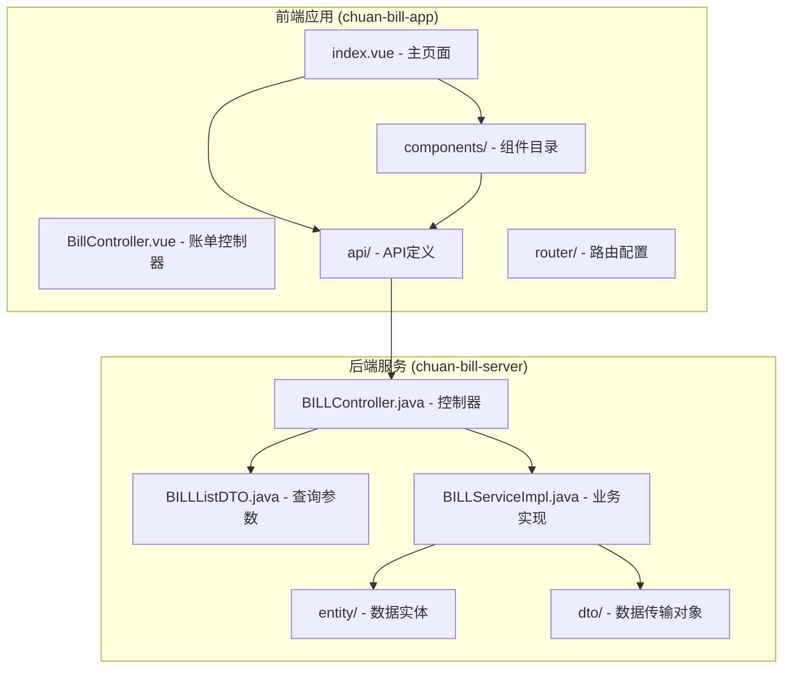

**图表来源**
- [index.vue:1-54](file://chuan-bill-app/src/pages/bill/index.vue#L1-L54)
- [BillController.java:1-91](file://chuan-bill-server/src/main/java/com/samoy/chuanbillserver/controller/BillController.java#L1-L91)

**章节来源**
- [index.vue:1-54](file://chuan-bill-app/src/pages/bill/index.vue#L1-L54)
- [BillController.java:1-91](file://chuan-bill-server/src/main/java/com/samoy/chuanbillserver/controller/BillController.java#L1-L91)

## 核心组件

### 前端组件架构

账单列表功能由多个相互协作的组件构成：

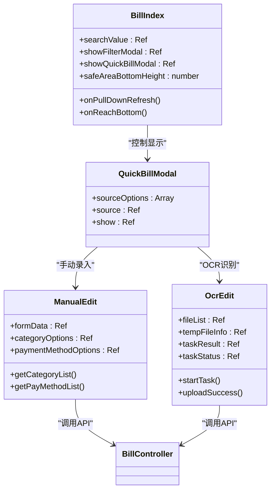

**图表来源**
- [index.vue:1-54](file://chuan-bill-app/src/pages/bill/index.vue#L1-L54)
- [QuickBillModal.vue:1-64](file://chuan-bill-app/src/pages/bill/components/QuickBillModal.vue#L1-L64)
- [ManualEdit.vue:1-174](file://chuan-bill-app/src/pages/bill/components/ManualEdit.vue#L1-L174)
- [OcrEdit.vue:1-167](file://chuan-bill-app/src/pages/bill/components/OcrEdit.vue#L1-L167)

### 后端服务架构

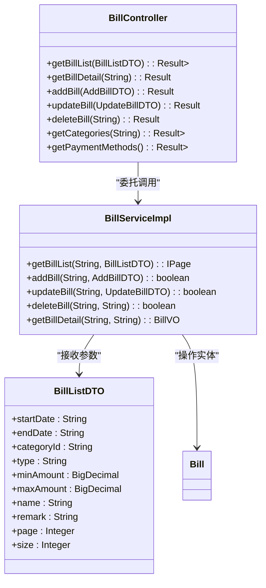

**图表来源**
- [BillController.java:1-91](file://chuan-bill-server/src/main/java/com/samoy/chuanbillserver/controller/BillController.java#L1-L91)
- [BillServiceImpl.java:1-244](file://chuan-bill-server/src/main/java/com/samoy/chuanbillserver/service/impl/BillServiceImpl.java#L1-L244)
- [BillListDTO.java:1-42](file://chuan-bill-server/src/main/java/com/samoy/chuanbillserver/dto/BillListDTO.java#L1-L42)

**章节来源**
- [QuickBillModal.vue:1-64](file://chuan-bill-app/src/pages/bill/components/QuickBillModal.vue#L1-L64)
- [BillController.java:1-91](file://chuan-bill-server/src/main/java/com/samoy/chuanbillserver/controller/BillController.java#L1-L91)

## 架构概览

### 数据流架构

账单列表的数据流遵循标准的MVC模式：

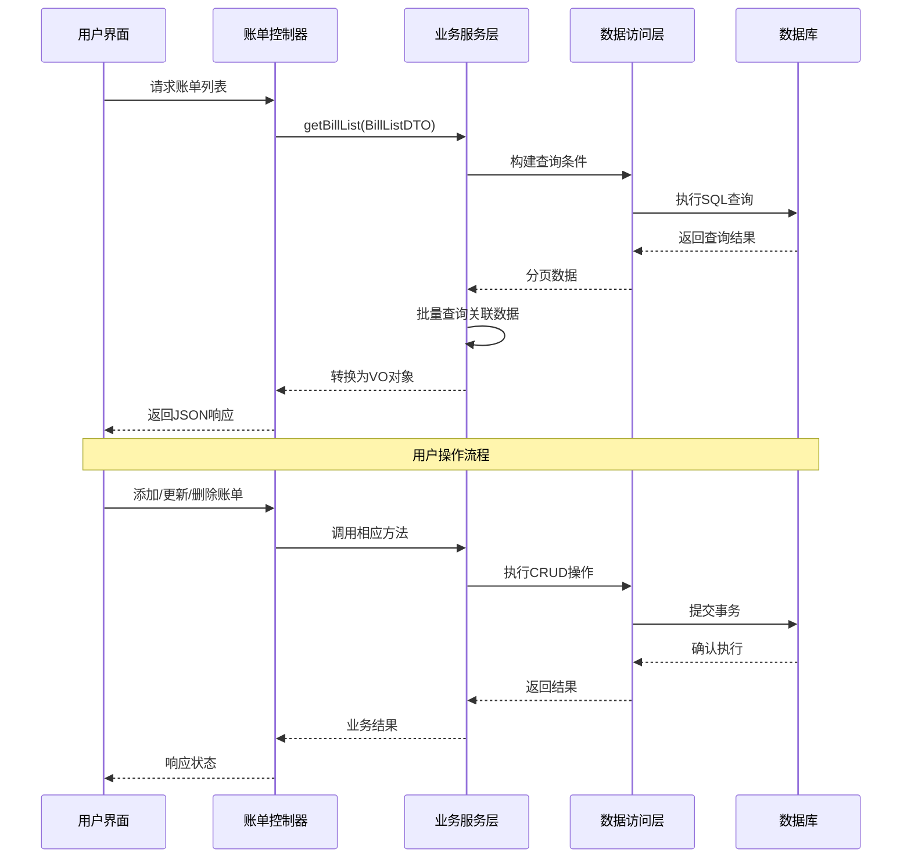

**图表来源**
- [BillController.java:37-42](file://chuan-bill-server/src/main/java/com/samoy/chuanbillserver/controller/BillController.java#L37-L42)
- [BillServiceImpl.java:50-123](file://chuan-bill-server/src/main/java/com/samoy/chuanbillserver/service/impl/BillServiceImpl.java#L50-L123)

### API接口设计

系统提供完整的RESTful API接口：

| 接口 | 方法 | 描述 | 参数 |
|------|------|------|------|
| `/bill/list` | GET | 获取账单列表 | 分页参数、筛选条件 |
| `/bill/detail` | GET | 获取账单详情 | 账单ID |
| `/bill/add` | POST | 添加账单 | 账单数据 |
| `/bill/update` | POST | 更新账单 | 账单数据 |
| `/bill/delete` | POST | 删除账单 | 账单ID |
| `/bill/categories` | GET | 获取分类列表 | 类型参数 |
| `/bill/payment-methods` | GET | 获取支付方式列表 | 无 |

**章节来源**
- [BillController.java:37-89](file://chuan-bill-server/src/main/java/com/samoy/chuanbillserver/controller/BillController.java#L37-L89)
- [apiDefinitions.ts:19-36](file://chuan-bill-app/src/api/apiDefinitions.ts#L19-L36)

## 详细组件分析

### 账单列表展示逻辑

#### 搜索功能实现

账单列表的搜索功能采用关键词模糊匹配机制：

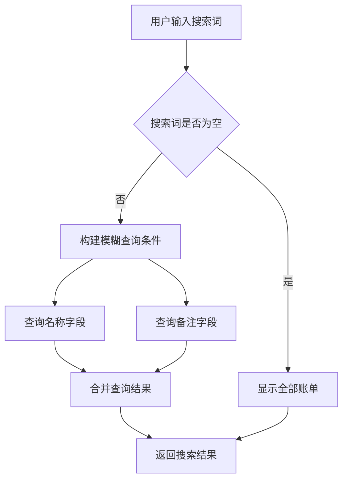

**图表来源**
- [BillServiceImpl.java:80-87](file://chuan-bill-server/src/main/java/com/samoy/chuanbillserver/service/impl/BillServiceImpl.java#L80-L87)

搜索功能支持：
- **名称模糊搜索**：对账单名称进行LIKE匹配
- **备注模糊搜索**：对账单备注进行LIKE匹配
- **实时响应**：输入即搜索，提供即时反馈

#### 分页加载机制

系统采用MyBatis Plus的分页插件实现高效的数据分页：

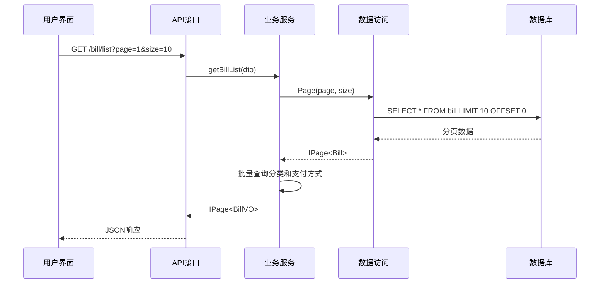

**图表来源**
- [BillServiceImpl.java:88-123](file://chuan-bill-server/src/main/java/com/samoy/chuanbillserver/service/impl/BillServiceImpl.java#L88-L123)

分页特性：
- **默认每页10条记录**
- **支持自定义页码和大小**
- **数据库层面分页，避免全量加载**

#### 下拉刷新和上拉加载

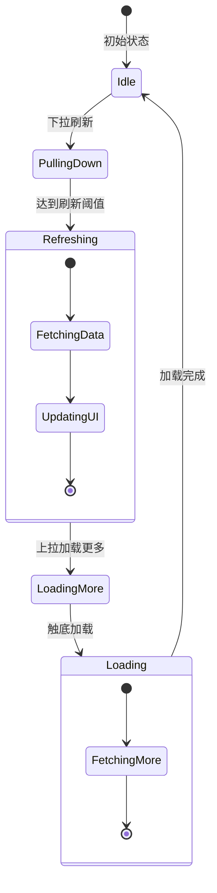

**图表来源**
- [index.vue:4-13](file://chuan-bill-app/src/pages/bill/index.vue#L4-L13)

#### 筛选功能实现

系统支持多维度的账单筛选：

| 筛选类型 | 参数名 | 说明 | 示例 |
|----------|--------|------|------|
| 时间范围 | startDate, endDate | 日期范围筛选 | 2024-01-01 |
| 账单类型 | type | 收入/支出类型 | income, expense |
| 分类筛选 | categoryId | 分类ID | 123456 |
| 金额范围 | minAmount, maxAmount | 金额区间 | 0.00-1000.00 |
| 关键词搜索 | name, remark | 名称和备注 | 早餐, 公司 |

**章节来源**
- [BillListDTO.java:10-41](file://chuan-bill-server/src/main/java/com/samoy/chuanbillserver/dto/BillListDTO.java#L10-L41)
- [index.vue:14-16](file://chuan-bill-app/src/pages/bill/index.vue#L14-L16)

### 数据排序和显示格式

#### 排序规则

账单列表按照以下优先级排序：
1. **时间倒序**：最新账单优先显示
2. **创建时间倒序**：同一天内按创建时间排序

排序实现：
```sql
ORDER BY time DESC, create_time DESC
```

#### 显示格式

账单数据显示包含：
- **基础信息**：名称、金额、时间、类型
- **分类信息**：分类名称和图标
- **支付方式**：支付方式名称
- **备注信息**：详细备注内容
- **来源标识**：手动录入、OCR识别等

### 快速记账功能

#### 多种录入方式

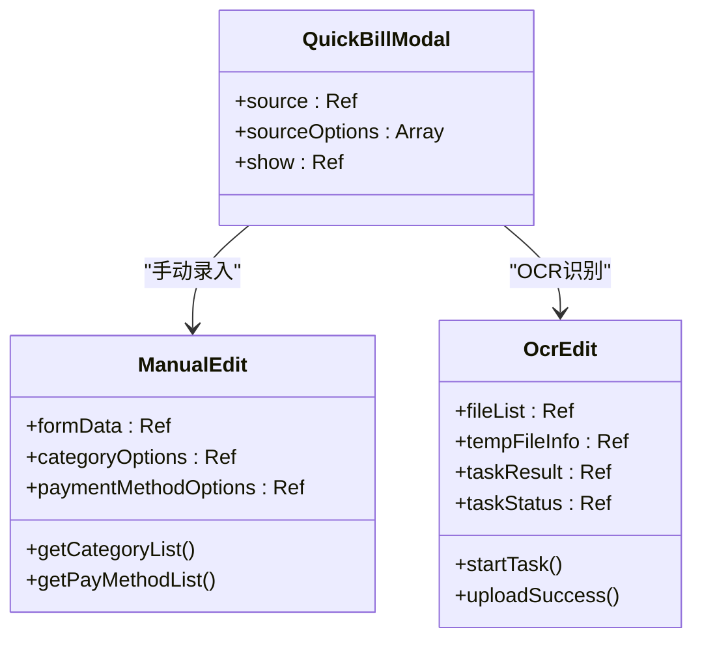

**图表来源**
- [QuickBillModal.vue:1-64](file://chuan-bill-app/src/pages/bill/components/QuickBillModal.vue#L1-L64)
- [ManualEdit.vue:1-174](file://chuan-bill-app/src/pages/bill/components/ManualEdit.vue#L1-L174)
- [OcrEdit.vue:1-167](file://chuan-bill-app/src/pages/bill/components/OcrEdit.vue#L1-L167)

**章节来源**
- [QuickBillModal.vue:14-18](file://chuan-bill-app/src/pages/bill/components/QuickBillModal.vue#L14-L18)
- [ManualEdit.vue:31-66](file://chuan-bill-app/src/pages/bill/components/ManualEdit.vue#L31-L66)
- [OcrEdit.vue:27-69](file://chuan-bill-app/src/pages/bill/components/OcrEdit.vue#L27-L69)

## 依赖分析

### 前端依赖关系

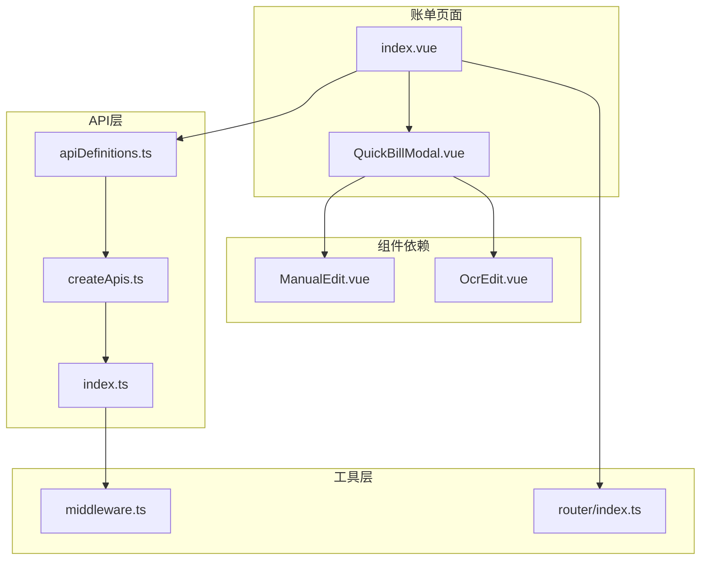

**图表来源**
- [index.vue:1-54](file://chuan-bill-app/src/pages/bill/index.vue#L1-L54)
- [apiDefinitions.ts:19-36](file://chuan-bill-app/src/api/apiDefinitions.ts#L19-L36)
- [createApis.ts:65-72](file://chuan-bill-app/src/api/createApis.ts#L65-L72)

### 后端依赖关系

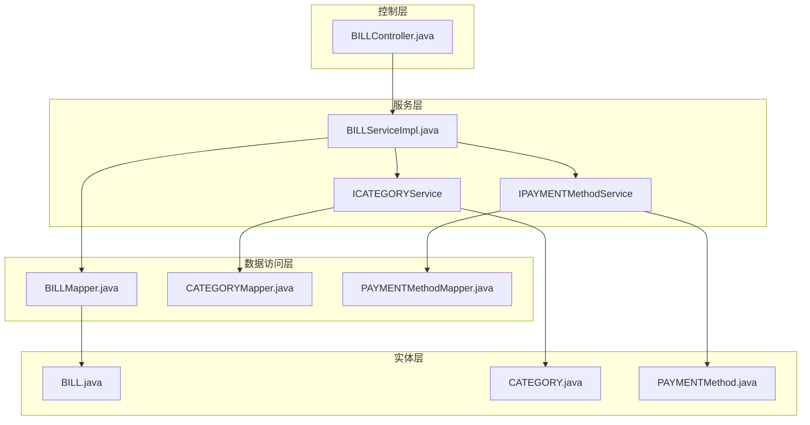

**图表来源**
- [BillController.java:28-35](file://chuan-bill-server/src/main/java/com/samoy/chuanbillserver/controller/BillController.java#L28-L35)
- [BillServiceImpl.java:44-48](file://chuan-bill-server/src/main/java/com/samoy/chuanbillserver/service/impl/BillServiceImpl.java#L44-L48)

**章节来源**
- [BillController.java:1-91](file://chuan-bill-server/src/main/java/com/samoy/chuanbillserver/controller/BillController.java#L1-L91)
- [BillServiceImpl.java:1-244](file://chuan-bill-server/src/main/java/com/samoy/chuanbillserver/service/impl/BillServiceImpl.java#L1-L244)

## 性能考虑

### 数据库查询优化

#### N+1查询问题解决

系统采用批量查询和缓存机制避免N+1查询问题：

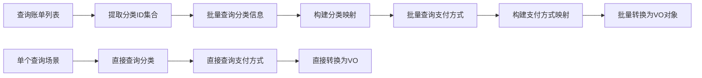

**图表来源**
- [BillServiceImpl.java:90-122](file://chuan-bill-server/src/main/java/com/samoy/chuanbillserver/service/impl/BillServiceImpl.java#L90-L122)

优化策略：
- **批量查询**：一次性获取所有相关分类和支付方式
- **内存映射**：使用HashMap缓存查询结果
- **条件过滤**：只处理非空且去重后的ID集合

#### 索引优化建议

为提高查询性能，建议在以下字段建立索引：
- `user_id`：用户维度查询
- `time`：时间排序查询
- `category_id`：分类筛选查询
- `create_time`：创建时间排序

### 前端性能优化

#### 虚拟滚动实现

虽然当前实现未使用虚拟滚动，但系统具备良好的扩展性以支持虚拟滚动：

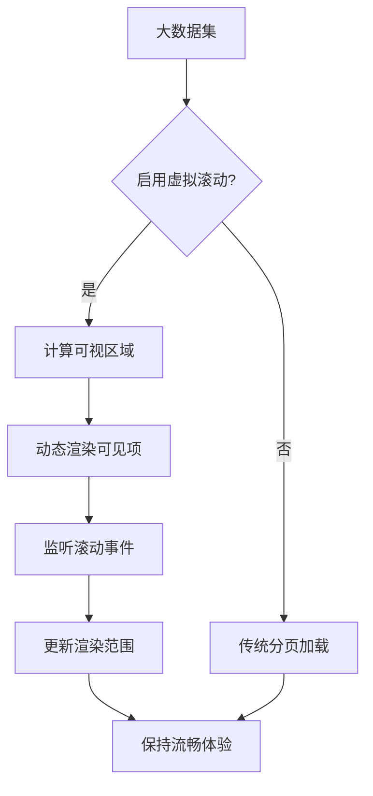

#### 懒加载策略

系统采用渐进式加载策略：
- **按需加载**：仅在需要时加载相关组件
- **延迟初始化**：组件在首次使用时才初始化
- **资源复用**：避免重复创建相同组件实例

#### 缓存机制

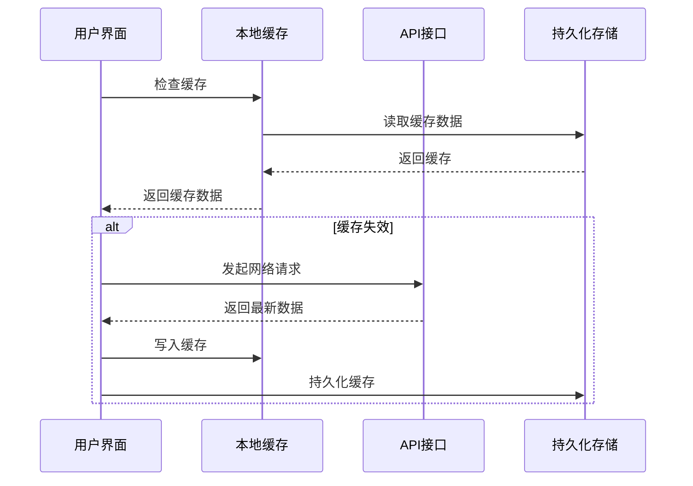

**图表来源**
- [middleware.ts:7-21](file://chuan-bill-app/src/api/core/middleware.ts#L7-L21)

**章节来源**
- [BillServiceImpl.java:90-122](file://chuan-bill-server/src/main/java/com/samoy/chuanbillserver/service/impl/BillServiceImpl.java#L90-L122)
- [middleware.ts:1-22](file://chuan-bill-app/src/api/core/middleware.ts#L1-L22)

## 故障排除指南

### 常见问题及解决方案

#### API调用失败

**问题现象**：账单列表无法加载，显示空白或错误提示

**可能原因**：
- 网络连接异常
- API接口不可用
- 认证令牌过期

**解决方案**：
1. 检查网络连接状态
2. 验证API接口URL配置
3. 重新登录获取有效令牌

#### 数据查询异常

**问题现象**：搜索功能无法正常工作，筛选条件无效

**可能原因**：
- 查询参数格式不正确
- 数据库连接问题
- SQL语句执行错误

**解决方案**：
1. 验证查询参数格式
2. 检查数据库连接配置
3. 查看服务器日志获取详细错误信息

#### 性能问题

**问题现象**：页面加载缓慢，滚动卡顿

**可能原因**：
- 数据量过大
- 查询效率低
- 前端渲染压力大

**解决方案**：
1. 优化数据库查询索引
2. 实现分页和懒加载
3. 考虑引入虚拟滚动

**章节来源**
- [BillController.java:37-42](file://chuan-bill-server/src/main/java/com/samoy/chuanbillserver/controller/BillController.java#L37-L42)
- [BillServiceImpl.java:50-123](file://chuan-bill-server/src/main/java/com/samoy/chuanbillserver/service/impl/BillServiceImpl.java#L50-L123)

## 结论

账单列表管理功能通过精心设计的架构实现了高效、稳定的账单管理体验。系统采用前后端分离的设计模式，前端使用现代化的Vue 3 + UniApp框架，后端基于Spring Boot + MyBatis Plus，提供了完整的RESTful API接口。

### 核心优势

1. **完整的功能覆盖**：支持搜索、筛选、分页、排序等核心功能
2. **高性能设计**：采用批量查询和缓存机制，避免N+1查询问题
3. **良好的扩展性**：模块化设计便于功能扩展和维护
4. **用户体验优化**：提供流畅的交互体验和及时的反馈机制

### 技术亮点

- **智能分页**：数据库层面的分页查询，支持大数据量场景
- **多维筛选**：支持时间范围、类型、分类、金额等多维度筛选
- **实时搜索**：关键词模糊匹配，提供即时搜索体验
- **快速录入**：支持手动录入和OCR识别两种快速录入方式

### 未来改进方向

1. **虚拟滚动**：对于超大数据集考虑引入虚拟滚动技术
2. **离线缓存**：增强离线数据同步和缓存机制
3. **性能监控**：集成性能监控工具，持续优化用户体验
4. **国际化支持**：扩展多语言支持，服务更广泛的用户群体

该账单列表管理功能为用户提供了一个功能完善、性能优异的账单管理解决方案，为后续的功能扩展奠定了坚实的技术基础。