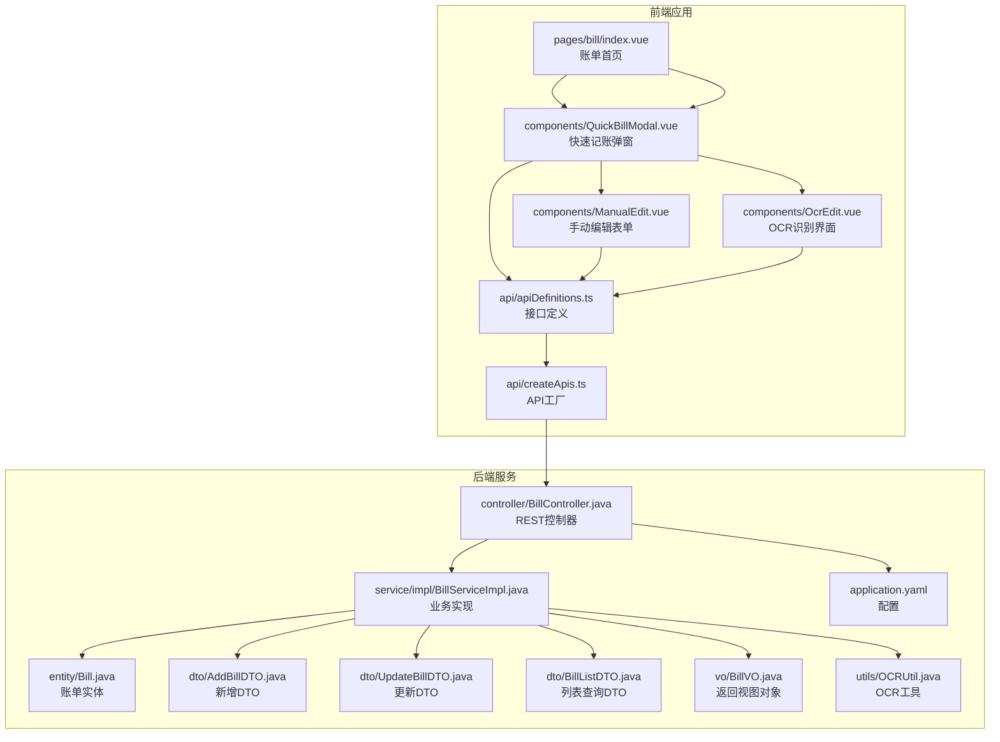
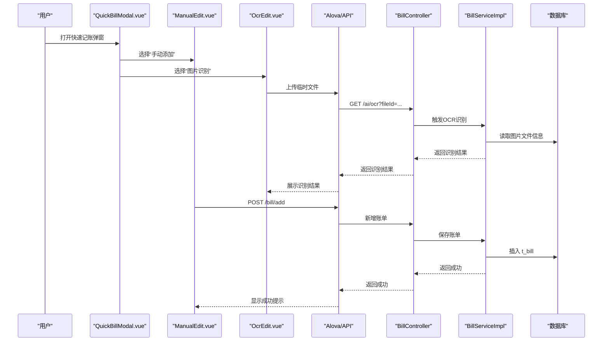
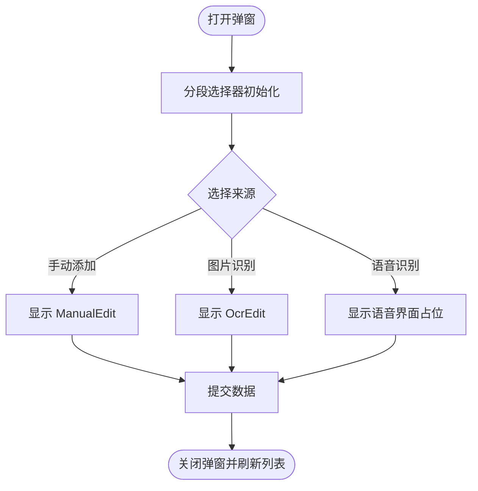
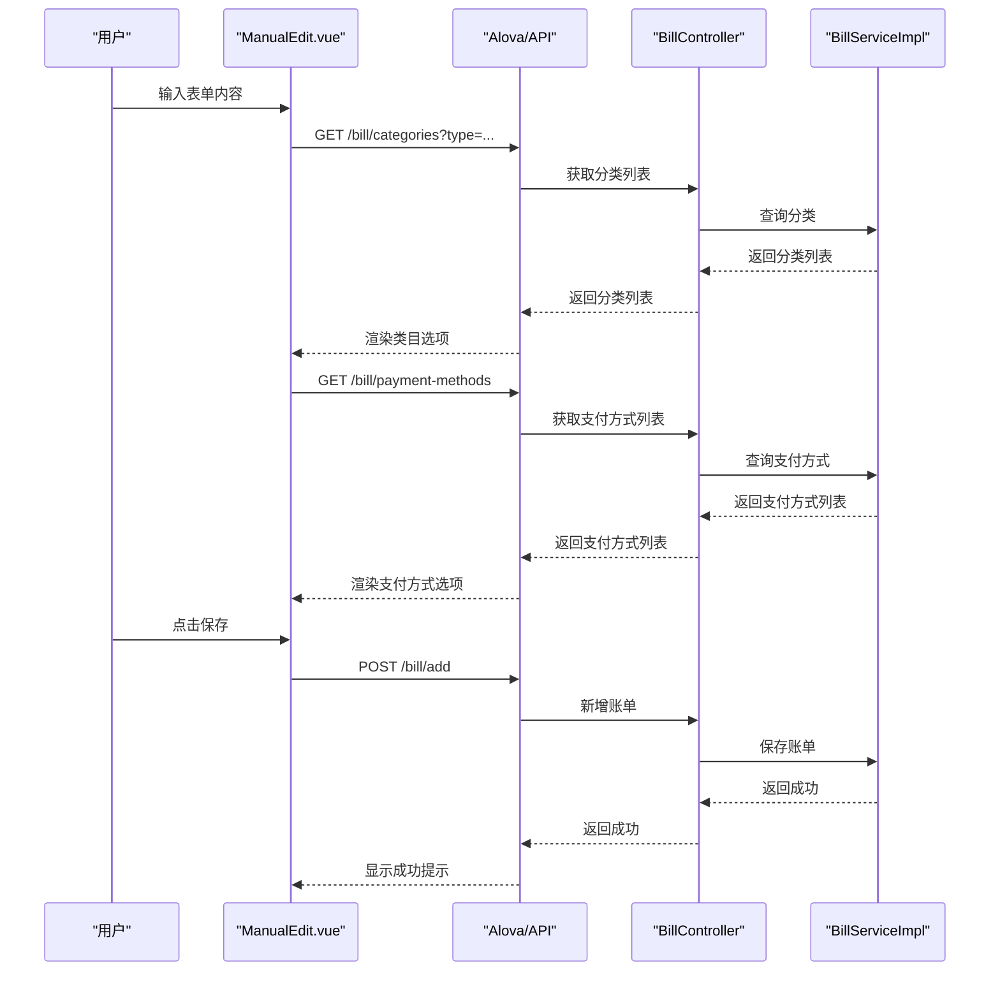
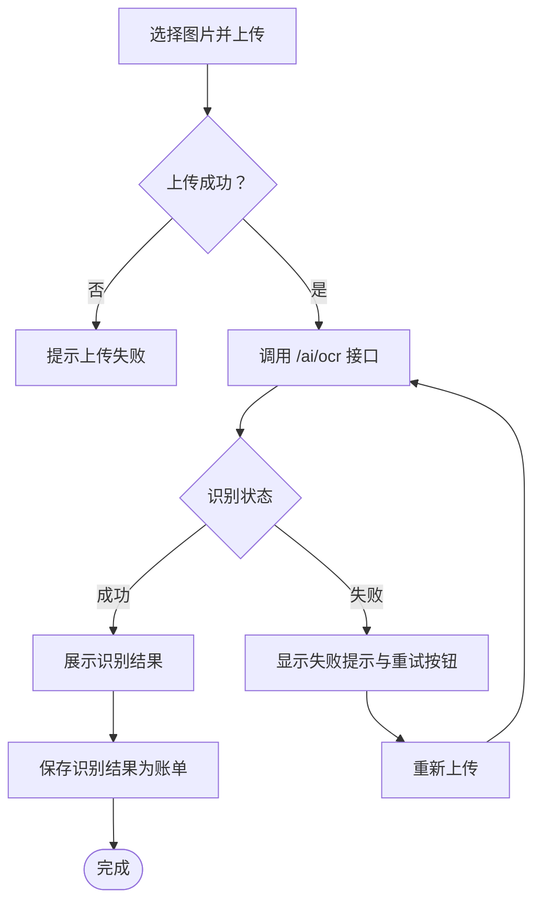
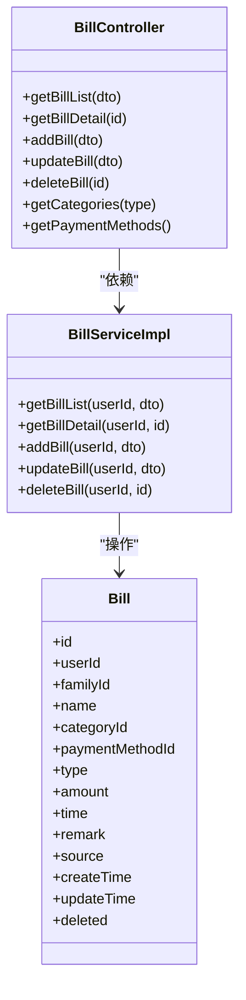
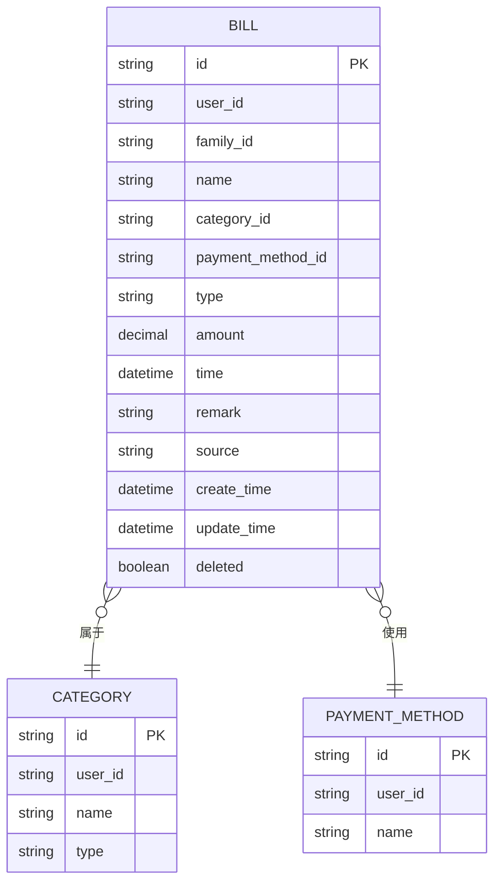
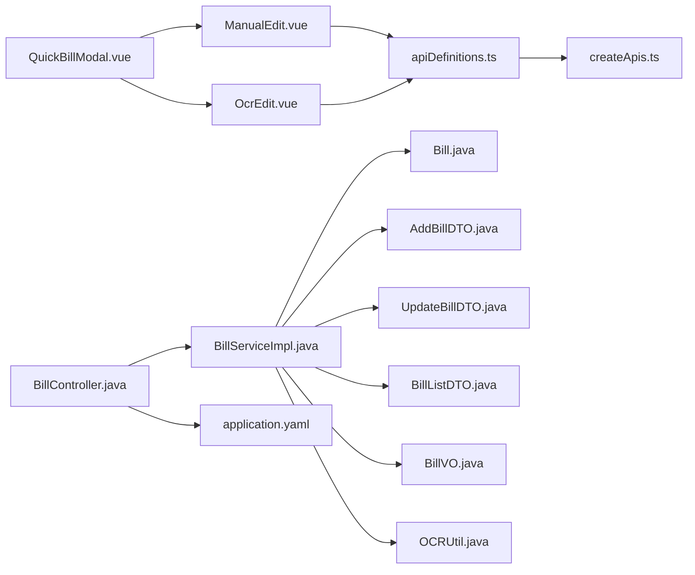

# 账单管理模块

<cite>
**本文引用的文件**
- [index.vue](file://chuan-bill-app/src/pages/bill/index.vue)
- [QuickBillModal.vue](file://chuan-bill-app/src/pages/bill/components/QuickBillModal.vue)
- [ManualEdit.vue](file://chuan-bill-app/src/pages/bill/components/ManualEdit.vue)
- [OcrEdit.vue](file://chuan-bill-app/src/pages/bill/components/OcrEdit.vue)
- [apiDefinitions.ts](file://chuan-bill-app/src/api/apiDefinitions.ts)
- [createApis.ts](file://chuan-bill-app/src/api/createApis.ts)
- [BillController.java](file://chuan-bill-server/src/main/java/com/samoy/chuanbillserver/controller/BillController.java)
- [BillServiceImpl.java](file://chuan-bill-server/src/main/java/com/samoy/chuanbillserver/service/impl/BillServiceImpl.java)
- [Bill.java](file://chuan-bill-server/src/main/java/com/samoy/chuanbillserver/entity/Bill.java)
- [AddBillDTO.java](file://chuan-bill-server/src/main/java/com/samoy/chuanbillserver/dto/AddBillDTO.java)
- [UpdateBillDTO.java](file://chuan-bill-server/src/main/java/com/samoy/chuanbillserver/dto/UpdateBillDTO.java)
- [BillListDTO.java](file://chuan-bill-server/src/main/java/com/samoy/chuanbillserver/dto/BillListDTO.java)
- [BillVO.java](file://chuan-bill-server/src/main/java/com/samoy/chuanbillserver/vo/BillVO.java)
- [application.yaml](file://chuan-bill-server/src/main/resources/application.yaml)
- [OCRUtil.java](file://chuan-bill-server/src/main/java/com/samoy/chuanbillserver/utils/OCRUtil.java)
</cite>

## 目录
1. [简介](#简介)
2. [项目结构](#项目结构)
3. [核心组件](#核心组件)
4. [架构总览](#架构总览)
5. [详细组件分析](#详细组件分析)
6. [依赖分析](#依赖分析)
7. [性能考虑](#性能考虑)
8. [故障排查指南](#故障排查指南)
9. [结论](#结论)
10. [附录](#附录)

## 简介
本文件面向“账单管理模块”的功能与技术实现，覆盖以下方面：
- 基础功能：账单列表展示、搜索筛选、分类管理、支付方式管理
- 多种输入方式：手动输入、OCR 图像识别、语音输入（预留）、快速记账快捷入口
- 数据模型：账单实体字段、业务规则与约束
- API 接口：增删改查、批量查询、分类与支付方式查询、OCR 识别
- 前端组件：QuickBillModal 快速记账弹窗、ManualEdit 手动编辑表单、OcrEdit OCR 识别界面
- 后端服务：业务逻辑、数据持久化、权限校验与异常处理
- 实际使用示例与常见问题解决

## 项目结构
账单管理模块由前端 UniApp 页面与组件、API 定义、后端 Spring Boot 控制器与服务构成，并通过数据库与外部 OCR 能力协同工作。

图表来源
- [index.vue:1-54](file://chuan-bill-app/src/pages/bill/index.vue#L1-L54)
- [QuickBillModal.vue:1-64](file://chuan-bill-app/src/pages/bill/components/QuickBillModal.vue#L1-L64)
- [ManualEdit.vue:1-174](file://chuan-bill-app/src/pages/bill/components/ManualEdit.vue#L1-L174)
- [OcrEdit.vue:1-167](file://chuan-bill-app/src/pages/bill/components/OcrEdit.vue#L1-L167)
- [apiDefinitions.ts:19-37](file://chuan-bill-app/src/api/apiDefinitions.ts#L19-L37)
- [createApis.ts:65-76](file://chuan-bill-app/src/api/createApis.ts#L65-L76)
- [BillController.java:24-90](file://chuan-bill-server/src/main/java/com/samoy/chuanbillserver/controller/BillController.java#L24-L90)
- [BillServiceImpl.java:42-243](file://chuan-bill-server/src/main/java/com/samoy/chuanbillserver/service/impl/BillServiceImpl.java#L42-L243)
- [Bill.java:24-112](file://chuan-bill-server/src/main/java/com/samoy/chuanbillserver/entity/Bill.java#L24-L112)
- [AddBillDTO.java:12-43](file://chuan-bill-server/src/main/java/com/samoy/chuanbillserver/dto/AddBillDTO.java#L12-L43)
- [UpdateBillDTO.java:12-38](file://chuan-bill-server/src/main/java/com/samoy/chuanbillserver/dto/UpdateBillDTO.java#L12-L38)
- [BillListDTO.java:10-41](file://chuan-bill-server/src/main/java/com/samoy/chuanbillserver/dto/BillListDTO.java#L10-L41)
- [BillVO.java:11-43](file://chuan-bill-server/src/main/java/com/samoy/chuanbillserver/vo/BillVO.java#L11-L43)
- [application.yaml:1-51](file://chuan-bill-server/src/main/resources/application.yaml#L1-L51)
- [OCRUtil.java:15-36](file://chuan-bill-server/src/main/java/com/samoy/chuanbillserver/utils/OCRUtil.java#L15-L36)

章节来源
- [index.vue:1-54](file://chuan-bill-app/src/pages/bill/index.vue#L1-L54)
- [QuickBillModal.vue:1-64](file://chuan-bill-app/src/pages/bill/components/QuickBillModal.vue#L1-L64)
- [ManualEdit.vue:1-174](file://chuan-bill-app/src/pages/bill/components/ManualEdit.vue#L1-L174)
- [OcrEdit.vue:1-167](file://chuan-bill-app/src/pages/bill/components/OcrEdit.vue#L1-L167)
- [apiDefinitions.ts:19-37](file://chuan-bill-app/src/api/apiDefinitions.ts#L19-L37)
- [createApis.ts:65-76](file://chuan-bill-app/src/api/createApis.ts#L65-L76)
- [BillController.java:24-90](file://chuan-bill-server/src/main/java/com/samoy/chuanbillserver/controller/BillController.java#L24-L90)
- [BillServiceImpl.java:42-243](file://chuan-bill-server/src/main/java/com/samoy/chuanbillserver/service/impl/BillServiceImpl.java#L42-L243)
- [Bill.java:24-112](file://chuan-bill-server/src/main/java/com/samoy/chuanbillserver/entity/Bill.java#L24-L112)
- [AddBillDTO.java:12-43](file://chuan-bill-server/src/main/java/com/samoy/chuanbillserver/dto/AddBillDTO.java#L12-L43)
- [UpdateBillDTO.java:12-38](file://chuan-bill-server/src/main/java/com/samoy/chuanbillserver/dto/UpdateBillDTO.java#L12-L38)
- [BillListDTO.java:10-41](file://chuan-bill-server/src/main/java/com/samoy/chuanbillserver/dto/BillListDTO.java#L10-L41)
- [BillVO.java:11-43](file://chuan-bill-server/src/main/java/com/samoy/chuanbillserver/vo/BillVO.java#L11-L43)
- [application.yaml:1-51](file://chuan-bill-server/src/main/resources/application.yaml#L1-L51)
- [OCRUtil.java:15-36](file://chuan-bill-server/src/main/java/com/samoy/chuanbillserver/utils/OCRUtil.java#L15-L36)

## 核心组件
- 前端页面与组件
  - 账单首页：提供搜索框、筛选按钮与快速记账悬浮按钮
  - 快速记账弹窗：切换“手动添加”“图片识别”“语音识别”
  - 手动编辑表单：输入金额、名称、时间、类目、支付方式、是否共享、备注
  - OCR 识别界面：上传图片、触发 AI 识别、展示识别结果或失败提示
- 后端控制器与服务
  - 账单控制器：提供列表、详情、新增、更新、删除、分类与支付方式查询
  - 账单服务：实现分页查询、权限校验、批量关联信息加载、新增/更新/删除
- 数据模型与 DTO/VO
  - 账单实体：包含主键、用户/家庭关联、名称、类目、支付方式、类型、金额、时间、备注、来源、逻辑删除等
  - 新增/更新 DTO：参数校验与格式约束
  - 列表查询 DTO：日期范围、类型、金额范围、名称/备注模糊匹配、分页
  - 返回 VO：统一对外输出结构，包含关联信息

章节来源
- [index.vue:1-54](file://chuan-bill-app/src/pages/bill/index.vue#L1-L54)
- [QuickBillModal.vue:1-64](file://chuan-bill-app/src/pages/bill/components/QuickBillModal.vue#L1-L64)
- [ManualEdit.vue:1-174](file://chuan-bill-app/src/pages/bill/components/ManualEdit.vue#L1-L174)
- [OcrEdit.vue:1-167](file://chuan-bill-app/src/pages/bill/components/OcrEdit.vue#L1-L167)
- [BillController.java:24-90](file://chuan-bill-server/src/main/java/com/samoy/chuanbillserver/controller/BillController.java#L24-L90)
- [BillServiceImpl.java:42-243](file://chuan-bill-server/src/main/java/com/samoy/chuanbillserver/service/impl/BillServiceImpl.java#L42-L243)
- [Bill.java:24-112](file://chuan-bill-server/src/main/java/com/samoy/chuanbillserver/entity/Bill.java#L24-L112)
- [AddBillDTO.java:12-43](file://chuan-bill-server/src/main/java/com/samoy/chuanbillserver/dto/AddBillDTO.java#L12-L43)
- [UpdateBillDTO.java:12-38](file://chuan-bill-server/src/main/java/com/samoy/chuanbillserver/dto/UpdateBillDTO.java#L12-L38)
- [BillListDTO.java:10-41](file://chuan-bill-server/src/main/java/com/samoy/chuanbillserver/dto/BillListDTO.java#L10-L41)
- [BillVO.java:11-43](file://chuan-bill-server/src/main/java/com/samoy/chuanbillserver/vo/BillVO.java#L11-L43)

## 架构总览
账单管理采用前后端分离架构：
- 前端通过 Alova 发起请求，调用后端 REST 接口
- 后端基于 Spring Boot 提供控制器、服务层、MyBatis-Plus 持久化
- OCR 能力通过 DashScope 应用调用实现
- 配置集中于 application.yaml，包含数据库、Redis、Sa-Token、OpenAPI、DashScope

图表来源
- [QuickBillModal.vue:14-52](file://chuan-bill-app/src/pages/bill/components/QuickBillModal.vue#L14-L52)
- [ManualEdit.vue:120-134](file://chuan-bill-app/src/pages/bill/components/ManualEdit.vue#L120-L134)
- [OcrEdit.vue:27-69](file://chuan-bill-app/src/pages/bill/components/OcrEdit.vue#L27-L69)
- [apiDefinitions.ts:23-36](file://chuan-bill-app/src/api/apiDefinitions.ts#L23-L36)
- [BillController.java:52-89](file://chuan-bill-server/src/main/java/com/samoy/chuanbillserver/controller/BillController.java#L52-L89)
- [BillServiceImpl.java:125-141](file://chuan-bill-server/src/main/java/com/samoy/chuanbillserver/service/impl/BillServiceImpl.java#L125-L141)

## 详细组件分析

### 前端组件：QuickBillModal 快速记账弹窗
- 功能要点
  - 底部弹出式动作面板，支持三种记账来源：手动添加、图片识别、语音识别
  - 通过分段选择器切换不同输入方式
  - 与 ManualEdit、OcrEdit 组件组合使用
- 交互流程
  - 打开弹窗后，初始化分段选择器样式
  - 根据选择显示对应子组件
  - 子组件负责具体的数据收集与提交

图表来源
- [QuickBillModal.vue:14-52](file://chuan-bill-app/src/pages/bill/components/QuickBillModal.vue#L14-L52)

章节来源
- [QuickBillModal.vue:1-64](file://chuan-bill-app/src/pages/bill/components/QuickBillModal.vue#L1-L64)

### 前端组件：ManualEdit 手动编辑表单
- 表单字段
  - 类型：支出/收入（单选）
  - 金额：数字输入，限制格式与精度
  - 名称：文本输入，长度限制
  - 时间：日期时间选择器，默认当前时间
  - 类目：按类型动态加载选项
  - 支付方式：下拉选择
  - 共享：开关控制，开启时可选择家庭
  - 备注：多行文本，字数限制
- 数据加载
  - 页面加载时分别请求分类列表与支付方式列表
  - 类型切换时联动更新类目选项
- 提交流程
  - 通过 Apis.bill.addBill 提交新增请求
  - 成功后关闭弹窗并刷新账单列表

图表来源
- [ManualEdit.vue:31-66](file://chuan-bill-app/src/pages/bill/components/ManualEdit.vue#L31-L66)
- [apiDefinitions.ts:32-36](file://chuan-bill-app/src/api/apiDefinitions.ts#L32-L36)
- [BillController.java:74-89](file://chuan-bill-server/src/main/java/com/samoy/chuanbillserver/controller/BillController.java#L74-L89)
- [BillServiceImpl.java:125-141](file://chuan-bill-server/src/main/java/com/samoy/chuanbillserver/service/impl/BillServiceImpl.java#L125-L141)

章节来源
- [ManualEdit.vue:1-174](file://chuan-bill-app/src/pages/bill/components/ManualEdit.vue#L1-L174)

### 前端组件：OcrEdit OCR 识别界面
- 流程概览
  - 上传图片至临时文件接口
  - 上传成功后调用 AI 识别接口
  - 识别成功则展示识别结果，失败则提供重试与手动输入入口
- 状态机
  - 初始化、上传中、识别中、成功、失败
- 交互细节
  - 上传组件支持限制为单文件、重新上传
  - 识别进行时显示扫描动画效果
  - 失败时提供重试与跳转手动输入按钮

图表来源
- [OcrEdit.vue:27-69](file://chuan-bill-app/src/pages/bill/components/OcrEdit.vue#L27-L69)
- [apiDefinitions.ts](file://chuan-bill-app/src/api/apiDefinitions.ts#L36)

章节来源
- [OcrEdit.vue:1-167](file://chuan-bill-app/src/pages/bill/components/OcrEdit.vue#L1-L167)

### 后端服务：账单控制器与服务
- 控制器职责
  - 提供账单列表、详情、新增、更新、删除接口
  - 提供分类与支付方式列表接口
- 服务层职责
  - 列表分页查询：支持日期范围、类型、类目、金额范围、名称/备注模糊匹配
  - 批量加载关联信息：避免 N+1 查询
  - 权限校验：仅允许操作本人账单
  - 新增/更新/删除：封装业务规则与异常处理

图表来源
- [BillController.java:24-90](file://chuan-bill-server/src/main/java/com/samoy/chuanbillserver/controller/BillController.java#L24-L90)
- [BillServiceImpl.java:42-243](file://chuan-bill-server/src/main/java/com/samoy/chuanbillserver/service/impl/BillServiceImpl.java#L42-L243)
- [Bill.java:24-112](file://chuan-bill-server/src/main/java/com/samoy/chuanbillserver/entity/Bill.java#L24-L112)

章节来源
- [BillController.java:24-90](file://chuan-bill-server/src/main/java/com/samoy/chuanbillserver/controller/BillController.java#L24-L90)
- [BillServiceImpl.java:42-243](file://chuan-bill-server/src/main/java/com/samoy/chuanbillserver/service/impl/BillServiceImpl.java#L42-L243)

### 数据模型设计
- 账单实体字段
  - 主键、用户/家庭关联、名称、类目、支付方式、类型、金额、时间、备注、来源、创建/更新时间、逻辑删除
- 业务规则与约束
  - 新增 DTO：名称必填且长度限制；金额必填且大于 0，最多 10 位整数与 2 位小数；类型为 income/expense；时间格式；备注长度限制；来源为 manual/ocr/voice
  - 更新 DTO：ID 必填；其余字段与新增类似但名称可选；金额与备注长度限制
  - 列表查询 DTO：日期格式校验；金额范围校验；名称/备注模糊搜索；分页参数校验
- 关联信息
  - 列表返回 VO 包含分类与支付方式信息，服务层通过批量查询减少数据库访问次数

图表来源
- [Bill.java:24-112](file://chuan-bill-server/src/main/java/com/samoy/chuanbillserver/entity/Bill.java#L24-L112)
- [BillVO.java:11-43](file://chuan-bill-server/src/main/java/com/samoy/chuanbillserver/vo/BillVO.java#L11-L43)

章节来源
- [Bill.java:24-112](file://chuan-bill-server/src/main/java/com/samoy/chuanbillserver/entity/Bill.java#L24-L112)
- [AddBillDTO.java:12-43](file://chuan-bill-server/src/main/java/com/samoy/chuanbillserver/dto/AddBillDTO.java#L12-L43)
- [UpdateBillDTO.java:12-38](file://chuan-bill-server/src/main/java/com/samoy/chuanbillserver/dto/UpdateBillDTO.java#L12-L38)
- [BillListDTO.java:10-41](file://chuan-bill-server/src/main/java/com/samoy/chuanbillserver/dto/BillListDTO.java#L10-L41)
- [BillVO.java:11-43](file://chuan-bill-server/src/main/java/com/samoy/chuanbillserver/vo/BillVO.java#L11-L43)

### API 接口说明
- 账单相关
  - GET /bill/list：分页获取账单列表，支持日期范围、类型、类目、金额范围、名称/备注模糊搜索
  - GET /bill/detail：获取账单详情
  - POST /bill/add：新增账单
  - POST /bill/update：更新账单
  - POST /bill/delete：删除账单
- 分类与支付方式
  - GET /bill/categories：获取分类列表（可按类型过滤）
  - GET /bill/payment-methods：获取支付方式列表
- 文件与 OCR
  - POST /file/uploadTempFile：上传临时文件
  - GET /ai/ocr：调用 AI 进行 OCR 识别

章节来源
- [apiDefinitions.ts:19-37](file://chuan-bill-app/src/api/apiDefinitions.ts#L19-L37)
- [BillController.java:37-89](file://chuan-bill-server/src/main/java/com/samoy/chuanbillserver/controller/BillController.java#L37-L89)

## 依赖分析
- 前端
  - QuickBillModal 依赖 ManualEdit 与 OcrEdit
  - ManualEdit 依赖分类与支付方式接口
  - OcrEdit 依赖上传与 OCR 接口
  - Alova API 工厂统一生成方法
- 后端
  - BillController 依赖 BillServiceImpl、CategoryService、PaymentMethodService
  - BillServiceImpl 依赖 BillMapper、CategoryService、PaymentMethodService
  - OCRUtil 依赖 DashScope 配置

图表来源
- [QuickBillModal.vue:1-64](file://chuan-bill-app/src/pages/bill/components/QuickBillModal.vue#L1-L64)
- [ManualEdit.vue:1-174](file://chuan-bill-app/src/pages/bill/components/ManualEdit.vue#L1-L174)
- [OcrEdit.vue:1-167](file://chuan-bill-app/src/pages/bill/components/OcrEdit.vue#L1-L167)
- [apiDefinitions.ts:19-37](file://chuan-bill-app/src/api/apiDefinitions.ts#L19-L37)
- [createApis.ts:65-76](file://chuan-bill-app/src/api/createApis.ts#L65-L76)
- [BillController.java:24-90](file://chuan-bill-server/src/main/java/com/samoy/chuanbillserver/controller/BillController.java#L24-L90)
- [BillServiceImpl.java:42-243](file://chuan-bill-server/src/main/java/com/samoy/chuanbillserver/service/impl/BillServiceImpl.java#L42-L243)
- [Bill.java:24-112](file://chuan-bill-server/src/main/java/com/samoy/chuanbillserver/entity/Bill.java#L24-L112)
- [AddBillDTO.java:12-43](file://chuan-bill-server/src/main/java/com/samoy/chuanbillserver/dto/AddBillDTO.java#L12-L43)
- [UpdateBillDTO.java:12-38](file://chuan-bill-server/src/main/java/com/samoy/chuanbillserver/dto/UpdateBillDTO.java#L12-L38)
- [BillListDTO.java:10-41](file://chuan-bill-server/src/main/java/com/samoy/chuanbillserver/dto/BillListDTO.java#L10-L41)
- [BillVO.java:11-43](file://chuan-bill-server/src/main/java/com/samoy/chuanbillserver/vo/BillVO.java#L11-L43)
- [application.yaml:1-51](file://chuan-bill-server/src/main/resources/application.yaml#L1-L51)
- [OCRUtil.java:15-36](file://chuan-bill-server/src/main/java/com/samoy/chuanbillserver/utils/OCRUtil.java#L15-L36)

章节来源
- [QuickBillModal.vue:1-64](file://chuan-bill-app/src/pages/bill/components/QuickBillModal.vue#L1-L64)
- [ManualEdit.vue:1-174](file://chuan-bill-app/src/pages/bill/components/ManualEdit.vue#L1-L174)
- [OcrEdit.vue:1-167](file://chuan-bill-app/src/pages/bill/components/OcrEdit.vue#L1-L167)
- [apiDefinitions.ts:19-37](file://chuan-bill-app/src/api/apiDefinitions.ts#L19-L37)
- [createApis.ts:65-76](file://chuan-bill-app/src/api/createApis.ts#L65-L76)
- [BillController.java:24-90](file://chuan-bill-server/src/main/java/com/samoy/chuanbillserver/controller/BillController.java#L24-L90)
- [BillServiceImpl.java:42-243](file://chuan-bill-server/src/main/java/com/samoy/chuanbillserver/service/impl/BillServiceImpl.java#L42-L243)
- [Bill.java:24-112](file://chuan-bill-server/src/main/java/com/samoy/chuanbillserver/entity/Bill.java#L24-L112)
- [AddBillDTO.java:12-43](file://chuan-bill-server/src/main/java/com/samoy/chuanbillserver/dto/AddBillDTO.java#L12-L43)
- [UpdateBillDTO.java:12-38](file://chuan-bill-server/src/main/java/com/samoy/chuanbillserver/dto/UpdateBillDTO.java#L12-L38)
- [BillListDTO.java:10-41](file://chuan-bill-server/src/main/java/com/samoy/chuanbillserver/dto/BillListDTO.java#L10-L41)
- [BillVO.java:11-43](file://chuan-bill-server/src/main/java/com/samoy/chuanbillserver/vo/BillVO.java#L11-L43)
- [application.yaml:1-51](file://chuan-bill-server/src/main/resources/application.yaml#L1-L51)
- [OCRUtil.java:15-36](file://chuan-bill-server/src/main/java/com/samoy/chuanbillserver/utils/OCRUtil.java#L15-L36)

## 性能考虑
- 列表查询优化
  - 使用分页与排序，避免一次性加载大量数据
  - 对日期、类型、类目、金额范围、名称/备注进行条件过滤
  - 批量查询分类与支付方式，减少 N+1 查询
- 前端渲染
  - 表单滚动区域设置为可滚动，避免布局抖动
  - 上传与识别过程使用状态指示，提升用户体验
- 外部服务
  - OCR 请求需在网络稳定环境下进行，建议增加重试与超时控制
  - 临时文件上传建议限制文件大小与格式，降低后端压力

## 故障排查指南
- 上传失败
  - 确认上传接口可用与网络正常
  - 检查响应解析逻辑，确保正确提取临时文件信息
- OCR 识别失败
  - 检查 DashScope 配置（API Key、App ID）是否正确
  - 确认图片清晰度与格式符合要求
- 权限问题
  - 确保登录态有效，接口均依赖登录用户 ID
  - 更新/删除操作会进行归属校验，非本人账单会抛出异常
- 参数校验失败
  - 检查新增/更新 DTO 的字段长度、数值范围与格式
  - 列表查询 DTO 的日期格式与分页参数

章节来源
- [OcrEdit.vue:46-69](file://chuan-bill-app/src/pages/bill/components/OcrEdit.vue#L46-L69)
- [application.yaml:48-51](file://chuan-bill-server/src/main/resources/application.yaml#L48-L51)
- [BillServiceImpl.java:144-173](file://chuan-bill-server/src/main/java/com/samoy/chuanbillserver/service/impl/BillServiceImpl.java#L144-L173)
- [AddBillDTO.java:14-43](file://chuan-bill-server/src/main/java/com/samoy/chuanbillserver/dto/AddBillDTO.java#L14-L43)
- [UpdateBillDTO.java:16-38](file://chuan-bill-server/src/main/java/com/samoy/chuanbillserver/dto/UpdateBillDTO.java#L16-L38)
- [BillListDTO.java:11-41](file://chuan-bill-server/src/main/java/com/samoy/chuanbillserver/dto/BillListDTO.java#L11-L41)

## 结论
账单管理模块通过统一的前端组件与后端接口，实现了多样化的记账入口与完善的账务管理能力。前端以 QuickBillModal 为核心入口，结合 ManualEdit 与 OcrEdit 提供丰富的输入体验；后端以 BillController 与 BillServiceImpl 为核心，配合 DTO/VO 与实体模型，满足分页查询、权限校验与批量关联信息加载等需求。OCR 能力集成完善，配置清晰，便于扩展与维护。

## 附录
- 快速记账使用步骤
  - 在账单首页点击悬浮按钮打开快速记账弹窗
  - 选择“手动添加”或“图片识别”
  - 填写表单或上传图片并等待识别
  - 识别成功后保存为账单
- 常见问题
  - 无法上传图片：检查上传接口与网络；确认图片格式与大小
  - OCR 识别失败：更换清晰图片或手动输入
  - 无法查看他人账单：确认权限与归属校验