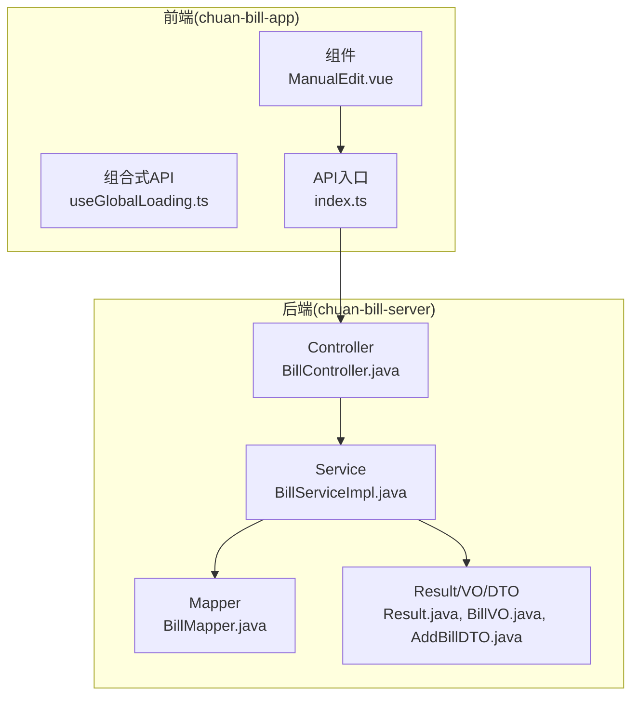
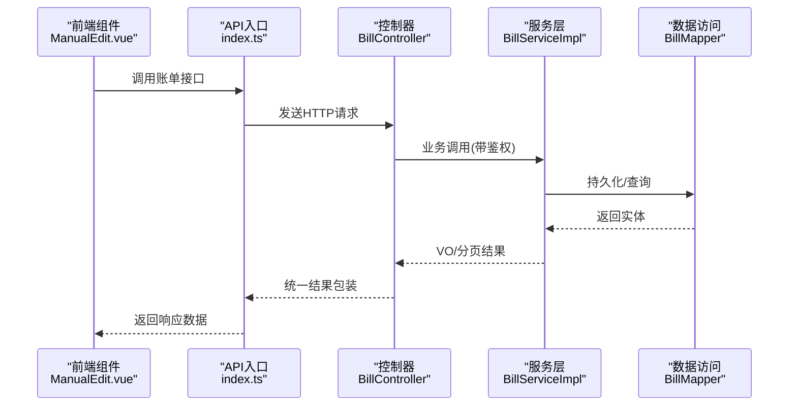
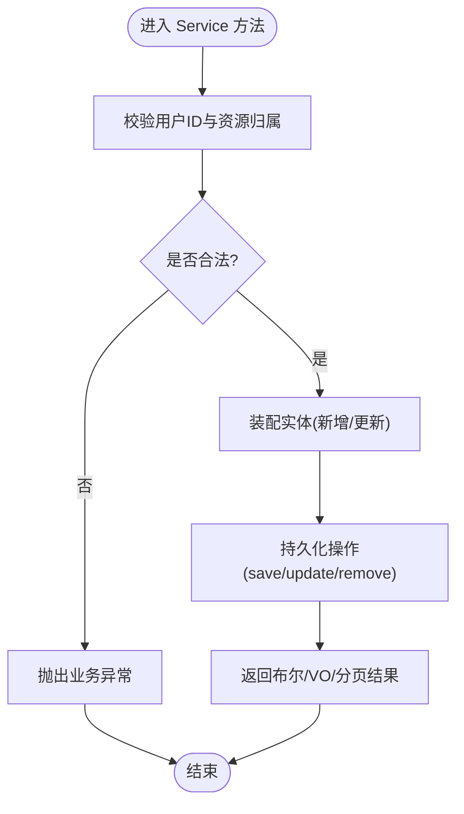
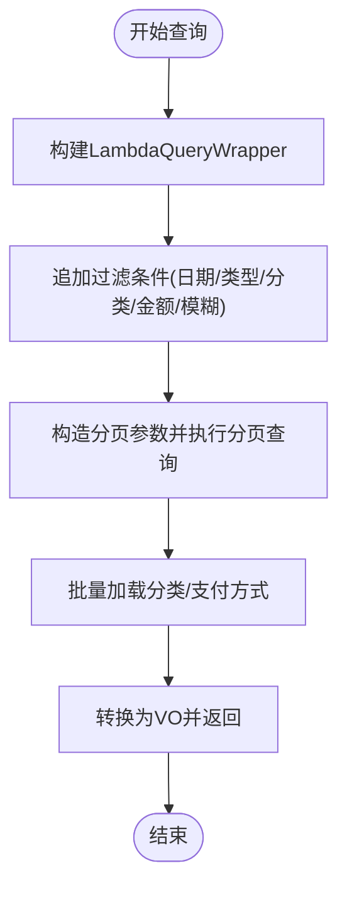
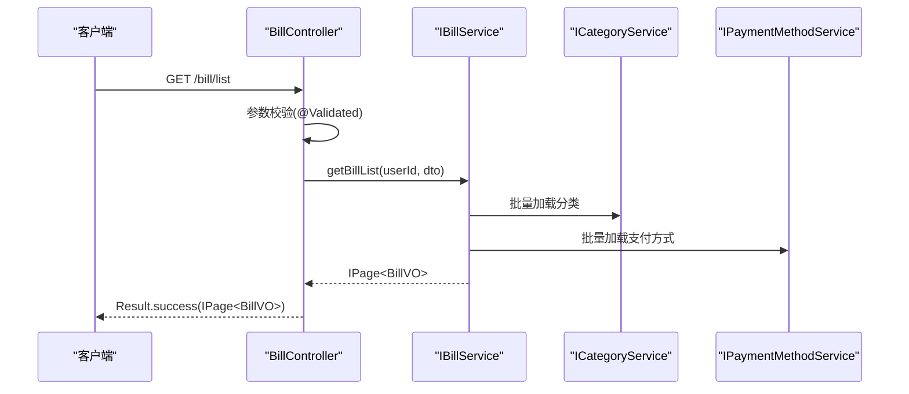
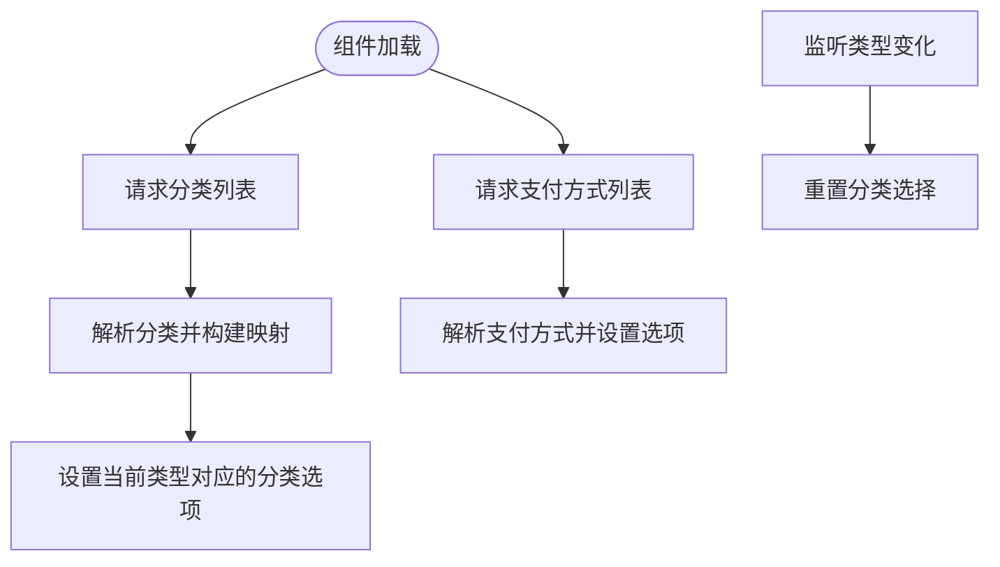
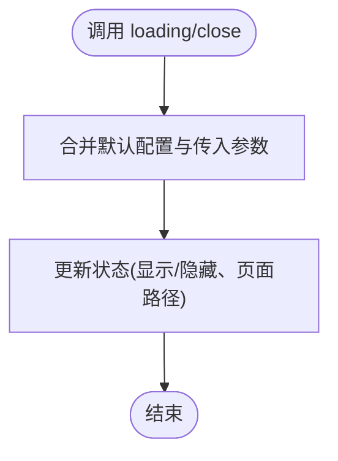
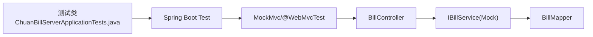

# 单元测试

<cite>
**本文引用的文件**
- [pom.xml](file://chuan-bill-server/pom.xml)
- [ChuanBillServerApplicationTests.java](file://chuan-bill-server/src/test/java/com/samoy/chuanbillserver/ChuanBillServerApplicationTests.java)
- [BillController.java](file://chuan-bill-server/src/main/java/com/samoy/chuanbillserver/controller/BillController.java)
- [BillServiceImpl.java](file://chuan-bill-server/src/main/java/com/samoy/chuanbillserver/service/impl/BillServiceImpl.java)
- [BillMapper.java](file://chuan-bill-server/src/main/java/com/samoy/chuanbillserver/dao/BillMapper.java)
- [ManualEdit.vue](file://chuan-bill-app/src/pages/bill/components/ManualEdit.vue)
- [useGlobalLoading.ts](file://chuan-bill-app/src/composables/useGlobalLoading.ts)
- [index.ts](file://chuan-bill-app/src/api/index.ts)
</cite>

## 目录
1. [简介](#简介)
2. [项目结构](#项目结构)
3. [核心组件](#核心组件)
4. [架构总览](#架构总览)
5. [详细组件分析](#详细组件分析)
6. [依赖分析](#依赖分析)
7. [性能考虑](#性能考虑)
8. [故障排查指南](#故障排查指南)
9. [结论](#结论)
10. [附录](#附录)

## 简介
本文件面向“小川记账”项目的单元测试实践，覆盖以下目标：
- Spring Boot 后端：Service 层、Repository 层、Controller 层的单元测试最佳实践与示例路径
- Vue 前端：组件单元测试、组合式 API 测试、全局组件测试的实现方法
- Mock 对象与框架：Mockito 配置、Spring Test 注解、测试数据准备
- 测试用例设计：边界条件、异常、业务逻辑
- 覆盖率与规范：覆盖率要求、命名规范、断言方法
- 结果分析：如何评估测试质量与改进方向

## 项目结构
本项目采用前后端分离架构：
- 后端：Spring Boot 3 + MyBatis-Plus，位于 chuan-bill-server
- 前端：Vue 3 + UniApp（小程序/多端），位于 chuan-bill-app

图表来源
- [BillController.java:1-91](file://chuan-bill-server/src/main/java/com/samoy/chuanbillserver/controller/BillController.java#L1-91)
- [BillServiceImpl.java:1-244](file://chuan-bill-server/src/main/java/com/samoy/chuanbillserver/service/impl/BillServiceImpl.java#L1-244)
- [BillMapper.java:1-15](file://chuan-bill-server/src/main/java/com/samoy/chuanbillserver/dao/BillMapper.java#L1-15)
- [ManualEdit.vue:1-174](file://chuan-bill-app/src/pages/bill/components/ManualEdit.vue#L1-174)
- [useGlobalLoading.ts:1-38](file://chuan-bill-app/src/composables/useGlobalLoading.ts#L1-38)
- [index.ts:1-19](file://chuan-bill-app/src/api/index.ts#L1-19)

章节来源
- [pom.xml:148-168](file://chuan-bill-server/pom.xml#L148-L168)
- [ChuanBillServerApplicationTests.java:1-12](file://chuan-bill-server/src/test/java/com/samoy/chuanbillserver/ChuanBillServerApplicationTests.java#L1-12)

## 核心组件
- 控制器层：负责请求接入、参数校验、鉴权（Sa-Token）、调用服务层并返回统一结果包装
- 服务层：实现业务逻辑，处理权限校验、批量关联数据加载、分页查询优化
- 数据访问层：基于 MyBatis-Plus Mapper 接口，提供基础 CRUD 能力
- 前端组件：ManualEdit.vue 负责账单录入 UI 与交互；useGlobalLoading.ts 提供全局加载状态管理；API 入口统一对外暴露

章节来源
- [BillController.java:23-91](file://chuan-bill-server/src/main/java/com/samoy/chuanbillserver/controller/BillController.java#L23-L91)
- [BillServiceImpl.java:42-244](file://chuan-bill-server/src/main/java/com/samoy/chuanbillserver/service/impl/BillServiceImpl.java#L42-L244)
- [BillMapper.java:1-15](file://chuan-bill-server/src/main/java/com/samoy/chuanbillserver/dao/BillMapper.java#L1-15)
- [ManualEdit.vue:1-174](file://chuan-bill-app/src/pages/bill/components/ManualEdit.vue#L1-174)
- [useGlobalLoading.ts:1-38](file://chuan-bill-app/src/composables/useGlobalLoading.ts#L1-38)
- [index.ts:1-19](file://chuan-bill-app/src/api/index.ts#L1-19)

## 架构总览
后端采用“控制器-服务-数据访问”的分层架构，前端通过 Alova 客户端发起请求并与后端交互。

图表来源
- [ManualEdit.vue:31-61](file://chuan-bill-app/src/pages/bill/components/ManualEdit.vue#L31-L61)
- [index.ts:14-18](file://chuan-bill-app/src/api/index.ts#L14-L18)
- [BillController.java:37-89](file://chuan-bill-server/src/main/java/com/samoy/chuanbillserver/controller/BillController.java#L37-L89)
- [BillServiceImpl.java:50-123](file://chuan-bill-server/src/main/java/com/samoy/chuanbillserver/service/impl/BillServiceImpl.java#L50-L123)
- [BillMapper.java:1-15](file://chuan-bill-server/src/main/java/com/samoy/chuanbillserver/dao/BillMapper.java#L1-15)

## 详细组件分析

### 后端：Service 层测试
目标：验证业务逻辑正确性、权限控制、异常处理、分页与关联数据加载。

- 关键点
  - 权限校验：更新/删除/查看需校验账单归属用户
  - 分页查询：按时间、金额、分类等条件过滤
  - 关联数据：批量加载分类与支付方式，避免 N+1 查询
  - DTO 映射：新增/更新时的数据装配

- 测试建议
  - 使用 Mockito 创建 IBillService 的桩件，模拟 ICategoryService/IPaymentMethodService 的返回
  - 准备最小化测试数据（Bill、Category、PaymentMethod），构造 AddBillDTO/UpdateBillDTO
  - 断言：返回值类型、异常抛出、分页大小与排序、VO 字段映射
  - 边界：空值、非法金额、空字符串、null 分类/支付方式

- 示例路径
  - 新增账单：[BillServiceImpl.addBill:126-141](file://chuan-bill-server/src/main/java/com/samoy/chuanbillserver/service/impl/BillServiceImpl.java#L126-L141)
  - 更新账单：[BillServiceImpl.updateBill:144-161](file://chuan-bill-server/src/main/java/com/samoy/chuanbillserver/service/impl/BillServiceImpl.java#L144-L161)
  - 删除账单：[BillServiceImpl.deleteBill:164-173](file://chuan-bill-server/src/main/java/com/samoy/chuanbillserver/service/impl/BillServiceImpl.java#L164-L173)
  - 列表分页与关联加载：[BillServiceImpl.getBillList:51-123](file://chuan-bill-server/src/main/java/com/samoy/chuanbillserver/service/impl/BillServiceImpl.java#L51-L123)

图表来源
- [BillServiceImpl.java:144-173](file://chuan-bill-server/src/main/java/com/samoy/chuanbillserver/service/impl/BillServiceImpl.java#L144-L173)

章节来源
- [BillServiceImpl.java:126-173](file://chuan-bill-server/src/main/java/com/samoy/chuanbillserver/service/impl/BillServiceImpl.java#L126-L173)

### 后端：Repository 层测试
目标：验证 Mapper 行为与 SQL 条件拼装。

- 关键点
  - LambdaQueryWrapper 条件拼接：日期范围、类型、分类、金额范围、模糊匹配
  - 分页 Page 构造与排序
  - 批量查询 listByIds 的性能与空集合处理

- 测试建议
  - 使用嵌入式数据库（如 H2）或内存数据库进行集成测试
  - 构造不同查询条件组合，验证分页与排序
  - 验证空集合与 null 值处理

- 示例路径
  - 条件构建与分页：[BillServiceImpl.getBillList:51-88](file://chuan-bill-server/src/main/java/com/samoy/chuanbillserver/service/impl/BillServiceImpl.java#L51-L88)
  - 批量查询分类/支付方式：[BillServiceImpl.getBillList:90-120](file://chuan-bill-server/src/main/java/com/samoy/chuanbillserver/service/impl/BillServiceImpl.java#L90-L120)

图表来源
- [BillServiceImpl.java:51-123](file://chuan-bill-server/src/main/java/com/samoy/chuanbillserver/service/impl/BillServiceImpl.java#L51-L123)
- [BillMapper.java:1-15](file://chuan-bill-server/src/main/java/com/samoy/chuanbillserver/dao/BillMapper.java#L1-15)

章节来源
- [BillServiceImpl.java:51-123](file://chuan-bill-server/src/main/java/com/samoy/chuanbillserver/service/impl/BillServiceImpl.java#L51-L123)
- [BillMapper.java:1-15](file://chuan-bill-server/src/main/java/com/samoy/chuanbillserver/dao/BillMapper.java#L1-15)

### 后端：Controller 层测试
目标：验证路由、参数校验、鉴权、返回结构。

- 关键点
  - Sa-Token 登录态：StpUtil.getLoginIdAsString() 获取用户ID
  - 参数校验：@Validated + DTO 校验
  - 统一返回：Result.success(...) 包裹分页/对象/布尔

- 测试建议
  - 使用 Spring Boot Test + MockMvc 或 @WebMvcTest
  - 使用 @MockBean 注入 IBillService/ICategoryService/IPaymentMethodService
  - 构造登录上下文（Sa-Token），验证鉴权通过与失败分支
  - 断言 HTTP 状态码、响应体结构与字段

- 示例路径
  - 获取账单列表：[BillController.getBillList:37-42](file://chuan-bill-server/src/main/java/com/samoy/chuanbillserver/controller/BillController.java#L37-L42)
  - 添加账单：[BillController.addBill:52-57](file://chuan-bill-server/src/main/java/com/samoy/chuanbillserver/controller/BillController.java#L52-L57)
  - 更新账单：[BillController.updateBill:59-64](file://chuan-bill-server/src/main/java/com/samoy/chuanbillserver/controller/BillController.java#L59-L64)
  - 删除账单：[BillController.deleteBill:66-72](file://chuan-bill-server/src/main/java/com/samoy/chuanbillserver/controller/BillController.java#L66-L72)

图表来源
- [BillController.java:37-42](file://chuan-bill-server/src/main/java/com/samoy/chuanbillserver/controller/BillController.java#L37-L42)
- [BillServiceImpl.java:51-123](file://chuan-bill-server/src/main/java/com/samoy/chuanbillserver/service/impl/BillServiceImpl.java#L51-L123)

章节来源
- [BillController.java:37-89](file://chuan-bill-server/src/main/java/com/samoy/chuanbillserver/controller/BillController.java#L37-L89)

### 前端：组件单元测试（ManualEdit.vue）
目标：验证组件渲染、表单联动、异步数据加载、UI 行为。

- 关键点
  - 分类与支付方式下拉选项加载
  - 类型切换导致分类选项变化
  - 表单字段双向绑定与校验
  - 异步请求成功/失败分支

- 测试建议
  - 使用 Vitest + @vue/test-utils
  - 使用 Mock API（Alova）拦截 Apis.bill.* 请求，返回固定数据
  - 断言：DOM 渲染、事件触发、状态变更、异步回调
  - 边界：空数据、错误状态、网络异常

- 示例路径
  - 分类列表加载：[ManualEdit.getCategoryList:31-48](file://chuan-bill-app/src/pages/bill/components/ManualEdit.vue#L31-L48)
  - 支付方式列表加载：[ManualEdit.getPayMethodList:50-56](file://chuan-bill-app/src/pages/bill/components/ManualEdit.vue#L50-L56)
  - 类型切换联动：[ManualEdit.watch.type:63-66](file://chuan-bill-app/src/pages/bill/components/ManualEdit.vue#L63-L66)

图表来源
- [ManualEdit.vue:31-66](file://chuan-bill-app/src/pages/bill/components/ManualEdit.vue#L31-L66)

章节来源
- [ManualEdit.vue:1-174](file://chuan-bill-app/src/pages/bill/components/ManualEdit.vue#L1-174)

### 前端：组合式 API 测试（useGlobalLoading.ts）
目标：验证全局加载状态管理的行为与状态变更。

- 关键点
  - loading/close 动作对状态的影响
  - 当前页面记录与合并策略

- 测试建议
  - 使用 Vitest 直接测试 store 动作
  - 断言状态快照与默认值恢复
  - 边界：字符串与对象参数、空状态恢复

- 示例路径
  - 全局加载动作：[useGlobalLoading.loading:21-30](file://chuan-bill-app/src/composables/useGlobalLoading.ts#L21-L30)
  - 关闭动作：[useGlobalLoading.close:32-35](file://chuan-bill-app/src/composables/useGlobalLoading.ts#L32-L35)

图表来源
- [useGlobalLoading.ts:21-35](file://chuan-bill-app/src/composables/useGlobalLoading.ts#L21-L35)

章节来源
- [useGlobalLoading.ts:1-38](file://chuan-bill-app/src/composables/useGlobalLoading.ts#L1-38)

### 前端：全局组件测试（API 入口）
目标：验证 API 入口导出与 Alova 实例配置。

- 关键点
  - createApis 生成全局 Apis 对象
  - alovaInstance 与配置映射

- 测试建议
  - 断言导出对象结构与类型
  - 在组件测试中注入 Mock Apis，隔离真实网络

- 示例路径
  - API 导出入口：[index.ts:14-18](file://chuan-bill-app/src/api/index.ts#L14-L18)

章节来源
- [index.ts:1-19](file://chuan-bill-app/src/api/index.ts#L1-19)

## 依赖分析
后端测试依赖与配置要点：
- 测试启动与扫描：Spring Boot Test
- Web 测试：MockMvc 或 @WebMvcTest
- 数据访问：MyBatis-Plus + Mapper
- Mock 框架：Mockito（用于 Service/Controller 层桩件）

图表来源
- [ChuanBillServerApplicationTests.java:1-12](file://chuan-bill-server/src/test/java/com/samoy/chuanbillserver/ChuanBillServerApplicationTests.java#L1-12)
- [BillController.java:23-91](file://chuan-bill-server/src/main/java/com/samoy/chuanbillserver/controller/BillController.java#L23-L91)
- [BillServiceImpl.java:42-244](file://chuan-bill-server/src/main/java/com/samoy/chuanbillserver/service/impl/BillServiceImpl.java#L42-L244)
- [BillMapper.java:1-15](file://chuan-bill-server/src/main/java/com/samoy/chuanbillserver/dao/BillMapper.java#L1-15)

章节来源
- [pom.xml:148-168](file://chuan-bill-server/pom.xml#L148-L168)
- [ChuanBillServerApplicationTests.java:1-12](file://chuan-bill-server/src/test/java/com/samoy/chuanbillserver/ChuanBillServerApplicationTests.java#L1-12)

## 性能考虑
- Service 层分页与批量加载：避免 N+1 查询，提升列表性能
- 前端组件懒加载与虚拟滚动：在大数据量场景下减少 DOM 压力
- 测试执行顺序：优先运行独立、无外部依赖的单元测试，再进行集成测试

## 故障排查指南
- 后端常见问题
  - 权限异常：检查 Sa-Token 登录态与用户 ID 校验
  - 参数校验失败：确认 DTO 字段与约束
  - 分页结果为空：检查条件过滤与分页参数
- 前端常见问题
  - 组件未渲染：检查异步数据是否已返回
  - 事件未触发：确认事件绑定与参数传递
  - 状态未更新：检查 Pinia Store 的 action 是否被调用

## 结论
通过分层测试与 Mock 隔离，可以高效验证后端业务逻辑与前端组件行为。建议以 Service/Repository 为核心，逐步扩展到 Controller 与前端组件，并结合覆盖率指标持续完善测试矩阵。

## 附录

### 测试覆盖率要求（建议）
- 服务层：≥ 80%
- 数据访问层：≥ 70%
- 控制器层：≥ 60%
- 前端组件：≥ 75%
- 组合式 API：≥ 85%

### 测试命名规范（建议）
- 后端：类名以 Test 结尾；方法以 testXxx 形式；按场景分组（成功/失败/边界）
- 前端：文件以 .spec.ts/.test.ts 结尾；describe 以组件名命名；it 描述具体行为

### 断言方法使用（建议）
- 后端：AssertJ 或 JUnit Assert，断言返回值、异常类型、分页大小
- 前端：expect/toBe、toHaveProperty、toHaveBeenCalledWith 等

### 测试数据准备（建议）
- 使用 @BeforeEach 初始化最小化数据
- 使用 @MockBean/@SpyBean 注入桩件
- 使用 @WithMockUser 或 Sa-Token 模拟登录上下文