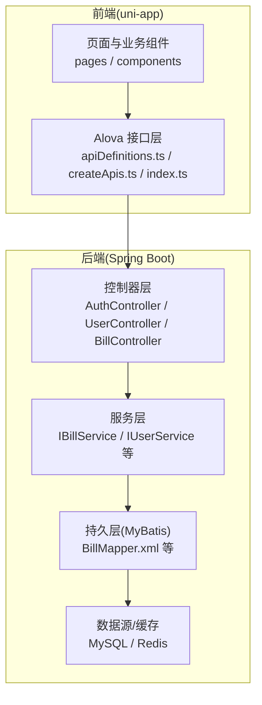
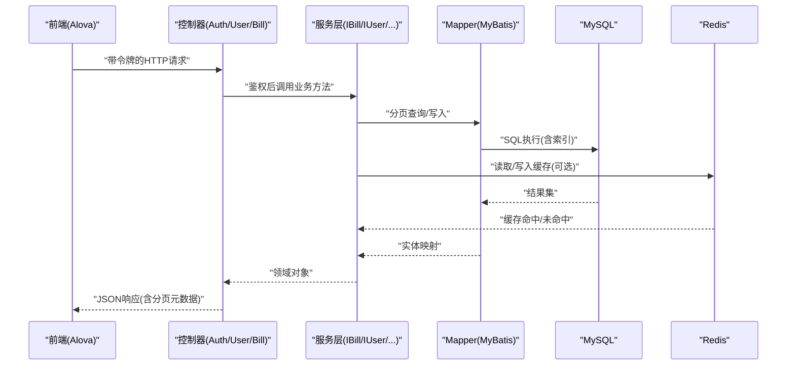
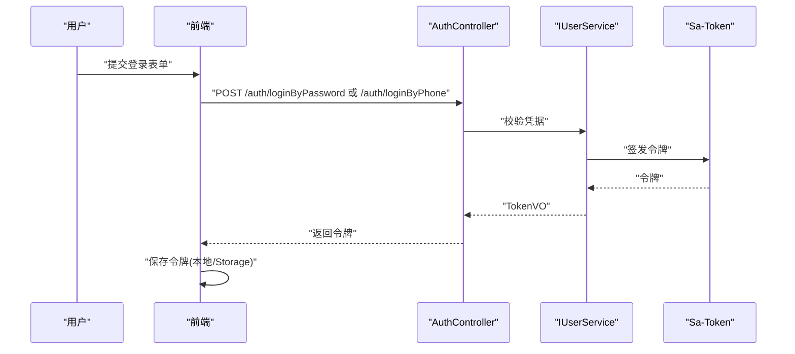
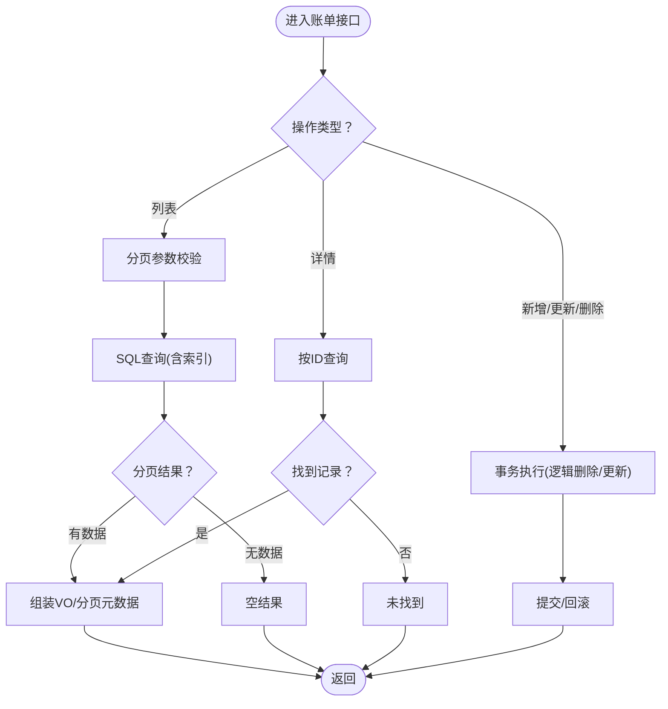
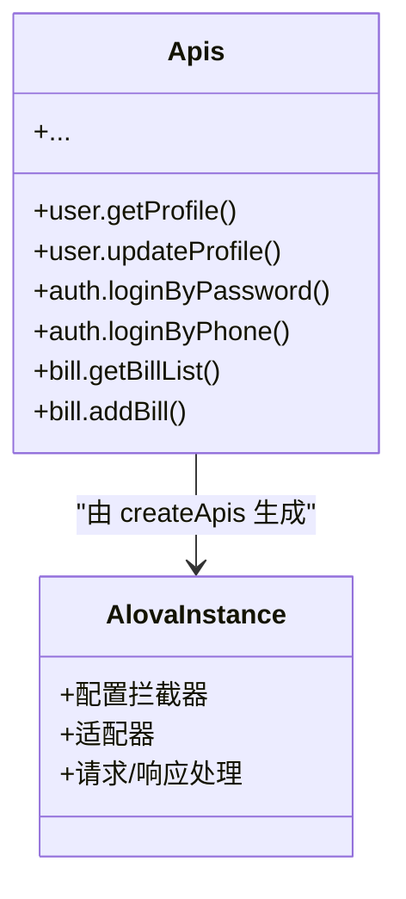
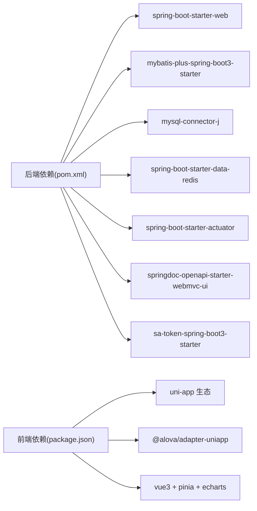

# 性能测试

<cite>
**本文引用的文件**
- [application.yaml](file://chuan-bill-server/src/main/resources/application.yaml)
- [pom.xml](file://chuan-bill-server/pom.xml)
- [init.sql](file://chuan-bill-server/init.sql)
- [BillController.java](file://chuan-bill-server/src/main/java/com/samoy/chuanbillserver/controller/BillController.java)
- [UserController.java](file://chuan-bill-server/src/main/java/com/samoy/chuanbillserver/controller/UserController.java)
- [AuthController.java](file://chuan-bill-server/src/main/java/com/samoy/chuanbillserver/controller/AuthController.java)
- [BillMapper.xml](file://chuan-bill-server/src/main/resources/mapper/BillMapper.xml)
- [apiDefinitions.ts](file://chuan-bill-app/src/api/apiDefinitions.ts)
- [createApis.ts](file://chuan-bill-app/src/api/createApis.ts)
- [index.ts](file://chuan-bill-app/src/api/index.ts)
- [package.json](file://chuan-bill-app/package.json)
- [PRD.md](file://PRD.md)
</cite>

## 目录
1. [简介](#简介)
2. [项目结构](#项目结构)
3. [核心组件](#核心组件)
4. [架构总览](#架构总览)
5. [详细组件分析](#详细组件分析)
6. [依赖分析](#依赖分析)
7. [性能考虑](#性能考虑)
8. [故障排查指南](#故障排查指南)
9. [结论](#结论)
10. [附录](#附录)

## 简介
本文件面向“小川记账”项目的性能测试工作，目标是建立一套系统化的性能测试方法论与实践指南，覆盖负载测试、压力测试、基准测试与回归测试，并提供基于测试结果的优化建议与可执行的测试脚本与流程。测试对象涵盖后端服务（Spring Boot + MyBatis-Plus + MySQL + Redis）、认证与授权（Sa-Token）、以及前端（uni-app + Alova）。

## 项目结构
小川记账采用前后端分离架构：
- 后端：Spring Boot 应用，提供 REST 接口，集成 MyBatis-Plus、MySQL、Redis、OpenAPI/Swagger、Actuator 监控。
- 前端：uni-app 应用，使用 Alova 进行接口调用，通过 OpenAPI 定义生成接口代码。
- 数据库：MySQL 初始化脚本包含用户、账单、类目、支付方式、预算、消息等核心表，并建立关键索引。

图示来源
- [AuthController.java:1-66](file://chuan-bill-server/src/main/java/com/samoy/chuanbillserver/controller/AuthController.java#L1-L66)
- [UserController.java:1-62](file://chuan-bill-server/src/main/java/com/samoy/chuanbillserver/controller/UserController.java#L1-L62)
- [BillController.java:1-91](file://chuan-bill-server/src/main/java/com/samoy/chuanbillserver/controller/BillController.java#L1-L91)
- [BillMapper.xml:1-6](file://chuan-bill-server/src/main/resources/mapper/BillMapper.xml#L1-L6)
- [apiDefinitions.ts:1-38](file://chuan-bill-app/src/api/apiDefinitions.ts#L1-L38)
- [createApis.ts:1-95](file://chuan-bill-app/src/api/createApis.ts#L1-L95)
- [index.ts:1-19](file://chuan-bill-app/src/api/index.ts#L1-L19)

章节来源
- [application.yaml:1-51](file://chuan-bill-server/src/main/resources/application.yaml#L1-L51)
- [pom.xml:1-226](file://chuan-bill-server/pom.xml#L1-L226)
- [init.sql:1-326](file://chuan-bill-server/init.sql#L1-L326)
- [package.json:1-135](file://chuan-bill-app/package.json#L1-L135)
- [PRD.md:1-168](file://PRD.md#L1-L168)

## 核心组件
- 认证与授权：后端通过 Sa-Token 实现令牌管理；前端通过 Alova 的全局实例发起请求，携带令牌访问受保护接口。
- 接口定义：前端通过 OpenAPI 定义生成 Apis 对象，统一管理 GET/POST 请求路径与参数。
- 控制器层：提供认证、用户资料、账单列表/详情/增删改、分类与支付方式等接口。
- 数据层：MyBatis-Plus 提供分页查询与逻辑删除；MySQL 初始化脚本包含多张核心表及索引。
- 监控与可观测性：Actuator 暴露健康检查与指标；Swagger/OpenAPI 提供接口文档。

章节来源
- [AuthController.java:1-66](file://chuan-bill-server/src/main/java/com/samoy/chuanbillserver/controller/AuthController.java#L1-L66)
- [UserController.java:1-62](file://chuan-bill-server/src/main/java/com/samoy/chuanbillserver/controller/UserController.java#L1-L62)
- [BillController.java:1-91](file://chuan-bill-server/src/main/java/com/samoy/chuanbillserver/controller/BillController.java#L1-L91)
- [apiDefinitions.ts:1-38](file://chuan-bill-app/src/api/apiDefinitions.ts#L1-L38)
- [createApis.ts:1-95](file://chuan-bill-app/src/api/createApis.ts#L1-L95)
- [index.ts:1-19](file://chuan-bill-app/src/api/index.ts#L1-L19)
- [application.yaml:1-51](file://chuan-bill-server/src/main/resources/application.yaml#L1-L51)
- [pom.xml:55-168](file://chuan-bill-server/pom.xml#L55-L168)

## 架构总览
下图展示了从前端到后端再到数据库的典型请求链路，以及关键性能关注点（认证、分页、缓存、索引）。

图示来源
- [AuthController.java:1-66](file://chuan-bill-server/src/main/java/com/samoy/chuanbillserver/controller/AuthController.java#L1-L66)
- [UserController.java:1-62](file://chuan-bill-server/src/main/java/com/samoy/chuanbillserver/controller/UserController.java#L1-L62)
- [BillController.java:1-91](file://chuan-bill-server/src/main/java/com/samoy/chuanbillserver/controller/BillController.java#L1-L91)
- [BillMapper.xml:1-6](file://chuan-bill-server/src/main/resources/mapper/BillMapper.xml#L1-L6)
- [application.yaml:1-51](file://chuan-bill-server/src/main/resources/application.yaml#L1-L51)

## 详细组件分析

### 认证与登录接口性能要点
- 登录接口：密码登录与手机号登录，返回令牌；前端需在后续请求中携带令牌。
- 验证码发送：无需登录，但需注意短信通道的限流与降级。
- 令牌管理：Sa-Token 提供令牌生命周期与日志，影响并发下的会话开销。

图示来源
- [AuthController.java:1-66](file://chuan-bill-server/src/main/java/com/samoy/chuanbillserver/controller/AuthController.java#L1-L66)
- [UserController.java:1-62](file://chuan-bill-server/src/main/java/com/samoy/chuanbillserver/controller/UserController.java#L1-L62)
- [application.yaml:23-31](file://chuan-bill-server/src/main/resources/application.yaml#L23-L31)

章节来源
- [AuthController.java:1-66](file://chuan-bill-server/src/main/java/com/samoy/chuanbillserver/controller/AuthController.java#L1-L66)

### 账单接口性能要点
- 列表查询：支持分页与多维筛选，需关注 SQL 索引与分页大小上限。
- 详情查询：单条记录读取，需确认缓存策略与懒加载。
- 新增/更新/删除：写入操作需关注事务与幂等性；删除采用逻辑删除。
- 分类与支付方式：读取类目与支付方式列表，适合缓存热点数据。

图示来源
- [BillController.java:1-91](file://chuan-bill-server/src/main/java/com/samoy/chuanbillserver/controller/BillController.java#L1-L91)
- [BillMapper.xml:1-6](file://chuan-bill-server/src/main/resources/mapper/BillMapper.xml#L1-L6)
- [init.sql:130-158](file://chuan-bill-server/init.sql#L130-L158)

章节来源
- [BillController.java:1-91](file://chuan-bill-server/src/main/java/com/samoy/chuanbillserver/controller/BillController.java#L1-L91)
- [init.sql:130-158](file://chuan-bill-server/init.sql#L130-L158)

### 前端接口调用与生成
- 前端通过 OpenAPI 定义生成 Apis 对象，统一管理请求方法与 URL。
- Alova 实例负责拦截器、适配器与请求配置，便于统一注入令牌与错误处理。

图示来源
- [apiDefinitions.ts:1-38](file://chuan-bill-app/src/api/apiDefinitions.ts#L1-L38)
- [createApis.ts:1-95](file://chuan-bill-app/src/api/createApis.ts#L1-L95)
- [index.ts:1-19](file://chuan-bill-app/src/api/index.ts#L1-L19)

章节来源
- [apiDefinitions.ts:1-38](file://chuan-bill-app/src/api/apiDefinitions.ts#L1-L38)
- [createApis.ts:1-95](file://chuan-bill-app/src/api/createApis.ts#L1-L95)
- [index.ts:1-19](file://chuan-bill-app/src/api/index.ts#L1-L19)
- [package.json:57-87](file://chuan-bill-app/package.json#L57-L87)

## 依赖分析
- 后端依赖：Spring Web、MyBatis-Plus、MySQL Connector、Redis Starter、Actuator、OpenAPI/Swagger、Sa-Token 等。
- 前端依赖：uni-app 生态、Alova、Vue3、Pinia、ECharts 等。
- 数据库初始化：包含用户、账单、类目、支付方式、预算、消息等表，关键字段均建有索引。

图示来源
- [pom.xml:51-168](file://chuan-bill-server/pom.xml#L51-L168)
- [package.json:57-87](file://chuan-bill-app/package.json#L57-L87)

章节来源
- [pom.xml:1-226](file://chuan-bill-server/pom.xml#L1-L226)
- [package.json:1-135](file://chuan-bill-app/package.json#L1-L135)
- [init.sql:1-326](file://chuan-bill-server/init.sql#L1-L326)

## 性能考虑
- 并发与会话：Sa-Token 的令牌与会话管理会影响高并发下的内存占用与 GC 压力。
- 数据库：合理使用索引（如账单表 user_id/time、family_id/time），避免全表扫描；分页查询控制每页大小。
- 缓存：热点读（分类、支付方式、用户资料）可引入 Redis 缓存；写后失效或延迟双删策略。
- 网络与序列化：减少不必要的字段传输，开启 GZIP 压缩；前端请求合并与节流。
- 监控：利用 Actuator 暴露 JVM、线程、HTTP 请求指标，结合外部监控平台采集。

[本节为通用指导，不直接分析具体文件]

## 故障排查指南
- 接口超时/抖动：检查数据库慢查询日志、索引缺失、连接池耗尽；观察 Actuator 指标。
- 认证失败/频繁登出：核对 Sa-Token 令牌过期与并发配置；检查 Redis 连接与可用性。
- 前端请求异常：确认 Alova 拦截器是否正确注入令牌；检查 OpenAPI 生成的 Apis 方法签名。
- 数据不一致：核查逻辑删除与分页边界；确认幂等性设计与事务隔离级别。

章节来源
- [application.yaml:23-31](file://chuan-bill-server/src/main/resources/application.yaml#L23-L31)
- [pom.xml:55-168](file://chuan-bill-server/pom.xml#L55-L168)
- [createApis.ts:1-95](file://chuan-bill-app/src/api/createApis.ts#L1-L95)

## 结论
通过明确的性能测试方法与工具链，结合数据库索引、缓存策略、并发配置与监控指标，可以系统性地发现并解决小川记账在高并发场景下的瓶颈。建议持续开展基准测试与回归测试，形成性能基线，保障用户体验与系统稳定性。

[本节为总结，不直接分析具体文件]

## 附录

### 性能测试方法与脚本清单
以下为可执行的测试脚本与流程清单，便于在 CI/CD 中自动化执行与回归验证。

- 负载测试（JMeter）
  - 测试场景设计
    - 场景一：登录与首页加载（认证接口 + 账单列表）
    - 场景二：高频写入（新增账单）
    - 场景三：混合场景（读写比 7:3）
  - 并发用户模拟
    - 阶梯式并发：10 → 50 → 100 → 200，每级保持 3~5 分钟稳定
    - 持续并发：200 并发持续 10 分钟
  - 响应时间监控
    - 目标：95% 响应时间 ≤ 1 秒，99% 响应时间 ≤ 2 秒
    - 指标：平均响应时间、P95/P99、错误率、吞吐量
  - JMX 脚本位置参考
    - [AuthController.java:1-66](file://chuan-bill-server/src/main/java/com/samoy/chuanbillserver/controller/AuthController.java#L1-L66)
    - [BillController.java:1-91](file://chuan-bill-server/src/main/java/com/samoy/chuanbillserver/controller/BillController.java#L1-L91)
    - [apiDefinitions.ts:1-38](file://chuan-bill-app/src/api/apiDefinitions.ts#L1-L38)

- 压力测试策略
  - 数据库压力测试
    - 使用 sysbench/tpcc 或 MySQL 自带工具，构造大量账单数据与并发写入
    - 关注点：锁等待、死锁、索引使用率、缓冲池命中率
  - API 接口压力测试
    - 针对账单列表、新增、详情等高频接口进行极限并发压测
    - 关注点：线程池饱和、队列长度、数据库连接池耗尽
  - 内存使用测试
    - 使用 JProfiler/JMC/VisualVM 观察堆内存、GC 次数与停顿
    - 关注点：大对象分配、缓存命中、长尾请求
  - CPU 使用率测试
    - 观察 CPU 上下文切换、阻塞与用户态占比
    - 关注点：IO 密集型 vs 计算密集型任务分布

- 性能基准测试
  - 系统性能指标定义
    - 吞吐量：请求/秒
    - 延迟：平均/中位数/P95/P99
    - 资源：CPU 使用率、内存占用、磁盘 IO、网络 IO
    - 可用性：错误率、SLA 达成率
  - 基准测试工具
    - JMeter（脚本与场景）
    - wrk/ab（简单场景）
    - Prometheus + Grafana（运行时指标）
  - 性能回归测试
    - 在 CI 中集成 JMeter 脚本，设定阈值告警
    - 对关键接口建立基线，对比每次构建的指标

- 性能测试报告分析
  - 吞吐量分析：不同并发下的 QPS 变化曲线，识别拐点
  - 延迟分析：P95/P99 随并发增长的趋势，定位瓶颈
  - 资源利用率分析：CPU、内存、磁盘、网络、数据库连接池使用率
  - 错误分析：错误类型分布、错误堆栈定位

- 性能优化建议（基于测试结果）
  - 数据库层面
    - 补充缺失索引（如账单按 user_id/time、family_id/time）
    - 分页查询限制最大页码与每页大小
    - 读写分离与只读副本
  - 缓存层面
    - 热点数据（分类、支付方式、用户资料）引入 Redis 缓存
    - 写后失效策略，避免脏读
  - 并发与线程层面
    - 调整线程池大小与队列长度
    - 合理设置连接池参数（最大连接、空闲、超时）
  - 前端层面
    - 请求合并与节流，减少重复请求
    - 图片与静态资源压缩与 CDN
  - 监控与告警
    - 基于 Actuator 指标建立阈值告警
    - 链路追踪（如 SkyWalking/Zipkin）定位慢调用

- 测试执行流程
  - 准备阶段
    - 启动 MySQL 与 Redis，导入初始化脚本
    - 启动 Spring Boot 应用，确认 Swagger 文档可用
    - 启动前端开发服务器或打包产物
  - 执行阶段
    - 使用 JMeter 执行各场景脚本，采集指标
    - 记录并发、响应时间、错误率、资源使用
  - 分析阶段
    - 对比基线，识别回归
    - 输出报告并制定优化计划
  - 回归阶段
    - 修复后再次执行相同场景，验证效果

章节来源
- [application.yaml:1-51](file://chuan-bill-server/src/main/resources/application.yaml#L1-L51)
- [pom.xml:1-226](file://chuan-bill-server/pom.xml#L1-L226)
- [init.sql:1-326](file://chuan-bill-server/init.sql#L1-L326)
- [AuthController.java:1-66](file://chuan-bill-server/src/main/java/com/samoy/chuanbillserver/controller/AuthController.java#L1-L66)
- [BillController.java:1-91](file://chuan-bill-server/src/main/java/com/samoy/chuanbillserver/controller/BillController.java#L1-L91)
- [apiDefinitions.ts:1-38](file://chuan-bill-app/src/api/apiDefinitions.ts#L1-L38)
- [createApis.ts:1-95](file://chuan-bill-app/src/api/createApis.ts#L1-L95)
- [index.ts:1-19](file://chuan-bill-app/src/api/index.ts#L1-L19)
- [package.json:1-135](file://chuan-bill-app/package.json#L1-L135)
- [PRD.md:1-168](file://PRD.md#L1-L168)