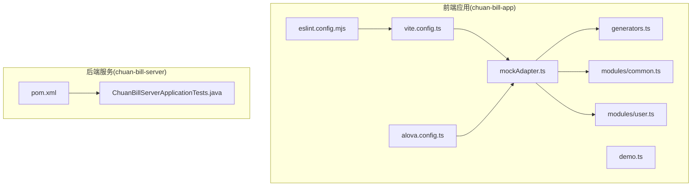
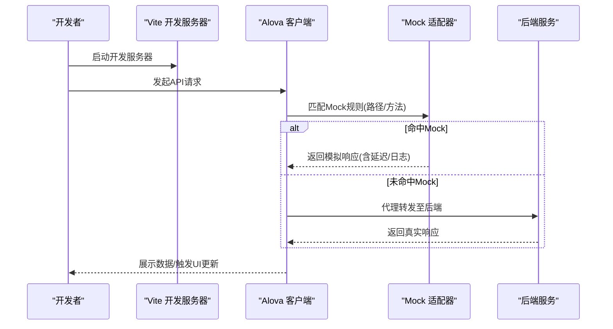
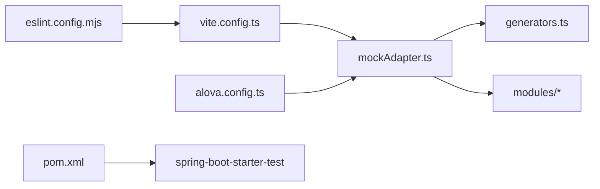

# 测试工具配置

<cite>
**本文引用的文件**
- [package.json](file://chuan-bill-app/package.json)
- [eslint.config.mjs](file://chuan-bill-app/eslint.config.mjs)
- [vite.config.ts](file://chuan-bill-app/vite.config.ts)
- [alova.config.ts](file://chuan-bill-app/alova.config.ts)
- [pom.xml](file://chuan-bill-server/pom.xml)
- [ChuanBillServerApplicationTests.java](file://chuan-bill-server/src/test/java/com/samoy/chuanbillserver/ChuanBillServerApplicationTests.java)
- [mockAdapter.ts](file://chuan-bill-app/src/api/mock/mockAdapter.ts)
- [generators.ts](file://chuan-bill-app/src/api/mock/utils/generators.ts)
- [common.ts](file://chuan-bill-app/src/api/mock/modules/common.ts)
- [user.ts](file://chuan-bill-app/src/api/mock/modules/user.ts)
- [demo.ts](file://chuan-bill-app/src/api/mock/demo.ts)
- [README.md](file://chuan-bill-app/src/api/mock/README.md)
</cite>

## 目录
1. [简介](#简介)
2. [项目结构](#项目结构)
3. [核心组件](#核心组件)
4. [架构总览](#架构总览)
5. [详细组件分析](#详细组件分析)
6. [依赖关系分析](#依赖关系分析)
7. [性能考虑](#性能考虑)
8. [故障排查指南](#故障排查指南)
9. [结论](#结论)
10. [附录](#附录)

## 简介
本文件面向“小川记账测试工具配置”，系统性梳理前端与后端的测试环境与配置，涵盖以下内容：
- 前端测试工具链：基于 Vite 的开发与构建、ESLint 规范、Alova Mock 适配器与数据生成器、OpenAPI 接口代码生成。
- 后端测试工具链：基于 Spring Boot 的 JUnit 5 测试基线、Maven 依赖与插件配置。
- 测试运行与集成：本地开发代理、Mock API 服务、测试脚本与 CI/CD 集成建议。
- 最佳实践：测试命名约定、组织结构、维护策略与常见问题排查。

## 项目结构
本仓库包含前端应用与后端服务两部分，测试相关配置主要分布在前端应用与后端 Maven 工程中：
- 前端应用（chuan-bill-app）：Vite 配置、ESLint 配置、Alova Mock 适配器与数据生成器、OpenAPI 接口生成配置。
- 后端服务（chuan-bill-server）：Spring Boot 测试起步依赖、JUnit 5 基线测试类、Maven 依赖与插件管理。



图表来源
- [vite.config.ts:1-80](file://chuan-bill-app/vite.config.ts#L1-L80)
- [eslint.config.mjs:1-18](file://chuan-bill-app/eslint.config.mjs#L1-L18)
- [alova.config.ts:1-85](file://chuan-bill-app/alova.config.ts#L1-L85)
- [mockAdapter.ts:1-48](file://chuan-bill-app/src/api/mock/mockAdapter.ts#L1-L48)
- [generators.ts:1-143](file://chuan-bill-app/src/api/mock/utils/generators.ts#L1-L143)
- [common.ts:1-31](file://chuan-bill-app/src/api/mock/modules/common.ts#L1-L31)
- [user.ts:1-305](file://chuan-bill-app/src/api/mock/modules/user.ts#L1-L305)
- [demo.ts:1-437](file://chuan-bill-app/src/api/mock/demo.ts#L1-L437)
- [pom.xml:1-226](file://chuan-bill-server/pom.xml#L1-L226)
- [ChuanBillServerApplicationTests.java:1-12](file://chuan-bill-server/src/test/java/com/samoy/chuanbillserver/ChuanBillServerApplicationTests.java#L1-L12)

章节来源
- [package.json:1-135](file://chuan-bill-app/package.json#L1-L135)
- [vite.config.ts:1-80](file://chuan-bill-app/vite.config.ts#L1-L80)
- [eslint.config.mjs:1-18](file://chuan-bill-app/eslint.config.mjs#L1-L18)
- [alova.config.ts:1-85](file://chuan-bill-app/alova.config.ts#L1-L85)
- [pom.xml:1-226](file://chuan-bill-server/pom.xml#L1-L226)

## 核心组件
- 前端测试与开发工具链
  - Vite：开发服务器、代理配置、插件生态。
  - ESLint：统一规则与忽略项，保证代码质量。
  - Alova Mock：基于 @alova/mock 与 @alova/adapter-uniapp 的 Mock 适配器，支持按模块聚合、延迟与日志。
  - OpenAPI 接口生成：通过 @alova/wormhole 从 Swagger/OpenAPI 文档自动生成类型与接口调用代码。
- 后端测试与构建工具链
  - JUnit 5：Spring Boot 测试起步依赖，提供基础测试能力。
  - Maven：依赖管理、编译与格式化插件、打包插件。

章节来源
- [vite.config.ts:1-80](file://chuan-bill-app/vite.config.ts#L1-L80)
- [eslint.config.mjs:1-18](file://chuan-bill-app/eslint.config.mjs#L1-L18)
- [alova.config.ts:1-85](file://chuan-bill-app/alova.config.ts#L1-L85)
- [mockAdapter.ts:1-48](file://chuan-bill-app/src/api/mock/mockAdapter.ts#L1-L48)
- [pom.xml:1-226](file://chuan-bill-server/pom.xml#L1-L226)

## 架构总览
前端通过 Vite 提供开发体验，Alova Mock 适配器在开发时拦截 API 请求并返回模拟数据；OpenAPI 文档驱动生成接口代码，确保前后端契约一致。后端通过 Spring Boot 与 JUnit 5 提供服务端测试基线。



图表来源
- [vite.config.ts:70-78](file://chuan-bill-app/vite.config.ts#L70-L78)
- [mockAdapter.ts:28-45](file://chuan-bill-app/src/api/mock/mockAdapter.ts#L28-L45)
- [alova.config.ts:16-27](file://chuan-bill-app/alova.config.ts#L16-L27)

## 详细组件分析

### 前端测试与 Mock 体系
- Mock 适配器
  - 聚合多模块 Mock 定义，统一启用/禁用、延迟、日志与路径匹配模式。
  - 支持与真实 HTTP 适配器共存，未命中的请求将透传至真实后端。
- 数据生成器
  - 提供 ID、名称、日期、布尔、数组、基础/列表响应、业务对象（用户、商品、组织等）等生成函数，便于快速构造测试数据。
- 模块化 Mock
  - 通用处理模块与具体业务模块（如用户）分离，便于扩展与维护。
- 示例与演示
  - 提供完整的 CRUD、错误处理与业务流程演示，便于联调与回归。

```mermaid
classDiagram
class MockAdapter {
+enable : boolean
+delay : number
+matchMode : string
+mockRequestLogger : boolean
+httpAdapter
+onMockResponse
}
class Generators {
+id() : number
+name(prefix) : string
+code(prefix) : string
+date(dayOffset) : string
+datetime(dayOffset) : string
+boolean() : boolean
+number(min,max) : number
+array(generator,length) : T[]
+baseResponse(data,code,msg)
+listResponse(data,total,more,code,msg)
+user(roleCode)
+goods(index)
+stat() : number
}
class CommonModule {
+GET_*
+POST_*
}
class UserModule {
+POST_/user/createWithArray
+POST_/user/createWithList
+GET_/user/login
+GET_/user/logout
+GET_/user/{username}
+PUT_/user/{username}
+DELETE_/user/{username}
+POST_/user
}
MockAdapter --> Generators : "使用"
MockAdapter --> CommonModule : "合并"
MockAdapter --> UserModule : "合并"
```

图表来源
- [mockAdapter.ts:1-48](file://chuan-bill-app/src/api/mock/mockAdapter.ts#L1-L48)
- [generators.ts:1-143](file://chuan-bill-app/src/api/mock/utils/generators.ts#L1-L143)
- [common.ts:1-31](file://chuan-bill-app/src/api/mock/modules/common.ts#L1-L31)
- [user.ts:1-305](file://chuan-bill-app/src/api/mock/modules/user.ts#L1-L305)

章节来源
- [mockAdapter.ts:1-48](file://chuan-bill-app/src/api/mock/mockAdapter.ts#L1-L48)
- [generators.ts:1-143](file://chuan-bill-app/src/api/mock/utils/generators.ts#L1-L143)
- [common.ts:1-31](file://chuan-bill-app/src/api/mock/modules/common.ts#L1-L31)
- [user.ts:1-305](file://chuan-bill-app/src/api/mock/modules/user.ts#L1-L305)
- [demo.ts:1-437](file://chuan-bill-app/src/api/mock/demo.ts#L1-L437)
- [README.md:1-108](file://chuan-bill-app/src/api/mock/README.md#L1-L108)

### OpenAPI 接口生成与配置
- 配置项要点
  - 输入源：Swagger/OpenAPI 文档地址。
  - 输出目录：生成 TypeScript 类型与接口代码。
  - 媒体类型：JSON。
  - 版本与类型：OpenAPI v3 与 TypeScript。
  - 自动更新：编辑器启动时与定时检查。
- 与 Mock 的关系
  - 生成的接口类型与调用代码与 Mock 定义协同工作，确保契约一致。

章节来源
- [alova.config.ts:1-85](file://chuan-bill-app/alova.config.ts#L1-L85)

### ESLint 规则与忽略
- 规则覆盖
  - 基于 @uni-helper/eslint-config，开启 UnoCSS 规则。
  - 关闭控制台警告与评论规则限制。
- 忽略范围
  - 指定 uni_modules、文档站点构建产物、Markdown 文件等。

章节来源
- [eslint.config.mjs:1-18](file://chuan-bill-app/eslint.config.mjs#L1-L18)

### Vite 开发与代理
- 插件生态
  - 页面、布局、组件自动注册与解析、UnoCSS、AutoImport、ECharts、Bundle Optimizer 等。
- 代理配置
  - 将 /api 前缀代理至本地后端服务，便于联调。

章节来源
- [vite.config.ts:1-80](file://chuan-bill-app/vite.config.ts#L1-L80)

### 后端测试基线与依赖
- JUnit 5 基线
  - SpringBootTest 注解的空测试类，作为测试容器与上下文加载的占位。
- 依赖与插件
  - spring-boot-starter-test 提供测试起步能力。
  - Maven 编译、打包、Spotless 格式化插件。

章节来源
- [ChuanBillServerApplicationTests.java:1-12](file://chuan-bill-server/src/test/java/com/samoy/chuanbillserver/ChuanBillServerApplicationTests.java#L1-L12)
- [pom.xml:1-226](file://chuan-bill-server/pom.xml#L1-L226)

## 依赖关系分析
- 前端
  - Vite 作为构建与开发核心，依赖插件生态；ESLint 保障规范；Alova Mock 与 OpenAPI 生成提升联调效率。
- 后端
  - Spring Boot 测试起步依赖提供 JUnit 5 能力；Maven 插件负责格式化与打包。



图表来源
- [eslint.config.mjs:1-18](file://chuan-bill-app/eslint.config.mjs#L1-L18)
- [vite.config.ts:1-80](file://chuan-bill-app/vite.config.ts#L1-L80)
- [mockAdapter.ts:1-48](file://chuan-bill-app/src/api/mock/mockAdapter.ts#L1-L48)
- [generators.ts:1-143](file://chuan-bill-app/src/api/mock/utils/generators.ts#L1-L143)
- [alova.config.ts:1-85](file://chuan-bill-app/alova.config.ts#L1-L85)
- [pom.xml:1-226](file://chuan-bill-server/pom.xml#L1-L226)

## 性能考虑
- Mock 延迟
  - 通过随机延迟模拟网络抖动，有助于发现 UI 异步问题与加载态设计缺陷。
- 代理与缓存
  - Vite 代理减少跨域与重复请求；合理利用浏览器缓存与组件缓存优化开发体验。
- 代码生成
  - OpenAPI 生成接口代码避免手写样板，降低维护成本与类型不一致风险。

## 故障排查指南
- Mock 不生效
  - 检查 Mock 适配器启用开关与路径匹配模式；确认请求路径与方法是否符合定义。
- 代理不通
  - 核对 /api 代理目标地址与端口；确保后端服务已启动。
- ESLint 报错
  - 检查规则与忽略配置；必要时临时关闭规则定位问题。
- OpenAPI 生成异常
  - 确认 Swagger 地址可达且文档格式正确；检查版本与媒体类型配置。

章节来源
- [mockAdapter.ts:35-45](file://chuan-bill-app/src/api/mock/mockAdapter.ts#L35-L45)
- [vite.config.ts:70-78](file://chuan-bill-app/vite.config.ts#L70-L78)
- [eslint.config.mjs:1-18](file://chuan-bill-app/eslint.config.mjs#L1-L18)
- [alova.config.ts:16-27](file://chuan-bill-app/alova.config.ts#L16-L27)

## 结论
本项目在前端侧通过 Alova Mock 与 OpenAPI 生成实现高效联调，在后端侧以 Spring Boot 测试起步依赖提供 JUnit 5 基线。结合 Vite 与 ESLint，形成从开发到测试的一体化工具链。建议在团队内统一测试命名与组织结构，持续完善 Mock 数据模板与错误场景覆盖，以提升研发效率与质量稳定性。

## 附录

### 测试工具安装与环境搭建
- 前端
  - Node.js 版本要求：参见工程引擎配置。
  - 包管理器：pnpm。
  - 依赖安装：在前端应用根目录执行包管理器安装命令。
- 后端
  - JDK 版本：Java 17。
  - Maven：使用 Maven 插件进行构建与测试。

章节来源
- [package.json:8-10](file://chuan-bill-app/package.json#L8-L10)
- [pom.xml:29-31](file://chuan-bill-server/pom.xml#L29-L31)

### 测试配置文件说明
- 前端
  - ESLint：规则与忽略项配置。
  - Vite：插件、代理与开发服务器配置。
  - Alova：OpenAPI 文档输入、输出、类型与自动更新配置。
  - Mock：适配器启用、延迟、日志与模块聚合。
- 后端
  - Maven：依赖、插件与属性配置。

章节来源
- [eslint.config.mjs:1-18](file://chuan-bill-app/eslint.config.mjs#L1-L18)
- [vite.config.ts:1-80](file://chuan-bill-app/vite.config.ts#L1-L80)
- [alova.config.ts:1-85](file://chuan-bill-app/alova.config.ts#L1-L85)
- [mockAdapter.ts:1-48](file://chuan-bill-app/src/api/mock/mockAdapter.ts#L1-L48)
- [pom.xml:1-226](file://chuan-bill-server/pom.xml#L1-L226)

### Mock 数据生成工具
- 工具函数
  - 基础生成：ID、名称、代码、日期、布尔、数值、数组。
  - 响应封装：基础响应、列表响应。
  - 业务对象：用户、商品、组织、员工、权限、代码名称等。
- 使用建议
  - 在各模块中复用生成器，保持数据一致性。
  - 针对边界与异常场景补充测试数据。

章节来源
- [generators.ts:1-143](file://chuan-bill-app/src/api/mock/utils/generators.ts#L1-L143)

### 测试运行与 CI/CD 集成
- 本地开发
  - 启动前端开发服务器与后端服务，Mock 适配器自动生效。
  - 通过代理访问后端接口，未命中 Mock 的请求将转发至后端。
- 测试命令
  - 前端：可通过包管理器脚本运行开发与构建任务。
  - 后端：Maven 插件负责测试与打包。
- 报告生成
  - 建议在 CI/CD 中集成测试报告收集与归档（如 JUnit XML、覆盖率报告等）。

章节来源
- [package.json:11-56](file://chuan-bill-app/package.json#L11-L56)
- [vite.config.ts:70-78](file://chuan-bill-app/vite.config.ts#L70-L78)
- [pom.xml:171-223](file://chuan-bill-server/pom.xml#L171-L223)

### 测试最佳实践
- 命名约定
  - 测试文件与模块命名清晰，便于检索与维护。
- 组织结构
  - Mock 模块按业务域划分，通用逻辑集中管理。
- 维护策略
  - 随契约变更同步更新 OpenAPI 文档与生成代码。
  - 持续扩充 Mock 数据模板与错误场景覆盖。

章节来源
- [README.md:1-108](file://chuan-bill-app/src/api/mock/README.md#L1-L108)