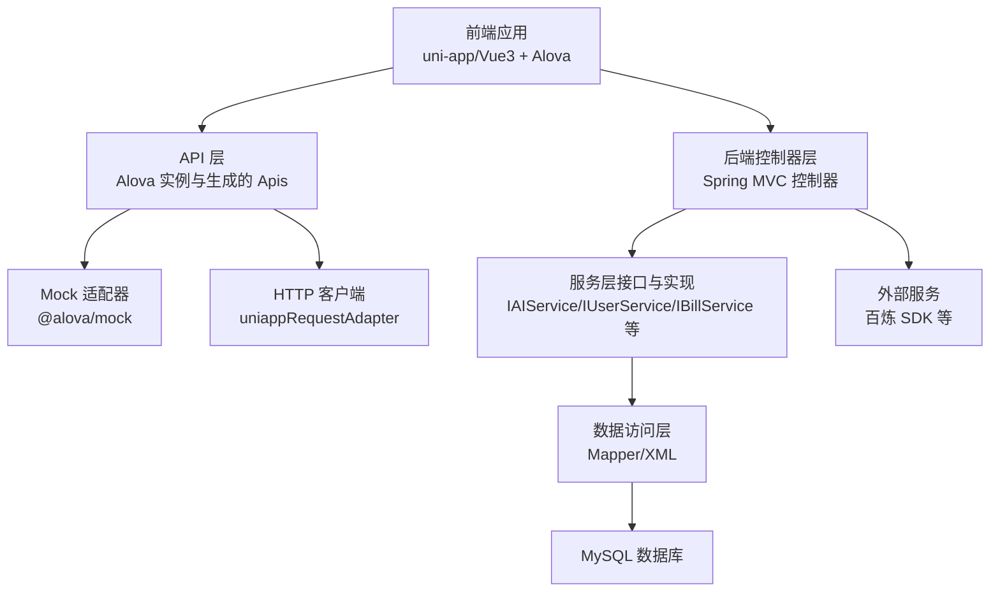
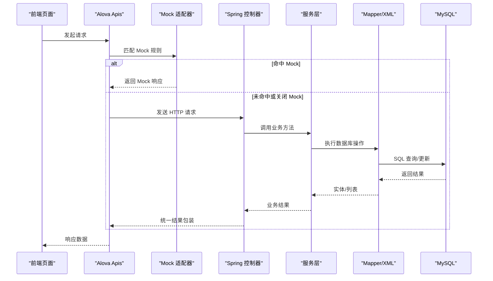
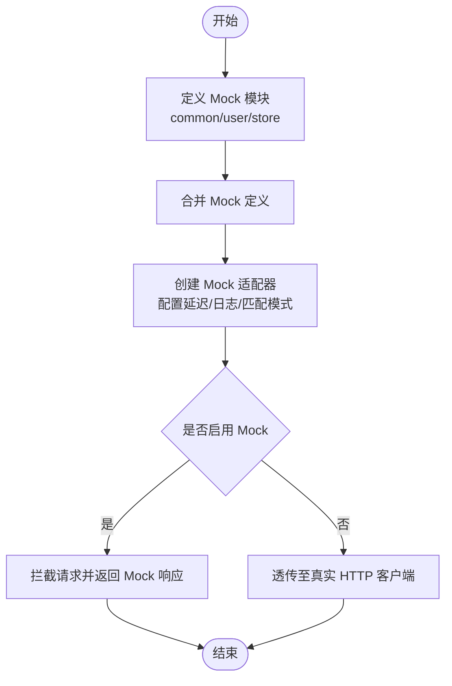
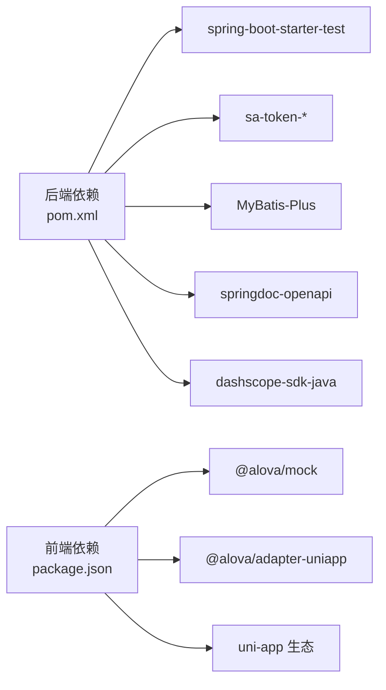

# 测试策略

<cite>
**本文引用的文件**
- [pom.xml](file://chuan-bill-server/pom.xml)
- [ChuanBillServerApplicationTests.java](file://chuan-bill-server/src/test/java/com/samoy/chuanbillserver/ChuanBillServerApplicationTests.java)
- [package.json](file://chuan-bill-app/package.json)
- [common.ts](file://chuan-bill-app/src/api/mock/modules/common.ts)
- [user.ts](file://chuan-bill-app/src/api/mock/modules/user.ts)
- [store.ts](file://chuan-bill-app/src/api/mock/modules/store.ts)
- [generators.ts](file://chuan-bill-app/src/api/mock/utils/generators.ts)
- [mockAdapter.ts](file://chuan-bill-app/src/api/mock/mockAdapter.ts)
- [index.ts](file://chuan-bill-app/src/api/index.ts)
- [AIController.java](file://chuan-bill-server/src/main/java/com/samoy/chuanbillserver/controller/AIController.java)
- [AuthController.java](file://chuan-bill-server/src/main/java/com/samoy/chuanbillserver/controller/AuthController.java)
- [BillController.java](file://chuan-bill-server/src/main/java/com/samoy/chuanbillserver/controller/BillController.java)
- [UserController.java](file://chuan-bill-server/src/main/java/com/samoy/chuanbillserver/controller/UserController.java)
- [FileController.java](file://chuan-bill-server/src/main/java/com/samoy/chuanbillserver/controller/FileController.java)
- [IAIService.java](file://chuan-bill-server/src/main/java/com/samoy/chuanbillserver/service/IAIService.java)
- [IUserService.java](file://chuan-bill-server/src/main/java/com/samoy/chuanbillserver/service/IUserService.java)
- [IBillService.java](file://chuan-bill-server/src/main/java/com/samoy/chuanbillserver/service/IBillService.java)
- [IVerificationCodeService.java](file://chuan-bill-server/src/main/java/com/samoy/chuanbillserver/service/IVerificationCodeService.java)
- [BusinessException.java](file://chuan-bill-server/src/main/java/com/samoy/chuanbillserver/expection/BusinessException.java)
- [GlobalExceptionHandler.java](file://chuan-bill-server/src/main/java/com/samoy/chuanbillserver/expection/GlobalExceptionHandler.java)
- [Result.java](file://chuan-bill-server/src/main/java/com/samoy/chuanbillserver/result/Result.java)
- [ResultEnum.java](file://chuan-bill-server/src/main/java/com/samoy/chuanbillserver/result/ResultEnum.java)
- [application.yaml](file://chuan-bill-server/src/main/resources/application.yaml)
</cite>

## 目录
1. 引言
2. 项目结构
3. 核心组件
4. 架构总览
5. 详细组件分析
6. 依赖分析
7. 性能考虑
8. 故障排查指南
9. 结论
10. 附录

## 引言
本测试策略文档面向“小川记账”项目，系统化地规划了从单元测试、集成测试到性能测试与持续集成的全流程测试方案。文档覆盖以下方面：
- Spring Boot 服务层测试策略与最佳实践
- Vue 组件与 API 接口测试方法
- 集成测试方案（数据库、外部服务、端到端）
- Mock 数据设计与测试环境隔离
- 性能测试方法（负载、压力、并发、基准）
- 测试工具使用指南（JUnit、Mockito、Vitest、Cypress 等）
- 测试覆盖率要求、CI 中的测试流程与测试报告生成

## 项目结构
小川记账采用前后端分离架构：
- 前端基于 uni-app/Vue3，使用 Alova 进行请求管理，并内置基于 @alova/mock 的 Mock 体系
- 后端基于 Spring Boot 3，使用 MyBatis-Plus、Sa-Token、OpenAPI 等技术栈

图表来源
- [index.ts:1-19](file://chuan-bill-app/src/api/index.ts#L1-L19)
- [mockAdapter.ts:1-48](file://chuan-bill-app/src/api/mock/mockAdapter.ts#L1-L48)
- [AIController.java](file://chuan-bill-server/src/main/java/com/samoy/chuanbillserver/controller/AIController.java)
- [AuthController.java](file://chuan-bill-server/src/main/java/com/samoy/chuanbillserver/controller/AuthController.java)
- [BillController.java](file://chuan-bill-server/src/main/java/com/samoy/chuanbillserver/controller/BillController.java)
- [UserController.java](file://chuan-bill-server/src/main/java/com/samoy/chuanbillserver/controller/UserController.java)
- [FileController.java](file://chuan-bill-server/src/main/java/com/samoy/chuanbillserver/controller/FileController.java)

章节来源
- [package.json:1-135](file://chuan-bill-app/package.json#L1-L135)
- [pom.xml:1-226](file://chuan-bill-server/pom.xml#L1-L226)

## 核心组件
- 前端 API 与 Mock
  - Alova 实例与 Apis 对象导出，统一管理请求与类型配置
  - Mock 适配器聚合多模块 Mock 定义，支持按路径匹配与延迟模拟
  - Mock 数据生成器提供基础响应、列表响应、随机数据等能力
- 后端控制器与服务
  - 控制器层负责路由与参数解析，服务层封装业务逻辑，DAO 层对接数据库
  - 全局异常处理与统一结果包装，便于测试断言

章节来源
- [index.ts:1-19](file://chuan-bill-app/src/api/index.ts#L1-L19)
- [mockAdapter.ts:1-48](file://chuan-bill-app/src/api/mock/mockAdapter.ts#L1-L48)
- [generators.ts:1-143](file://chuan-bill-app/src/api/mock/utils/generators.ts#L1-L143)
- [common.ts:1-31](file://chuan-bill-app/src/api/mock/modules/common.ts#L1-L31)
- [user.ts:1-305](file://chuan-bill-app/src/api/mock/modules/user.ts#L1-L305)
- [store.ts:1-174](file://chuan-bill-app/src/api/mock/modules/store.ts#L1-L174)
- [AIController.java](file://chuan-bill-server/src/main/java/com/samoy/chuanbillserver/controller/AIController.java)
- [AuthController.java](file://chuan-bill-server/src/main/java/com/samoy/chuanbillserver/controller/AuthController.java)
- [BillController.java](file://chuan-bill-server/src/main/java/com/samoy/chuanbillserver/controller/BillController.java)
- [UserController.java](file://chuan-bill-server/src/main/java/com/samoy/chuanbillserver/controller/UserController.java)
- [FileController.java](file://chuan-bill-server/src/main/java/com/samoy/chuanbillserver/controller/FileController.java)
- [IAIService.java](file://chuan-bill-server/src/main/java/com/samoy/chuanbillserver/service/IAIService.java)
- [IUserService.java](file://chuan-bill-server/src/main/java/com/samoy/chuanbillserver/service/IUserService.java)
- [IBillService.java](file://chuan-bill-server/src/main/java/com/samoy/chuanbillserver/service/IBillService.java)
- [IVerificationCodeService.java](file://chuan-bill-server/src/main/java/com/samoy/chuanbillserver/service/IVerificationCodeService.java)
- [BusinessException.java](file://chuan-bill-server/src/main/java/com/samoy/chuanbillserver/expection/BusinessException.java)
- [GlobalExceptionHandler.java](file://chuan-bill-server/src/main/java/com/samoy/chuanbillserver/expection/GlobalExceptionHandler.java)
- [Result.java](file://chuan-bill-server/src/main/java/com/samoy/chuanbillserver/result/Result.java)
- [ResultEnum.java](file://chuan-bill-server/src/main/java/com/samoy/chuanbillserver/result/ResultEnum.java)

## 架构总览
下图展示从前端请求到后端处理再到数据库访问的关键交互路径，以及 Mock 在开发阶段的介入点。

图表来源
- [index.ts:1-19](file://chuan-bill-app/src/api/index.ts#L1-L19)
- [mockAdapter.ts:1-48](file://chuan-bill-app/src/api/mock/mockAdapter.ts#L1-L48)
- [AIController.java](file://chuan-bill-server/src/main/java/com/samoy/chuanbillserver/controller/AIController.java)
- [AuthController.java](file://chuan-bill-server/src/main/java/com/samoy/chuanbillserver/controller/AuthController.java)
- [BillController.java](file://chuan-bill-server/src/main/java/com/samoy/chuanbillserver/controller/BillController.java)
- [UserController.java](file://chuan-bill-server/src/main/java/com/samoy/chuanbillserver/controller/UserController.java)
- [FileController.java](file://chuan-bill-server/src/main/java/com/samoy/chuanbillserver/controller/FileController.java)

## 详细组件分析

### 单元测试策略（Spring Boot 服务层）
- 测试范围
  - 服务层方法：覆盖核心业务逻辑分支、边界条件、异常场景
  - 控制器层：验证参数解析、鉴权、统一结果包装
  - 工具类与异常处理：确保全局异常映射与业务异常抛出符合预期
- 测试要点
  - 使用 Spring Boot Test 启动上下文，结合 @MockBean/@SpyBean 替换外部依赖
  - 对服务层进行行为驱动测试，断言方法调用次数、参数、返回值
  - 对控制器进行契约测试，断言 HTTP 状态码、响应体结构与消息
- 关键断言对象
  - 统一结果包装类与枚举用于断言 code/msg/data 结构
  - 业务异常类用于断言错误码与提示信息

章节来源
- [ChuanBillServerApplicationTests.java:1-12](file://chuan-bill-server/src/test/java/com/samoy/chuanbillserver/ChuanBillServerApplicationTests.java#L1-L12)
- [Result.java](file://chuan-bill-server/src/main/java/com/samoy/chuanbillserver/result/Result.java)
- [ResultEnum.java](file://chuan-bill-server/src/main/java/com/samoy/chuanbillserver/result/ResultEnum.java)
- [BusinessException.java](file://chuan-bill-server/src/main/java/com/samoy/chuanbillserver/expection/BusinessException.java)
- [GlobalExceptionHandler.java](file://chuan-bill-server/src/main/java/com/samoy/chuanbillserver/expection/GlobalExceptionHandler.java)

### Vue 组件与 API 接口测试（前端）
- 测试目标
  - 组件渲染与交互正确性
  - API 请求与响应处理（含 Mock）
  - 错误处理与加载态展示
- 测试策略
  - 使用 @alova/mock 的 Mock 适配器在开发/测试环境注入 Mock 响应
  - 利用生成器工具构造多样化测试数据，覆盖正常、异常、边界场景
  - 通过 Alova 的拦截器与中间件验证请求参数、重试与超时策略
- Mock 设计
  - 通用模块对未匹配的路径提供默认响应
  - 业务模块（用户、商店）定义具体接口与状态码
  - Mock 适配器支持延迟、日志与路径匹配模式

图表来源
- [common.ts:1-31](file://chuan-bill-app/src/api/mock/modules/common.ts#L1-L31)
- [user.ts:1-305](file://chuan-bill-app/src/api/mock/modules/user.ts#L1-L305)
- [store.ts:1-174](file://chuan-bill-app/src/api/mock/modules/store.ts#L1-L174)
- [mockAdapter.ts:1-48](file://chuan-bill-app/src/api/mock/mockAdapter.ts#L1-L48)

章节来源
- [mockAdapter.ts:1-48](file://chuan-bill-app/src/api/mock/mockAdapter.ts#L1-L48)
- [generators.ts:1-143](file://chuan-bill-app/src/api/mock/utils/generators.ts#L1-L143)
- [common.ts:1-31](file://chuan-bill-app/src/api/mock/modules/common.ts#L1-L31)
- [user.ts:1-305](file://chuan-bill-app/src/api/mock/modules/user.ts#L1-L305)
- [store.ts:1-174](file://chuan-bill-app/src/api/mock/modules/store.ts#L1-L174)

### API 接口测试（RESTful）
- 测试内容
  - 控制器层接口：鉴权、参数校验、业务处理、统一结果包装
  - 外部服务集成：百炼 SDK 调用的响应与异常处理
- 断言维度
  - HTTP 状态码、响应头、响应体结构
  - 统一结果对象的 code/msg/data 字段
  - 异常处理链路对业务异常与系统异常的区分

章节来源
- [AIController.java](file://chuan-bill-server/src/main/java/com/samoy/chuanbillserver/controller/AIController.java)
- [AuthController.java](file://chuan-bill-server/src/main/java/com/samoy/chuanbillserver/controller/AuthController.java)
- [BillController.java](file://chuan-bill-server/src/main/java/com/samoy/chuanbillserver/controller/BillController.java)
- [UserController.java](file://chuan-bill-server/src/main/java/com/samoy/chuanbillserver/controller/UserController.java)
- [FileController.java](file://chuan-bill-server/src/main/java/com/samoy/chuanbillserver/controller/FileController.java)
- [Result.java](file://chuan-bill-server/src/main/java/com/samoy/chuanbillserver/result/Result.java)
- [ResultEnum.java](file://chuan-bill-server/src/main/java/com/samoy/chuanbillserver/result/ResultEnum.java)
- [BusinessException.java](file://chuan-bill-server/src/main/java/com/samoy/chuanbillserver/expection/BusinessException.java)
- [GlobalExceptionHandler.java](file://chuan-bill-server/src/main/java/com/samoy/chuanbillserver/expection/GlobalExceptionHandler.java)

### 集成测试方案
- 数据库集成测试
  - 使用测试数据库或内存数据库（如 H2），在测试环境中初始化 schema 与种子数据
  - 通过事务回滚或测试后清理保证数据隔离
- 外部服务集成测试
  - 对百炼 SDK 等外部服务使用 Mock 或沙盒环境，避免真实扣费与依赖真实网络
  - 验证鉴权、超时、重试与降级策略
- 端到端测试流程
  - 前端：使用 uni-app 自动化工具或 Cypress（H5 场景）进行页面级测试
  - 后端：使用 REST Assured 或 Spring WebTestClient 进行端到端请求验证
  - CI：在流水线中执行 E2E，截图/录制失败视频，生成报告

章节来源
- [pom.xml:156-158](file://chuan-bill-server/pom.xml#L156-L158)
- [application.yaml](file://chuan-bill-server/src/main/resources/application.yaml)

### Mock 数据设计
- 数据生成器
  - 提供基础响应、列表响应、随机 ID/名称/日期/布尔/数组等
  - 支持业务对象（用户、订单等）的批量生成与定制
- Mock 模块
  - 通用模块：对未匹配路径提供默认响应
  - 业务模块：用户、商店等接口的规则与状态码
- Mock 适配器
  - 聚合多模块定义，支持延迟、日志与路径匹配模式
  - 开发环境可开启日志，便于调试

章节来源
- [generators.ts:1-143](file://chuan-bill-app/src/api/mock/utils/generators.ts#L1-L143)
- [common.ts:1-31](file://chuan-bill-app/src/api/mock/modules/common.ts#L1-L31)
- [user.ts:1-305](file://chuan-bill-app/src/api/mock/modules/user.ts#L1-L305)
- [store.ts:1-174](file://chuan-bill-app/src/api/mock/modules/store.ts#L1-L174)
- [mockAdapter.ts:1-48](file://chuan-bill-app/src/api/mock/mockAdapter.ts#L1-L48)

### 性能测试方法
- 负载测试
  - 使用 JMeter/LoadRunner 对后端接口施加逐步增长的并发请求，观察吞吐量与响应时间
  - 前端使用 Lighthouse 或自定义脚本模拟用户行为，评估首屏与交互延迟
- 压力测试
  - 将请求速率提升至系统临界点，定位瓶颈（CPU/内存/数据库连接/外部服务）
- 并发测试
  - 针对高并发场景（登录、记账、统计）进行稳定性验证
- 性能基准测试
  - 固定场景与数据集，对比版本间性能变化，建立基线

[本节为通用指导，无需列出章节来源]

### 测试工具使用指南
- JUnit 5（后端）
  - 用于单元测试与 Spring 上下文加载，结合 Mockito 进行依赖替换
- Mockito（后端）
  - 模拟服务层依赖，验证方法调用与返回值
- Vitest（前端）
  - 用于组件与工具函数的快速测试，支持快照与覆盖率
- Cypress（端到端）
  - 在 H5 场景进行端到端验证，支持跨浏览器与移动设备模拟
- 测试报告与覆盖率
  - 后端：Surefire/Failsafe 生成 XML 报告，结合 Jacoco 生成覆盖率
  - 前端：Vitest 输出 JSON 报告，结合 c8/nyc 生成覆盖率

章节来源
- [pom.xml:156-158](file://chuan-bill-server/pom.xml#L156-L158)
- [package.json:1-135](file://chuan-bill-app/package.json#L1-L135)

## 依赖分析
- 前端依赖
  - @alova/mock 提供 Mock 能力；@alova/adapter-uniapp 适配 uni-app 请求
  - uni-app 生态组件与工具库支撑页面与交互
- 后端依赖
  - spring-boot-starter-test 提供测试基础能力
  - Sa-Token、MyBatis-Plus、OpenAPI、百炼 SDK 等构成业务与集成基础

图表来源
- [pom.xml:51-169](file://chuan-bill-server/pom.xml#L51-L169)
- [package.json:57-87](file://chuan-bill-app/package.json#L57-L87)

章节来源
- [pom.xml:51-169](file://chuan-bill-server/pom.xml#L51-L169)
- [package.json:57-87](file://chuan-bill-app/package.json#L57-L87)

## 性能考虑
- Mock 延迟与日志
  - Mock 适配器支持随机延迟，有助于更真实地模拟网络状况
  - 开发环境开启日志，便于定位慢请求
- 数据库与缓存
  - 在测试中使用内存数据库或专用测试实例，避免共享数据污染
  - 对热点查询与写入路径进行索引与连接池优化验证
- 外部服务
  - 使用 Mock 或沙盒环境，设置合理的超时与重试策略，避免测试被外部波动影响

章节来源
- [mockAdapter.ts:35-45](file://chuan-bill-app/src/api/mock/mockAdapter.ts#L35-L45)
- [application.yaml](file://chuan-bill-server/src/main/resources/application.yaml)

## 故障排查指南
- 统一异常处理
  - 全局异常处理器将业务异常与系统异常区分为不同响应结构，便于测试断言
- 业务异常
  - 业务异常类用于抛出明确的错误码与消息，测试中应覆盖典型异常分支
- 控制器契约
  - 统一结果包装类与枚举确保响应结构一致，便于前端与后端协同验证

章节来源
- [GlobalExceptionHandler.java](file://chuan-bill-server/src/main/java/com/samoy/chuanbillserver/expection/GlobalExceptionHandler.java)
- [BusinessException.java](file://chuan-bill-server/src/main/java/com/samoy/chuanbillserver/expection/BusinessException.java)
- [Result.java](file://chuan-bill-server/src/main/java/com/samoy/chuanbillserver/result/Result.java)
- [ResultEnum.java](file://chuan-bill-server/src/main/java/com/samoy/chuanbillserver/result/ResultEnum.java)

## 结论
本测试策略围绕“小川记账”的前后端架构，构建了从单元到集成、从接口到端到端的全链路测试方案。通过完善的 Mock 数据设计与测试工具配置，结合统一的结果包装与异常处理机制，能够有效保障功能正确性与系统稳定性。建议在持续集成中引入自动化测试与覆盖率监控，形成闭环的质量保障体系。

## 附录
- 测试覆盖率要求（建议）
  - 后端：方法覆盖率 ≥ 80%，分支覆盖率 ≥ 60%
  - 前端：语句覆盖率 ≥ 80%，分支覆盖率 ≥ 60%
- 持续集成建议
  - 分层执行：单元测试 → 集成测试 → 端到端测试 → 覆盖率报告
  - 失败即停，保留测试日志与报告 artifacts