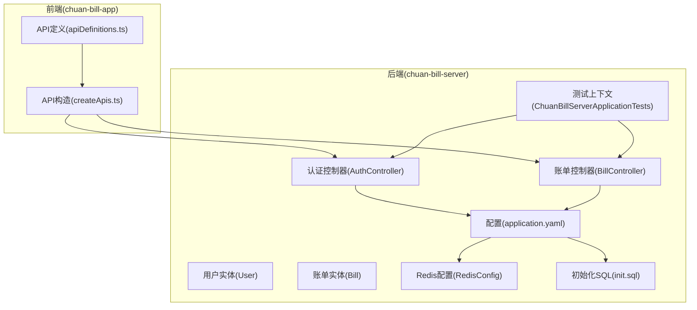
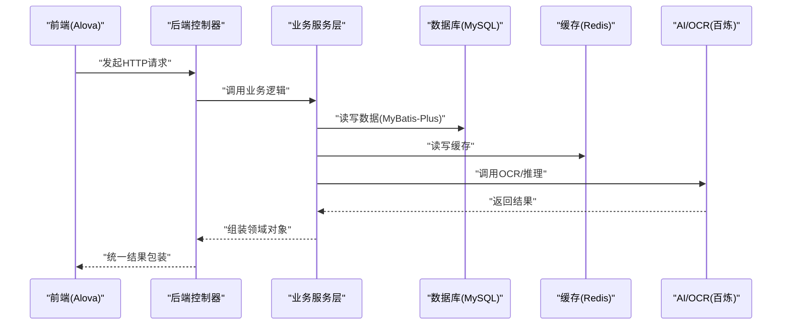
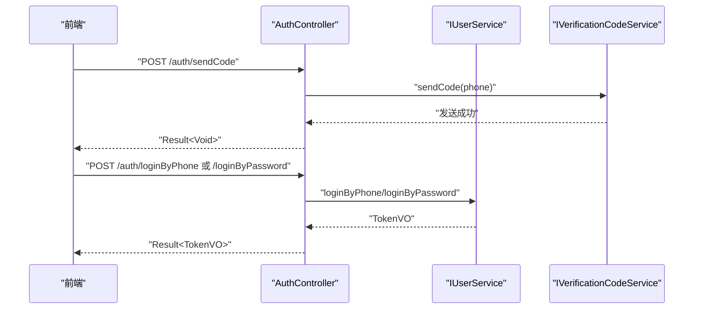
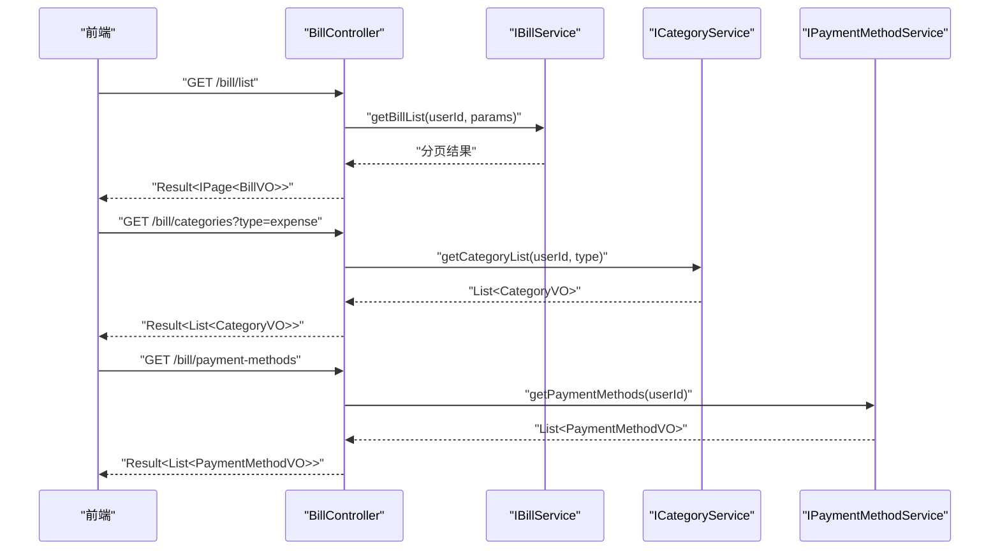
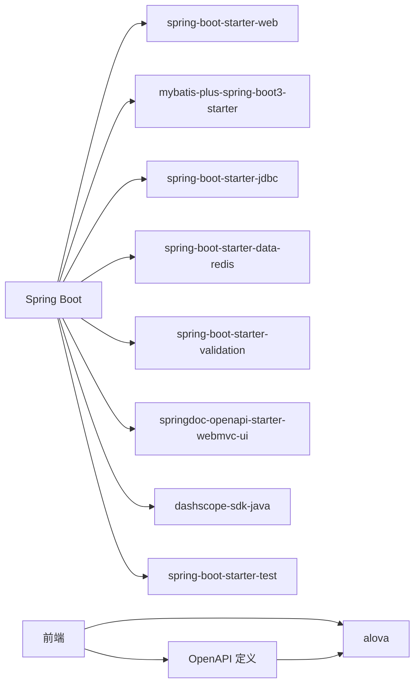

# 集成测试

<cite>
**本文引用的文件**   
- [pom.xml](file://chuan-bill-server/pom.xml)
- [application.yaml](file://chuan-bill-server/src/main/resources/application.yaml)
- [init.sql](file://chuan-bill-server/init.sql)
- [ChuanBillServerApplicationTests.java](file://chuan-bill-server/src/test/java/com/samoy/chuanbillserver/ChuanBillServerApplicationTests.java)
- [AuthController.java](file://chuan-bill-server/src/main/java/com/samoy/chuanbillserver/controller/AuthController.java)
- [BillController.java](file://chuan-bill-server/src/main/java/com/samoy/chuanbillserver/controller/BillController.java)
- [RedisConfig.java](file://chuan-bill-server/src/main/java/com/samoy/chuanbillserver/config/RedisConfig.java)
- [User.java](file://chuan-bill-server/src/main/java/com/samoy/chuanbillserver/entity/User.java)
- [Bill.java](file://chuan-bill-server/src/main/java/com/samoy/chuanbillserver/entity/Bill.java)
- [apiDefinitions.ts](file://chuan-bill-app/src/api/apiDefinitions.ts)
- [createApis.ts](file://chuan-bill-app/src/api/createApis.ts)
- [package.json](file://package.json)
</cite>

## 目录
1. [引言](#引言)
2. [项目结构](#项目结构)
3. [核心组件](#核心组件)
4. [架构总览](#架构总览)
5. [详细组件分析](#详细组件分析)
6. [依赖分析](#依赖分析)
7. [性能考虑](#性能考虑)
8. [故障排查指南](#故障排查指南)
9. [结论](#结论)
10. [附录](#附录)

## 引言
本文件面向“小川记账”项目的集成测试，覆盖后端 Spring Boot 应用的数据库集成测试、外部服务（AI/OCR）集成测试、API 接口集成测试；同时涵盖前端与后端的集成测试策略，包括 API 调用测试、数据流测试与错误处理测试。文档还提供测试环境配置建议（测试数据库、Mock 服务、环境变量）、测试策略（测试数据同步、事务回滚、测试隔离），以及典型端到端测试场景（用户登录流程、账单管理流程、家庭共享流程）。文中所有技术细节均基于仓库现有代码与配置文件进行分析与总结。

## 项目结构
后端采用 Spring Boot 3 + MyBatis-Plus，前端采用 Vue3 + Alova，通过 OpenAPI 描述统一的接口契约。整体结构如下：

图表来源
- [application.yaml:1-51](file://chuan-bill-server/src/main/resources/application.yaml#L1-L51)
- [AuthController.java:1-66](file://chuan-bill-server/src/main/java/com/samoy/chuanbillserver/controller/AuthController.java#L1-L66)
- [BillController.java:1-91](file://chuan-bill-server/src/main/java/com/samoy/chuanbillserver/controller/BillController.java#L1-L91)
- [RedisConfig.java:1-31](file://chuan-bill-server/src/main/java/com/samoy/chuanbillserver/config/RedisConfig.java#L1-L31)
- [init.sql:1-326](file://chuan-bill-server/init.sql#L1-L326)
- [apiDefinitions.ts:1-38](file://chuan-bill-app/src/api/apiDefinitions.ts#L1-L38)
- [createApis.ts:1-95](file://chuan-bill-app/src/api/createApis.ts#L1-L95)
- [ChuanBillServerApplicationTests.java:1-12](file://chuan-bill-server/src/test/java/com/samoy/chuanbillserver/ChuanBillServerApplicationTests.java#L1-L12)

章节来源
- [pom.xml:1-226](file://chuan-bill-server/pom.xml#L1-L226)
- [application.yaml:1-51](file://chuan-bill-server/src/main/resources/application.yaml#L1-L51)
- [init.sql:1-326](file://chuan-bill-server/init.sql#L1-L326)
- [package.json:1-29](file://package.json#L1-L29)

## 核心组件
- 认证与验证码接口：提供密码登录、手机登录与发送验证码能力，接口位于认证控制器中，返回统一结果包装。
- 账单管理接口：提供账单列表、详情、新增、更新、删除、分类与支付方式查询等能力，接口位于账单控制器中。
- 实体模型：用户与账单实体映射数据库表，支撑数据持久化与查询。
- 配置与依赖：数据源、Redis、MyBatis-Plus、OpenAPI/Swagger、百炼 SDK（AI/OCR）等。
- 前端 API 定义：通过 OpenAPI 描述统一的接口路径与方法，前端以 Alova 构造请求。

章节来源
- [AuthController.java:1-66](file://chuan-bill-server/src/main/java/com/samoy/chuanbillserver/controller/AuthController.java#L1-L66)
- [BillController.java:1-91](file://chuan-bill-server/src/main/java/com/samoy/chuanbillserver/controller/BillController.java#L1-L91)
- [User.java:1-94](file://chuan-bill-server/src/main/java/com/samoy/chuanbillserver/entity/User.java#L1-L94)
- [Bill.java:1-113](file://chuan-bill-server/src/main/java/com/samoy/chuanbillserver/entity/Bill.java#L1-L113)
- [application.yaml:1-51](file://chuan-bill-server/src/main/resources/application.yaml#L1-L51)
- [pom.xml:50-169](file://chuan-bill-server/pom.xml#L50-L169)
- [apiDefinitions.ts:1-38](file://chuan-bill-app/src/api/apiDefinitions.ts#L1-L38)
- [createApis.ts:1-95](file://chuan-bill-app/src/api/createApis.ts#L1-L95)

## 架构总览
下图展示了后端在集成测试中的关键交互：前端通过 Alova 调用后端 REST 接口，后端控制器经由服务层访问数据库与外部 AI/OCR 服务，并通过统一结果包装返回。

图表来源
- [AuthController.java:1-66](file://chuan-bill-server/src/main/java/com/samoy/chuanbillserver/controller/AuthController.java#L1-L66)
- [BillController.java:1-91](file://chuan-bill-server/src/main/java/com/samoy/chuanbillserver/controller/BillController.java#L1-L91)
- [application.yaml:1-51](file://chuan-bill-server/src/main/resources/application.yaml#L1-L51)
- [RedisConfig.java:1-31](file://chuan-bill-server/src/main/java/com/samoy/chuanbillserver/config/RedisConfig.java#L1-L31)
- [pom.xml:128-141](file://chuan-bill-server/pom.xml#L128-L141)

## 详细组件分析

### 认证与验证码接口集成测试
- 测试目标
  - 验证登录（密码/手机）与发送验证码接口的正确性与安全性。
  - 验证验证码服务与短信通道的连通性（若为外部服务，可采用 Mock）。
- 关键点
  - 控制器层统一返回结果包装，便于前端一致处理。
  - 使用权限框架进行会话管理，需在测试中模拟登录态。
- 流程示意

图表来源
- [AuthController.java:29-64](file://chuan-bill-server/src/main/java/com/samoy/chuanbillserver/controller/AuthController.java#L29-L64)
- [application.yaml:23-31](file://chuan-bill-server/src/main/resources/application.yaml#L23-L31)

章节来源
- [AuthController.java:1-66](file://chuan-bill-server/src/main/java/com/samoy/chuanbillserver/controller/AuthController.java#L1-L66)

### 账单管理接口集成测试
- 测试目标
  - 验证账单 CRUD、分类与支付方式查询接口。
  - 验证权限控制（需登录态）与参数校验。
- 关键点
  - 控制器通过统一鉴权工具获取当前用户 ID，确保数据隔离。
  - 分类与支付方式查询依赖用户维度数据，需准备用户与系统默认数据。
- 流程示意

图表来源
- [BillController.java:37-89](file://chuan-bill-server/src/main/java/com/samoy/chuanbillserver/controller/BillController.java#L37-L89)

章节来源
- [BillController.java:1-91](file://chuan-bill-server/src/main/java/com/samoy/chuanbillserver/controller/BillController.java#L1-L91)

### 数据库与外部服务集成测试
- 数据库集成测试
  - 使用初始化 SQL 快速构建测试数据库，包含用户、账单、分类、支付方式、家庭等表。
  - 在测试中准备必要种子数据，确保接口行为可预期。
- 外部服务集成测试
  - 百炼 SDK 已引入，OCR/推理能力可通过配置的 API Key/AppId 调用。
  - 若需要离线测试，可对相关服务进行 Mock 或替换实现。

章节来源
- [init.sql:1-326](file://chuan-bill-server/init.sql#L1-L326)
- [application.yaml:48-51](file://chuan-bill-server/src/main/resources/application.yaml#L48-L51)
- [pom.xml:128-141](file://chuan-bill-server/pom.xml#L128-L141)

### 前后端集成测试
- 前端通过 Alova 的 API 定义与构造函数，统一调用后端接口。
- 建议在集成测试中：
  - 使用真实后端或本地容器化的后端实例。
  - 对关键接口进行端到端验证，覆盖正常流程与异常分支。
  - 校验响应格式、鉴权头、分页与过滤参数等。

章节来源
- [apiDefinitions.ts:19-37](file://chuan-bill-app/src/api/apiDefinitions.ts#L19-L37)
- [createApis.ts:22-72](file://chuan-bill-app/src/api/createApis.ts#L22-L72)

## 依赖分析
- 后端依赖要点
  - Web、MyBatis-Plus、MySQL、Redis、参数校验、OpenAPI/Swagger、百炼 SDK、测试 Starter。
- 前端依赖要点
  - Alova 作为 HTTP 客户端，结合 OpenAPI 定义生成 API 方法。

图表来源
- [pom.xml:50-169](file://chuan-bill-server/pom.xml#L50-L169)
- [apiDefinitions.ts:1-38](file://chuan-bill-app/src/api/apiDefinitions.ts#L1-L38)

章节来源
- [pom.xml:50-169](file://chuan-bill-server/pom.xml#L50-L169)
- [package.json:1-29](file://package.json#L1-L29)

## 性能考虑
- 测试数据库与缓存
  - 使用内存数据库或轻量级 MySQL 容器，减少启动与初始化开销。
  - Redis 可使用本地容器或内存模式，避免网络抖动影响测试稳定性。
- 接口测试并发
  - 对高并发接口（如列表查询）进行压力测试，关注分页与索引命中情况。
- 外部服务降噪
  - 对 AI/OCR 接口采用 Mock 或本地替身，保证测试可重复性与速度。

## 故障排查指南
- 常见问题定位
  - 数据库连接失败：检查数据源 URL、用户名、密码与网络可达性。
  - Redis 连接失败：检查主机、端口、密码与超时配置。
  - 权限相关错误：确认鉴权头与登录态是否正确传递。
  - OpenAPI/Swagger 文档不可用：检查相关开关与路径配置。
- 日志与诊断
  - 启用 MyBatis 日志输出，便于查看 SQL 与参数。
  - 使用 Actuator 或日志级别提升定位问题效率。

章节来源
- [application.yaml:1-51](file://chuan-bill-server/src/main/resources/application.yaml#L1-L51)
- [pom.xml:54-61](file://chuan-bill-server/pom.xml#L54-L61)

## 结论
通过明确的测试策略与工具链，小川记账项目可在后端与前端之间建立可靠的集成测试体系。建议优先覆盖用户登录、账单管理与家庭共享等核心流程，配合 Mock 与容器化环境，确保测试的稳定性与可重复性。

## 附录

### 测试环境配置建议
- 测试数据库
  - 使用初始化 SQL 快速创建测试库与表结构。
  - 在测试中使用独立数据库或临时库，避免污染。
- Mock 服务
  - 对外部 AI/OCR 服务进行 Mock，或使用替身服务。
- 环境变量
  - 通过环境变量注入数据源、Redis、百炼 SDK 等配置。
  - 在 CI 中使用密钥管理工具安全存储敏感变量。

章节来源
- [init.sql:1-326](file://chuan-bill-server/init.sql#L1-L326)
- [application.yaml:4-51](file://chuan-bill-server/src/main/resources/application.yaml#L4-L51)
- [pom.xml:128-141](file://chuan-bill-server/pom.xml#L128-L141)

### 测试策略与最佳实践
- 测试数据同步
  - 在测试前执行初始化 SQL，或使用迁移工具准备种子数据。
- 事务回滚
  - 在测试方法上使用事务注解，确保测试结束后回滚。
- 测试隔离
  - 使用独立数据库与 Redis 实例，避免跨测试干扰。
- 端到端场景设计
  - 用户登录流程：发送验证码 → 手机登录 → 获取用户资料。
  - 账单管理流程：创建账单 → 查询列表 → 更新账单 → 删除账单。
  - 家庭共享流程：创建家庭 → 发起加入申请 → 户主审批 → 共享账单查询。

章节来源
- [AuthController.java:29-64](file://chuan-bill-server/src/main/java/com/samoy/chuanbillserver/controller/AuthController.java#L29-L64)
- [BillController.java:37-89](file://chuan-bill-server/src/main/java/com/samoy/chuanbillserver/controller/BillController.java#L37-L89)
- [init.sql:13-201](file://chuan-bill-server/init.sql#L13-L201)

### 工具使用与配置
- RestAssured
  - 适用于后端接口的集成测试，支持 JSON 断言与链式调用。
- Testcontainers
  - 用于启动 MySQL 与 Redis 容器，自动清理资源，适合本地与 CI。
- Postman Collection
  - 用于手工探索与回归测试，建议与 OpenAPI 定义保持同步。

章节来源
- [apiDefinitions.ts:19-37](file://chuan-bill-app/src/api/apiDefinitions.ts#L19-L37)
- [createApis.ts:22-72](file://chuan-bill-app/src/api/createApis.ts#L22-L72)