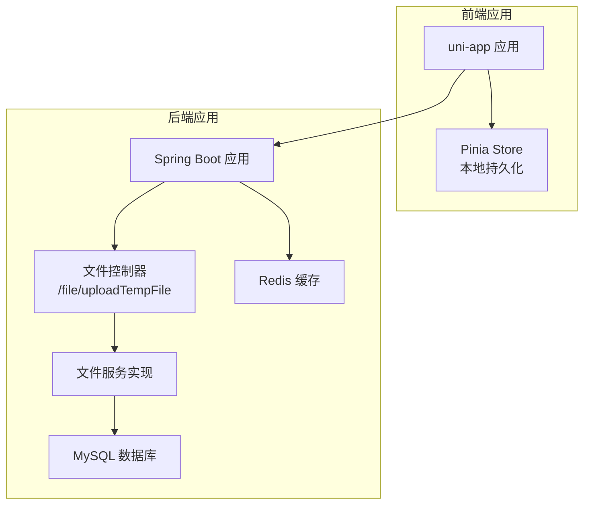
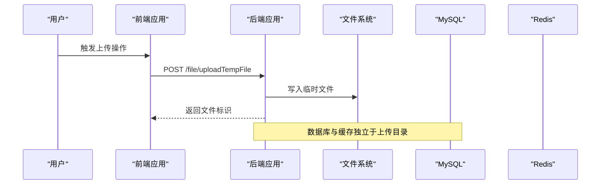
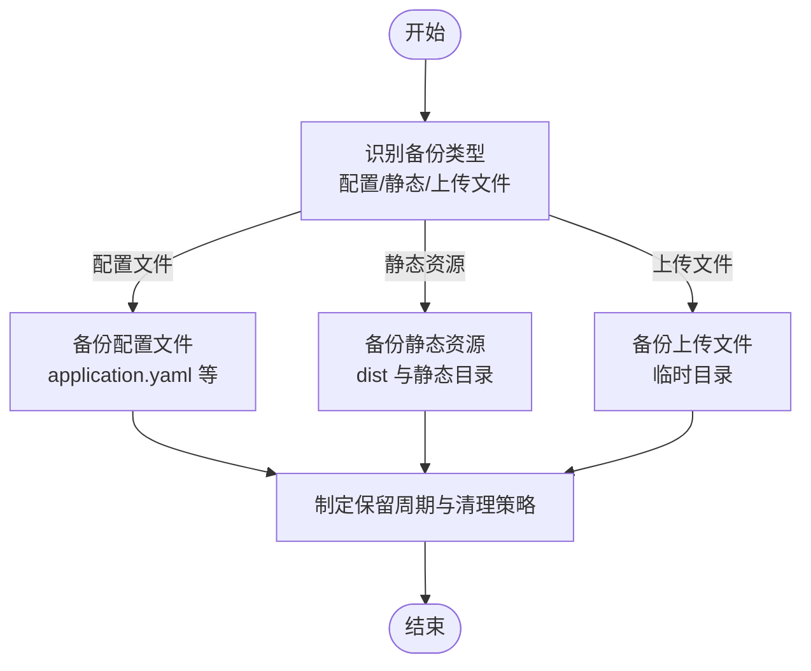
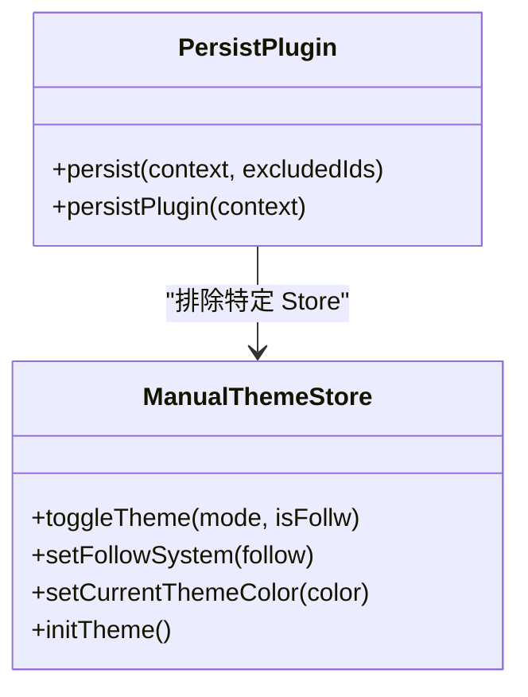
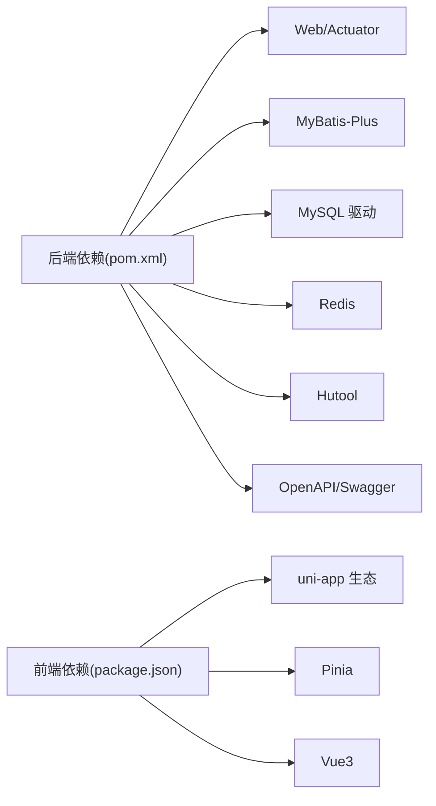

# 备份恢复

<cite>
**本文引用的文件**
- [application.yaml](file://chuan-bill-server/src/main/resources/application.yaml)
- [init.sql](file://chuan-bill-server/init.sql)
- [SystemConstants.java](file://chuan-bill-server/src/main/java/com/samoy/chuanbillserver/constant/SystemConstants.java)
- [FileController.java](file://chuan-bill-server/src/main/java/com/samoy/chuanbillserver/controller/FileController.java)
- [FileServiceImpl.java](file://chuan-bill-server/src/main/java/com/samoy/chuanbillserver/service/impl/FileServiceImpl.java)
- [RedisConfig.java](file://chuan-bill-server/src/main/java/com/samoy/chuanbillserver/config/RedisConfig.java)
- [persist.ts](file://chuan-bill-app/src/store/persist.ts)
- [manualThemeStore.ts](file://chuan-bill-app/src/store/manualThemeStore.ts)
- [ChuanBillServerApplication.java](file://chuan-bill-server/src/main/java/com/samoy/chuanbillserver/ChuanBillServerApplication.java)
- [pom.xml](file://chuan-bill-server/pom.xml)
- [package.json](file://chuan-bill-app/package.json)
</cite>

## 目录
1. [引言](#引言)
2. [项目结构](#项目结构)
3. [核心组件](#核心组件)
4. [架构总览](#架构总览)
5. [详细组件分析](#详细组件分析)
6. [依赖分析](#依赖分析)
7. [性能考虑](#性能考虑)
8. [故障排查指南](#故障排查指南)
9. [结论](#结论)
10. [附录](#附录)

## 引言
本运维文档面向“小川记账”备份与恢复体系，聚焦以下目标：
- 数据库备份策略：全量备份、增量备份、定时备份的配置与执行流程
- 文件备份方案：配置文件、静态资源、用户上传文件的备份策略
- 存储管理：备份文件命名规范、存储位置、保留周期、清理策略
- 灾难恢复流程：数据恢复步骤、系统重建、服务恢复、验证测试
- 备份验证方法、恢复演练计划、RTO/RPO 指标管理

本项目由后端 Spring Boot 应用与前端 uni-app 组成，数据库采用 MySQL，缓存采用 Redis，文件上传通过后端接口落地到本地临时目录。

## 项目结构
- 后端应用位于 chuan-bill-server，负责数据库、缓存、文件上传等核心能力
- 前端应用位于 chuan-bill-app，负责用户界面与本地状态持久化
- 关键运行环境变量通过 application.yaml 注入（数据库、Redis、第三方服务）

图表来源
- [application.yaml:1-51](file://chuan-bill-server/src/main/resources/application.yaml#L1-L51)
- [FileController.java:1-26](file://chuan-bill-server/src/main/java/com/samoy/chuanbillserver/controller/FileController.java#L1-L26)
- [FileServiceImpl.java:1-42](file://chuan-bill-server/src/main/java/com/samoy/chuanbillserver/service/impl/FileServiceImpl.java#L1-L42)
- [RedisConfig.java:1-31](file://chuan-bill-server/src/main/java/com/samoy/chuanbillserver/config/RedisConfig.java#L1-L31)

章节来源
- [application.yaml:1-51](file://chuan-bill-server/src/main/resources/application.yaml#L1-L51)
- [ChuanBillServerApplication.java:1-15](file://chuan-bill-server/src/main/java/com/samoy/chuanbillserver/ChuanBillServerApplication.java#L1-L15)

## 核心组件
- 数据库层：MySQL，初始化脚本包含用户、类目、支付方式、家庭、账单、预算、消息等核心表结构
- 缓存层：Redis，用于会话、验证码等短期数据
- 文件上传：后端提供临时文件上传接口，文件落盘至本地临时目录
- 前端持久化：Pinia Store 本地持久化，支持排除特定 Store 的持久化

章节来源
- [init.sql:1-326](file://chuan-bill-server/init.sql#L1-L326)
- [SystemConstants.java:30-34](file://chuan-bill-server/src/main/java/com/samoy/chuanbillserver/constant/SystemConstants.java#L30-L34)
- [FileController.java:1-26](file://chuan-bill-server/src/main/java/com/samoy/chuanbillserver/controller/FileController.java#L1-L26)
- [FileServiceImpl.java:1-42](file://chuan-bill-server/src/main/java/com/samoy/chuanbillserver/service/impl/FileServiceImpl.java#L1-L42)
- [persist.ts:1-38](file://chuan-bill-app/src/store/persist.ts#L1-L38)

## 架构总览
后端通过 application.yaml 配置数据库与 Redis 连接；文件上传接口接收图片并保存到临时目录；前端通过 Pinia 实现本地状态持久化。整体备份与恢复需覆盖数据库、Redis、上传文件与前端本地存储。

图表来源
- [FileController.java:21-25](file://chuan-bill-server/src/main/java/com/samoy/chuanbillserver/controller/FileController.java#L21-L25)
- [FileServiceImpl.java:21-42](file://chuan-bill-server/src/main/java/com/samoy/chuanbillserver/service/impl/FileServiceImpl.java#L21-L42)
- [application.yaml:4-21](file://chuan-bill-server/src/main/resources/application.yaml#L4-L21)

## 详细组件分析

### 数据库备份策略
- 全量备份
  - 使用数据库客户端工具导出 SQL 或二进制备份，建议结合初始化脚本进行结构与数据分离
  - 结构参考：[init.sql:1-326](file://chuan-bill-server/init.sql#L1-L326)
- 增量备份
  - 建议开启数据库二进制日志，按时间点恢复
- 定时备份
  - 建议每日全量 + 每小时增量，保留周期按法规与业务需求设定
- 备份验证
  - 定期抽样恢复演练，验证完整性与可用性

### 文件备份方案
- 配置文件
  - application.yaml 与各构建产物中的配置文件应纳入版本控制或统一归档
- 静态资源
  - 前端构建产物（dist）与后端静态资源目录需定期备份
- 用户上传文件
  - 临时上传文件：后端接口写入临时目录，需将该目录纳入备份范围
  - 参考路径：[SystemConstants.java:30-34](file://chuan-bill-server/src/main/java/com/samoy/chuanbillserver/constant/SystemConstants.java#L30-L34)
  - 接口：[FileController.java:21-25](file://chuan-bill-server/src/main/java/com/samoy/chuanbillserver/controller/FileController.java#L21-L25)
  - 实现：[FileServiceImpl.java:21-42](file://chuan-bill-server/src/main/java/com/samoy/chuanbillserver/service/impl/FileServiceImpl.java#L21-L42)

### 缓存备份方案（Redis）
- Redis 作为短期缓存（验证码、会话），可基于 RDB/AOF 或外部持久化策略进行备份
- 配置参考：[RedisConfig.java:1-31](file://chuan-bill-server/src/main/java/com/samoy/chuanbillserver/config/RedisConfig.java#L1-L31)
- 运行参数参考：[application.yaml:10-21](file://chuan-bill-server/src/main/resources/application.yaml#L10-L21)

### 前端本地持久化备份
- Pinia Store 本地持久化：通过本地存储同步实现状态持久化
- 排除机制：可排除特定 Store（如临时数据）
- 参考：[persist.ts:12-38](file://chuan-bill-app/src/store/persist.ts#L12-L38)
- 主题 Store：[manualThemeStore.ts:1-151](file://chuan-bill-app/src/store/manualThemeStore.ts#L1-L151)

图表来源
- [persist.ts:10-38](file://chuan-bill-app/src/store/persist.ts#L10-L38)
- [manualThemeStore.ts:9-151](file://chuan-bill-app/src/store/manualThemeStore.ts#L9-L151)

## 依赖分析
- 后端依赖
  - Spring Boot Web、MyBatis-Plus、MySQL 驱动、Redis、Hutool 工具集、OpenAPI/Swagger
  - 参考：[pom.xml:51-168](file://chuan-bill-server/pom.xml#L51-L168)
- 前端依赖
  - uni-app 生态、Vue3、Pinia、图表库等
  - 参考：[package.json:57-87](file://chuan-bill-app/package.json#L57-L87)

图表来源
- [pom.xml:51-168](file://chuan-bill-server/pom.xml#L51-L168)
- [package.json:57-87](file://chuan-bill-app/package.json#L57-L87)

章节来源
- [pom.xml:51-168](file://chuan-bill-server/pom.xml#L51-L168)
- [package.json:57-87](file://chuan-bill-app/package.json#L57-L87)

## 性能考虑
- 数据库备份窗口与业务高峰错峰，避免影响在线交易
- 文件上传目录与数据库、缓存分离，降低 IO 抖动
- Redis 持久化策略（RDB/AOF）与备份频率平衡，兼顾恢复点目标

## 故障排查指南
- 文件上传失败
  - 检查上传接口与实现：[FileController.java:21-25](file://chuan-bill-server/src/main/java/com/samoy/chuanbillserver/controller/FileController.java#L21-L25)、[FileServiceImpl.java:21-42](file://chuan-bill-server/src/main/java/com/samoy/chuanbillserver/service/impl/FileServiceImpl.java#L21-L42)
  - 检查临时目录权限与磁盘空间
- 数据库连接异常
  - 检查环境变量与连接串：[application.yaml:4-8](file://chuan-bill-server/src/main/resources/application.yaml#L4-L8)
- 缓存连接异常
  - 检查 Redis 配置与连通性：[application.yaml:10-21](file://chuan-bill-server/src/main/resources/application.yaml#L10-L21)、[RedisConfig.java:14-29](file://chuan-bill-server/src/main/java/com/samoy/chuanbillserver/config/RedisConfig.java#L14-L29)
- 前端本地持久化问题
  - 检查排除逻辑与存储同步：[persist.ts:12-38](file://chuan-bill-app/src/store/persist.ts#L12-L38)

章节来源
- [FileController.java:21-25](file://chuan-bill-server/src/main/java/com/samoy/chuanbillserver/controller/FileController.java#L21-L25)
- [FileServiceImpl.java:21-42](file://chuan-bill-server/src/main/java/com/samoy/chuanbillserver/service/impl/FileServiceImpl.java#L21-L42)
- [application.yaml:4-21](file://chuan-bill-server/src/main/resources/application.yaml#L4-L21)
- [RedisConfig.java:14-29](file://chuan-bill-server/src/main/java/com/samoy/chuanbillserver/config/RedisConfig.java#L14-L29)
- [persist.ts:12-38](file://chuan-bill-app/src/store/persist.ts#L12-L38)

## 结论
本项目备份与恢复体系应以“数据库 + 缓存 + 文件 + 前端本地状态”四维一体为核心，结合全量/增量/定时策略与严格的保留与清理规则，确保在灾难发生时满足既定的 RTO/RPO 指标。建议将上述组件纳入统一的自动化备份与恢复流程，并定期开展演练验证。

## 附录

### 备份存储管理规范
- 备份文件命名规范
  - 数据库：db_backup_YYYYMMDD_HHMMSS.sql 或 .tar.gz
  - Redis：redis_snapshot_YYYYMMDD_HHMMSS.rdb 或 AOF 时间戳
  - 文件：files_backup_YYYYMMDD_HHMMSS.tar.gz
- 存储位置
  - 数据库与 Redis：专用备份卷或对象存储归档
  - 文件：与应用分离的独立挂载盘
- 保留周期
  - 日备：14 天
  - 周备：8 个周备
  - 月备：12 个月备
- 清理策略
  - 自动清理超期备份，保留最近 N 次全备与每小时增量

### 灾难恢复流程
- 数据恢复
  - 优先恢复数据库与缓存，再恢复文件
  - 验证关键表完整性与索引有效性
- 系统重建
  - 拉起后端服务，检查数据库与 Redis 连通
  - 验证 OpenAPI/Swagger 文档可用性
- 服务恢复
  - 启动前端应用，检查本地持久化状态
- 验证测试
  - 功能回归、接口联调、性能压测

### 备份验证与恢复演练
- 验证方法
  - 抽样恢复、交叉验证、一致性比对
- 演练计划
  - 每季度一次全链路演练，记录 RTO/RPO 指标
- 指标管理
  - RPO：数据丢失容忍度（如 1 小时内）
  - RTO：恢复时间目标（如 4 小时内）