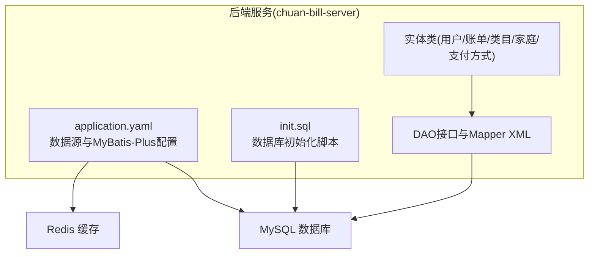
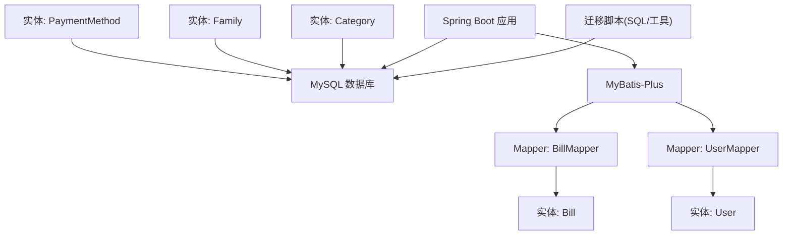
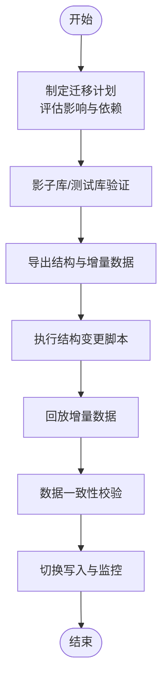
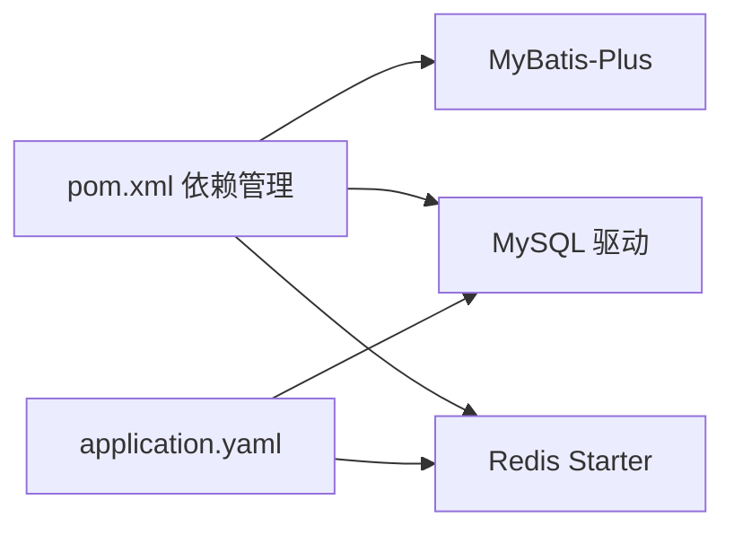
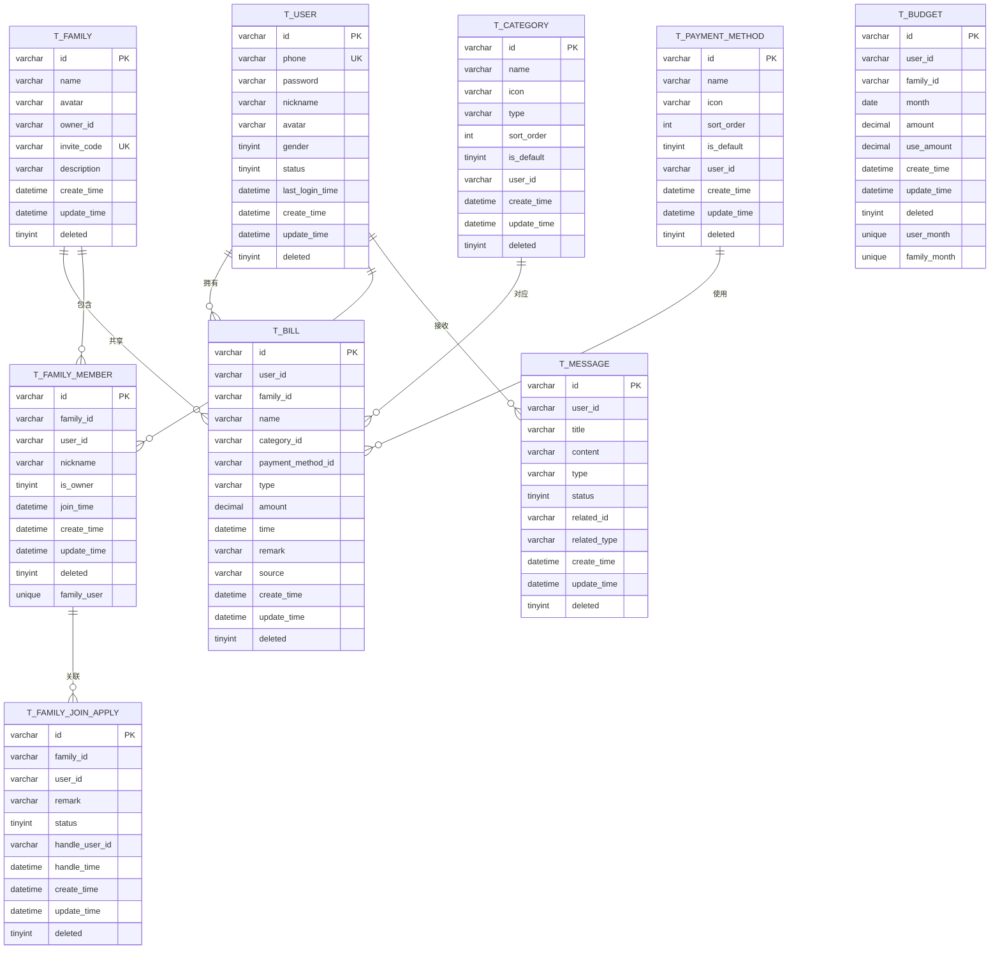

# 数据迁移

<cite>
**本文引用的文件**
- [init.sql](file://chuan-bill-server/init.sql)
- [application.yaml](file://chuan-bill-server/src/main/resources/application.yaml)
- [pom.xml](file://chuan-bill-server/pom.xml)
- [Bill.java](file://chuan-bill-server/src/main/java/com/samoy/chuanbillserver/entity/Bill.java)
- [User.java](file://chuan-bill-server/src/main/java/com/samoy/chuanbillserver/entity/User.java)
- [Category.java](file://chuan-bill-server/src/main/java/com/samoy/chuanbillserver/entity/Category.java)
- [Family.java](file://chuan-bill-server/src/main/java/com/samoy/chuanbillserver/entity/Family.java)
- [PaymentMethod.java](file://chuan-bill-server/src/main/java/com/samoy/chuanbillserver/entity/PaymentMethod.java)
- [BillMapper.java](file://chuan-bill-server/src/main/java/com/samoy/chuanbillserver/dao/BillMapper.java)
- [UserMapper.java](file://chuan-bill-server/src/main/java/com/samoy/chuanbillserver/dao/UserMapper.java)
- [BillMapper.xml](file://chuan-bill-server/src/main/resources/mapper/BillMapper.xml)
- [UserMapper.xml](file://chuan-bill-server/src/main/resources/mapper/UserMapper.xml)
</cite>

## 目录
1. [简介](#简介)
2. [项目结构](#项目结构)
3. [核心组件](#核心组件)
4. [架构总览](#架构总览)
5. [详细组件分析](#详细组件分析)
6. [依赖关系分析](#依赖关系分析)
7. [性能考量](#性能考量)
8. [故障排查指南](#故障排查指南)
9. [结论](#结论)
10. [附录](#附录)

## 简介
本运维文档面向“小川记账”系统的数据库结构与数据迁移场景，围绕以下目标展开：
- 数据库结构变更迁移：表结构修改、索引优化、约束调整的策略与步骤
- 数据格式迁移：字段类型转换、数据清洗、格式标准化
- 历史数据处理：备份、增量迁移、数据校验、回滚机制
- 迁移脚本编写：SQL脚本模板、迁移工具使用、自动化脚本部署
- 风险评估、测试验证与生产迁移最佳实践

文档以仓库中的数据库初始化脚本、Spring Boot配置、MyBatis-Plus实体与Mapper为依据，结合实际代码结构给出可操作的迁移方案。

## 项目结构
小川记账采用前后端分离架构，数据库层位于后端服务工程中，使用MySQL作为持久化存储，并通过MyBatis-Plus进行ORM映射。数据库初始化脚本定义了完整的表结构与索引，应用通过配置文件指定数据源与MyBatis-Plus逻辑删除配置。

**图表来源**
- [application.yaml:1-51](file://chuan-bill-server/src/main/resources/application.yaml#L1-L51)
- [init.sql:1-326](file://chuan-bill-server/init.sql#L1-L326)

**章节来源**
- [application.yaml:1-51](file://chuan-bill-server/src/main/resources/application.yaml#L1-L51)
- [init.sql:1-326](file://chuan-bill-server/init.sql#L1-L326)

## 核心组件
- 数据库初始化脚本：定义数据库、字符集、各业务表结构、索引与初始数据
- 应用配置：数据源URL、用户名、密码、Redis连接、MyBatis-Plus逻辑删除字段配置
- 实体与Mapper：账单、用户、类目、家庭、支付方式的实体类与DAO接口
- Maven依赖：MyBatis-Plus、MySQL驱动、Redis、OpenAPI文档等

这些组件共同构成迁移工作的基础：迁移脚本需要与现有表结构一致；应用配置决定连接参数与逻辑删除策略；实体与Mapper决定字段映射与查询路径。

**章节来源**
- [init.sql:1-326](file://chuan-bill-server/init.sql#L1-L326)
- [application.yaml:1-51](file://chuan-bill-server/src/main/resources/application.yaml#L1-L51)
- [Bill.java:1-113](file://chuan-bill-server/src/main/java/com/samoy/chuanbillserver/entity/Bill.java#L1-L113)
- [User.java:1-94](file://chuan-bill-server/src/main/java/com/samoy/chuanbillserver/entity/User.java#L1-L94)
- [Category.java:1-88](file://chuan-bill-server/src/main/java/com/samoy/chuanbillserver/entity/Category.java#L1-L88)
- [Family.java:1-82](file://chuan-bill-server/src/main/java/com/samoy/chuanbillserver/entity/Family.java#L1-L82)
- [PaymentMethod.java:1-82](file://chuan-bill-server/src/main/java/com/samoy/chuanbillserver/entity/PaymentMethod.java#L1-L82)
- [BillMapper.java:1-15](file://chuan-bill-server/src/main/java/com/samoy/chuanbillserver/dao/BillMapper.java#L1-L15)
- [UserMapper.java:1-15](file://chuan-bill-server/src/main/java/com/samoy/chuanbillserver/dao/UserMapper.java#L1-L15)
- [BillMapper.xml:1-6](file://chuan-bill-server/src/main/resources/mapper/BillMapper.xml#L1-L6)
- [UserMapper.xml:1-6](file://chuan-bill-server/src/main/resources/mapper/UserMapper.xml#L1-L6)

## 架构总览
下图展示迁移过程中的关键参与者与交互：迁移脚本、数据库、应用配置、实体与Mapper。

**图表来源**
- [init.sql:1-326](file://chuan-bill-server/init.sql#L1-L326)
- [application.yaml:1-51](file://chuan-bill-server/src/main/resources/application.yaml#L1-L51)
- [Bill.java:1-113](file://chuan-bill-server/src/main/java/com/samoy/chuanbillserver/entity/Bill.java#L1-L113)
- [User.java:1-94](file://chuan-bill-server/src/main/java/com/samoy/chuanbillserver/entity/User.java#L1-L94)
- [Category.java:1-88](file://chuan-bill-server/src/main/java/com/samoy/chuanbillserver/entity/Category.java#L1-L88)
- [Family.java:1-82](file://chuan-bill-server/src/main/java/com/samoy/chuanbillserver/entity/Family.java#L1-L82)
- [PaymentMethod.java:1-82](file://chuan-bill-server/src/main/java/com/samoy/chuanbillserver/entity/PaymentMethod.java#L1-L82)
- [BillMapper.java:1-15](file://chuan-bill-server/src/main/java/com/samoy/chuanbillserver/dao/BillMapper.java#L1-L15)
- [UserMapper.java:1-15](file://chuan-bill-server/src/main/java/com/samoy/chuanbillserver/dao/UserMapper.java#L1-L15)

## 详细组件分析

### 数据库初始化脚本（init.sql）
- 定义数据库与字符集
- 定义用户、类目、支付方式、家庭、家庭成员、家庭加入申请、账单、预算、消息等表
- 定义主键、唯一键与普通索引，覆盖常用查询维度（如用户ID、时间、类型、状态等）
- 插入系统默认类目与支付方式

迁移要点：
- 结构变更需与现有索引保持兼容或按顺序重建
- 新增字段建议先加非空默认值，再批量填充，最后改为约束
- 删除列前确保无外键依赖且历史数据已归档

**章节来源**
- [init.sql:1-326](file://chuan-bill-server/init.sql#L1-L326)

### 应用配置（application.yaml）
- 数据源：驱动类名、URL、用户名、密码
- Redis：主机、端口、数据库、超时、连接池
- MyBatis-Plus：全局逻辑删除字段配置（deleted）
- OpenAPI/Swagger：接口文档开关

迁移要点：
- 迁移前核对数据源URL与凭据
- 逻辑删除字段需与脚本中的deleted字段一致
- 生产环境建议开启只读备份库或影子库验证

**章节来源**
- [application.yaml:1-51](file://chuan-bill-server/src/main/resources/application.yaml#L1-L51)

### 实体与Mapper（MyBatis-Plus）
- 实体类映射到对应表，字段注解与表字段一一对应
- Mapper接口继承BaseMapper，支持通用CRUD
- Mapper XML为空，使用注解或自动映射

迁移要点：
- 新增字段需同步在实体类与Mapper中声明
- 查询条件尽量走索引列，避免全表扫描
- 使用分页插件时注意排序与索引匹配

**章节来源**
- [Bill.java:1-113](file://chuan-bill-server/src/main/java/com/samoy/chuanbillserver/entity/Bill.java#L1-L113)
- [User.java:1-94](file://chuan-bill-server/src/main/java/com/samoy/chuanbillserver/entity/User.java#L1-L94)
- [Category.java:1-88](file://chuan-bill-server/src/main/java/com/samoy/chuanbillserver/entity/Category.java#L1-L88)
- [Family.java:1-82](file://chuan-bill-server/src/main/java/com/samoy/chuanbillserver/entity/Family.java#L1-L82)
- [PaymentMethod.java:1-82](file://chuan-bill-server/src/main/java/com/samoy/chuanbillserver/entity/PaymentMethod.java#L1-L82)
- [BillMapper.java:1-15](file://chuan-bill-server/src/main/java/com/samoy/chuanbillserver/dao/BillMapper.java#L1-L15)
- [UserMapper.java:1-15](file://chuan-bill-server/src/main/java/com/samoy/chuanbillserver/dao/UserMapper.java#L1-L15)
- [BillMapper.xml:1-6](file://chuan-bill-server/src/main/resources/mapper/BillMapper.xml#L1-L6)
- [UserMapper.xml:1-6](file://chuan-bill-server/src/main/resources/mapper/UserMapper.xml#L1-L6)

### 迁移流程与策略

#### 表结构修改
- 变更步骤
  - 评估影响范围与依赖（索引、触发器、视图、外键）
  - 在影子库或测试库执行变更，验证查询与性能
  - 切换只读，导出增量数据与结构
  - 执行结构变更脚本
  - 回放增量数据，校验一致性
  - 切换写入，监控异常
- 索引优化
  - 基于查询模式新增复合索引（如用户+时间、家庭+时间）
  - 合理拆分高选择性列，避免冗余索引
- 约束调整
  - 从宽松到严格：先允许NULL，填充后再设NOT NULL
  - 外键变更需谨慎，必要时临时禁用约束或使用批量更新

[此图为概念性流程图，不直接映射具体源文件]

#### 数据格式迁移
- 字段类型转换
  - 金额字段统一为DECIMAL(12,2)，避免浮点误差
  - 时间字段统一为DATETIME，避免时区问题
  - 枚举字段统一为VARCHAR，配合应用侧枚举校验
- 数据清洗
  - 去除空值与异常值，补齐缺失字段
  - 规范字符串编码与大小写
- 格式标准化
  - 统一ID生成策略（UUID/雪花算法）
  - 统一时间戳格式与时区

[本节为通用指导，不直接分析具体源文件]

#### 历史数据处理
- 备份
  - 全量备份与增量备份结合
  - 备份恢复演练，验证RTO/RPO
- 增量迁移
  - 基于时间窗口的分批迁移
  - 并发控制与锁优化
- 数据校验
  - 计数校验、抽样校验、字段级校验
- 回滚机制
  - 快照回滚与逆向SQL
  - 灰度发布与快速切回

[本节为通用指导，不直接分析具体源文件]

#### 迁移脚本编写指南
- SQL脚本模板
  - 结构变更：先建新表/列，再复制数据，最后替换
  - 索引变更：DROP旧索引，ADD新索引，避免长时间锁表
  - 数据迁移：使用LIMIT分批，记录进度
- 迁移工具使用
  - 使用数据库客户端或迁移工具（如Flyway/Liquibase）管理版本
  - 工具需支持幂等与回滚
- 自动化脚本部署
  - CI/CD流水线集成迁移任务
  - 执行前检查前置条件（版本、备份、权限）

[本节为通用指导，不直接分析具体源文件]

## 依赖关系分析
- 数据源与缓存
  - 应用通过配置文件连接MySQL与Redis
- ORM与实体
  - 实体类与表字段映射，Mapper提供数据访问能力
- 迁移工具链
  - Maven管理MyBatis-Plus、MySQL驱动、Redis等依赖

**图表来源**
- [pom.xml:1-226](file://chuan-bill-server/pom.xml#L1-L226)
- [application.yaml:1-51](file://chuan-bill-server/src/main/resources/application.yaml#L1-L51)

**章节来源**
- [pom.xml:1-226](file://chuan-bill-server/pom.xml#L1-L226)
- [application.yaml:1-51](file://chuan-bill-server/src/main/resources/application.yaml#L1-L51)

## 性能考量
- 索引设计
  - 覆盖高频查询列（用户ID、时间、类型、状态）
  - 避免重复与低选择性索引
- 查询优化
  - 使用EXPLAIN分析慢查询
  - 分页查询配合合适索引
- 写入优化
  - 批量插入与事务合并
  - 控制并发与锁粒度

[本节为通用指导，不直接分析具体源文件]

## 故障排查指南
- 连接失败
  - 检查数据源URL、用户名、密码
  - 确认网络与防火墙
- 逻辑删除异常
  - 核对deleted字段与MyBatis-Plus配置
- 索引失效
  - 检查查询条件是否命中索引
  - 分析执行计划
- 迁移中断
  - 查看日志与错误码
  - 执行回滚脚本或修复脚本

[本节为通用指导，不直接分析具体源文件]

## 结论
本次迁移工作应以“结构兼容、数据安全、过程可控、回退有据”为核心原则。基于现有初始化脚本与应用配置，结合实体与Mapper映射，可制定可落地的迁移方案。建议在影子库充分验证后，采用灰度与回滚策略推进生产迁移。

## 附录

### 数据模型概览（ER）

**图表来源**
- [init.sql:13-201](file://chuan-bill-server/init.sql#L13-L201)