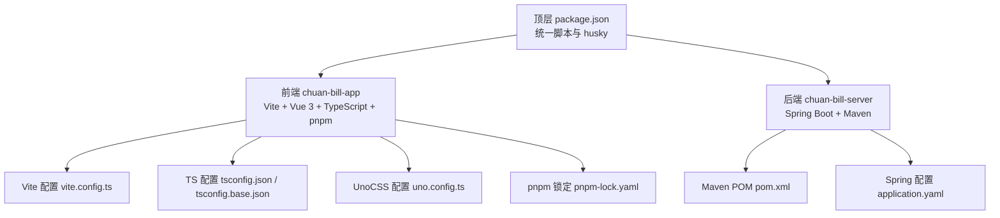
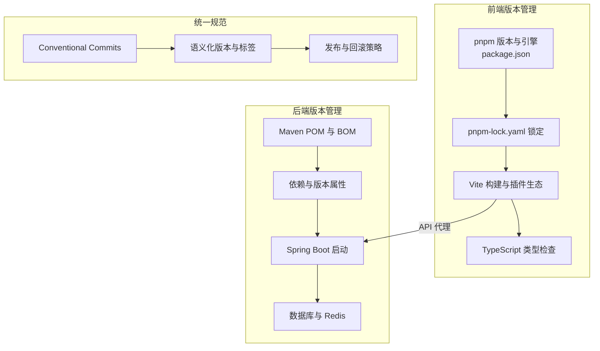
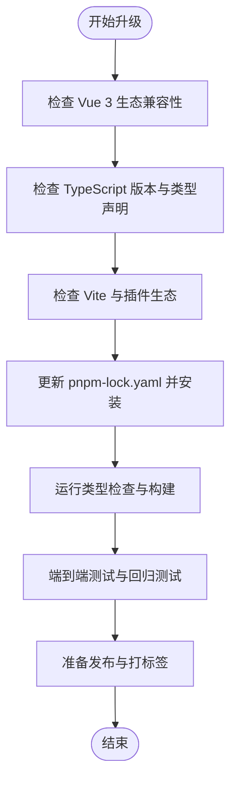
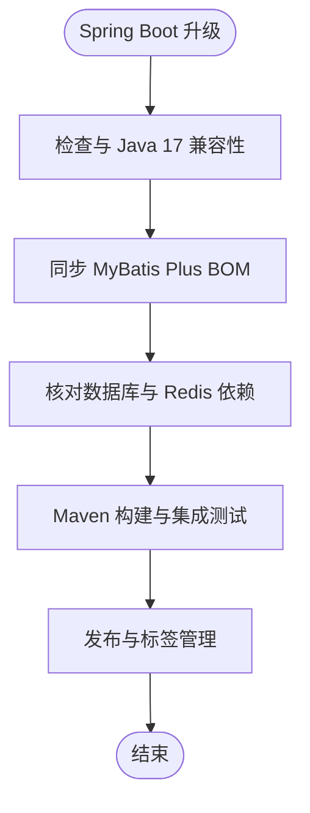
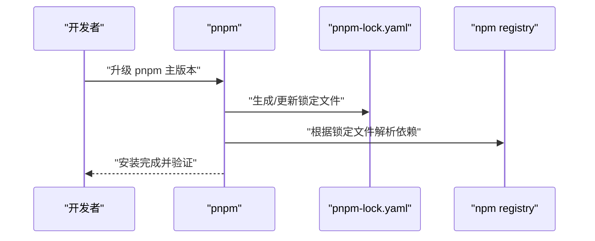
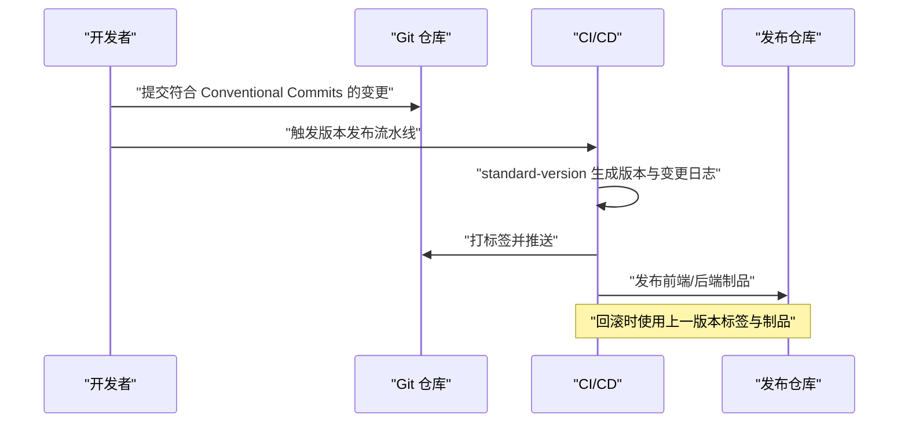
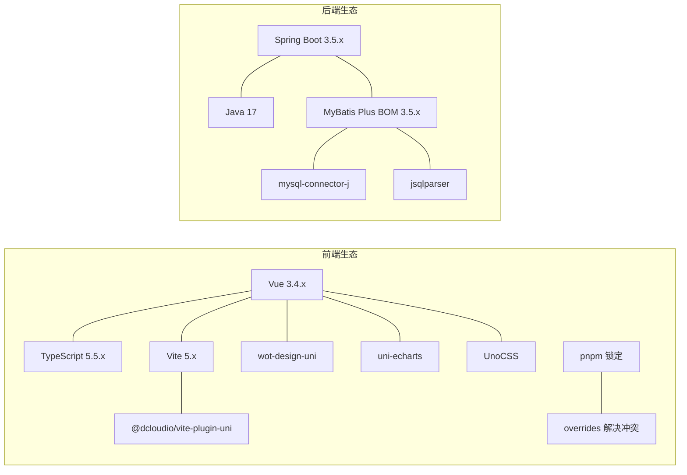
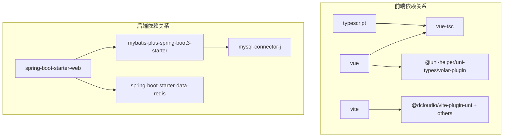

# 版本管理

<cite>
**本文引用的文件**
- [chuan-bill-app/package.json](file://chuan-bill-app/package.json)
- [chuan-bill-app/vite.config.ts](file://chuan-bill-app/vite.config.ts)
- [chuan-bill-app/tsconfig.json](file://chuan-bill-app/tsconfig.json)
- [chuan-bill-app/tsconfig.base.json](file://chuan-bill-app/tsconfig.base.json)
- [chuan-bill-app/uno.config.ts](file://chuan-bill-app/uno.config.ts)
- [chuan-bill-app/pnpm-lock.yaml](file://chuan-bill-app/pnpm-lock.yaml)
- [chuan-bill-server/pom.xml](file://chuan-bill-server/pom.xml)
- [chuan-bill-server/src/main/resources/application.yaml](file://chuan-bill-server/src/main/resources/application.yaml)
- [package.json](file://package.json)
- [commitlint.config.js](file://commitlint.config.js)
</cite>

## 目录
1. [简介](#简介)
2. [项目结构](#项目结构)
3. [核心组件](#核心组件)
4. [架构总览](#架构总览)
5. [详细组件分析](#详细组件分析)
6. [依赖分析](#依赖分析)
7. [性能考虑](#性能考虑)
8. [故障排查指南](#故障排查指南)
9. [结论](#结论)
10. [附录](#附录)

## 简介
本运维文档聚焦“小川记账”的版本管理策略与实践，覆盖前后端版本升级路径、依赖锁定与兼容性检查、包管理工具版本控制、发布流程与回滚策略，以及版本兼容性矩阵。目标是为团队提供可落地的版本治理方法，降低升级风险，提升交付稳定性。

## 项目结构
项目采用前后端分离的多包结构：
- 前端工程：chuan-bill-app（基于 uni-app 的多端应用，包含 H5、小程序、App 等平台产物）
- 后端工程：chuan-bill-server（基于 Spring Boot 的 Java 服务）
- 顶层脚本：统一启动、代码规范与提交规范配置

**图示来源**
- [package.json:1-29](file://package.json#L1-L29)
- [chuan-bill-app/package.json:1-135](file://chuan-bill-app/package.json#L1-L135)
- [chuan-bill-app/vite.config.ts:1-80](file://chuan-bill-app/vite.config.ts#L1-L80)
- [chuan-bill-app/tsconfig.json:1-30](file://chuan-bill-app/tsconfig.json#L1-L30)
- [chuan-bill-app/tsconfig.base.json:1-11](file://chuan-bill-app/tsconfig.base.json#L1-L11)
- [chuan-bill-app/uno.config.ts:1-38](file://chuan-bill-app/uno.config.ts#L1-L38)
- [chuan-bill-app/pnpm-lock.yaml:1-800](file://chuan-bill-app/pnpm-lock.yaml#L1-L800)
- [chuan-bill-server/pom.xml:1-226](file://chuan-bill-server/pom.xml#L1-L226)
- [chuan-bill-server/src/main/resources/application.yaml:1-51](file://chuan-bill-server/src/main/resources/application.yaml#L1-L51)

**章节来源**
- [package.json:1-29](file://package.json#L1-L29)
- [chuan-bill-app/package.json:1-135](file://chuan-bill-app/package.json#L1-L135)
- [chuan-bill-server/pom.xml:1-226](file://chuan-bill-server/pom.xml#L1-L226)

## 核心组件
- 前端核心依赖
  - Vue 3：版本约束为兼容范围，需结合 Vite、TypeScript、组件库进行兼容性验证
  - TypeScript：版本与 Vue 3、Volar 插件保持一致
  - Vite：版本与 @dcloudio/vite-plugin-uni、@unocss/vite 等生态插件协同
  - 包管理：pnpm，版本与锁文件共同保障一致性
- 后端核心依赖
  - Spring Boot：父 POM 版本已固定，MyBatis Plus 通过 BOM 同步
  - Java：版本属性集中管理
  - 数据与中间件：MySQL、Redis、Actuator 等
- 顶层与规范
  - 顶层 package.json 提供统一启动与 lint 脚本
  - commitlint 配置遵循 Conventional Commits

**章节来源**
- [chuan-bill-app/package.json:57-125](file://chuan-bill-app/package.json#L57-L125)
- [chuan-bill-app/tsconfig.json:19-22](file://chuan-bill-app/tsconfig.json#L19-L22)
- [chuan-bill-app/vite.config.ts:17-79](file://chuan-bill-app/vite.config.ts#L17-L79)
- [chuan-bill-app/pnpm-lock.yaml:10-210](file://chuan-bill-app/pnpm-lock.yaml#L10-L210)
- [chuan-bill-server/pom.xml:29-50](file://chuan-bill-server/pom.xml#L29-L50)
- [chuan-bill-server/pom.xml:51-169](file://chuan-bill-server/pom.xml#L51-L169)
- [chuan-bill-server/src/main/resources/application.yaml:1-51](file://chuan-bill-server/src/main/resources/application.yaml#L1-L51)
- [package.json:6-16](file://package.json#L6-L16)
- [commitlint.config.js:1-4](file://commitlint.config.js#L1-L4)

## 架构总览
版本管理贯穿“开发—构建—发布—回滚”全生命周期，前端与后端分别以包管理器与构建工具为核心，配合统一的提交规范与发布工具，形成闭环。

**图示来源**
- [chuan-bill-app/package.json:8-10](file://chuan-bill-app/package.json#L8-L10)
- [chuan-bill-app/pnpm-lock.yaml:1-800](file://chuan-bill-app/pnpm-lock.yaml#L1-L800)
- [chuan-bill-app/vite.config.ts:70-78](file://chuan-bill-app/vite.config.ts#L70-L78)
- [chuan-bill-server/pom.xml:29-50](file://chuan-bill-server/pom.xml#L29-L50)
- [chuan-bill-server/pom.xml:51-169](file://chuan-bill-server/pom.xml#L51-L169)
- [package.json:6-16](file://package.json#L6-L16)
- [commitlint.config.js:1-4](file://commitlint.config.js#L1-L4)

## 详细组件分析

### 前端依赖版本升级策略（Vue 3、TypeScript、Vite）
- Vue 3 升级
  - 当前版本：~3.4.38
  - 升级步骤
    1) 检查 Vite 与 @dcloudio/vite-plugin-uni 对应版本，确保插件生态兼容
    2) 检查 TypeScript 与 Vue 3 的类型匹配（参考 tsconfig.json 中的类型声明与 Volar 插件）
    3) 运行类型检查与端到端测试，确认无类型错误与运行时异常
  - 兼容性检查清单
    - Volar 插件与 Vue 3 主版本匹配
    - 组件库（wot-design-uni、uni-echarts）与 Vue 3 版本兼容
    - Vite 插件链（AutoImport、UnoCSS、Components、Layouts、Pages、Manifest、BundleOptimizer）均与新 Vue 版本兼容
- TypeScript 升级
  - 当前版本：~5.5.4
  - 升级步骤
    1) 保持与 Vue 3、Volar 插件版本一致
    2) 更新 tsconfig.base.json 的 lib 与严格模式配置
    3) 运行 vue-tsc 进行类型检查
- Vite 升级
  - 当前版本：^5.2.8
  - 升级步骤
    1) 更新 @dcloudio/vite-plugin-uni 与相关插件至兼容版本
    2) 检查 optimizeDeps.exclude 与插件顺序
    3) 重新构建并验证代理与热更新

**图示来源**
- [chuan-bill-app/package.json:84-86](file://chuan-bill-app/package.json#L84-L86)
- [chuan-bill-app/package.json:120](file://chuan-bill-app/package.json#L120)
- [chuan-bill-app/package.json:123](file://chuan-bill-app/package.json#L123)
- [chuan-bill-app/tsconfig.json:19-22](file://chuan-bill-app/tsconfig.json#L19-L22)
- [chuan-bill-app/tsconfig.base.json:1-11](file://chuan-bill-app/tsconfig.base.json#L1-L11)
- [chuan-bill-app/vite.config.ts:17-79](file://chuan-bill-app/vite.config.ts#L17-L79)
- [chuan-bill-app/pnpm-lock.yaml:10-210](file://chuan-bill-app/pnpm-lock.yaml#L10-L210)

**章节来源**
- [chuan-bill-app/package.json:84-86](file://chuan-bill-app/package.json#L84-L86)
- [chuan-bill-app/package.json:120](file://chuan-bill-app/package.json#L120)
- [chuan-bill-app/package.json:123](file://chuan-bill-app/package.json#L123)
- [chuan-bill-app/tsconfig.json:19-22](file://chuan-bill-app/tsconfig.json#L19-L22)
- [chuan-bill-app/tsconfig.base.json:1-11](file://chuan-bill-app/tsconfig.base.json#L1-L11)
- [chuan-bill-app/vite.config.ts:17-79](file://chuan-bill-app/vite.config.ts#L17-L79)
- [chuan-bill-app/pnpm-lock.yaml:10-210](file://chuan-bill-app/pnpm-lock.yaml#L10-L210)

### 后端框架版本管理（Spring Boot、Java、MyBatis Plus）
- Spring Boot
  - 父 POM 版本：3.5.11
  - 升级策略
    1) 评估安全与稳定性，遵循 LTS 或稳定版本
    2) 同步 Actuator、DevTools、Validation 等周边依赖
- Java 版本
  - 属性：17
  - 升级策略
    1) 与 Spring Boot 3 兼容（推荐 LTS）
    2) CI/CD 环境统一 JDK 版本
- MyBatis Plus
  - 通过 mybatis-plus-bom 同步版本
  - 升级策略
    1) 与 Spring Boot 3 Starter 兼容
    2) 保持与 mysql-connector-j、jsqlparser 等驱动与分页插件版本一致

**图示来源**
- [chuan-bill-server/pom.xml:6-7](file://chuan-bill-server/pom.xml#L6-L7)
- [chuan-bill-server/pom.xml:33-50](file://chuan-bill-server/pom.xml#L33-L50)
- [chuan-bill-server/pom.xml:51-169](file://chuan-bill-server/pom.xml#L51-L169)
- [chuan-bill-server/src/main/resources/application.yaml:1-51](file://chuan-bill-server/src/main/resources/application.yaml#L1-L51)

**章节来源**
- [chuan-bill-server/pom.xml:6-7](file://chuan-bill-server/pom.xml#L6-L7)
- [chuan-bill-server/pom.xml:33-50](file://chuan-bill-server/pom.xml#L33-L50)
- [chuan-bill-server/pom.xml:51-169](file://chuan-bill-server/pom.xml#L51-L169)
- [chuan-bill-server/src/main/resources/application.yaml:1-51](file://chuan-bill-server/src/main/resources/application.yaml#L1-L51)

### 包管理工具版本控制（pnpm）
- pnpm 版本
  - 工程内：9.9.0
  - 顶层：10.27.0
- 锁定机制
  - pnpm-lock.yaml 记录精确版本与依赖树，确保跨环境一致性
  - overrides 字段用于解决特定包冲突（如 unconfig）
- 升级策略
  - 优先升级 pnpm 主版本，再执行 pnpm install 生成新锁文件
  - 严格审查依赖变更，避免破坏性更新

**图示来源**
- [chuan-bill-app/package.json:6](file://chuan-bill-app/package.json#L6)
- [package.json:21](file://package.json#L21)
- [chuan-bill-app/pnpm-lock.yaml:7-8](file://chuan-bill-app/pnpm-lock.yaml#L7-L8)

**章节来源**
- [chuan-bill-app/package.json:6](file://chuan-bill-app/package.json#L6)
- [package.json:21](file://package.json#L21)
- [chuan-bill-app/pnpm-lock.yaml:7-8](file://chuan-bill-app/pnpm-lock.yaml#L7-L8)

### 版本发布流程（语义化版本、标签、回滚）
- 语义化版本
  - 使用 standard-version（工程内已引入），遵循主.次.补丁规则
  - 提交信息遵循 Conventional Commits，自动生成变更日志
- 发布标签
  - 建议在合并到主分支后打标签并推送
  - 前端与后端分别维护各自版本号与发布产物
- 回滚策略
  - 前端：回退到上一版本 pnpm-lock.yaml 与最近一次构建产物
  - 后端：回滚到上一稳定镜像或 WAR/包，必要时回滚数据库迁移

**图示来源**
- [chuan-bill-app/package.json:119](file://chuan-bill-app/package.json#L119)
- [commitlint.config.js:1-4](file://commitlint.config.js#L1-L4)
- [package.json:6-16](file://package.json#L6-L16)

**章节来源**
- [chuan-bill-app/package.json:119](file://chuan-bill-app/package.json#L119)
- [commitlint.config.js:1-4](file://commitlint.config.js#L1-L4)
- [package.json:6-16](file://package.json#L6-L16)

### 版本兼容性矩阵
- 前端兼容性（基于当前锁定文件）
  - Vue 3.4.x 与 TypeScript 5.5.x、Vite 5.x、@dcloudio/vite-plugin-uni、wot-design-uni、uni-echarts、UnoCSS 等生态组件版本需在同一兼容窗口
  - pnpm overrides 用于解决 unconfig 冲突
- 后端兼容性
  - Spring Boot 3.5.x 与 Java 17
  - MyBatis Plus 3.5.x（通过 BOM）与 Spring Boot 3 Starter 兼容
  - MySQL Connector/J 与分页插件版本需与 MyBatis Plus 保持一致

**图示来源**
- [chuan-bill-app/pnpm-lock.yaml:10-210](file://chuan-bill-app/pnpm-lock.yaml#L10-L210)
- [chuan-bill-app/package.json:84-86](file://chuan-bill-app/package.json#L84-L86)
- [chuan-bill-app/package.json:120](file://chuan-bill-app/package.json#L120)
- [chuan-bill-app/package.json:123](file://chuan-bill-app/package.json#L123)
- [chuan-bill-server/pom.xml:33-50](file://chuan-bill-server/pom.xml#L33-L50)
- [chuan-bill-server/pom.xml:51-169](file://chuan-bill-server/pom.xml#L51-L169)

**章节来源**
- [chuan-bill-app/pnpm-lock.yaml:10-210](file://chuan-bill-app/pnpm-lock.yaml#L10-L210)
- [chuan-bill-app/package.json:84-86](file://chuan-bill-app/package.json#L84-L86)
- [chuan-bill-app/package.json:120](file://chuan-bill-app/package.json#L120)
- [chuan-bill-app/package.json:123](file://chuan-bill-app/package.json#L123)
- [chuan-bill-server/pom.xml:33-50](file://chuan-bill-server/pom.xml#L33-L50)
- [chuan-bill-server/pom.xml:51-169](file://chuan-bill-server/pom.xml#L51-L169)

## 依赖分析
- 前端依赖耦合
  - Vite 插件链高度耦合，升级需成组验证
  - TypeScript 与 Vue 3 的类型声明需保持一致
  - UnoCSS 与组件库解析器需与 Vite 插件顺序匹配
- 后端依赖耦合
  - Spring Boot 与 MyBatis Plus BOM 为强耦合
  - 数据源与 Redis 连接池配置需与版本兼容

**图示来源**
- [chuan-bill-app/tsconfig.json:19-22](file://chuan-bill-app/tsconfig.json#L19-L22)
- [chuan-bill-app/vite.config.ts:17-79](file://chuan-bill-app/vite.config.ts#L17-L79)
- [chuan-bill-server/pom.xml:51-169](file://chuan-bill-server/pom.xml#L51-L169)

**章节来源**
- [chuan-bill-app/tsconfig.json:19-22](file://chuan-bill-app/tsconfig.json#L19-L22)
- [chuan-bill-app/vite.config.ts:17-79](file://chuan-bill-app/vite.config.ts#L17-L79)
- [chuan-bill-server/pom.xml:51-169](file://chuan-bill-server/pom.xml#L51-L169)

## 性能考虑
- 前端
  - 通过 Bundle Optimizer 与按需组件加载减少首屏体积
  - Vite 依赖预优化 exclude 配置在开发阶段减少不必要的扫描
- 后端
  - Actuator 与健康检查开启，便于 CI/CD 中的就绪探针
  - 连接池参数与超时设置需与实例规格匹配

[本节为通用指导，不直接分析具体文件]

## 故障排查指南
- 前端
  - 类型错误：运行 vue-tsc，逐项修复类型声明不匹配
  - 构建失败：检查 Vite 插件顺序与解析器配置
  - 依赖冲突：查看 pnpm-lock.yaml 中 overrides 生效情况
- 后端
  - 启动失败：检查 application.yaml 中数据库与 Redis 连接参数
  - 依赖冲突：核对 pom.xml 中 BOM 与显式版本的一致性
- 顶层
  - 启动脚本：确认 concurrently 并行启动的子进程状态

**章节来源**
- [chuan-bill-app/tsconfig.json:19-22](file://chuan-bill-app/tsconfig.json#L19-L22)
- [chuan-bill-app/vite.config.ts:17-79](file://chuan-bill-app/vite.config.ts#L17-L79)
- [chuan-bill-app/pnpm-lock.yaml:7-8](file://chuan-bill-app/pnpm-lock.yaml#L7-L8)
- [chuan-bill-server/src/main/resources/application.yaml:1-51](file://chuan-bill-server/src/main/resources/application.yaml#L1-L51)
- [chuan-bill-server/pom.xml:33-50](file://chuan-bill-server/pom.xml#L33-L50)
- [package.json:6-16](file://package.json#L6-L16)

## 结论
通过统一的包管理器、严格的依赖锁定、完善的提交规范与发布流程，小川记账项目可在保证稳定性的同时高效推进版本迭代。建议在每次升级前先在预发环境验证，升级后立即打标签并产出制品，以便快速回滚。

[本节为总结性内容，不直接分析具体文件]

## 附录
- 常用命令参考
  - 前端：type-check、lint、build、dev
  - 后端：spring-boot:run、spotless:check
  - 顶层：start、lint

**章节来源**
- [chuan-bill-app/package.json:11-55](file://chuan-bill-app/package.json#L11-L55)
- [package.json:6-16](file://package.json#L6-L16)