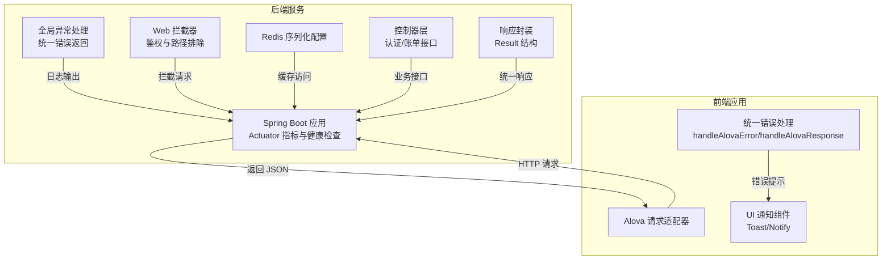
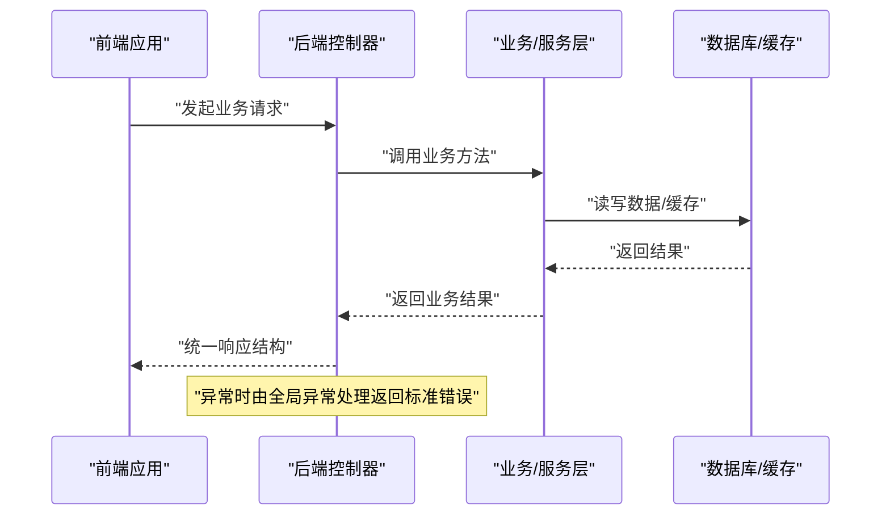
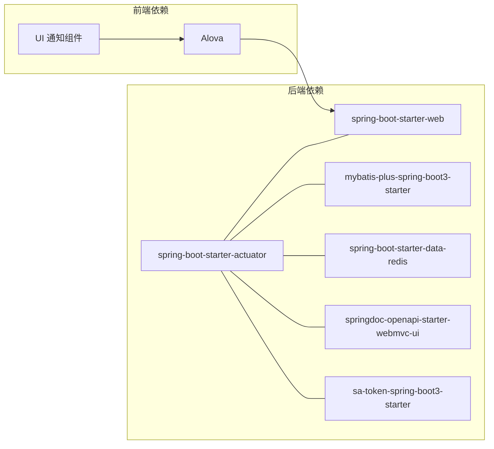
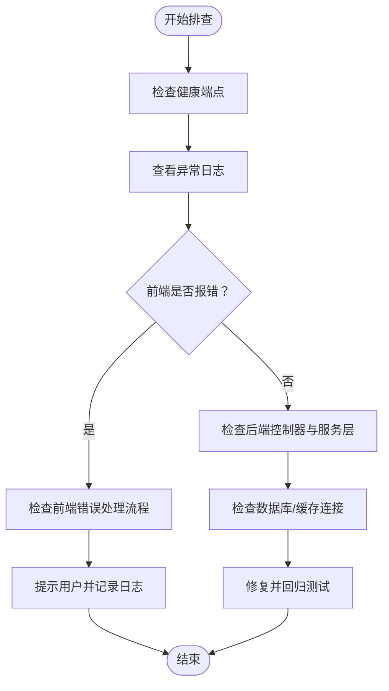

# 监控告警

<cite>
**本文引用的文件**   
- [application.yaml](file://chuan-bill-server/src/main/resources/application.yaml)
- [ChuanBillServerApplication.java](file://chuan-bill-server/src/main/java/com/samoy/chuanbillserver/ChuanBillServerApplication.java)
- [pom.xml](file://chuan-bill-server/pom.xml)
- [GlobalExceptionHandler.java](file://chuan-bill-server/src/main/java/com/samoy/chuanbillserver/expection/GlobalExceptionHandler.java)
- [MyWebMvcConfig.java](file://chuan-bill-server/src/main/java/com/samoy/chuanbillserver/config/MyWebMvcConfig.java)
- [RedisConfig.java](file://chuan-bill-server/src/main/java/com/samoy/chuanbillserver/config/RedisConfig.java)
- [AuthController.java](file://chuan-bill-server/src/main/java/com/samoy/chuanbillserver/controller/AuthController.java)
- [BillController.java](file://chuan-bill-server/src/main/java/com/samoy/chuanbillserver/controller/BillController.java)
- [Result.java](file://chuan-bill-server/src/main/java/com/samoy/chuanbillserver/result/Result.java)
- [handlers.ts](file://chuan-bill-app/src/api/core/handlers.ts)
- [handlers.js](file://chuan-bill-app/dist/dev/mp-weixin/api/core/handlers.js)
</cite>

## 目录
1. [简介](#简介)
2. [项目结构](#项目结构)
3. [核心组件](#核心组件)
4. [架构总览](#架构总览)
5. [组件详细分析](#组件详细分析)
6. [依赖关系分析](#依赖关系分析)
7. [性能与容量规划](#性能与容量规划)
8. [故障排查指南](#故障排查指南)
9. [结论](#结论)
10. [附录](#附录)

## 简介
本运维文档面向“小川记账”监控告警体系，聚焦于应用监控配置（健康检查、性能指标、错误日志）、性能监控方案（响应时间、吞吐量、资源使用率）、业务监控策略（关键业务指标、用户行为分析、功能使用统计），以及异常告警机制（规则、通知渠道、升级策略）。同时提供与 Prometheus、Grafana、ELK Stack 的集成建议与配置要点，帮助团队建立完善的可观测性与告警闭环。

## 项目结构
后端采用 Spring Boot 应用，前端为基于 Vue3 + TypeScript 的小程序应用。后端通过 Actuator 开启健康检查与指标导出；前端通过统一的请求处理器对错误进行捕获与反馈。整体结构如下：

图表来源
- [ChuanBillServerApplication.java:1-15](file://chuan-bill-server/src/main/java/com/samoy/chuanbillserver/ChuanBillServerApplication.java#L1-L15)
- [application.yaml:1-51](file://chuan-bill-server/src/main/resources/application.yaml#L1-L51)
- [pom.xml:53-168](file://chuan-bill-server/pom.xml#L53-L168)
- [GlobalExceptionHandler.java:1-50](file://chuan-bill-server/src/main/java/com/samoy/chuanbillserver/expection/GlobalExceptionHandler.java#L1-L50)
- [MyWebMvcConfig.java:1-21](file://chuan-bill-server/src/main/java/com/samoy/chuanbillserver/config/MyWebMvcConfig.java#L1-L21)
- [RedisConfig.java:1-32](file://chuan-bill-server/src/main/java/com/samoy/chuanbillserver/config/RedisConfig.java#L1-L32)
- [AuthController.java:1-66](file://chuan-bill-server/src/main/java/com/samoy/chuanbillserver/controller/AuthController.java#L1-L66)
- [BillController.java:1-91](file://chuan-bill-server/src/main/java/com/samoy/chuanbillserver/controller/BillController.java#L1-L91)
- [Result.java:1-50](file://chuan-bill-server/src/main/java/com/samoy/chuanbillserver/result/Result.java#L1-L50)
- [handlers.ts:50-104](file://chuan-bill-app/src/api/core/handlers.ts#L50-L104)
- [handlers.js:33-66](file://chuan-bill-app/dist/dev/mp-weixin/api/core/handlers.js#L33-L66)

章节来源
- [ChuanBillServerApplication.java:1-15](file://chuan-bill-server/src/main/java/com/samoy/chuanbillserver/ChuanBillServerApplication.java#L1-L15)
- [application.yaml:1-51](file://chuan-bill-server/src/main/resources/application.yaml#L1-L51)
- [pom.xml:53-168](file://chuan-bill-server/pom.xml#L53-L168)

## 核心组件
- 应用启动与配置
  - 启动入口负责加载 Spring Boot 容器与 MyBatis Mapper 扫描。
  - 配置文件集中管理数据源、Redis、Sa-Token、OpenAPI 文档等。
- 全局异常处理
  - 统一捕获未登录、业务异常与通用异常，记录日志并返回标准化结果。
- Web 拦截器
  - 基于 Sa-Token 的登录拦截，排除认证、Swagger 等路径。
- Redis 序列化
  - 统一键值序列化策略，确保缓存读写一致性。
- 控制器层
  - 认证与账单相关接口，结合权限上下文获取用户标识。
- 响应封装
  - 统一返回结构，包含状态码、消息、数据与时间戳。
- 前端错误处理
  - Alova 错误处理与响应处理，区分网络、超时、未授权与业务错误，联动 UI 通知。

章节来源
- [ChuanBillServerApplication.java:1-15](file://chuan-bill-server/src/main/java/com/samoy/chuanbillserver/ChuanBillServerApplication.java#L1-L15)
- [application.yaml:1-51](file://chuan-bill-server/src/main/resources/application.yaml#L1-L51)
- [GlobalExceptionHandler.java:1-50](file://chuan-bill-server/src/main/java/com/samoy/chuanbillserver/expection/GlobalExceptionHandler.java#L1-L50)
- [MyWebMvcConfig.java:1-21](file://chuan-bill-server/src/main/java/com/samoy/chuanbillserver/config/MyWebMvcConfig.java#L1-L21)
- [RedisConfig.java:1-32](file://chuan-bill-server/src/main/java/com/samoy/chuanbillserver/config/RedisConfig.java#L1-L32)
- [AuthController.java:1-66](file://chuan-bill-server/src/main/java/com/samoy/chuanbillserver/controller/AuthController.java#L1-L66)
- [BillController.java:1-91](file://chuan-bill-server/src/main/java/com/samoy/chuanbillserver/controller/BillController.java#L1-L91)
- [Result.java:1-50](file://chuan-bill-server/src/main/java/com/samoy/chuanbillserver/result/Result.java#L1-L50)
- [handlers.ts:50-104](file://chuan-bill-app/src/api/core/handlers.ts#L50-L104)
- [handlers.js:33-66](file://chuan-bill-app/dist/dev/mp-weixin/api/core/handlers.js#L33-L66)

## 架构总览
后端通过 Actuator 暴露健康检查与指标，前端通过 Alova 发起请求并在错误时进行统一处理与用户提示。全局异常处理与拦截器保证了请求链路的一致性与安全性。

图表来源
- [AuthController.java:1-66](file://chuan-bill-server/src/main/java/com/samoy/chuanbillserver/controller/AuthController.java#L1-L66)
- [BillController.java:1-91](file://chuan-bill-server/src/main/java/com/samoy/chuanbillserver/controller/BillController.java#L1-L91)
- [Result.java:1-50](file://chuan-bill-server/src/main/java/com/samoy/chuanbillserver/result/Result.java#L1-L50)
- [GlobalExceptionHandler.java:1-50](file://chuan-bill-server/src/main/java/com/samoy/chuanbillserver/expection/GlobalExceptionHandler.java#L1-L50)

## 组件详细分析

### 应用监控配置（健康检查、性能指标、错误日志）
- 健康检查
  - Actuator starter 已引入，可通过 HTTP 端点暴露健康状态与指标，便于外部系统拉取。
  - Swagger/OpenAPI 文档路径已配置，可用于快速验证服务可用性。
- 性能指标
  - Actuator 默认提供 JVM、进程、HTTP 请求等基础指标，可结合 Prometheus 抓取。
- 错误日志
  - 全局异常处理器记录异常日志，便于后续接入 ELK 进行检索与聚合。

章节来源
- [pom.xml:53-168](file://chuan-bill-server/pom.xml#L53-L168)
- [application.yaml:1-51](file://chuan-bill-server/src/main/resources/application.yaml#L1-L51)
- [GlobalExceptionHandler.java:1-50](file://chuan-bill-server/src/main/java/com/samoy/chuanbillserver/expection/GlobalExceptionHandler.java#L1-L50)

### 性能监控方案（响应时间、吞吐量、资源使用率）
- 响应时间
  - 利用 Actuator HTTP 指标（如 http.server.requests）按 URI、方法、状态码维度统计平均响应时间与 P95/P99。
- 吞吐量
  - 通过请求数（requests）与错误数（异常计数）计算 QPS 与错误率。
- 资源使用率
  - 采集 JVM 指标（堆内存、线程、GC、类加载）与操作系统指标（CPU、内存、IO）。
- 建议
  - 将 Actuator 指标暴露为 /actuator/prometheus 或 /actuator/metrics，配合 Prometheus 抓取。
  - Grafana 创建仪表盘，设置阈值与告警规则。

章节来源
- [pom.xml:53-168](file://chuan-bill-server/pom.xml#L53-L168)
- [application.yaml:1-51](file://chuan-bill-server/src/main/resources/application.yaml#L1-L51)

### 业务监控策略（关键业务指标、用户行为分析、功能使用统计）
- 关键业务指标
  - 认证成功率/失败率、账单增删改查操作成功率、分类与支付方式查询命中率。
  - 可通过埋点在控制器层或服务层增加计数器与直方图指标。
- 用户行为分析
  - 在前端对关键交互（登录、新增账单、OCR识别等）进行打点上报，结合后端日志与指标进行关联分析。
- 功能使用统计
  - 对高频接口（如账单列表、详情）进行访问次数、错误分布统计，辅助容量规划与优化。

章节来源
- [AuthController.java:1-66](file://chuan-bill-server/src/main/java/com/samoy/chuanbillserver/controller/AuthController.java#L1-L66)
- [BillController.java:1-91](file://chuan-bill-server/src/main/java/com/samoy/chuanbillserver/controller/BillController.java#L1-L91)

### 异常告警机制（规则、通知渠道、升级策略）
- 规则配置
  - 错误率阈值（如 5 分钟错误率 > 3%）、响应时间阈值（P95 > X ms）、资源使用阈值（CPU/内存/GC）。
  - 建议针对不同接口与模块设置差异化阈值。
- 通知渠道
  - 邮件、即时通讯群机器人、电话（升级通道）。
- 升级策略
  - 一级告警（通知）→ 二级告警（加急）→ 三级告警（升级到值班）。
- 前端联动
  - 前端错误处理对 401/403 自动提示并跳转登录，避免重复告警风暴。

章节来源
- [GlobalExceptionHandler.java:1-50](file://chuan-bill-server/src/main/java/com/samoy/chuanbillserver/expection/GlobalExceptionHandler.java#L1-L50)
- [handlers.ts:50-104](file://chuan-bill-app/src/api/core/handlers.ts#L50-L104)
- [handlers.js:33-66](file://chuan-bill-app/dist/dev/mp-weixin/api/core/handlers.js#L33-L66)

### 监控工具集成指南（Prometheus、Grafana、ELK Stack）
- Prometheus
  - 配置抓取任务，目标为后端 Actuator 指标端点。
  - 导入常用模板（JVM、Spring Boot）以快速可视化。
- Grafana
  - 新建数据源指向 Prometheus，创建仪表盘：错误率、响应时间、吞吐量、资源使用。
  - 设置告警面板与通知通道。
- ELK Stack
  - 后端日志输出至 stdout/stderr，容器化部署时由 Filebeat 收集。
  - 在 Kibana 中建立索引模式，进行日志检索、聚合与告警（如错误日志关键字匹配）。

章节来源
- [application.yaml:1-51](file://chuan-bill-server/src/main/resources/application.yaml#L1-L51)
- [pom.xml:53-168](file://chuan-bill-server/pom.xml#L53-L168)

## 依赖关系分析
后端依赖 Actuator、Web、MyBatis-Plus、Redis、OpenAPI、Sa-Token 等模块；前端通过 Alova 与后端交互，错误处理统一收敛。

图表来源
- [pom.xml:53-168](file://chuan-bill-server/pom.xml#L53-L168)
- [handlers.ts:50-104](file://chuan-bill-app/src/api/core/handlers.ts#L50-L104)

章节来源
- [pom.xml:53-168](file://chuan-bill-server/pom.xml#L53-L168)

## 性能与容量规划
- 指标采集
  - 重点关注：错误率、P95/P99 响应时间、并发连接数、数据库慢查询、Redis 命中率。
- 阈值建议
  - 响应时间：P95 < 2s；错误率 < 1%；CPU 使用率 < 80%；Redis 命中率 > 95%。
- 容量规划
  - 基于峰值 QPS 与资源使用趋势，预留 20%-30% 缓冲，结合弹性伸缩策略。

章节来源
- [application.yaml:1-51](file://chuan-bill-server/src/main/resources/application.yaml#L1-L51)
- [pom.xml:53-168](file://chuan-bill-server/pom.xml#L53-L168)

## 故障排查指南
- 健康检查
  - 通过 Actuator 健康端点确认应用、磁盘、数据库、Redis 连接状态。
- 日志定位
  - 全局异常处理器记录异常栈，结合请求上下文快速定位问题。
- 前端错误
  - 区分网络错误、超时、未授权与业务错误，前端统一提示并引导用户重试或重新登录。

图表来源
- [GlobalExceptionHandler.java:1-50](file://chuan-bill-server/src/main/java/com/samoy/chuanbillserver/expection/GlobalExceptionHandler.java#L1-L50)
- [handlers.ts:50-104](file://chuan-bill-app/src/api/core/handlers.ts#L50-L104)

章节来源
- [GlobalExceptionHandler.java:1-50](file://chuan-bill-server/src/main/java/com/samoy/chuanbillserver/expection/GlobalExceptionHandler.java#L1-L50)
- [handlers.ts:50-104](file://chuan-bill-app/src/api/core/handlers.ts#L50-L104)

## 结论
通过 Actuator 的健康检查与指标能力、统一的异常处理与前端错误收敛，结合 Prometheus/Grafana/ELK 的集成，可形成覆盖应用、性能与业务的完整监控告警体系。建议尽快落地指标阈值与告警规则，完善通知与升级流程，并持续优化关键业务指标与用户体验。

## 附录
- 配置要点清单
  - Actuator 指标端点启用与暴露策略
  - Swagger/OpenAPI 文档路径与访问控制
  - Sa-Token 登录拦截与放行路径
  - Redis 序列化与连接池配置
  - 全局异常处理日志级别与输出格式
- 前端错误处理清单
  - 401/403 自动跳转登录
  - 网络错误、超时、未知错误的统一提示
  - 开发环境下的调试日志输出

章节来源
- [application.yaml:1-51](file://chuan-bill-server/src/main/resources/application.yaml#L1-L51)
- [MyWebMvcConfig.java:1-21](file://chuan-bill-server/src/main/java/com/samoy/chuanbillserver/config/MyWebMvcConfig.java#L1-L21)
- [RedisConfig.java:1-32](file://chuan-bill-server/src/main/java/com/samoy/chuanbillserver/config/RedisConfig.java#L1-L32)
- [GlobalExceptionHandler.java:1-50](file://chuan-bill-server/src/main/java/com/samoy/chuanbillserver/expection/GlobalExceptionHandler.java#L1-L50)
- [handlers.ts:50-104](file://chuan-bill-app/src/api/core/handlers.ts#L50-L104)