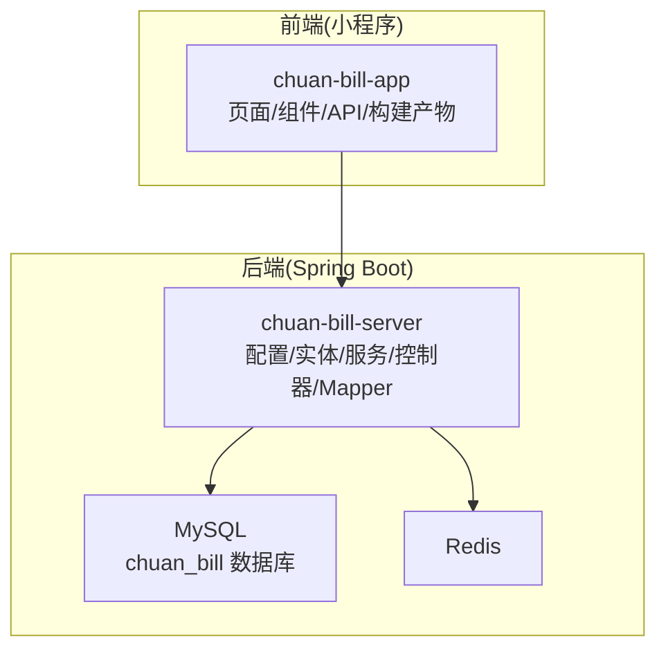
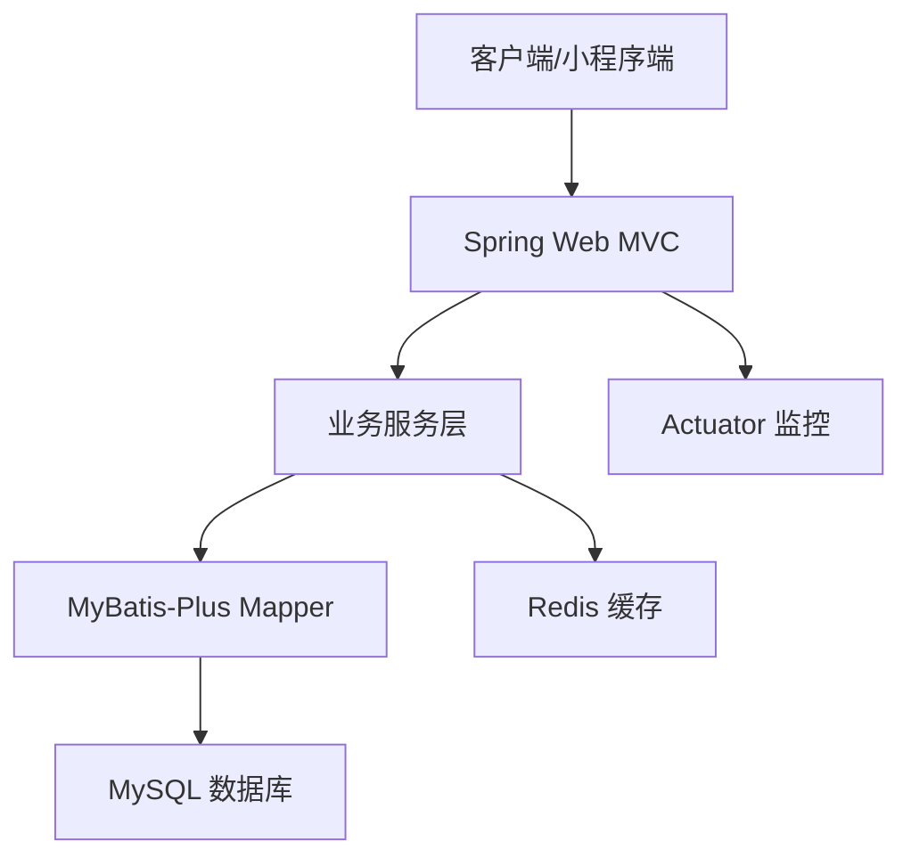
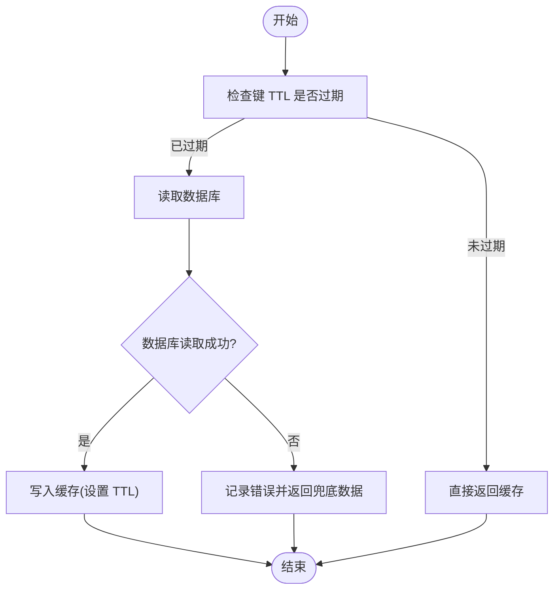
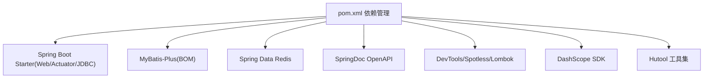

# 系统维护

<cite>
**本文引用的文件**   
- [application.yaml](file://chuan-bill-server/src/main/resources/application.yaml)
- [pom.xml](file://chuan-bill-server/pom.xml)
- [init.sql](file://chuan-bill-server/init.sql)
- [RedisConfig.java](file://chuan-bill-server/src/main/java/com/samoy/chuanbillserver/config/RedisConfig.java)
- [MybatisPlusConfig.java](file://chuan-bill-server/src/main/java/com/samoy/chuanbillserver/config/MybatisPlusConfig.java)
- [package.json](file://package.json)
- [ChuanBillServerApplicationTests.xml](file://chuan-bill-server/target/surefire-reports/TEST-com.samoy.chuanbillserver.ChuanBillServerApplicationTests.xml)
</cite>

## 目录
1. [简介](#简介)
2. [项目结构](#项目结构)
3. [核心组件](#核心组件)
4. [架构总览](#架构总览)
5. [详细组件分析](#详细组件分析)
6. [依赖分析](#依赖分析)
7. [性能考虑](#性能考虑)
8. [故障排查指南](#故障排查指南)
9. [结论](#结论)
10. [附录](#附录)

## 简介
本运维文档面向“小川记账系统”的日常与定期维护任务，覆盖系统清理、日志轮转、缓存清理、临时文件清理的执行计划与操作方法；涵盖安全补丁管理（操作系统、应用、依赖库）的更新流程；提供性能优化建议（数据库查询、缓存策略、前端资源、服务器资源配置）；给出容量规划策略（存储、带宽、并发用户数、扩容方案）；并提供维护任务自动化脚本与定时任务配置思路，帮助团队建立标准化的运维体系。

## 项目结构
小川记账系统采用前后端分离架构：
- 前端：基于 uni-app 的小程序工程，位于 chuan-bill-app，包含页面、组件、API、构建产物等。
- 后端：Spring Boot 应用，位于 chuan-bill-server，包含配置、实体、服务、控制器、Mapper、测试等。
- 数据库：MySQL，初始化脚本在 init.sql 中定义了用户、类目、支付方式、家庭、账单、预算、消息等表及索引。
- 缓存：Redis，通过 Spring Data Redis 进行连接与序列化配置。
- 构建与开发：根目录 package.json 提供统一启动脚本；后端使用 Maven 管理依赖与构建。

**图表来源**
- [application.yaml:1-51](file://chuan-bill-server/src/main/resources/application.yaml#L1-L51)
- [init.sql:1-326](file://chuan-bill-server/init.sql#L1-L326)

**章节来源**
- [application.yaml:1-51](file://chuan-bill-server/src/main/resources/application.yaml#L1-L51)
- [init.sql:1-326](file://chuan-bill-server/init.sql#L1-L326)
- [package.json:1-29](file://package.json#L1-L29)

## 核心组件
- 数据源与缓存配置：后端通过 application.yaml 配置数据源、Redis、MyBatis-Plus 分页拦截器、Swagger/OpenAPI 文档路径等。
- Redis 序列化：RedisConfig 统一键值序列化策略，确保缓存一致性与可读性。
- MyBatis-Plus 分页：MybatisPlusConfig 注册分页插件，支持 MySQL。
- 初始化数据库：init.sql 提供完整的建库、建表、索引与系统默认数据插入。
- 开发与构建：package.json 提供前后端联调脚本，便于本地快速启动与代码规范检查。

**章节来源**
- [application.yaml:1-51](file://chuan-bill-server/src/main/resources/application.yaml#L1-L51)
- [RedisConfig.java:1-32](file://chuan-bill-server/src/main/java/com/samoy/chuanbillserver/config/RedisConfig.java#L1-L32)
- [MybatisPlusConfig.java:1-18](file://chuan-bill-server/src/main/java/com/samoy/chuanbillserver/config/MybatisPlusConfig.java#L1-L18)
- [init.sql:1-326](file://chuan-bill-server/init.sql#L1-L326)
- [package.json:1-29](file://package.json#L1-L29)

## 架构总览
后端服务通过 Web 层接收请求，经由服务层处理业务逻辑，持久层访问 MySQL，同时使用 Redis 缓存热点数据与会话信息。日志输出与监控指标可通过 Actuator（见 pom.xml）进行采集与暴露。

**图表来源**
- [pom.xml:55-56](file://chuan-bill-server/pom.xml#L55-L56)
- [application.yaml:1-51](file://chuan-bill-server/src/main/resources/application.yaml#L1-L51)

## 详细组件分析

### 数据库维护与清理
- 表结构与索引：init.sql 定义了用户、类目、支付方式、家庭、账单、预算、消息等表，并为高频查询字段建立索引，有助于后续查询优化。
- 逻辑删除：MyBatis-Plus 全局配置了逻辑删除字段与值，避免误删数据，维护时需结合业务规则进行归档或清理。
- 清理策略建议：
  - 定期归档历史账单与消息至冷存储，保留近 1 年热数据。
  - 清理过期的临时文件与上传目录（参考后端临时目录位置），按天/周轮转。
  - 使用 SQL 统计各表大小与增长趋势，制定容量预警阈值。

**章节来源**
- [init.sql:1-326](file://chuan-bill-server/init.sql#L1-L326)
- [application.yaml:32-39](file://chuan-bill-server/src/main/resources/application.yaml#L32-L39)

### 日志轮转与审计
- 日志输出：MyBatis 日志实现配置为标准输出，便于开发调试；生产环境建议接入文件日志与集中式日志平台（如 ELK/Sentry）。
- 轮转策略：建议按天轮转，保留 30 天日志；对敏感字段脱敏；设置最大文件大小与备份份数上限。
- 审计与合规：记录关键操作（登录、修改、删除、导出）与异常事件，配合告警系统触发人工复核。

**章节来源**
- [application.yaml:38-41](file://chuan-bill-server/src/main/resources/application.yaml#L38-L41)
- [ChuanBillServerApplicationTests.xml:90-128](file://chuan-bill-server/target/surefire-reports/TEST-com.samoy.chuanbillserver.ChuanBillServerApplicationTests.xml#L90-L128)

### 缓存清理与策略
- Redis 配置：RedisConfig 统一键值序列化，确保缓存数据一致；application.yaml 提供连接参数与超时设置。
- 清理策略：
  - 会话缓存：基于 Sa-Token 的令牌生命周期与主动失效机制，定期清理过期会话。
  - 热点数据：对高频查询结果设置合理 TTL，避免缓存雪崩；对写多读少的数据采用“先更新数据库再删除缓存”策略。
  - 批量清理：按业务维度（用户、家庭）批量失效缓存，避免全量清空。
- 监控：关注命中率、内存使用、慢查询命令，及时调整过期策略与淘汰策略。

**图表来源**
- [RedisConfig.java:1-32](file://chuan-bill-server/src/main/java/com/samoy/chuanbillserver/config/RedisConfig.java#L1-L32)
- [application.yaml:10-21](file://chuan-bill-server/src/main/resources/application.yaml#L10-L21)

**章节来源**
- [RedisConfig.java:1-32](file://chuan-bill-server/src/main/java/com/samoy/chuanbillserver/config/RedisConfig.java#L1-L32)
- [application.yaml:10-31](file://chuan-bill-server/src/main/resources/application.yaml#L10-L31)

### 临时文件清理
- 前端构建产物：dist/dev/mp-weixin 下的静态资源与组件打包产物，建议定期清理旧版本产物，保留最近 3 版本。
- 后端临时目录：后端存在临时上传目录（参考后端工程中的临时目录位置），建议按天清理超过 7 天未使用的文件。
- 清理脚本：可结合 find/ls 与定时任务实现自动清理，保留日志以便审计。

**章节来源**
- [package.json:1-29](file://package.json#L1-L29)
- [init.sql:1-326](file://chuan-bill-server/init.sql#L1-L326)

### 安全补丁管理
- 操作系统补丁：制定 OS 安全基线与补丁发布周期（如每月第二周），在测试环境验证后再灰度到生产。
- 应用安全更新：后端使用 Spring Boot 3.x 与 Sa-Token 等成熟框架，需关注官方 CVE 公告，优先升级高危漏洞版本。
- 依赖库安全修复：通过 Maven/Gradle 的依赖扫描工具（如 OWASP Dependency-Check）定期扫描，修复已知漏洞；对第三方 SDK（如 DashScope）保持版本同步与密钥轮换。
- 流程建议：建立补丁清单、变更审批、回滚预案与上线验证清单。

**章节来源**
- [pom.xml:1-226](file://chuan-bill-server/pom.xml#L1-L226)
- [application.yaml:48-51](file://chuan-bill-server/src/main/resources/application.yaml#L48-L51)

### 性能优化措施
- 数据库查询优化：
  - 基于 init.sql 的索引设计，持续监控慢查询日志，补充缺失索引或重构复杂查询。
  - 使用 MyBatis-Plus 分页插件限制一次性加载数据量，避免 N+1 查询。
- 缓存策略调整：
  - 对高频读取的类目、支付方式、用户资料设置短 TTL；对写多读少的配置采用延迟双删或写后失效。
  - 利用 Redis 集群提升吞吐与可用性。
- 前端资源优化：
  - 启用按需加载与代码分割；压缩与合并静态资源；CDN 加速与缓存头配置。
- 服务器资源配置：
  - 后端 JVM 参数与线程池大小按 QPS 与峰值流量调优；数据库连接池大小与超时阈值结合压测结果设定。
  - 前端静态资源部署在独立 CDN，后端 API 与静态资源分离。

**章节来源**
- [init.sql:1-326](file://chuan-bill-server/init.sql#L1-L326)
- [MybatisPlusConfig.java:1-18](file://chuan-bill-server/src/main/java/com/samoy/chuanbillserver/config/MybatisPlusConfig.java#L1-L18)
- [application.yaml:10-21](file://chuan-bill-server/src/main/resources/application.yaml#L10-L21)

### 容量规划策略
- 存储容量评估：统计用户规模、平均账单条数、附件数量与大小，结合增长率估算年化增长，预留 30%-50% 安全余量。
- 带宽规划：前端静态资源与图片 CDN 带宽需求按 PV/UV 与文件大小计算；后端 API 峰值带宽按并发请求数与响应体大小估算。
- 并发用户数预测：以峰值 QPS 与平均响应时间推导并发连接数，结合数据库连接池与 Redis 连接池上限评估。
- 扩容方案：采用水平扩展（多实例 + 负载均衡）与垂直扩展（CPU/内存/磁盘）相结合；数据库读写分离与缓存集群化。

**章节来源**
- [init.sql:1-326](file://chuan-bill-server/init.sql#L1-L326)
- [application.yaml:1-51](file://chuan-bill-server/src/main/resources/application.yaml#L1-L51)

### 维护任务自动化脚本与定时任务
- 定时任务配置：
  - Linux：使用 crontab 或 systemd timer，按日/周/月调度清理脚本与巡检任务。
  - Windows：使用任务计划程序（Task Scheduler）。
- 维护脚本示例（思路）：
  - 数据库清理：归档历史账单、清理过期消息、统计表大小。
  - 日志轮转：按日期重命名并压缩旧日志，清理超期日志。
  - 缓存清理：按业务维度批量失效缓存，清理过期会话。
  - 临时文件清理：删除超过保留期的构建产物与上传文件。
- 执行监控：
  - 脚本输出写入日志文件，结合告警系统（邮件/钉钉/企业微信）通知异常。
  - 对关键步骤增加校验（如文件存在性、数据库连接状态、Redis 可用性）。

**章节来源**
- [package.json:1-29](file://package.json#L1-L29)
- [application.yaml:1-51](file://chuan-bill-server/src/main/resources/application.yaml#L1-L51)

## 依赖分析
后端使用 Spring Boot 3.x 与 MyBatis-Plus 生态，集成 Redis、MySQL、Swagger/OpenAPI、Actuator 等能力；前端为 uni-app 工程，通过 npm 脚本统一启动前后端服务。

**图表来源**
- [pom.xml:33-168](file://chuan-bill-server/pom.xml#L33-L168)

**章节来源**
- [pom.xml:1-226](file://chuan-bill-server/pom.xml#L1-L226)

## 性能考虑
- 数据库层面：遵循 init.sql 的索引策略，避免全表扫描；对大表进行分区或分片（视业务发展）。
- 缓存层面：合理设置 TTL 与淘汰策略；热点数据多副本；写策略采用最终一致性。
- 前端层面：资源压缩与缓存头配置；按需加载与懒执行；CDN 与边缘节点优化。
- 服务器层面：JVM 参数与线程池大小调优；数据库连接池与超时阈值；监控与告警联动。

**章节来源**
- [init.sql:1-326](file://chuan-bill-server/init.sql#L1-L326)
- [application.yaml:10-21](file://chuan-bill-server/src/main/resources/application.yaml#L10-L21)
- [MybatisPlusConfig.java:1-18](file://chuan-bill-server/src/main/java/com/samoy/chuanbillserver/config/MybatisPlusConfig.java#L1-L18)

## 故障排查指南
- 启动与依赖问题：查看测试报告中的日志片段，定位依赖加载顺序与多 SLF4J 提供者冲突等问题。
- 数据库连接：核对 application.yaml 中的数据库 URL、用户名、密码与时区配置。
- 缓存不可用：检查 Redis 连接参数与密码，确认网络连通性与权限。
- 接口文档：确认 Swagger/OpenAPI 路径与启用状态，避免文档不可访问。

**章节来源**
- [ChuanBillServerApplicationTests.xml:90-128](file://chuan-bill-server/target/surefire-reports/TEST-com.samoy.chuanbillserver.ChuanBillServerApplicationTests.xml#L90-L128)
- [application.yaml:1-51](file://chuan-bill-server/src/main/resources/application.yaml#L1-L51)

## 结论
通过标准化的维护流程、完善的清理与轮转策略、持续的安全补丁管理、针对性的性能优化与容量规划，以及自动化脚本与定时任务的落地，小川记账系统能够在保证稳定性的同时持续演进。建议将上述流程纳入 SRE/DevOps 体系，形成可追溯、可审计、可回滚的运维闭环。

## 附录
- 快速启动与开发：使用根目录 package.json 的脚本一键启动前后端服务，便于本地联调与问题定位。
- 初始化数据库：执行 init.sql 完成建库建表与默认数据注入，确保开发与测试环境一致。

**章节来源**
- [package.json:1-29](file://package.json#L1-L29)
- [init.sql:1-326](file://chuan-bill-server/init.sql#L1-L326)