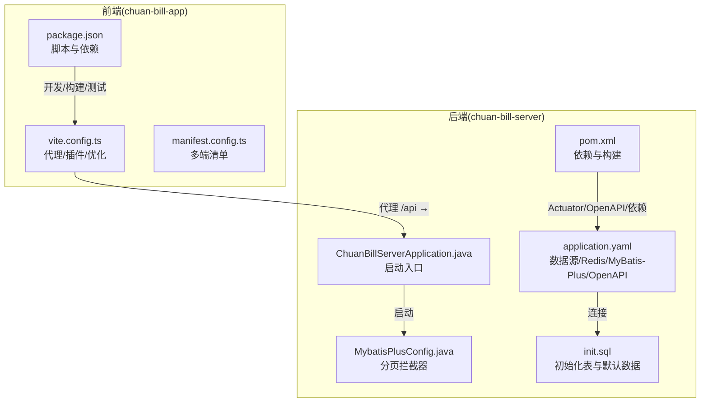
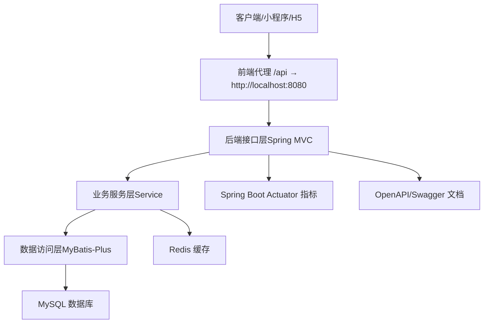
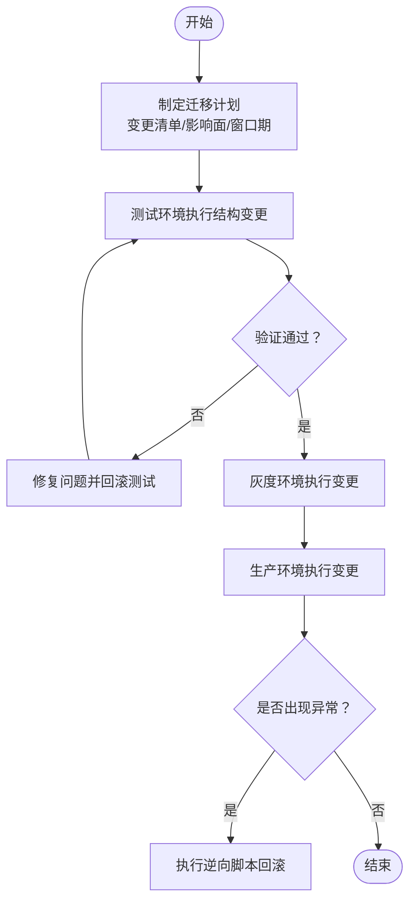
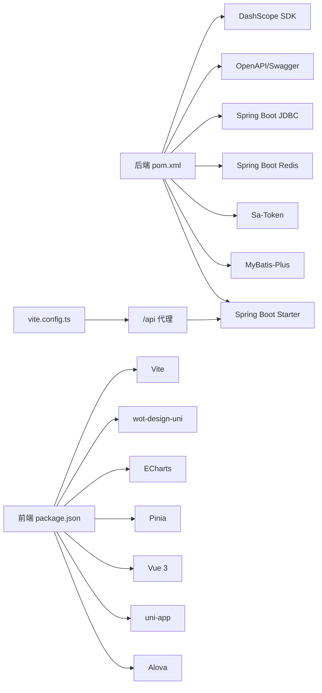
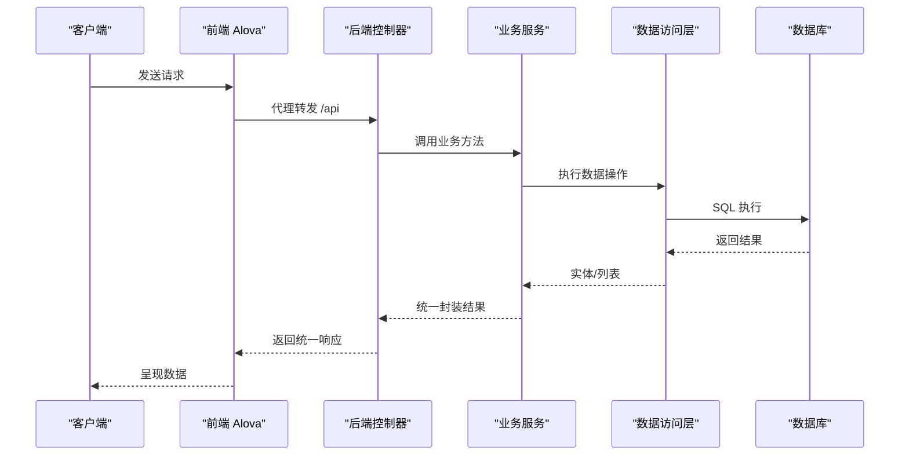

# 维护与升级

<cite>
**本文引用的文件**
- [pom.xml](file://chuan-bill-server/pom.xml)
- [application.yaml](file://chuan-bill-server/src/main/resources/application.yaml)
- [init.sql](file://chuan-bill-server/init.sql)
- [ChuanBillServerApplication.java](file://chuan-bill-server/src/main/java/com/samoy/chuanbillserver/ChuanBillServerApplication.java)
- [MybatisPlusConfig.java](file://chuan-bill-server/src/main/java/com/samoy/chuanbillserver/config/MybatisPlusConfig.java)
- [package.json（根）](file://package.json)
- [package.json（前端）](file://chuan-bill-app/package.json)
- [vite.config.ts](file://chuan-bill-app/vite.config.ts)
- [manifest.config.ts](file://chuan-bill-app/manifest.config.ts)
- [CLAUDE.md](file://CLAUDE.md)
- [PRD.md](file://PRD.md)
- [README.md（前端）](file://chuan-bill-app/README.md)
- [README.md（Mock）](file://chuan-bill-app/src/api/mock/README.md)
- [BillMapper.xml](file://chuan-bill-server/src/main/resources/mapper/BillMapper.xml)
</cite>

## 目录
1. [简介](#简介)
2. [项目结构](#项目结构)
3. [核心组件](#核心组件)
4. [架构总览](#架构总览)
5. [详细组件分析](#详细组件分析)
6. [依赖关系分析](#依赖关系分析)
7. [性能考量](#性能考量)
8. [故障排查指南](#故障排查指南)
9. [结论](#结论)
10. [附录](#附录)

## 简介
本运维文档面向“小川记账”项目的维护与升级，覆盖版本升级策略（前端依赖、后端框架、数据库、第三方服务）、数据迁移方案（结构变更、数据格式迁移、历史数据处理、回滚策略）、监控告警配置（应用/性能/业务/异常）、备份恢复策略（数据库/文件/配置/灾难恢复）、系统维护任务（定期维护、安全补丁、性能优化、容量规划）以及运维工具与自动化脚本、运维文档与知识库建设。文档同时提供架构图、流程图与序列图，帮助技术与非技术读者理解与落地。

## 项目结构
项目采用双端单仓（monorepo）组织方式：
- chuan-bill-app：前端（uni-app/Vue 3/TypeScript，跨平台移动应用）
- chuan-bill-server：后端（Spring Boot 3/Java 17，MySQL + Redis）

根目录提供统一的启动、代码风格检查与并发开发脚本；前端通过 Vite 配置代理指向后端服务；后端通过 Spring Boot Actuator、OpenAPI/Swagger 提供可观测性与接口文档能力。

**图表来源**
- [package.json（根）:1-29](file://package.json#L1-L29)
- [package.json（前端）:1-135](file://chuan-bill-app/package.json#L1-L135)
- [vite.config.ts:1-80](file://chuan-bill-app/vite.config.ts#L1-L80)
- [manifest.config.ts:1-100](file://chuan-bill-app/manifest.config.ts#L1-L100)
- [pom.xml:1-226](file://chuan-bill-server/pom.xml#L1-L226)
- [application.yaml:1-51](file://chuan-bill-server/src/main/resources/application.yaml#L1-L51)
- [ChuanBillServerApplication.java:1-15](file://chuan-bill-server/src/main/java/com/samoy/chuanbillserver/ChuanBillServerApplication.java#L1-L15)
- [MybatisPlusConfig.java:1-18](file://chuan-bill-server/src/main/java/com/samoy/chuanbillserver/config/MybatisPlusConfig.java#L1-L18)
- [init.sql:1-326](file://chuan-bill-server/init.sql#L1-L326)

**章节来源**
- [package.json（根）:1-29](file://package.json#L1-L29)
- [package.json（前端）:1-135](file://chuan-bill-app/package.json#L1-L135)
- [vite.config.ts:1-80](file://chuan-bill-app/vite.config.ts#L1-L80)
- [manifest.config.ts:1-100](file://chuan-bill-app/manifest.config.ts#L1-L100)
- [pom.xml:1-226](file://chuan-bill-server/pom.xml#L1-L226)
- [application.yaml:1-51](file://chuan-bill-server/src/main/resources/application.yaml#L1-L51)
- [ChuanBillServerApplication.java:1-15](file://chuan-bill-server/src/main/java/com/samoy/chuanbillserver/ChuanBillServerApplication.java#L1-L15)
- [MybatisPlusConfig.java:1-18](file://chuan-bill-server/src/main/java/com/samoy/chuanbillserver/config/MybatisPlusConfig.java#L1-L18)
- [init.sql:1-326](file://chuan-bill-server/init.sql#L1-L326)

## 核心组件
- 前端组件
  - 路由与页面：基于文件系统的路由与布局系统，页面位于 src/pages，子包与组件通过插件自动生成与注册。
  - 状态管理：Pinia + 自定义持久化插件，结合全局反馈组件（Toast/Message/Loading）提升交互一致性。
  - API 层：Alova 适配 uni-app，统一响应处理器与 Mock 数据，便于联调与测试。
  - UI 与样式：wot-design-uni 组件库、UnoCSS 原子化样式、ECharts 图表集成。
  - 构建与开发：Vite 配置代理至后端，支持多端构建与开发脚本。
- 后端组件
  - 启动与扫描：Spring Boot 启动类，Mapper 扫描路径配置。
  - ORM 与分页：MyBatis-Plus 分页拦截器（MySQL），软删除字段统一配置。
  - 配置与连接：数据源（MySQL）、缓存（Redis）、OpenAPI/Swagger 文档、DashScope OCR 配置。
  - 监控与可观测：Actuator 指标暴露，便于集成外部监控系统。
- 数据库
  - 初始化脚本包含用户、类目、支付方式、家庭、成员、申请、账单、预算、消息等表，并提供系统默认类目与支付方式数据。

**章节来源**
- [CLAUDE.md:30-47](file://CLAUDE.md#L30-L47)
- [vite.config.ts:1-80](file://chuan-bill-app/vite.config.ts#L1-L80)
- [manifest.config.ts:1-100](file://chuan-bill-app/manifest.config.ts#L1-L100)
- [ChuanBillServerApplication.java:1-15](file://chuan-bill-server/src/main/java/com/samoy/chuanbillserver/ChuanBillServerApplication.java#L1-L15)
- [MybatisPlusConfig.java:1-18](file://chuan-bill-server/src/main/java/com/samoy/chuanbillserver/config/MybatisPlusConfig.java#L1-L18)
- [application.yaml:1-51](file://chuan-bill-server/src/main/resources/application.yaml#L1-L51)
- [init.sql:1-326](file://chuan-bill-server/init.sql#L1-L326)

## 架构总览
前后端分离部署，前端通过 /api 前缀代理访问后端接口；后端通过 Actuator 暴露指标，Swagger/OpenAPI 提供接口文档；数据库与缓存通过环境变量注入，便于容器化与多环境部署。

**图表来源**
- [vite.config.ts:70-78](file://chuan-bill-app/vite.config.ts#L70-L78)
- [application.yaml:1-51](file://chuan-bill-server/src/main/resources/application.yaml#L1-L51)
- [pom.xml:51-169](file://chuan-bill-server/pom.xml#L51-L169)

## 详细组件分析

### 版本升级策略

#### 前端依赖升级
- 依赖管理：使用 pnpm，版本锁定在根与前端 package.json 中；建议通过标准版本工具进行语义化版本管理。
- 升级流程
  - 评估：对比依赖差异，关注破坏性变更与废弃 API。
  - 本地验证：运行开发与构建脚本，确保无编译/运行错误。
  - 联调：开启 Mock 或连接后端测试环境，验证核心功能。
  - 回归：全量功能回归测试，重点检查 UI 组件、图表、路由与多端构建。
- 注意事项
  - 组件库与 UI 框架升级需关注主题与样式兼容。
  - 图表与 ECharts 升级需验证渲染与交互。
  - 多端构建（微信/百度/字节/支付宝等）需逐一验证。

**章节来源**
- [package.json（前端）:1-135](file://chuan-bill-app/package.json#L1-L135)
- [manifest.config.ts:1-100](file://chuan-bill-app/manifest.config.ts#L1-L100)
- [vite.config.ts:1-80](file://chuan-bill-app/vite.config.ts#L1-L80)
- [CLAUDE.md:19-25](file://CLAUDE.md#L19-L25)

#### 后端框架升级
- 升级目标：Spring Boot 3、Java 17、MyBatis-Plus、Sa-Token、OpenAPI/Swagger 等。
- 升级流程
  - 版本对齐：统一父工程与 BOM，核对各组件兼容矩阵。
  - 依赖替换：逐步替换 starter 与依赖版本，避免混合版本导致的冲突。
  - 运行验证：启动应用，检查 Actuator 指标、Swagger 文档、认证与缓存。
  - 数据层：确认分页拦截器与软删除配置在新版本下行为一致。
- 注意事项
  - Actuator 与健康检查需在新版本下重新校验。
  - Sa-Token 与 Redis 集成需确认连接池与序列化兼容。
  - OpenAPI/Swagger UI 路径与启用开关需与配置一致。

**章节来源**
- [pom.xml:1-226](file://chuan-bill-server/pom.xml#L1-L226)
- [application.yaml:1-51](file://chuan-bill-server/src/main/resources/application.yaml#L1-L51)
- [MybatisPlusConfig.java:1-18](file://chuan-bill-server/src/main/java/com/samoy/chuanbillserver/config/MybatisPlusConfig.java#L1-L18)
- [ChuanBillServerApplication.java:1-15](file://chuan-bill-server/src/main/java/com/samoy/chuanbillserver/ChuanBillServerApplication.java#L1-L15)

#### 数据库版本升级
- 当前版本：MySQL 驱动与连接池、MyBatis-Plus 分页插件已配置。
- 升级流程
  - 评估：确定 MySQL 版本与字符集/排序规则，确保与 init.sql 兼容。
  - 迁移：先在测试环境执行 init.sql，再在生产灰度执行结构变更脚本。
  - 校验：验证索引、唯一约束、默认值与触发器（如有）。
- 注意事项
  - 字符集 utf8mb4 与排序规则需保持一致。
  - 软删除字段 deleted 需在迁移后统一生效。

**章节来源**
- [pom.xml:97-107](file://chuan-bill-server/pom.xml#L97-L107)
- [application.yaml:4-8](file://chuan-bill-server/src/main/resources/application.yaml#L4-L8)
- [init.sql:1-326](file://chuan-bill-server/init.sql#L1-L326)

#### 第三方服务升级
- DashScope OCR：通过环境变量注入 API Key 与 App ID，升级时需同步更新密钥与配置项。
- 升级流程
  - 获取最新 SDK 版本与配置项。
  - 在测试环境验证 OCR 能力与返回结构。
  - 切换生产配置并监控调用成功率与耗时。
- 注意事项
  - 配置项命名与默认值需与后端配置保持一致。
  - 对 OCR 失败与网络异常进行兜底处理。

**章节来源**
- [application.yaml:48-51](file://chuan-bill-server/src/main/resources/application.yaml#L48-L51)
- [pom.xml:128-134](file://chuan-bill-server/pom.xml#L128-L134)

### 数据迁移方案

#### 数据库结构变更
- 变更类型：新增/删除/修改表与字段、索引重建、默认值与约束调整。
- 迁移策略
  - 渐进式：先在测试环境执行结构变更脚本，再灰度到生产。
  - 兼容性：保留向后兼容字段，逐步淘汰旧字段。
  - 回滚：准备逆向脚本，确保回滚不丢失数据。
- 关键点
  - 软删除字段 deleted 需统一生效。
  - 唯一索引与复合索引需在变更后校验唯一性。

**图表来源**
- [init.sql:1-326](file://chuan-bill-server/init.sql#L1-L326)
- [MybatisPlusConfig.java:1-18](file://chuan-bill-server/src/main/java/com/samoy/chuanbillserver/config/MybatisPlusConfig.java#L1-L18)

**章节来源**
- [init.sql:1-326](file://chuan-bill-server/init.sql#L1-L326)
- [MybatisPlusConfig.java:1-18](file://chuan-bill-server/src/main/java/com/samoy/chuanbillserver/config/MybatisPlusConfig.java#L1-L18)

#### 数据格式迁移
- 示例：类目与支付方式的系统默认数据迁移。
- 流程
  - 生成迁移脚本，包含插入/更新/删除逻辑。
  - 在测试环境验证数据正确性与业务一致性。
  - 生产灰度执行，观察业务报表与统计结果。
- 回滚策略：保留备份数据，必要时回退到上一个版本的数据快照。

**章节来源**
- [init.sql:204-326](file://chuan-bill-server/init.sql#L204-L326)

#### 历史数据处理
- 历史账单与预算：迁移后需校验历史数据的时间索引与聚合统计。
- 会员与家庭：成员加入/退出历史需保持可追溯性。
- 处理建议：在迁移前后分别导出快照，便于审计与回溯。

**章节来源**
- [init.sql:130-201](file://chuan-bill-server/init.sql#L130-L201)

#### 回滚策略
- 结构回滚：执行逆向 DDL 脚本，恢复索引与约束。
- 数据回滚：基于备份快照回滚到迁移前状态。
- 配置回滚：回退环境变量与配置文件，重启服务验证。

**章节来源**
- [application.yaml:1-51](file://chuan-bill-server/src/main/resources/application.yaml#L1-L51)

### 监控告警配置

#### 应用监控
- 指标暴露：启用 Actuator，收集 JVM、HTTP 请求、业务指标。
- 监控系统：Prometheus/Grafana/Alertmanager 或云监控平台接入。
- 关键指标：请求量、错误率、响应时间、内存/CPU、数据库连接数、Redis 连接数。

**章节来源**
- [pom.xml:53-56](file://chuan-bill-server/pom.xml#L53-L56)
- [application.yaml:1-51](file://chuan-bill-server/src/main/resources/application.yaml#L1-L51)

#### 性能监控
- 前端：Vite 构建产物体积与分包策略，ECharts 渲染性能。
- 后端：慢查询日志、分页查询优化、缓存命中率、连接池使用率。
- 建议：结合 APM 工具（如 SkyWalking/Zipkin）追踪链路。

**章节来源**
- [vite.config.ts:1-80](file://chuan-bill-app/vite.config.ts#L1-L80)
- [pom.xml:80-96](file://chuan-bill-server/pom.xml#L80-L96)

#### 业务监控
- 业务指标：账单创建/更新/删除次数、家庭成员变动、预算使用率。
- 告警阈值：异常波动（如 3σ）与阈值告警（如超预算比例）。
- 可视化：Grafana 仪表盘展示关键业务看板。

**章节来源**
- [PRD.md:77-95](file://PRD.md#L77-L95)

#### 异常告警
- 日志：统一日志采集与分级（ERROR/WARN/INFO），异常堆栈与上下文。
- 告警：基于日志与指标阈值触发，支持钉钉/企业微信/邮件通知。
- 处理：建立值班与应急响应流程，缩短 MTTR。

**章节来源**
- [CLAUDE.md:57-66](file://CLAUDE.md#L57-L66)

### 备份恢复策略

#### 数据库备份
- 全量/增量备份：mysqldump/LTO/Percona XtraBackup。
- 策略：每日全备+每小时增量，保留7-14天。
- 验证：定期抽样恢复演练，验证备份可用性。

**章节来源**
- [application.yaml:4-8](file://chuan-bill-server/src/main/resources/application.yaml#L4-L8)

#### 文件备份
- 前端静态资源与构建产物：版本化存储于对象存储或 CDN。
- 配置文件：敏感配置通过环境变量注入，非敏感配置纳入版本管理。

**章节来源**
- [manifest.config.ts:1-100](file://chuan-bill-app/manifest.config.ts#L1-L100)

#### 配置备份
- 环境变量：生产环境通过密钥管理服务注入（如 KMS/Vault）。
- 配置文件：application.yaml 与各端清单文件纳入版本控制。

**章节来源**
- [application.yaml:1-51](file://chuan-bill-server/src/main/resources/application.yaml#L1-L51)
- [manifest.config.ts:1-100](file://chuan-bill-app/manifest.config.ts#L1-L100)

#### 灾难恢复流程
- RTO/RPO：明确恢复时间与数据丢失容忍度。
- 流程：隔离故障、切换流量、恢复数据库、回放日志、验证业务。
- 文档：形成 SOP 并定期演练。

**章节来源**
- [CLAUDE.md:63-66](file://CLAUDE.md#L63-L66)

### 系统维护任务

#### 定期维护
- 数据库：索引维护、统计信息更新、日志轮转。
- 缓存：定期清理过期键、监控容量与命中率。
- 依赖：季度依赖审计与安全漏洞扫描。

**章节来源**
- [pom.xml:1-226](file://chuan-bill-server/pom.xml#L1-L226)
- [application.yaml:9-22](file://chuan-bill-server/src/main/resources/application.yaml#L9-L22)

#### 安全补丁
- 后端：Spring Security、MyBatis-Plus、Sa-Token、Redis 官方公告。
- 前端：组件库与构建工具安全通告，及时升级。

**章节来源**
- [pom.xml:62-73](file://chuan-bill-server/pom.xml#L62-L73)
- [package.json（前端）:88-125](file://chuan-bill-app/package.json#L88-L125)

#### 性能优化
- 查询优化：索引覆盖、分页优化、避免 N+1。
- 缓存策略：热点数据缓存、多级缓存、失效策略。
- 前端：分包与懒加载、图片压缩、CDN 加速。

**章节来源**
- [MybatisPlusConfig.java:1-18](file://chuan-bill-server/src/main/java/com/samoy/chuanbillserver/config/MybatisPlusConfig.java#L1-L18)
- [vite.config.ts:1-80](file://chuan-bill-app/vite.config.ts#L1-L80)

#### 容量规划
- 评估：用户规模、数据增长、查询峰值、并发连接。
- 规划：数据库与缓存扩容、横向扩展与读写分离。

**章节来源**
- [application.yaml:9-22](file://chuan-bill-server/src/main/resources/application.yaml#L9-L22)

### 运维工具与自动化

#### 运维工具
- 代码质量：ESLint（前端）、Spotless（后端）。
- 构建与测试：Vite（前端）、Maven（后端）、单元测试。
- 版本管理：standard-version（前端）、语义化版本。

**章节来源**
- [package.json（根）:6-16](file://package.json#L6-L16)
- [package.json（前端）:115-124](file://chuan-bill-app/package.json#L115-L124)
- [pom.xml:197-221](file://chuan-bill-server/pom.xml#L197-L221)

#### 自动化脚本
- 启动：根脚本并发启动前端与后端。
- Lint：统一 lint 与修复命令。
- 构建：多端构建脚本，按平台输出产物。

**章节来源**
- [package.json（根）:6-16](file://package.json#L6-L16)
- [package.json（前端）:11-56](file://chuan-bill-app/package.json#L11-L56)

#### 运维文档与知识库
- 文档：PRD、CLAUDE.md、README、Mock 使用说明。
- 知识库：FAQ、升级记录、故障案例、最佳实践。

**章节来源**
- [PRD.md:1-168](file://PRD.md#L1-L168)
- [CLAUDE.md:1-78](file://CLAUDE.md#L1-L78)
- [README.md（前端）:1-116](file://chuan-bill-app/README.md#L1-L116)
- [README.md（Mock）:1-108](file://chuan-bill-app/src/api/mock/README.md#L1-L108)

## 依赖关系分析

**图表来源**
- [pom.xml:51-169](file://chuan-bill-server/pom.xml#L51-L169)
- [package.json（前端）:57-87](file://chuan-bill-app/package.json#L57-L87)
- [vite.config.ts:70-78](file://chuan-bill-app/vite.config.ts#L70-L78)

**章节来源**
- [pom.xml:1-226](file://chuan-bill-server/pom.xml#L1-L226)
- [package.json（前端）:1-135](file://chuan-bill-app/package.json#L1-L135)
- [vite.config.ts:1-80](file://chuan-bill-app/vite.config.ts#L1-L80)

## 性能考量
- 前端
  - 构建优化：按需加载、分包策略、Tree Shaking。
  - 运行优化：组件懒加载、图片压缩、CDN。
- 后端
  - 数据库：索引优化、分页与 LIMIT、连接池参数调优。
  - 缓存：热点数据缓存、多级缓存、合理过期策略。
  - 监控：指标采集与告警，瓶颈定位。

[本节为通用指导，无需特定文件来源]

## 故障排查指南
- 启动失败
  - 检查数据库连接与 Redis 连接字符串与凭据。
  - 查看 Actuator 指标与日志，定位依赖冲突。
- 接口异常
  - 核对统一响应包装与异常处理类。
  - 检查 Sa-Token 认证与 Redis 会话状态。
- 前端联调
  - 确认 /api 代理配置与后端 CORS。
  - 使用 Mock 数据验证接口契约。

**章节来源**
- [application.yaml:1-51](file://chuan-bill-server/src/main/resources/application.yaml#L1-L51)
- [CLAUDE.md:42-47](file://CLAUDE.md#L42-L47)
- [vite.config.ts:70-78](file://chuan-bill-app/vite.config.ts#L70-L78)

## 结论
通过标准化的升级流程、完善的迁移与回滚策略、系统化的监控告警、严格的备份恢复与容量规划，以及自动化工具与知识库建设，“小川记账”可在演进过程中保持稳定性与可维护性。建议将本文档作为日常运维的行动指南，并结合实际环境持续迭代。

[本节为总结，无需特定文件来源]

## 附录

### API 调用序列示意（概念图）

[本图为概念示意，无需图表来源]