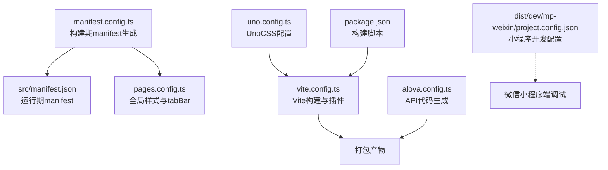
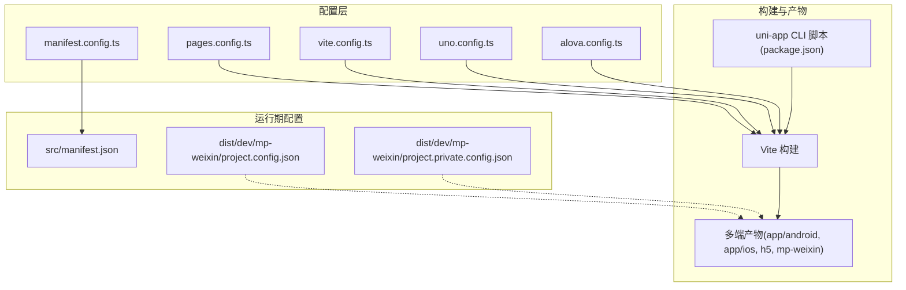
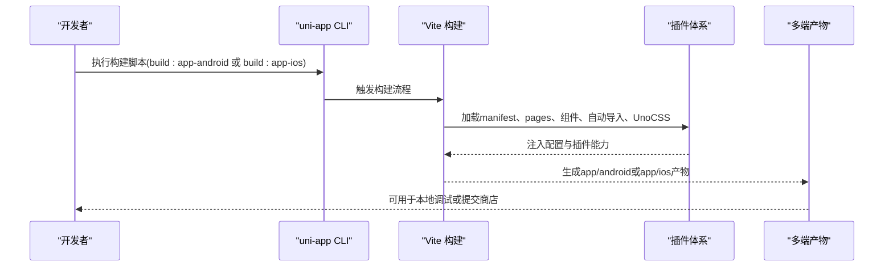
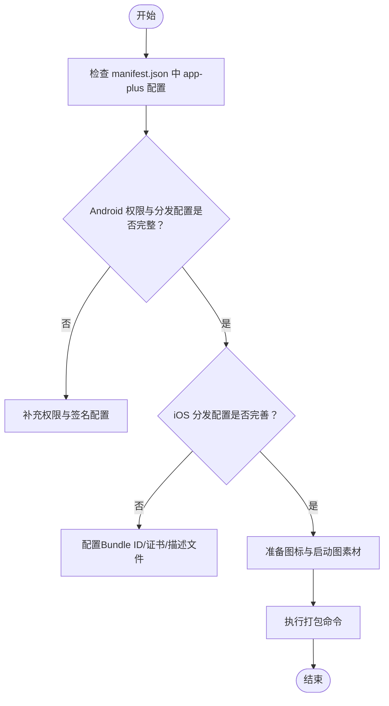
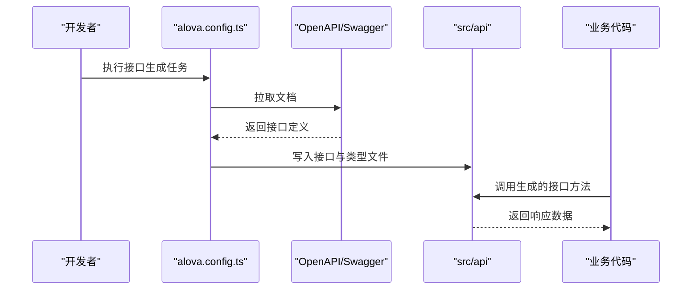
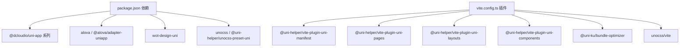

# APP原生应用部署

<cite>
**本文引用的文件**   
- [manifest.config.ts](file://chuan-bill-app/manifest.config.ts)
- [package.json](file://chuan-bill-app/package.json)
- [src/manifest.json](file://chuan-bill-app/src/manifest.json)
- [pages.config.ts](file://chuan-bill-app/pages.config.ts)
- [vite.config.ts](file://chuan-bill-app/vite.config.ts)
- [uno.config.ts](file://chuan-bill-app/uno.config.ts)
- [alova.config.ts](file://chuan-bill-app/alova.config.ts)
- [dist/dev/mp-weixin/project.config.json](file://chuan-bill-app/dist/dev/mp-weixin/project.config.json)
- [dist/dev/mp-weixin/project.private.config.json](file://chuan-bill-app/dist/dev/mp-weixin/project.private.config.json)
- [README.md](file://chuan-bill-app/README.md)
</cite>

## 目录
1. [简介](#简介)
2. [项目结构](#项目结构)
3. [核心组件](#核心组件)
4. [架构总览](#架构总览)
5. [详细组件分析](#详细组件分析)
6. [依赖分析](#依赖分析)
7. [性能考量](#性能考量)
8. [故障排查指南](#故障排查指南)
9. [结论](#结论)
10. [附录](#附录)

## 简介
本指南面向“小川记账”APP在原生应用平台（Android/iOS）的部署与发布，结合当前仓库中的uni-app配置与脚本，系统讲解以下内容：
- 构建配置与打包流程：HBuilderX打包、命令行打包、自动化CI/CD集成要点
- 签名证书与发布配置：Android与iOS差异、权限清单、图标与启动图准备
- 应用商店发布策略：应用宝、华为应用市场、小米应用商店、苹果App Store的审核与发布流程
- 性能优化：启动速度、内存、电量、网络请求优化
- 应用更新机制：热更新与增量更新的设计思路与版本兼容性处理

## 项目结构
该仓库采用uni-app多端统一工程，核心目录与文件如下：
- 构建与配置
  - manifest.config.ts：用于生成各端manifest的配置入口（含app-plus分发配置）
  - src/manifest.json：运行期manifest（包含启动页、权限、模块等）
  - pages.config.ts：全局样式与tabBar配置
  - vite.config.ts：Vite构建与插件体系
  - uno.config.ts：UnoCSS原子化样式配置
  - alova.config.ts：API接口代码生成与自动更新配置
- 运行与调试
  - package.json：脚本命令（dev/build、多端构建）
  - dist/dev/mp-weixin/project.config.json、project.private.config.json：微信小程序端开发配置
- 文档与生态
  - README.md：特性与周边生态说明

**图表来源**
- [manifest.config.ts:12-99](file://chuan-bill-app/manifest.config.ts#L12-L99)
- [src/manifest.json:1-84](file://chuan-bill-app/src/manifest.json#L1-L84)
- [pages.config.ts:1-43](file://chuan-bill-app/pages.config.ts#L1-L43)
- [vite.config.ts:17-79](file://chuan-bill-app/vite.config.ts#L17-L79)
- [uno.config.ts:10-37](file://chuan-bill-app/uno.config.ts#L10-L37)
- [alova.config.ts:8-84](file://chuan-bill-app/alova.config.ts#L8-L84)
- [package.json:11-55](file://chuan-bill-app/package.json#L11-L55)
- [dist/dev/mp-weixin/project.config.json:1-36](file://chuan-bill-app/dist/dev/mp-weixin/project.config.json#L1-L36)

**章节来源**
- [manifest.config.ts:12-99](file://chuan-bill-app/manifest.config.ts#L12-L99)
- [src/manifest.json:1-84](file://chuan-bill-app/src/manifest.json#L1-L84)
- [pages.config.ts:1-43](file://chuan-bill-app/pages.config.ts#L1-L43)
- [vite.config.ts:17-79](file://chuan-bill-app/vite.config.ts#L17-L79)
- [uno.config.ts:10-37](file://chuan-bill-app/uno.config.ts#L10-L37)
- [alova.config.ts:8-84](file://chuan-bill-app/alova.config.ts#L8-L84)
- [package.json:11-55](file://chuan-bill-app/package.json#L11-L55)
- [dist/dev/mp-weixin/project.config.json:1-36](file://chuan-bill-app/dist/dev/mp-weixin/project.config.json#L1-L36)

## 核心组件
- 构建与打包
  - 使用uni-app CLI脚本进行多端构建与开发，支持app-android、app-ios等目标平台
  - Vite作为构建引擎，集成页面、布局、组件、自动导入、UnoCSS等插件
- 运行期配置
  - manifest.json集中管理应用元数据、权限、模块、分发配置
  - pages.config.ts统一导航栏与tabBar样式
- 网络与接口
  - Alova配置用于从OpenAPI/Swagger生成接口代码，并支持自动更新
- 样式与主题
  - UnoCSS按需生成样式，支持主题变量与暗黑模式

**章节来源**
- [package.json:11-55](file://chuan-bill-app/package.json#L11-L55)
- [vite.config.ts:22-69](file://chuan-bill-app/vite.config.ts#L22-L69)
- [src/manifest.json:8-42](file://chuan-bill-app/src/manifest.json#L8-L42)
- [pages.config.ts:5-20](file://chuan-bill-app/pages.config.ts#L5-L20)
- [alova.config.ts:8-84](file://chuan-bill-app/alova.config.ts#L8-L84)
- [uno.config.ts:10-37](file://chuan-bill-app/uno.config.ts#L10-L37)

## 架构总览
下图展示了从配置到构建、再到多端产物的关键路径。

**图表来源**
- [manifest.config.ts:12-99](file://chuan-bill-app/manifest.config.ts#L12-L99)
- [pages.config.ts:1-43](file://chuan-bill-app/pages.config.ts#L1-L43)
- [vite.config.ts:17-79](file://chuan-bill-app/vite.config.ts#L17-L79)
- [uno.config.ts:10-37](file://chuan-bill-app/uno.config.ts#L10-L37)
- [alova.config.ts:8-84](file://chuan-bill-app/alova.config.ts#L8-L84)
- [package.json:11-55](file://chuan-bill-app/package.json#L11-L55)
- [src/manifest.json:1-84](file://chuan-bill-app/src/manifest.json#L1-L84)
- [dist/dev/mp-weixin/project.config.json:1-36](file://chuan-bill-app/dist/dev/mp-weixin/project.config.json#L1-L36)
- [dist/dev/mp-weixin/project.private.config.json:1-22](file://chuan-bill-app/dist/dev/mp-weixin/project.private.config.json#L1-L22)

## 详细组件分析

### 构建与打包流程
- 命令行打包
  - 使用uni-app CLI脚本进行多端构建与开发，例如：
    - 开发：dev:app、dev:app-android、dev:app-ios
    - 生产：build:app、build:app-android、build:app-ios
  - Vite作为构建引擎，集成页面、布局、组件、自动导入、UnoCSS等插件
- HBuilderX打包
  - 在HBuilderX中打开项目，选择对应平台进行打包；本仓库已提供完整的manifest与pages配置，确保打包时可正确识别权限、模块与分发设置
- 自动化CI/CD集成
  - 可在CI中执行构建脚本，输出多端产物；注意在CI环境安装Node与依赖后再执行构建

**图表来源**
- [package.json:11-55](file://chuan-bill-app/package.json#L11-L55)
- [vite.config.ts:22-69](file://chuan-bill-app/vite.config.ts#L22-L69)
- [manifest.config.ts:12-99](file://chuan-bill-app/manifest.config.ts#L12-L99)
- [pages.config.ts:1-43](file://chuan-bill-app/pages.config.ts#L1-L43)

**章节来源**
- [package.json:11-55](file://chuan-bill-app/package.json#L11-L55)
- [vite.config.ts:17-79](file://chuan-bill-app/vite.config.ts#L17-L79)

### 签名证书与发布配置
- Android
  - 权限清单已在manifest中声明，包含网络状态、相机、振动、唤醒锁等权限
  - 分发配置位于app-plus.distribute.android.permissions，打包时会写入AndroidManifest
  - 发布前需生成并配置签名证书（keystore），并在HBuilderX或命令行指定签名信息
- iOS
  - 分发配置位于app-plus.distribute.ios，当前为空；发布前需在HBuilderX中配置Bundle ID、开发者账号、描述文件与签名证书
- 图标与启动图
  - 启动页配置位于app-plus.splashscreen，包含延时、等待、自动关闭等参数
  - 图标与启动图素材需按目标平台分辨率准备，并在HBuilderX中配置

**图表来源**
- [src/manifest.json:8-42](file://chuan-bill-app/src/manifest.json#L8-L42)
- [manifest.config.ts:34-58](file://chuan-bill-app/manifest.config.ts#L34-L58)

**章节来源**
- [src/manifest.json:8-42](file://chuan-bill-app/src/manifest.json#L8-L42)
- [manifest.config.ts:34-58](file://chuan-bill-app/manifest.config.ts#L34-L58)

### 应用商店发布策略
- 应用宝（腾讯应用宝）
  - 上传Android APK，确保签名一致、权限合理、无敏感权限滥用
  - 提交前核对应用名称、图标、截图、隐私政策链接
- 华为应用市场
  - 上传APK或AppGallery Connect，按要求填写元数据、截图、视频
  - 关注权限与隐私合规，确保符合华为审核规范
- 小米应用商店
  - 上传APK，完善应用信息、截图与隐私政策
  - 注意权限最小化原则，避免过度申请敏感权限
- 苹果App Store
  - 需要Apple Developer账号，配置Bundle ID、证书与描述文件
  - 提交前完成TestFlight内测、App Store Connect元数据与截图
  - 审核关注隐私标签、权限说明与功能稳定性

[本节为通用发布策略说明，不直接分析具体文件，故无“章节来源”]

### 应用更新机制设计
- 热更新与增量更新
  - 可通过uni-app的热更新能力实现远程资源替换；需在manifest中配置热更新开关与校验参数
  - 增量更新可通过差分包策略实现，需服务端生成并下发校验信息
- 版本兼容性
  - 严格遵循语义化版本号，重大变更需提升主版本
  - 对不兼容的API或UI变更，提供迁移指引与降级策略

[本节为通用机制说明，不直接分析具体文件，故无“章节来源”]

### 网络与接口配置
- 接口代码生成
  - 通过alova.config.ts从Swagger/OpenAPI生成接口代码，默认输出至src/api
  - 支持自动更新，可在编辑器启动时或定时检查更新
- 请求适配
  - 使用@alova/adapter-uniapp进行请求适配，结合拦截器与中间件实现统一错误处理与鉴权

**图表来源**
- [alova.config.ts:8-84](file://chuan-bill-app/alova.config.ts#L8-L84)

**章节来源**
- [alova.config.ts:8-84](file://chuan-bill-app/alova.config.ts#L8-L84)

### 页面与主题配置
- 全局样式与tabBar
  - pages.config.ts统一设置导航栏、背景、动画与tabBar列表
  - 支持条件编译（如MP-ALIPAY）以适配不同平台的tabBar行为
- 主题与暗黑模式
  - h5与小程序端启用暗黑模式与主题位置配置，便于统一视觉风格

**章节来源**
- [pages.config.ts:5-20](file://chuan-bill-app/pages.config.ts#L5-L20)
- [src/manifest.json:50-83](file://chuan-bill-app/src/manifest.json#L50-L83)

## 依赖分析
- 构建与插件
  - @uni-helper系列插件负责manifest、pages、layouts、components的自动化
  - @uni-ku/bundle-optimizer用于小程序端的体积优化
  - UnoCSS提供原子化样式能力
- 运行时依赖
  - @dcloudio/uni-app及各端适配包
  - Alova用于高效网络请求
  - wot-design-uni提供UI组件库

**图表来源**
- [package.json:57-86](file://chuan-bill-app/package.json#L57-L86)
- [vite.config.ts:22-69](file://chuan-bill-app/vite.config.ts#L22-L69)

**章节来源**
- [package.json:57-86](file://chuan-bill-app/package.json#L57-L86)
- [vite.config.ts:22-69](file://chuan-bill-app/vite.config.ts#L22-L69)

## 性能考量
- 启动速度优化
  - 启动页配置合理，避免过长等待；减少首屏非关键资源加载
  - 使用分包策略（小程序端已开启子包优化）
- 内存管理
  - 避免全局大对象长期持有；及时释放定时器与事件监听
- 电量消耗控制
  - 合理使用后台任务与定位、相机等高耗电能力，按需申请与关闭
- 网络请求优化
  - 使用Alova的缓存与并发控制；对长列表与图片懒加载，减少首屏压力

[本节为通用性能指导，不直接分析具体文件，故无“章节来源”]

## 故障排查指南
- 构建失败
  - 检查Node版本与依赖安装；确认Vite插件配置未冲突
- 权限与模块缺失
  - 核对manifest.json中的app-plus.modules与distribute.android.permissions
- 小程序端调试异常
  - 检查project.config.json与project.private.config.json中的编译选项与调试开关
- 接口生成问题
  - 确认alova.config.ts中OpenAPI地址可达，平台与版本配置正确

**章节来源**
- [src/manifest.json:8-42](file://chuan-bill-app/src/manifest.json#L8-L42)
- [dist/dev/mp-weixin/project.config.json:1-36](file://chuan-bill-app/dist/dev/mp-weixin/project.config.json#L1-L36)
- [dist/dev/mp-weixin/project.private.config.json:1-22](file://chuan-bill-app/dist/dev/mp-weixin/project.private.config.json#L1-L22)
- [alova.config.ts:8-84](file://chuan-bill-app/alova.config.ts#L8-L84)

## 结论
本指南基于仓库现有配置，给出了uni-app在原生应用平台的构建、签名、发布与优化实践。实际发布前仍需根据各应用商店的具体要求完善元数据与合规材料，并在CI环境中验证构建与打包流程。

## 附录
- 开发与构建脚本参考
  - 开发：dev:app、dev:app-android、dev:app-ios
  - 生产：build:app、build:app-android、build:app-ios
- 相关生态与文档
  - README.md中列举了周边生态与在线文档，可作为进一步学习的入口

**章节来源**
- [package.json:11-55](file://chuan-bill-app/package.json#L11-L55)
- [README.md:16-46](file://chuan-bill-app/README.md#L16-L46)