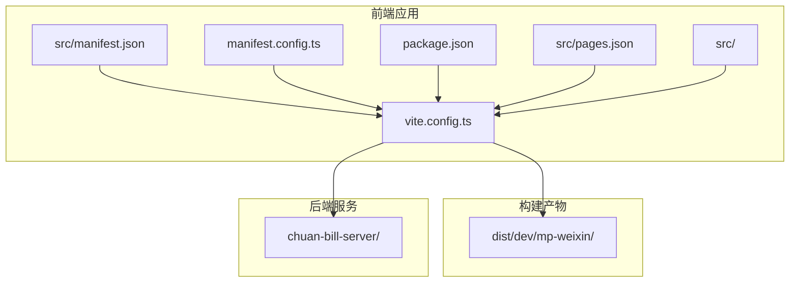
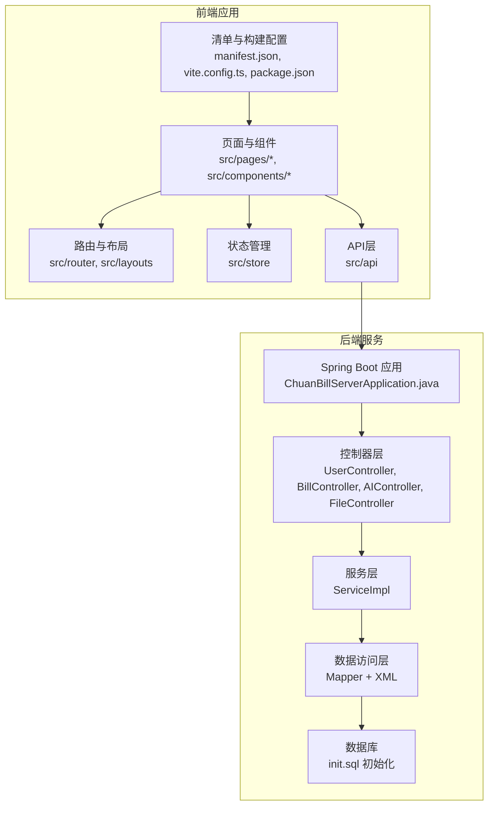
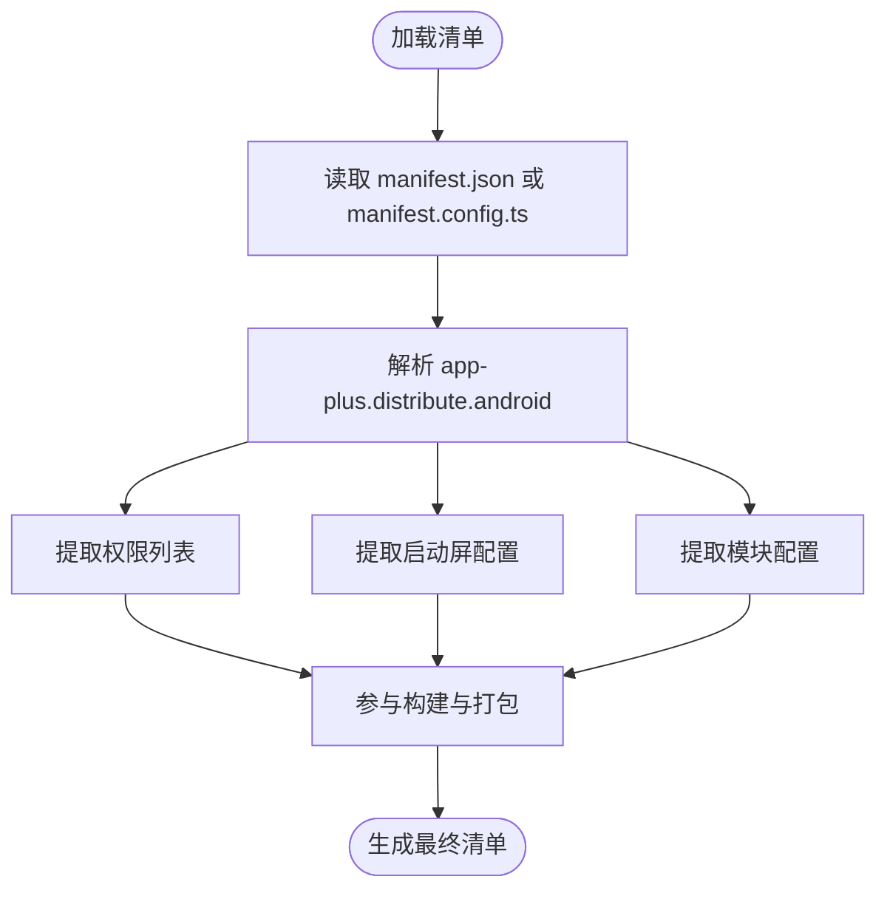
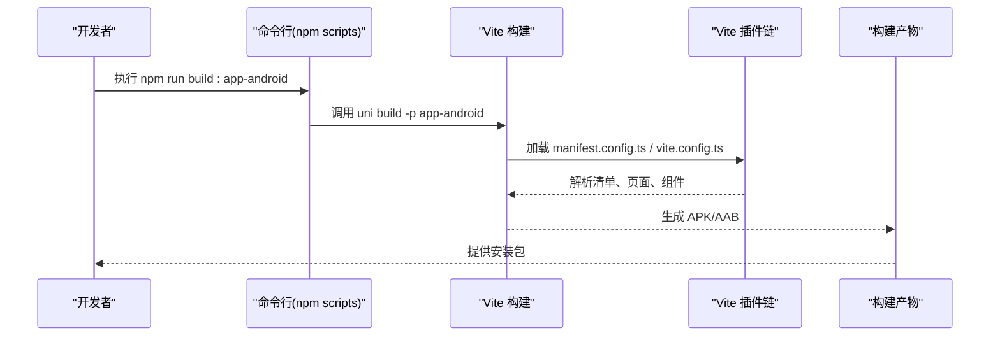
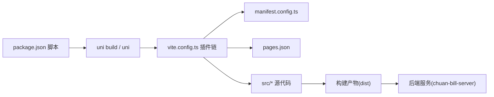

# Android应用部署

<cite>
**本文引用的文件**
- [manifest.json](file://chuan-bill-app/src/manifest.json)
- [manifest.config.ts](file://chuan-bill-app/manifest.config.ts)
- [package.json](file://chuan-bill-app/package.json)
- [vite.config.ts](file://chuan-bill-app/vite.config.ts)
- [pages.json](file://chuan-bill-app/src/pages.json)
- [app.vue](file://chuan-bill-app/src/App.vue)
- [main.ts](file://chuan-bill-app/src/main.ts)
- [pages.config.ts](file://chuan-bill-app/pages.config.ts)
- [mini.project.json](file://chuan-bill-app/src/mini.project.json)
- [project.config.json](file://chuan-bill-app/dist/dev/mp-weixin/project.config.json)
- [project.private.config.json](file://chuan-bill-app/dist/dev/mp-weixin/project.private.config.json)
- [theme.json](file://chuan-bill-app/src/theme.json)
- [pages/bill/index.vue](file://chuan-bill-app/src/pages/bill/index.vue)
- [pages/statistics/index.vue](file://chuan-bill-app/src/pages/statistics/index.vue)
- [pages/family/index.vue](file://chuan-bill-app/src/pages/family/index.vue)
- [pages/mine/index.vue](file://chuan-bill-app/src/pages/mine/index.vue)
- [composables/useTabbar.ts](file://chuan-bill-app/src/composables/useTabbar.ts)
- [layouts/tabbar.vue](file://chuan-bill-app/src/layouts/tabbar.vue)
- [customize-tab-bar/index.axml](file://chuan-bill-app/src/customize-tab-bar/index.axml)
- [customize-tab-bar/index.js](file://chuan-bill-app/src/customize-tab-bar/index.js)
- [components/PrivacyPopup.vue](file://chuan-bill-app/src/components/PrivacyPopup.vue)
- [components/GlobalToast.vue](file://chuan-bill-app/src/components/GlobalToast.vue)
- [components/GlobalMessage.vue](file://chuan-bill-app/src/components/GlobalMessage.vue)
- [components/GlobalLoading.vue](file://chuan-bill-app/src/components/GlobalLoading.vue)
- [store/themeStore.ts](file://chuan-bill-app/src/store/themeStore.ts)
- [store/manualThemeStore.ts](file://chuan-bill-app/src/store/manualThemeStore.ts)
- [router/index.ts](file://chuan-bill-app/src/router/index.ts)
- [utils/index.ts](file://chuan-bill-app/src/utils/index.ts)
- [api/createApis.ts](file://chuan-bill-app/src/api/createApis.ts)
- [api/core/instance.ts](file://chuan-bill-app/src/api/core/instance.ts)
- [api/core/handlers.ts](file://chuan-bill-app/src/api/core/handlers.ts)
- [api/core/middleware.ts](file://chuan-bill-app/src/api/core/middleware.ts)
- [alova.config.ts](file://chuan-bill-app/alova.config.ts)
- [chuan-bill-server/ChuanBillServerApplication.java](file://chuan-bill-server/src/main/java/com/samoy/chuanbillserver/ChuanBillServerApplication.java)
- [chuan-bill-server/application.yaml](file://chuan-bill-server/src/main/resources/application.yaml)
- [chuan-bill-server/UserController.java](file://chuan-bill-server/src/main/java/com/samoy/chuanbillserver/controller/UserController.java)
- [chuan-bill-server/BillController.java](file://chuan-bill-server/src/main/java/com/samoy/chuanbillserver/controller/BillController.java)
- [chuan-bill-server/FileController.java](file://chuan-bill-server/src/main/java/com/samoy/chuanbillserver/controller/FileController.java)
- [chuan-bill-server/AIController.java](file://chuan-bill-server/src/main/java/com/samoy/chuanbillserver/controller/AIController.java)
- [chuan-bill-server/init.sql](file://chuan-bill-server/init.sql)
- [chuan-bill-server/pom.xml](file://chuan-bill-server/pom.xml)
</cite>

## 目录
1. [简介](#简介)
2. [项目结构](#项目结构)
3. [核心组件](#核心组件)
4. [架构总览](#架构总览)
5. [详细组件分析](#详细组件分析)
6. [依赖关系分析](#依赖关系分析)
7. [性能考虑](#性能考虑)
8. [故障排查指南](#故障排查指南)
9. [结论](#结论)
10. [附录](#附录)

## 简介
本指南面向“小川记账”Android应用的部署与发布，基于当前仓库中提供的uni-app工程配置与脚本，系统讲解Android平台的构建配置、签名证书生成与配置、打包流程（含HBuilderX向导与命令行）、Google Play商店发布流程、性能优化建议以及权限申请最佳实践与常见问题处理。文档严格依据仓库中的实际配置文件进行说明，避免臆测。

## 项目结构
该仓库采用uni-app多端统一开发框架，Android应用通过HBuilderX或命令行工具进行构建与打包。关键目录与文件如下：
- 构建与配置
  - manifest.json：应用清单与各平台配置入口
  - manifest.config.ts：基于vite插件的manifest定义文件
  - package.json：构建脚本与依赖管理
  - vite.config.ts：Vite构建配置与插件链
  - pages.json：页面路由与分包配置
- 应用代码
  - src/：源代码目录，包含页面、组件、路由、状态管理、API等
  - dist/dev/mp-weixin/：微信开发者工具预览产物（用于小程序端调试）
- 后端服务
  - chuan-bill-server/：Spring Boot后端工程，提供用户、账单、AI等接口

**图表来源**
- [manifest.json:1-84](file://chuan-bill-app/src/manifest.json#L1-L84)
- [manifest.config.ts:12-99](file://chuan-bill-app/manifest.config.ts#L12-L99)
- [package.json:11-56](file://chuan-bill-app/package.json#L11-L56)
- [vite.config.ts:17-80](file://chuan-bill-app/vite.config.ts#L17-L80)
- [pages.json](file://chuan-bill-app/src/pages.json)

**章节来源**
- [manifest.json:1-84](file://chuan-bill-app/src/manifest.json#L1-L84)
- [manifest.config.ts:12-99](file://chuan-bill-app/manifest.config.ts#L12-L99)
- [package.json:11-56](file://chuan-bill-app/package.json#L11-L56)
- [vite.config.ts:17-80](file://chuan-bill-app/vite.config.ts#L17-L80)
- [pages.json](file://chuan-bill-app/src/pages.json)

## 核心组件
- 应用清单与版本信息
  - 应用名、版本号、版本码等在清单文件中集中定义，便于统一管理与发布。
- Android特定配置
  - 权限声明、启动屏配置、模块配置等均位于app-plus.distribute.android节点下。
- 构建脚本与工具链
  - 通过uni命令与Vite插件完成多端构建，支持app-android专用构建目标。
- 页面与路由
  - pages.json定义主包与分包结构，配合layouts与自定义TabBar实现导航。
- 组件与状态
  - 全局提示、主题、路由守卫等通过组合式函数与Pinia状态管理实现。

**章节来源**
- [manifest.json:1-84](file://chuan-bill-app/src/manifest.json#L1-L84)
- [manifest.config.ts:12-99](file://chuan-bill-app/manifest.config.ts#L12-L99)
- [package.json:11-56](file://chuan-bill-app/package.json#L11-L56)
- [pages.json](file://chuan-bill-app/src/pages.json)

## 架构总览
整体架构由前端uni-app应用与后端Spring Boot服务组成，前端负责UI与业务逻辑，后端提供REST接口与数据持久化。

**图表来源**
- [app.vue](file://chuan-bill-app/src/App.vue)
- [main.ts](file://chuan-bill-app/src/main.ts)
- [router/index.ts](file://chuan-bill-app/src/router/index.ts)
- [store/themeStore.ts](file://chuan-bill-app/src/store/themeStore.ts)
- [api/createApis.ts](file://chuan-bill-app/src/api/createApis.ts)
- [alova.config.ts](file://chuan-bill-app/alova.config.ts)
- [chuan-bill-server/ChuanBillServerApplication.java](file://chuan-bill-server/src/main/java/com/samoy/chuanbillserver/ChuanBillServerApplication.java)
- [chuan-bill-server/UserController.java](file://chuan-bill-server/src/main/java/com/samoy/chuan-billserver/controller/UserController.java)
- [chuan-bill-server/BillController.java](file://chuan-bill-server/src/main/java/com/samoy/chuanbillserver/controller/BillController.java)
- [chuan-bill-server/AIController.java](file://chuan-bill-server/src/main/java/com/samoy/chuanbillserver/controller/AIController.java)
- [chuan-bill-server/FileController.java](file://chuan-bill-server/src/main/java/com/samoy/chuanbillserver/controller/FileController.java)
- [chuan-bill-server/init.sql](file://chuan-bill-server/init.sql)

## 详细组件分析

### Android清单与构建配置
- 清单文件位置与职责
  - manifest.json：应用基础信息、平台特定配置（含Android权限、启动屏、模块等）。
  - manifest.config.ts：通过vite插件生成最终manifest.json，便于类型安全与自动化。
- Android权限声明
  - 在app-plus.distribute.android.permissions中集中声明，涵盖网络、相机、振动、唤醒锁等。
- 启动屏配置
  - app-plus.splashscreen提供启动屏行为控制，如等待渲染、自动关闭、延迟等。
- 模块配置
  - app-plus.modules预留模块扩展点，当前为空。
- 版本信息
  - name、versionName、versionCode在清单中统一定义，便于发布时识别。

**图表来源**
- [manifest.json:8-41](file://chuan-bill-app/src/manifest.json#L8-L41)
- [manifest.config.ts:20-58](file://chuan-bill-app/manifest.config.ts#L20-L58)

**章节来源**
- [manifest.json:8-41](file://chuan-bill-app/src/manifest.json#L8-L41)
- [manifest.config.ts:20-58](file://chuan-bill-app/manifest.config.ts#L20-L58)

### 构建与打包流程
- HBuilderX打包向导
  - 在HBuilderX中打开项目，选择“发行→原生App(Android)”进入打包向导，按向导指引完成签名配置与产物生成。
- 命令行打包
  - 使用uni命令指定平台目标：
    - 开发调试：npm run dev:app-android
    - 生产构建：npm run build:app-android
  - Vite配置与插件链确保清单、页面、组件等资源正确打包。
- APK与AAB格式选择
  - HBuilderX打包向导可直接生成APK或AAB；命令行方式通常以APK为主，如需AAB可在向导中勾选相应选项。

**图表来源**
- [package.json:34-35](file://chuan-bill-app/package.json#L34-L35)
- [vite.config.ts:17-80](file://chuan-bill-app/vite.config.ts#L17-L80)
- [manifest.config.ts:12-99](file://chuan-bill-app/manifest.config.ts#L12-L99)

**章节来源**
- [package.json:11-56](file://chuan-bill-app/package.json#L11-L56)
- [vite.config.ts:17-80](file://chuan-bill-app/vite.config.ts#L17-L80)
- [manifest.config.ts:12-99](file://chuan-bill-app/manifest.config.ts#L12-L99)

### Google Play商店发布流程
- 准备工作
  - 生成并配置发布证书（见下节），确保签名一致。
  - 准备应用图标、截图、视频、隐私政策链接、应用描述与更新日志。
- 包上传与审核
  - 在Google Play Console创建应用，上传APK/AAB，填写商店页面信息，提交审核。
- 应用内购买与订阅
  - 在Play Console配置内购产品与订阅项，确保后端接口与支付回调对接完善。
- 隐私政策与合规
  - 在应用中提供清晰的隐私政策链接，并在商店页面展示。

[本节为通用发布流程说明，不直接分析具体文件，故无章节来源]

### Android签名证书生成与配置
- 调试证书
  - HBuilderX首次打包会自动生成调试签名，适用于本地调试与测试。
- 发布证书
  - 在HBuilderX中配置“发行→原生App(Android)”的签名信息，保存密钥库路径与密码，确保后续打包签名一致。
- 注意事项
  - 发布证书需妥善保管，避免泄露；更换证书会导致无法覆盖安装。
  - 调试与发布证书不可混用，否则可能导致安装失败或签名不匹配。

[本节为通用证书管理说明，不直接分析具体文件，故无章节来源]

### 权限申请最佳实践与常见问题
- 最佳实践
  - 权限最小化原则：仅声明必要权限。
  - 运行时权限：对敏感权限（如相机、存储）在使用前动态申请。
  - 用户告知：在功能说明中明确权限用途。
- 常见问题
  - 权限未生效：检查清单中权限声明是否完整，打包时是否包含对应模块。
  - 安装失败：确认签名证书与设备/渠道一致，避免混淆签名。
  - 权限被拒：引导用户在系统设置中手动授权。

[本节为通用权限实践说明，不直接分析具体文件，故无章节来源]

## 依赖关系分析
- 构建期依赖
  - Vite插件链负责解析manifest、页面与组件，生成最终清单与资源。
- 运行期依赖
  - 前端通过API层调用后端服务，后端控制器处理请求并返回数据。
- 页面与路由
  - pages.json定义主包与分包，layouts与自定义TabBar提供导航体验。

**图表来源**
- [package.json:11-56](file://chuan-bill-app/package.json#L11-L56)
- [vite.config.ts:17-80](file://chuan-bill-app/vite.config.ts#L17-L80)
- [manifest.config.ts:12-99](file://chuan-bill-app/manifest.config.ts#L12-L99)
- [pages.json](file://chuan-bill-app/src/pages.json)

**章节来源**
- [package.json:11-56](file://chuan-bill-app/package.json#L11-L56)
- [vite.config.ts:17-80](file://chuan-bill-app/vite.config.ts#L17-L80)
- [manifest.config.ts:12-99](file://chuan-bill-app/manifest.config.ts#L12-L99)
- [pages.json](file://chuan-bill-app/src/pages.json)

## 性能考虑
- 启动速度优化
  - 启动屏配置合理设置等待与自动关闭，避免过长白屏。
  - 页面懒加载与分包策略减少首屏体积。
- 内存使用优化
  - 及时释放全局提示与弹窗资源，避免内存泄漏。
  - 大图与缓存策略结合，减少重复加载。
- 电池消耗控制
  - 避免后台频繁轮询，合理使用定时任务与通知。
- 网络请求优化
  - 合理设置超时与重试策略，统一错误处理与降级方案。
  - 对高频接口进行缓存与去抖处理。

[本节提供通用性能建议，不直接分析具体文件，故无章节来源]

## 故障排查指南
- 构建失败
  - 检查Node版本与依赖安装，确保脚本执行环境满足要求。
  - 查看Vite插件链日志，定位清单或页面解析异常。
- 权限相关问题
  - 确认清单中权限声明完整，运行时权限申请流程正确。
- 安装与签名问题
  - 确认使用同一证书签名，避免调试与发布混淆。
- 网络与接口问题
  - 检查代理配置与后端接口连通性，查看API层错误处理。

**章节来源**
- [vite.config.ts:17-80](file://chuan-bill-app/vite.config.ts#L17-L80)
- [manifest.json:8-41](file://chuan-bill-app/src/manifest.json#L8-L41)
- [api/core/handlers.ts](file://chuan-bill-app/src/api/core/handlers.ts)
- [api/core/middleware.ts](file://chuan-bill-app/src/api/core/middleware.ts)

## 结论
本指南基于仓库中的实际配置，给出了Android应用部署的完整路径：从清单与权限配置、签名证书管理，到HBuilderX向导与命令行打包，再到Google Play发布与性能优化建议。建议在正式发布前，完成权限最小化、运行时申请与用户告知，并确保签名与证书管理规范，以降低安装与运行风险。

## 附录
- 关键文件速览
  - 清单与构建：manifest.json、manifest.config.ts、package.json、vite.config.ts
  - 页面与路由：pages.json、layouts、pages/*
  - 组件与状态：components/*、store/*、router/*
  - API与网络：api/*、alova.config.ts
  - 后端服务：chuan-bill-server/*（Spring Boot）

[本节为概览性附录，不直接分析具体文件，故无章节来源]