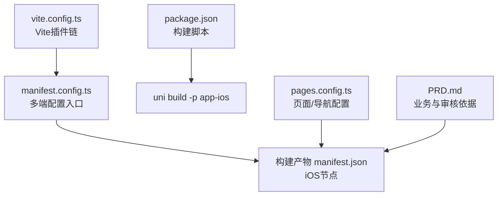
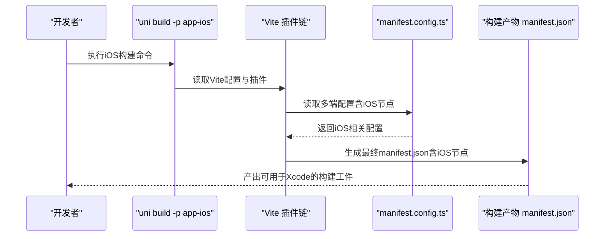
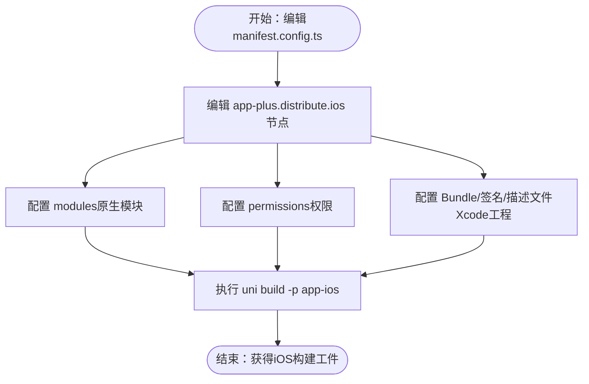

# iOS应用部署

<cite>
**本文引用的文件**
- [manifest.config.ts](file://chuan-bill-app/manifest.config.ts)
- [manifest.json](file://chuan-bill-app/src/manifest.json)
- [package.json](file://chuan-bill-app/package.json)
- [vite.config.ts](file://chuan-bill-app/vite.config.ts)
- [pages.config.ts](file://chuan-bill-app/pages.config.ts)
- [PRD.md](file://PRD.md)
</cite>

## 目录
1. [简介](#简介)
2. [项目结构](#项目结构)
3. [核心组件](#核心组件)
4. [架构概览](#架构概览)
5. [详细组件分析](#详细组件分析)
6. [依赖分析](#依赖分析)
7. [性能考虑](#性能考虑)
8. [故障排查指南](#故障排查指南)
9. [结论](#结论)
10. [附录](#附录)

## 简介
本指南面向“小川记账”iOS应用的部署与发布，基于仓库中现有的多端统一工程配置，聚焦以下目标：
- 解释iOS平台在manifest.json/manifest.config.ts中的配置要点（设备适配、模块配置等）
- 说明如何在现有工程中完成iOS构建与分发（含Xcode侧的必要步骤）
- 提供App Store Connect配置、元数据填写、屏幕截图准备、审核流程与二进制上传的实操指引
- 给出iOS性能优化建议（启动时间、内存、电池续航、后台任务限制）
- 涵盖iOS权限、推送通知、iCloud等高级功能的实现路径
- 总结常见审核被拒问题及应对策略

## 项目结构
该工程采用DCloud uni-app生态，通过Vite插件将多端配置统一到manifest中，并支持多端构建（含iOS）。与iOS部署直接相关的关键文件如下：
- manifest.config.ts：多端统一的manifest配置入口，包含iOS节点（当前为空对象）
- manifest.json：构建产物中的最终manifest，包含iOS节点（当前为空对象）
- package.json：构建脚本与依赖，包含iOS构建命令
- vite.config.ts：Vite配置，启用uni-manifest、uni-pages、uni-layouts等插件
- pages.config.ts：页面与导航栏配置
- PRD.md：产品需求文档，用于理解业务边界与审核要点

图示来源
- [manifest.config.ts:12-99](file://chuan-bill-app/manifest.config.ts#L12-L99)
- [manifest.json:1-84](file://chuan-bill-app/src/manifest.json#L1-L84)
- [package.json:32-51](file://chuan-bill-app/package.json#L32-L51)
- [vite.config.ts:17-69](file://chuan-bill-app/vite.config.ts#L17-L69)
- [pages.config.ts:3-42](file://chuan-bill-app/pages.config.ts#L3-L42)

章节来源
- [manifest.config.ts:12-99](file://chuan-bill-app/manifest.config.ts#L12-L99)
- [manifest.json:1-84](file://chuan-bill-app/src/manifest.json#L1-L84)
- [package.json:32-51](file://chuan-bill-app/package.json#L32-L51)
- [vite.config.ts:17-69](file://chuan-bill-app/vite.config.ts#L17-L69)
- [pages.config.ts:3-42](file://chuan-bill-app/pages.config.ts#L3-L42)

## 核心组件
- 构建与打包
  - 使用uni-app提供的构建脚本，通过命令行参数选择目标平台（如app-ios）
  - Vite插件链负责读取manifest配置、生成页面路由、注入组件与样式
- Manifest配置
  - iOS节点位于app-plus.distribute.ios下，当前为空对象，后续可扩展
  - modules节点用于声明需要的原生模块（如推送、地图、支付等）
- 页面与导航
  - pages.config.ts集中定义全局样式、导航栏与tabbar配置
- 业务与合规
  - PRD.md明确了功能边界，有助于规避审核风险（如隐私政策、数据安全）

章节来源
- [package.json:32-51](file://chuan-bill-app/package.json#L32-L51)
- [vite.config.ts:22-49](file://chuan-bill-app/vite.config.ts#L22-L49)
- [manifest.config.ts:30-58](file://chuan-bill-app/manifest.config.ts#L30-L58)
- [pages.config.ts:5-20](file://chuan-bill-app/pages.config.ts#L5-L20)
- [PRD.md:153-158](file://PRD.md#L153-L158)

## 架构概览
下图展示了从配置到构建产物的关键流转，以及与iOS部署相关的节点：

图示来源
- [package.json:35](file://chuan-bill-app/package.json#L35)
- [vite.config.ts:24](file://chuan-bill-app/vite.config.ts#L24)
- [manifest.config.ts:12-99](file://chuan-bill-app/manifest.config.ts#L12-L99)

## 详细组件分析

### iOS构建配置（manifest.json/manifest.config.ts）
- iOS节点位置
  - manifest.config.ts中存在app-plus.distribute.ios空对象，用于承载iOS专属配置
  - 构建产物manifest.json中对应位置亦为空对象
- 可扩展配置项（建议）
  - modules：声明需要的原生模块（如推送、iCloud、相机、定位等）
  - permissions：在iOS侧补充所需权限（例如推送、相机、相册、定位等）
  - distribute.ios：可扩展至Bundle ID、版本号、签名、描述文件等（需结合Xcode工程）
- 设备适配
  - 通过manifest中的全局样式与页面配置，配合uni-app的rpx适配，确保在iPhone/iPad上的显示一致性

图示来源
- [manifest.config.ts:54-55](file://chuan-bill-app/manifest.config.ts#L54-L55)
- [manifest.json:39](file://chuan-bill-app/src/manifest.json#L39)

章节来源
- [manifest.config.ts:30-58](file://chuan-bill-app/manifest.config.ts#L30-L58)
- [manifest.json:39](file://chuan-bill-app/src/manifest.json#L39)

### iOS开发者账号与证书流程
- Apple Developer账户注册
  - 企业版：适用于内部分发与企业上架
  - 个人版：适用于App Store分发与TestFlight测试
- 证书与描述文件
  - 开发者证书：用于本地调试与TestFlight
  - 分发证书：用于App Store发布
  - Provisioning Profile：根据Bundle ID与证书生成，包含设备UDID（测试分发）
- 与工程的衔接
  - 在Xcode工程中选择正确的Team、Bundle Identifier与Provisioning Profile
  - 证书与描述文件由Apple Developer中心生成，工程中进行匹配

章节来源
- [manifest.config.ts:54-55](file://chuan-bill-app/manifest.config.ts#L54-L55)

### iOS应用打包与分发（Xcode、Archive、IPA、TestFlight）
- Xcode项目配置
  - Team、Bundle Identifier、版本号与构建号
  - Provisioning Profile与签名（开发/分发）
- Archive构建
  - 在Xcode中执行Archive，生成.app与.dSYM符号文件
- IPA生成与验证
  - 导出IPA并使用Apple Configurator或Transporter校验
- TestFlight测试分发
  - 在App Store Connect中上传构建，分配测试组进行内测
- 与现有工程的关系
  - 本仓库通过uni build输出iOS工件；Xcode负责签名、导出与上传

章节来源
- [package.json:35](file://chuan-bill-app/package.json#L35)

### App Store发布流程（App Store Connect、元数据、屏幕截图、审核、上传）
- App Store Connect配置
  - 应用信息、版本号、语言、营销链接、隐私政策与数据使用说明
- 元数据与屏幕截图
  - 准备符合尺寸与分辨率的App图标、启动画面与App截图
- 审核指南遵循
  - 遵循隐私政策、数据最小化、权限申请说明、内容安全等要求
- 二进制文件上传
  - 使用Xcode或Transporter上传.dSYM与IPA
- 与产品需求的关联
  - PRD中强调的数据安全与隐私条款，是审核通过的关键

章节来源
- [PRD.md:153-158](file://PRD.md#L153-L158)

### iOS权限、推送通知与iCloud集成
- 权限配置
  - 在manifest中通过permissions声明所需权限（如相机、相册、定位、麦克风等）
  - 在Xcode中完善Info.plist与Usage Description
- 推送通知
  - 在Apple Developer中心创建APNs证书与推送能力
  - 在manifest.modules中声明推送模块（若使用uni-push）
  - 在Xcode中开启Push Notifications与Background Modes
- iCloud
  - 在Apple Developer中心开启iCloud能力与容器
  - 在Xcode中勾选iCloud并配置容器与权限
  - 在manifest.modules中声明iCloud模块（若使用uni-icloud）

章节来源
- [manifest.config.ts:30-31](file://chuan-bill-app/manifest.config.ts#L30-L31)
- [manifest.config.ts:54-55](file://chuan-bill-app/manifest.config.ts#L54-L55)

## 依赖分析
- 构建链路
  - uni build → Vite插件链（uni-manifest、uni-pages、uni-layouts等）→ 生成manifest.json
  - iOS构建命令通过package.json脚本触发
- 与iOS部署的耦合点
  - manifest配置决定iOS能力与权限
  - Xcode工程负责签名、导出与上传

图示来源
- [package.json:32-51](file://chuan-bill-app/package.json#L32-L51)
- [vite.config.ts:22-49](file://chuan-bill-app/vite.config.ts#L22-L49)
- [manifest.config.ts:12-99](file://chuan-bill-app/manifest.config.ts#L12-L99)

章节来源
- [package.json:32-51](file://chuan-bill-app/package.json#L32-L51)
- [vite.config.ts:22-49](file://chuan-bill-app/vite.config.ts#L22-L49)
- [manifest.config.ts:12-99](file://chuan-bill-app/manifest.config.ts#L12-L99)

## 性能考虑
- 启动时间优化
  - 合理拆分页面与组件，避免首屏过度渲染
  - 使用懒加载与按需引入，减少初始包体
- 内存管理
  - 避免循环引用与未释放的定时器/事件监听
  - 对大图与缓存进行合理控制
- 电池续航优化
  - 降低后台任务频率，避免频繁网络请求
  - 合理使用定位与传感器权限
- 后台任务限制
  - 遵循iOS后台执行限制，避免长时间后台运行
- 与业务的契合
  - PRD强调“数据分页加载、缓存策略优化”，这与性能优化方向一致

章节来源
- [PRD.md:142-146](file://PRD.md#L142-L146)

## 故障排查指南
- 构建失败
  - 检查manifest中iOS节点配置是否完整（modules、permissions）
  - 确认uni build -p app-ios命令可用且环境变量正确
- 签名与描述文件问题
  - 在Xcode中确认Team、Bundle ID与Provisioning Profile匹配
  - 更新描述文件并重新下载安装
- TestFlight无法安装
  - 确认设备已添加到描述文件或TestFlight测试组
  - 检查应用版本号与构建号是否递增
- 审核被拒
  - 重点检查隐私政策、数据使用说明与权限申请说明
  - 确保符合App Store审核指南

章节来源
- [manifest.config.ts:30-58](file://chuan-bill-app/manifest.config.ts#L30-L58)
- [package.json:35](file://chuan-bill-app/package.json#L35)

## 结论
本指南基于现有仓库配置，梳理了iOS部署的关键路径：从manifest配置到构建产物，再到Xcode签名与分发。建议在现有基础上逐步完善iOS节点配置（modules、permissions），并在Xcode中完成签名与导出，最终通过App Store Connect完成审核与发布。同时，遵循PRD中的数据安全与隐私要求，有助于提升审核通过率。

## 附录
- 常用构建命令
  - iOS构建：uni build -p app-ios
  - Android构建：uni build -p app-android
- 重要配置参考
  - manifest配置入口：manifest.config.ts
  - 构建产物：manifest.json
  - 页面与导航：pages.config.ts
  - 业务与合规：PRD.md

章节来源
- [package.json:32-51](file://chuan-bill-app/package.json#L32-L51)
- [manifest.config.ts:12-99](file://chuan-bill-app/manifest.config.ts#L12-L99)
- [manifest.json:1-84](file://chuan-bill-app/src/manifest.json#L1-L84)
- [pages.config.ts:3-42](file://chuan-bill-app/pages.config.ts#L3-L42)
- [PRD.md:153-158](file://PRD.md#L153-L158)