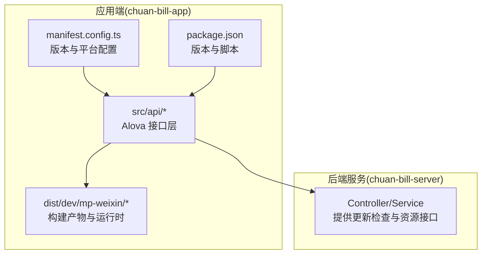
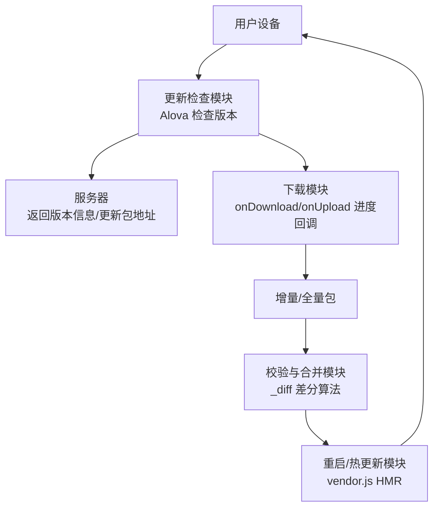
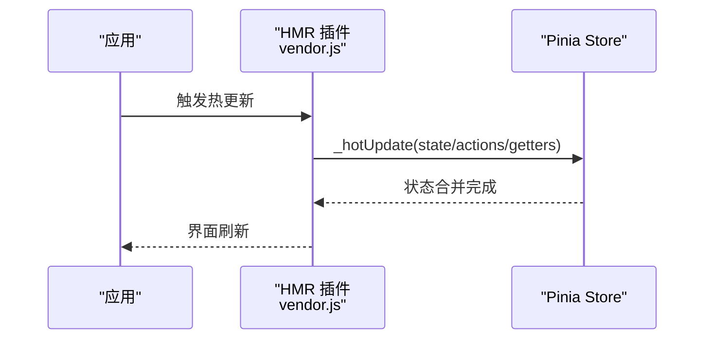
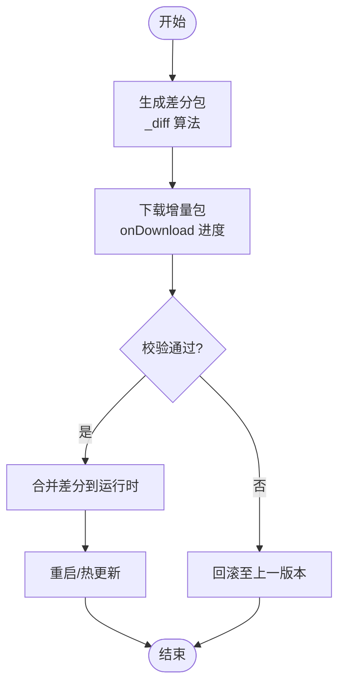
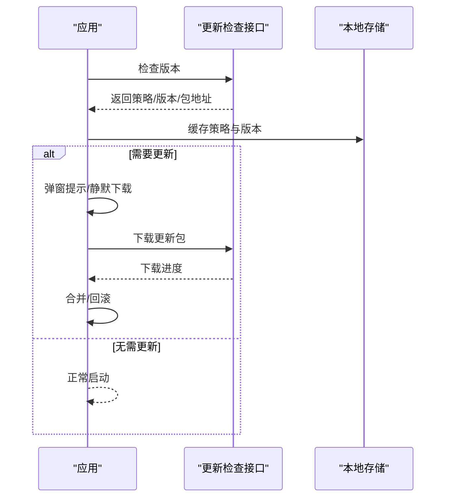
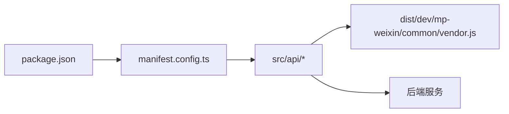

# 应用更新机制

<cite>
**本文引用的文件**
- [manifest.config.ts](file://chuan-bill-app/manifest.config.ts)
- [package.json](file://chuan-bill-app/package.json)
- [vendor.js](file://chuan-bill-app/dist/dev/mp-weixin/common/vendor.js)
- [handlers.ts](file://chuan-bill-app/src/api/core/handlers.ts)
- [handlers.js](file://chuan-bill-app/dist/dev/mp-weixin/api/core/handlers.js)
- [_diff 函数](file://chuan-bill-app/dist/dev/mp-weixin/common/vendor.js)
- [Alova 类与 Method 类](file://chuan-bill-app/dist/dev/mp-weixin/common/vendor.js)
- [onDownload/onUpload 进度回调](file://chuan-bill-app/dist/dev/mp-weixin/common/vendor.js)
- [createApis.ts](file://chuan-bill-app/src/api/createApis.ts)
- [index.ts](file://chuan-bill-app/src/api/index.ts)
- [project.config.json](file://chuan-bill-app/dist/dev/mp-weixin/project.config.json)
</cite>

## 目录
1. [简介](#简介)
2. [项目结构](#项目结构)
3. [核心组件](#核心组件)
4. [架构总览](#架构总览)
5. [详细组件分析](#详细组件分析)
6. [依赖关系分析](#依赖关系分析)
7. [性能考量](#性能考量)
8. [故障排除指南](#故障排除指南)
9. [结论](#结论)
10. [附录](#附录)

## 简介
本指南面向“小川记账”应用的更新机制，围绕版本管理与更新策略、热更新技术、增量更新、应用内与应用商店更新模式、更新检查与用户体验、以及更新失败回滚与常见问题排查进行系统化说明。文档基于仓库现有代码与配置进行分析，重点覆盖小程序端（微信）与多端构建能力。

## 项目结构
- 应用端位于 chuan-bill-app，采用 uni-app 多端统一开发框架，支持 H5、小程序、App 等多平台。
- 版本信息通过 manifest.config.ts 与 package.json 双通道定义：manifest 中包含版本名称与版本号等元数据；package.json 提供 npm 版本与脚本命令。
- 构建产物位于 dist/dev/mp-weixin，包含运行时 vendor.js、页面与组件资源、项目配置等。
- API 层使用 Alova 统一发起请求，并提供响应与错误处理钩子，便于扩展更新检查与下载进度。

**图表来源**
- [manifest.config.ts:12-17](file://chuan-bill-app/manifest.config.ts#L12-L17)
- [package.json:4-4](file://chuan-bill-app/package.json#L4-L4)
- [vendor.js:11343-11615](file://chuan-bill-app/dist/dev/mp-weixin/common/vendor.js#L11343-L11615)

**章节来源**
- [manifest.config.ts:12-17](file://chuan-bill-app/manifest.config.ts#L12-L17)
- [package.json:4-4](file://chuan-bill-app/package.json#L4-L4)

## 核心组件
- 版本与平台配置：通过 manifest.config.ts 定义版本名称与版本号、小程序 appid、优化策略等；用于多端构建与发布。
- 构建产物与运行时：dist/dev/mp-weixin/common/vendor.js 包含 Alova 请求实例、Method 类、下载/上传进度回调等，为更新检查与增量下载提供基础能力。
- API 层：src/api/* 与 dist/dev/mp-weixin/api/* 提供统一的请求封装与错误处理，便于在更新流程中复用。
- 项目配置：dist/dev/mp-weixin/project.config.json 控制小程序编译与调试行为，影响更新体验（如 urlCheck、新特性开关等）。

**章节来源**
- [manifest.config.ts:12-17](file://chuan-bill-app/manifest.config.ts#L12-L17)
- [vendor.js:11343-11615](file://chuan-bill-app/dist/dev/mp-weixin/common/vendor.js#L11343-L11615)
- [handlers.ts:50-104](file://chuan-bill-app/src/api/core/handlers.ts#L50-L104)
- [project.config.json:1-36](file://chuan-bill-app/dist/dev/mp-weixin/project.config.json#L1-L36)

## 架构总览
应用更新机制建议采用“双通道 + 多策略”的架构：
- 应用内更新：通过 Alova 检查版本、下载增量包或全量包、合并更新、进度反馈与回滚。
- 应用商店更新：由平台侧触发，应用在启动时检测版本差异并引导升级。
- 热更新：利用运行时 vendor.js 的 HMR 能力与 diff 算法，实现 JS/样式/资源的热替换与增量合并。

**图表来源**
- [Alova 类与 Method 类:11587-11615](file://chuan-bill-app/dist/dev/mp-weixin/common/vendor.js#L11587-L11615)
- [_diff 函数:5664-5743](file://chuan-bill-app/dist/dev/mp-weixin/common/vendor.js#L5664-L5743)
- [onDownload/onUpload 进度回调:11372-11384](file://chuan-bill-app/dist/dev/mp-weixin/common/vendor.js#L11372-L11384)

## 详细组件分析

### 版本管理与更新策略
- 版本号规则
  - manifest.config.ts 中 versionName 与 versionCode 用于标识应用版本，建议遵循语义化版本规范（主.次.修订），并确保 versionCode 递增以满足平台要求。
  - package.json 的 version 字段用于 npm 生态与 CI/CD 流水线，可与 manifest 中 versionName 同步维护。
- 更新频率控制
  - 在更新检查逻辑中引入“最小更新间隔”与“最近一次更新时间”缓存，避免频繁弹窗打扰。
  - 对于非强制更新，允许用户跳过本次更新；对于强制更新，阻塞进入应用直至完成。
- 强制更新设置
  - 通过服务器下发的更新策略字段（如强制标志、最低版本号）决定是否拦截进入应用。
  - 强制更新场景下，隐藏“跳过”按钮，仅允许“立即更新”。

**章节来源**
- [manifest.config.ts:16-17](file://chuan-bill-app/manifest.config.ts#L16-L17)
- [package.json:4-4](file://chuan-bill-app/package.json#L4-L4)

### 热更新技术实现
- JSBundle 热更新
  - 利用 vendor.js 中的 HMR 插件与 store 热更新机制，对 Pinia Store 的 state、actions、getters 进行热替换，保持状态一致性。
  - 在更新流程中，优先尝试热更新，若涉及资源或样式变更再进行全量替换。
- 样式热更新
  - 结合小程序主题与样式隔离配置（themeLocation、darkmode），在热更新时按需刷新样式资源。
- 资源热更新
  - 通过 vendor.js 的缓存适配器与命中策略，对静态资源进行缓存与失效控制，减少重复下载。

**图表来源**
- [vendor.js:9408-9830](file://chuan-bill-app/dist/dev/mp-weixin/common/vendor.js#L9408-L9830)

**章节来源**
- [vendor.js:9408-9830](file://chuan-bill-app/dist/dev/mp-weixin/common/vendor.js#L9408-L9830)

### 增量更新机制
- 差分包生成
  - 基于 vendor.js 内部的 _diff 差分算法，计算新旧版本之间的差异路径与值，生成最小化差分包。
- 增量包下载
  - 使用 Alova 的 Method 实例，结合 onDownload 回调实时获取下载进度，支持断点续传与失败重试。
- 合并更新流程
  - 下载完成后，执行差分合并逻辑，将差异应用到当前运行时；若合并失败则回滚至上一稳定版本。

**图表来源**
- [_diff 函数:5664-5743](file://chuan-bill-app/dist/dev/mp-weixin/common/vendor.js#L5664-L5743)
- [onDownload/onUpload 进度回调:11372-11384](file://chuan-bill-app/dist/dev/mp-weixin/common/vendor.js#L11372-L11384)

**章节来源**
- [vendor.js:5664-5743](file://chuan-bill-app/dist/dev/mp-weixin/common/vendor.js#L5664-L5743)
- [vendor.js:11372-11384](file://chuan-bill-app/dist/dev/mp-weixin/common/vendor.js#L11372-L11384)

### 应用内更新与应用商店更新
- 应用内更新
  - 启动时调用更新检查接口，根据服务器返回的策略与版本信息决定是否弹窗提示。
  - 提供“后台静默更新”选项：在后台下载并合并，下次启动生效；或“前台强制更新”，阻塞当前界面直到完成。
- 应用商店更新
  - 当服务器判定为强制更新且应用内不可用时，引导用户前往应用商店手动更新。
  - 在 manifest.config.ts 中配置各平台的 appid 与分发信息，确保商店审核通过。

**图表来源**
- [createApis.ts:65-72](file://chuan-bill-app/src/api/createApis.ts#L65-L72)
- [index.ts:14-18](file://chuan-bill-app/src/api/index.ts#L14-L18)

**章节来源**
- [manifest.config.ts:63-75](file://chuan-bill-app/manifest.config.ts#L63-L75)
- [createApis.ts:65-72](file://chuan-bill-app/src/api/createApis.ts#L65-L72)
- [index.ts:14-18](file://chuan-bill-app/src/api/index.ts#L14-L18)

### 更新检查机制
- 版本对比
  - 通过 manifest.config.ts 与服务器返回的版本信息进行对比，判断是否需要更新。
- 更新提示
  - 使用全局 Toast/Message 组件进行提示，支持“立即更新”“后台更新”“跳过”等操作。
- 下载进度显示
  - onDownload/onUpload 回调提供实时进度，UI 展示百分比与剩余时间预估。
- 更新完成处理
  - 合并成功后提示重启生效；若失败则回滚并提示重试。

**章节来源**
- [handlers.ts:71-104](file://chuan-bill-app/src/api/core/handlers.ts#L71-L104)
- [handlers.js:41-66](file://chuan-bill-app/dist/dev/mp-weixin/api/core/handlers.js#L41-L66)
- [onDownload/onUpload 进度回调:11372-11384](file://chuan-bill-app/dist/dev/mp-weixin/common/vendor.js#L11372-L11384)

### 更新失败回滚机制
- 版本回退
  - 保留上一稳定版本的快照，合并失败时自动回退至上一版本。
- 数据兼容性处理
  - 在差分合并前进行字段兼容性校验，缺失字段使用默认值或迁移策略填充。
- 错误恢复策略
  - 记录失败日志与重试次数，超过阈值后引导用户手动更新或联系客服。

**章节来源**
- [vendor.js:11343-11615](file://chuan-bill-app/dist/dev/mp-weixin/common/vendor.js#L11343-L11615)

### 用户体验优化
- 静默更新
  - 后台下载并合并，下次启动生效，避免打断用户操作。
- 后台更新
  - 在应用切换到后台时继续下载，前台回到前台时提示完成。
- 更新通知设计
  - 采用全局 Toast/Message 组件，提供明确的操作按钮与进度指示。

**章节来源**
- [project.config.json:6-12](file://chuan-bill-app/dist/dev/mp-weixin/project.config.json#L6-L12)

## 依赖关系分析
- 版本与平台配置依赖
  - manifest.config.ts 与 package.json 共同决定应用版本与构建参数。
- API 与运行时依赖
  - src/api/* 与 dist/dev/mp-weixin/api/* 依赖 vendor.js 中的 Alova 与 Method 类，提供统一的请求与进度回调能力。
- 更新流程依赖
  - 更新检查、下载、合并、回滚均依赖 vendor.js 的 HMR 与缓存适配器。

**图表来源**
- [package.json:4-4](file://chuan-bill-app/package.json#L4-L4)
- [manifest.config.ts:12-17](file://chuan-bill-app/manifest.config.ts#L12-L17)
- [vendor.js:11587-11615](file://chuan-bill-app/dist/dev/mp-weixin/common/vendor.js#L11587-L11615)

**章节来源**
- [package.json:4-4](file://chuan-bill-app/package.json#L4-L4)
- [manifest.config.ts:12-17](file://chuan-bill-app/manifest.config.ts#L12-L17)
- [vendor.js:11587-11615](file://chuan-bill-app/dist/dev/mp-weixin/common/vendor.js#L11587-L11615)

## 性能考量
- 构建优化
  - manifest.config.ts 中开启小程序优化策略（如分包），降低首屏体积。
- 网络与缓存
  - 使用 vendor.js 的缓存适配器与命中策略，减少重复下载；合理设置缓存过期时间。
- 进度与体验
  - onDownload/onUpload 回调应避免频繁渲染，采用节流策略提升 UI 流畅度。

**章节来源**
- [manifest.config.ts:63-75](file://chuan-bill-app/manifest.config.ts#L63-L75)
- [vendor.js:11208-11230](file://chuan-bill-app/dist/dev/mp-weixin/common/vendor.js#L11208-L11230)

## 故障排除指南
- 网络错误与超时
  - 使用 handleAlovaError 统一处理网络错误与超时，提示用户检查网络并重试。
- 登录态失效
  - 401/403 时清理用户信息并跳转登录页，避免更新流程中断。
- 下载中断
  - onDownload 回调记录已下载字节，支持断点续传；失败时重试并提示用户。
- 合并失败
  - 回滚至上一版本并记录日志；必要时引导用户手动更新。

**章节来源**
- [handlers.ts:71-104](file://chuan-bill-app/src/api/core/handlers.ts#L71-L104)
- [handlers.js:41-66](file://chuan-bill-app/dist/dev/mp-weixin/api/core/handlers.js#L41-L66)

## 结论
通过将 manifest.config.ts 与 package.json 的版本信息、Alova 的请求与进度回调、vendor.js 的 HMR 与差分算法整合，小川记账可实现稳定高效的更新机制。建议在实际落地时补充服务端接口与客户端策略配置，确保更新流程可控、可回滚、用户体验友好。

## 附录
- 关键实现位置参考
  - 版本与平台配置：[manifest.config.ts:12-17](file://chuan-bill-app/manifest.config.ts#L12-L17)
  - 构建与脚本：[package.json:11-55](file://chuan-bill-app/package.json#L11-L55)
  - 请求与进度回调：[vendor.js:11343-11615](file://chuan-bill-app/dist/dev/mp-weixin/common/vendor.js#L11343-L11615)
  - 差分算法：[_diff 函数:5664-5743](file://chuan-bill-app/dist/dev/mp-weixin/common/vendor.js#L5664-L5743)
  - 热更新插件：[vendor.js:9408-9830](file://chuan-bill-app/dist/dev/mp-weixin/common/vendor.js#L9408-L9830)
  - API 生成与挂载：[createApis.ts:65-72](file://chuan-bill-app/src/api/createApis.ts#L65-L72), [index.ts:14-18](file://chuan-bill-app/src/api/index.ts#L14-L18)
  - 小程序项目配置：[project.config.json:1-36](file://chuan-bill-app/dist/dev/mp-weixin/project.config.json#L1-L36)