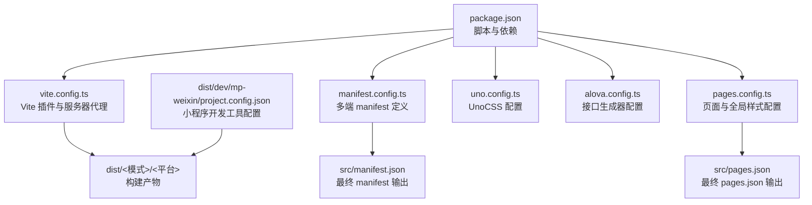
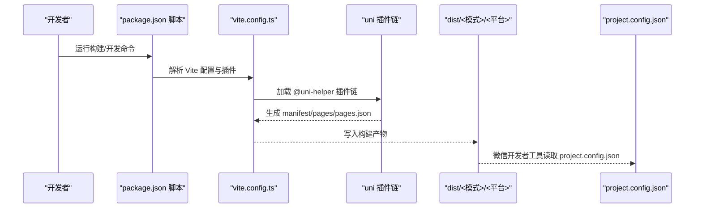
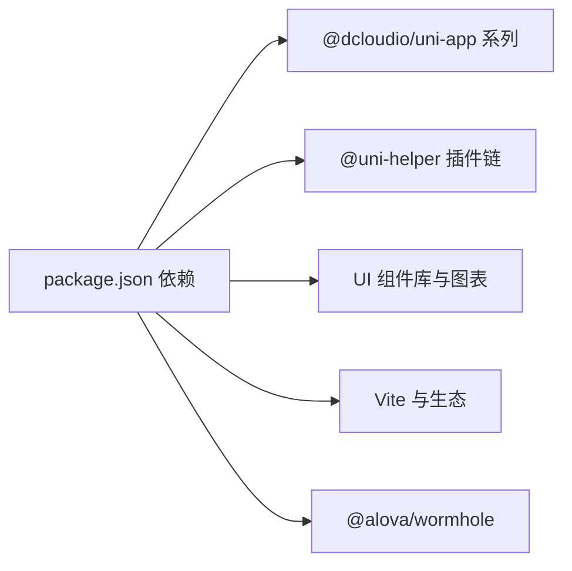

# 应用构建配置

<cite>
**本文引用的文件**
- [package.json](file://chuan-bill-app/package.json)
- [vite.config.ts](file://chuan-bill-app/vite.config.ts)
- [manifest.config.ts](file://chuan-bill-app/manifest.config.ts)
- [src/manifest.json](file://chuan-bill-app/src/manifest.json)
- [pages.config.ts](file://chuan-bill-app/pages.config.ts)
- [src/pages.json](file://chuan-bill-app/src/pages.json)
- [src/theme.json](file://chuan-bill-app/src/theme.json)
- [uno.config.ts](file://chuan-bill-app/uno.config.ts)
- [alova.config.ts](file://chuan-bill-app/alova.config.ts)
- [dist/dev/mp-weixin/project.config.json](file://chuan-bill-app/dist/dev/mp-weixin/project.config.json)
</cite>

## 目录
1. [简介](#简介)
2. [项目结构](#项目结构)
3. [核心组件](#核心组件)
4. [架构总览](#架构总览)
5. [详细组件分析](#详细组件分析)
6. [依赖分析](#依赖分析)
7. [性能考虑](#性能考虑)
8. [故障排查指南](#故障排查指南)
9. [结论](#结论)
10. [附录](#附录)

## 简介
本指南面向“小川记账”应用的构建与配置，围绕以下目标展开：  
- 全面解读 manifest.json（含 manifest.config.ts）配置项，覆盖应用基础信息、版本管理、平台特定配置、权限声明、启动屏设置等；  
- 深入说明 Vite 构建配置，包括构建输出目录、资源处理、代码分割、压缩优化等；  
- 阐述不同构建模式（开发、测试、生产）的配置差异与使用要点；  
- 规范应用图标与启动图的制作与适配；  
- 说明应用内资源管理（静态资源打包、CDN 配置、缓存策略）；  
- 提供构建脚本定制方法（自定义构建流程、环境变量、构建产物分析）；  
- 总结构建优化技巧与常见问题排查方法。

## 项目结构
本项目采用 uni-app 多端统一工程，前端源码位于 chuan-bill-app，核心配置集中在根目录的 package.json、vite.config.ts、manifest.config.ts、pages.config.ts、uno.config.ts、alova.config.ts 等文件中。构建产物输出到 dist 目录，小程序开发工具侧配置由 dist/dev/mp-weixin/project.config.json 提供。

图表来源
- [package.json:11-56](file://chuan-bill-app/package.json#L11-L56)
- [vite.config.ts:17-79](file://chuan-bill-app/vite.config.ts#L17-L79)
- [manifest.config.ts:12-99](file://chuan-bill-app/manifest.config.ts#L12-L99)
- [pages.config.ts:3-42](file://chuan-bill-app/pages.config.ts#L3-L42)
- [uno.config.ts:10-37](file://chuan-bill-app/uno.config.ts#L10-L37)
- [alova.config.ts:8-84](file://chuan-bill-app/alova.config.ts#L8-L84)
- [dist/dev/mp-weixin/project.config.json:1-36](file://chuan-bill-app/dist/dev/mp-weixin/project.config.json#L1-L36)

章节来源
- [package.json:1-135](file://chuan-bill-app/package.json#L1-L135)
- [vite.config.ts:1-80](file://chuan-bill-app/vite.config.ts#L1-L80)
- [manifest.config.ts:1-100](file://chuan-bill-app/manifest.config.ts#L1-L100)
- [pages.config.ts:1-43](file://chuan-bill-app/pages.config.ts#L1-L43)
- [uno.config.ts:1-38](file://chuan-bill-app/uno.config.ts#L1-L38)
- [alova.config.ts:1-85](file://chuan-bill-app/alova.config.ts#L1-L85)
- [dist/dev/mp-weixin/project.config.json:1-36](file://chuan-bill-app/dist/dev/mp-weixin/project.config.json#L1-L36)

## 核心组件
- 构建脚本与模式：通过 package.json 的 scripts 字段统一入口，支持多端与多模式组合，如 dev:mp-weixin、build:h5:production 等。
- Vite 配置：集中于 vite.config.ts，启用 @uni-helper 系列插件、自动导入、UnoCSS、echarts 集成、代理与依赖优化等。
- Manifest 配置：通过 manifest.config.ts 定义多端差异化配置，最终输出至 src/manifest.json。
- 页面与样式：pages.config.ts 定义全局样式与 tabbar，最终输出至 src/pages.json。
- 主题系统：src/theme.json 定义明暗主题色值，配合 manifest 中的 darkmode 与 themeLocation 使用。
- 开发工具配置：dist/dev/mp-weixin/project.config.json 为微信开发者工具提供编译与调试配置。

章节来源
- [package.json:11-56](file://chuan-bill-app/package.json#L11-L56)
- [vite.config.ts:17-79](file://chuan-bill-app/vite.config.ts#L17-L79)
- [manifest.config.ts:12-99](file://chuan-bill-app/manifest.config.ts#L12-L99)
- [src/manifest.json:1-84](file://chuan-bill-app/src/manifest.json#L1-L84)
- [pages.config.ts:3-42](file://chuan-bill-app/pages.config.ts#L3-L42)
- [src/pages.json:1-83](file://chuan-bill-app/src/pages.json#L1-L83)
- [src/theme.json:1-27](file://chuan-bill-app/src/theme.json#L1-L27)
- [dist/dev/mp-weixin/project.config.json:1-36](file://chuan-bill-app/dist/dev/mp-weixin/project.config.json#L1-L36)

## 架构总览
下图展示从配置到构建产物的关键路径与交互关系：

图表来源
- [package.json:11-56](file://chuan-bill-app/package.json#L11-L56)
- [vite.config.ts:17-79](file://chuan-bill-app/vite.config.ts#L17-L79)
- [dist/dev/mp-weixin/project.config.json:1-36](file://chuan-bill-app/dist/dev/mp-weixin/project.config.json#L1-L36)

## 详细组件分析

### Manifest 配置详解
- 应用基础信息
  - 名称、描述、版本号与转换单位等基础字段在 manifest.config.ts 与 src/manifest.json 中均有体现。
- 版本管理
  - versionName 与 versionCode 用于标识版本；在多端分发时可按平台单独管理。
- 平台特定配置
  - app-plus：包含 nvue 编译器、启动屏、模块与分发配置（Android 权限、iOS 等）。
  - mp-weixin：开启分包优化、关闭 url 校验、启用深色模式、主题文件位置、虚拟节点合并属性等。
  - mp-alipay、mp-baidu、mp-toutiao：启用组件化与部分编译选项。
  - h5：启用深色模式与主题文件位置。
- 权限声明
  - Android 权限列表集中于 app-plus.distribute.android.permissions，包含网络状态、相机、振动、唤醒锁等常用权限。
- 启动屏设置
  - splashscreen 支持 alwaysShowBeforeRender、waiting、autoclose、delay 等控制渲染前显示、等待、自动关闭与延迟。

章节来源
- [manifest.config.ts:12-99](file://chuan-bill-app/manifest.config.ts#L12-L99)
- [src/manifest.json:1-84](file://chuan-bill-app/src/manifest.json#L1-L84)

### Vite 构建配置详解
- 基础路径与依赖优化
  - base 设置为相对路径，便于多端部署；optimizeDeps 在开发模式排除特定包以提升启动速度。
- 插件体系
  - @uni-helper/vite-plugin-uni-manifest：将 manifest.config.ts 输出为 src/manifest.json。
  - @uni-helper/vite-plugin-uni-pages：根据 pages.config.ts 生成 src/pages.json。
  - @uni-helper/vite-plugin-uni-layouts：布局自动注入。
  - @uni-helper/vite-plugin-uni-components：自动按需引入组件与解析器（Wot、uni-echarts）。
  - @uni-ku/bundle-optimizer：在微信小程序平台启用打包优化（按平台条件加载）。
  - unplugin-auto-import：自动导入 Vue/Pinia/Router/Alowa 等 API，并生成类型声明。
  - unocss：原子化 CSS，结合 preset 与 transformer。
- 服务器代理
  - 本地开发时将 /api 代理到后端服务地址，便于联调。

章节来源
- [vite.config.ts:17-79](file://chuan-bill-app/vite.config.ts#L17-L79)
- [uno.config.ts:10-37](file://chuan-bill-app/uno.config.ts#L10-L37)

### 页面与样式配置
- 全局样式
  - pages.config.ts 定义导航栏背景、文字颜色、背景色、下拉刷新、上拉触底距离、转场动画等。
- Tabbar
  - 自定义 tabbar，支持条件编译（如 mp-alipay），并设置高度、颜色、背景、边框与列表页路径。
- 生成 pages.json
  - 通过 @uni-helper/vite-plugin-uni-pages 将 pages.config.ts 转换为 src/pages.json，包含页面列表与分包信息。

章节来源
- [pages.config.ts:3-42](file://chuan-bill-app/pages.config.ts#L3-L42)
- [src/pages.json:1-83](file://chuan-bill-app/src/pages.json#L1-L83)

### 主题与深色模式
- 主题文件
  - src/theme.json 定义 light/dark 两套主题色值，涵盖导航栏、标签栏、背景等关键变量。
- 深色模式与主题文件位置
  - manifest 中 mp-weixin 与 h5 启用 darkmode，并指定 themeLocation 指向 theme.json，实现跨端主题联动。

章节来源
- [src/theme.json:1-27](file://chuan-bill-app/src/theme.json#L1-L27)
- [src/manifest.json:50-83](file://chuan-bill-app/src/manifest.json#L50-L83)

### 接口生成与资源对接
- 接口生成
  - alova.config.ts 通过 wormhole 从 Swagger/OpenAPI 文档生成 TypeScript 接口与类型，支持过滤、转换与自动更新。
- 资源对接
  - 构建阶段由 Vite 插件链完成资源扫描、按需引入与打包；开发代理确保前后端联调顺畅。

章节来源
- [alova.config.ts:8-84](file://chuan-bill-app/alova.config.ts#L8-L84)
- [vite.config.ts:22-69](file://chuan-bill-app/vite.config.ts#L22-L69)

### 构建模式与脚本定制
- 模式与平台组合
  - 开发模式：dev、dev:h5、dev:mp-weixin 等；支持 --mode 传参切换开发/预发/生产。
  - 生产模式：build、build:h5:production 等；默认走 uni build 流程。
- 环境变量与条件编译
  - 可通过 --mode 与 Vite 环境变量控制不同行为；在 pages.config.ts 中使用条件编译指令进行平台差异化配置。
- 构建产物分析
  - 建议结合可视化分析工具对 dist 目录进行体积分析，定位大体积模块与重复依赖。

章节来源
- [package.json:11-56](file://chuan-bill-app/package.json#L11-L56)
- [pages.config.ts:23-26](file://chuan-bill-app/pages.config.ts#L23-L26)

### 图标与启动图制作规范
- 尺寸与格式
  - 应用图标与启动图建议准备多套尺寸以适配不同平台与分辨率，优先使用矢量或高分辨率位图，导出 PNG 或 JPG。
- 适配策略
  - 在 manifest 中按平台配置启动屏参数（如微信小程序的 splashscreen），确保在不同设备上显示一致。
- 资源放置
  - 将图标与启动图置于静态资源目录，避免被构建工具误删；必要时在 pages.config.ts 中显式声明。

章节来源
- [src/manifest.json:12-17](file://chuan-bill-app/src/manifest.json#L12-L17)
- [manifest.config.ts:24-29](file://chuan-bill-app/manifest.config.ts#L24-L29)

### 资源管理与缓存策略
- 静态资源打包
  - Vite 默认将静态资源按哈希命名并输出到 dist 目录；可通过 rollupOptions 自定义输出策略。
- CDN 配置
  - 对外链资源可在 manifest 或 pages.json 中声明，或通过构建时替换策略实现。
- 缓存策略
  - 建议对静态资源启用强缓存（长 TTL），对 HTML/CSS/JS 启用协商缓存；对动态接口使用合理的缓存头。

章节来源
- [vite.config.ts:18](file://chuan-bill-app/vite.config.ts#L18)
- [src/pages.json:56](file://chuan-bill-app/src/pages.json#L56)

## 依赖分析
- 构建与多端
  - @dcloudio/uni-app 及各平台适配包提供多端运行能力；@uni-helper 系列插件负责 manifest/pages/layouts/components 的自动化。
- UI 与主题
  - wot-design-uni、uni-echarts 提供组件与图表能力；UnoCSS 提供原子化样式。
- 工具链
  - vite、@vitejs/plugin-react、unplugin-auto-import、unocss 等提升开发体验与产物质量。
- 接口生成
  - @alova/wormhole 与 swagger 文档对接，自动生成接口与类型。

图表来源
- [package.json:57-87](file://chuan-bill-app/package.json#L57-L87)
- [package.json:88-125](file://chuan-bill-app/package.json#L88-L125)

章节来源
- [package.json:57-125](file://chuan-bill-app/package.json#L57-L125)

## 性能考虑
- 代码分割与懒加载
  - 合理拆分页面与组件，利用路由级懒加载减少首屏体积。
- 依赖优化
  - optimizeDeps.exclude 在开发期排除大体积依赖，缩短冷启动时间。
- 资源压缩与 Tree Shaking
  - 生产构建默认启用压缩与摇树优化；可进一步通过插件配置增强。
- 组件按需引入
  - 通过 @uni-helper/vite-plugin-uni-components 的解析器与目录扫描，避免全量引入。
- 主题与样式
  - UnoCSS 仅产出实际使用的样式，降低 CSS 体积。

章节来源
- [vite.config.ts:19-21](file://chuan-bill-app/vite.config.ts#L19-L21)
- [vite.config.ts:33-38](file://chuan-bill-app/vite.config.ts#L33-L38)
- [uno.config.ts:11-31](file://chuan-bill-app/uno.config.ts#L11-L31)

## 故障排查指南
- 构建失败或模块缺失
  - 检查 optimizeDeps.exclude 是否正确排除了未安装或不兼容的包；确认 Node 版本满足 engines 要求。
- 页面未生效或样式异常
  - 确认 pages.config.ts 与 src/pages.json 的一致性；检查条件编译指令是否正确。
- 启动屏不显示或白屏
  - 校验 manifest 中 splashscreen 参数与平台配置；确保资源路径正确。
- 深色模式未生效
  - 确认 manifest 中 darkmode 与 themeLocation 设置；检查 src/theme.json 键名与取值。
- 开发代理无效
  - 检查 vite.server.proxy 配置与后端服务连通性；确认路径重写规则。
- 微信开发者工具无法识别
  - 确认 dist/dev/mp-weixin/project.config.json 的 appid、projectname 与实际项目一致。

章节来源
- [vite.config.ts:19-21](file://chuan-bill-app/vite.config.ts#L19-L21)
- [src/pages.json:15-55](file://chuan-bill-app/src/pages.json#L15-L55)
- [src/manifest.json:12-17](file://chuan-bill-app/src/manifest.json#L12-L17)
- [src/theme.json:1-27](file://chuan-bill-app/src/theme.json#L1-L27)
- [vite.config.ts:70-78](file://chuan-bill-app/vite.config.ts#L70-L78)
- [dist/dev/mp-weixin/project.config.json:16-17](file://chuan-bill-app/dist/dev/mp-weixin/project.config.json#L16-L17)

## 结论
本指南基于现有配置文件梳理了“小川记账”的构建与多端配置要点。通过 manifest.config.ts 与 pages.config.ts 的协同，配合 Vite 插件链与 UnoCSS，可实现跨端一致的开发体验与产物质量。建议在后续迭代中持续关注体积分析、依赖优化与主题一致性，以保障多端性能与稳定性。

## 附录
- 常用命令速查
  - 开发：dev、dev:h5、dev:mp-weixin
  - 生产：build、build:h5:production
  - 其他平台：dev:mp-alipay、build:mp-weixin 等
- 关键配置文件清单
  - 构建：vite.config.ts、uno.config.ts、alova.config.ts
  - 清单：manifest.config.ts、src/manifest.json
  - 页面：pages.config.ts、src/pages.json
  - 主题：src/theme.json
  - 小程序开发工具：dist/dev/mp-weixin/project.config.json

章节来源
- [package.json:11-56](file://chuan-bill-app/package.json#L11-L56)
- [vite.config.ts:17-79](file://chuan-bill-app/vite.config.ts#L17-L79)
- [manifest.config.ts:12-99](file://chuan-bill-app/manifest.config.ts#L12-L99)
- [src/manifest.json:1-84](file://chuan-bill-app/src/manifest.json#L1-L84)
- [pages.config.ts:3-42](file://chuan-bill-app/pages.config.ts#L3-L42)
- [src/pages.json:1-83](file://chuan-bill-app/src/pages.json#L1-L83)
- [src/theme.json:1-27](file://chuan-bill-app/src/theme.json#L1-L27)
- [dist/dev/mp-weixin/project.config.json:1-36](file://chuan-bill-app/dist/dev/mp-weixin/project.config.json#L1-L36)