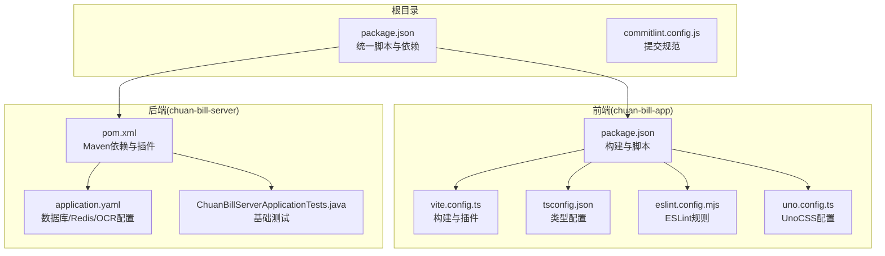
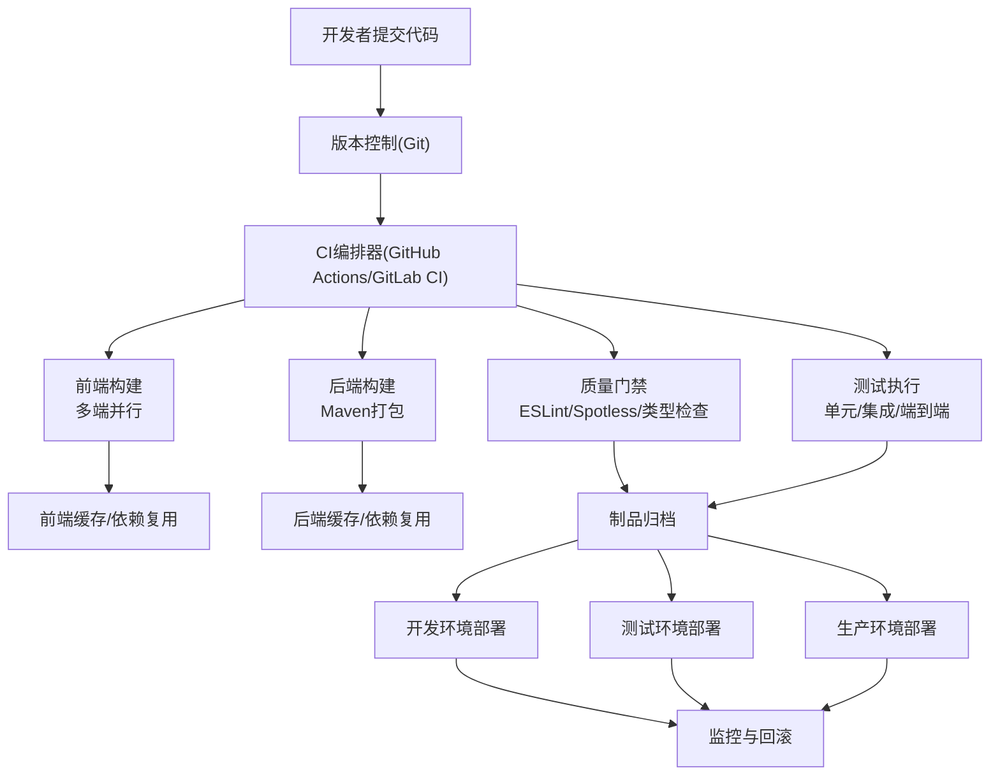
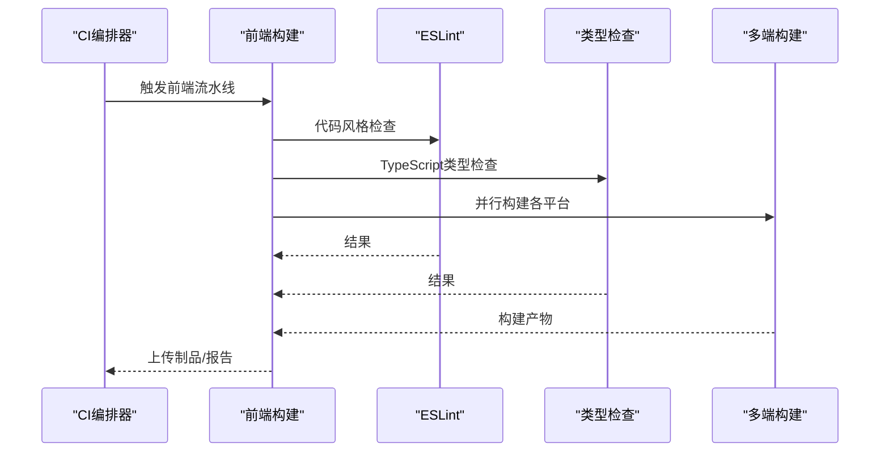
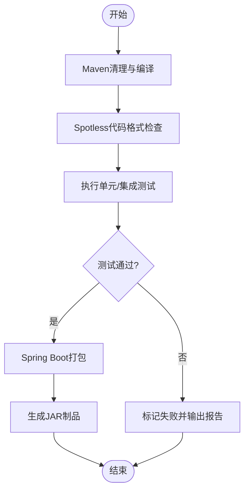
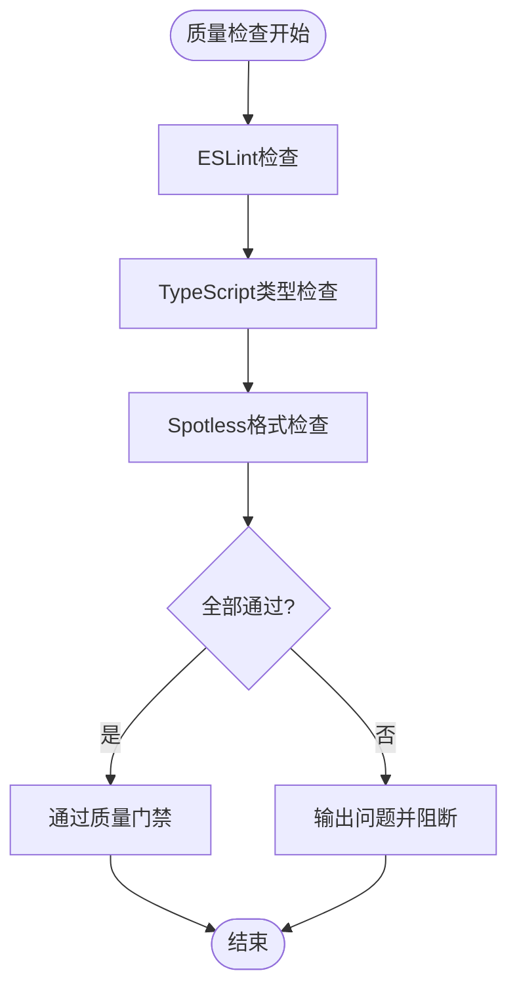
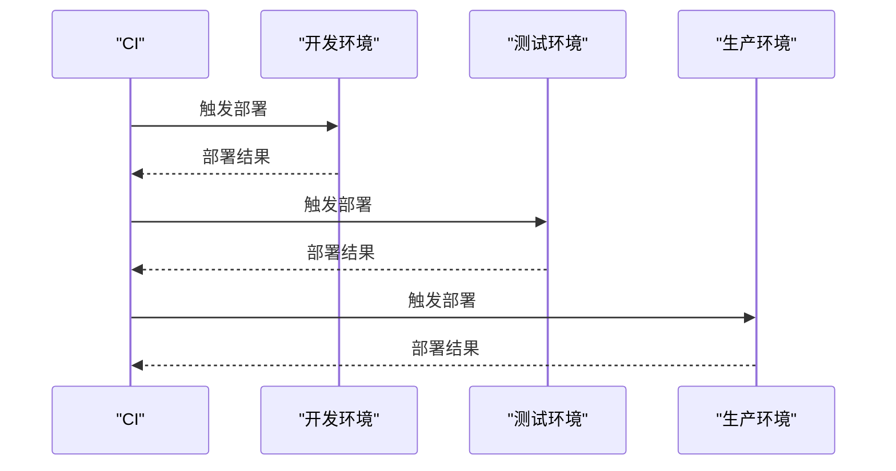
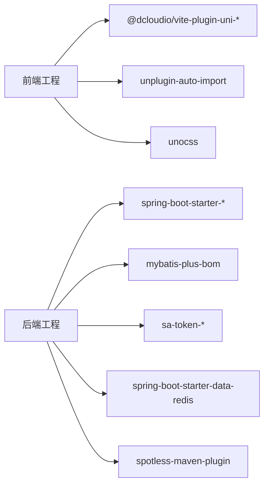

# CI/CD流水线

<cite>
**本文引用的文件**
- [package.json](file://package.json)
- [chuan-bill-app/package.json](file://chuan-bill-app/package.json)
- [chuan-bill-app/vite.config.ts](file://chuan-bill-app/vite.config.ts)
- [chuan-bill-app/tsconfig.json](file://chuan-bill-app/tsconfig.json)
- [chuan-bill-app/eslint.config.mjs](file://chuan-bill-app/eslint.config.mjs)
- [chuan-bill-app/uno.config.ts](file://chuan-bill-app/uno.config.ts)
- [chuan-bill-server/pom.xml](file://chuan-bill-server/pom.xml)
- [chuan-bill-server/src/main/resources/application.yaml](file://chuan-bill-server/src/main/resources/application.yaml)
- [chuan-bill-server/src/test/java/com/samoy/chuanbillserver/ChuanBillServerApplicationTests.java](file://chuan-bill-server/src/test/java/com/samoy/chuanbillserver/ChuanBillServerApplicationTests.java)
- [commitlint.config.js](file://commitlint.config.js)
- [PRD.md](file://PRD.md)
- [CLAUDE.md](file://CLAUDE.md)
</cite>

## 目录
1. [简介](#简介)
2. [项目结构](#项目结构)
3. [核心组件](#核心组件)
4. [架构总览](#架构总览)
5. [详细组件分析](#详细组件分析)
6. [依赖分析](#依赖分析)
7. [性能考虑](#性能考虑)
8. [故障排查指南](#故障排查指南)
9. [结论](#结论)
10. [附录](#附录)

## 简介
本指南面向“小川记账”项目的持续集成与持续交付（CI/CD）流水线设计与落地，覆盖前端 uni-app/Vue3/TypeScript 应用与后端 Spring Boot/JDK17 应用的自动化构建、测试、质量检查与多环境部署策略。文档同时提供 GitHub Actions 或 GitLab CI 的配置思路与最佳实践，涵盖多平台并行构建、条件触发、环境变量管理、缓存策略、并行任务与失败重试、测试与报告、代码质量检查、版本与发布管理以及回滚策略。

## 项目结构
项目采用双应用单仓（monorepo）结构：
- 前端应用：chuan-bill-app（uni-app/Vue3/TypeScript，支持多端构建）
- 后端应用：chuan-bill-server（Spring Boot 3/JDK17，MySQL + Redis）

根目录提供统一的脚本与质量工具配置，便于在 CI 中统一调用。

**图示来源**
- [package.json:1-29](file://package.json#L1-L29)
- [chuan-bill-app/package.json:1-135](file://chuan-bill-app/package.json#L1-L135)
- [chuan-bill-app/vite.config.ts:1-80](file://chuan-bill-app/vite.config.ts#L1-L80)
- [chuan-bill-app/tsconfig.json:1-30](file://chuan-bill-app/tsconfig.json#L1-L30)
- [chuan-bill-app/eslint.config.mjs:1-18](file://chuan-bill-app/eslint.config.mjs#L1-L18)
- [chuan-bill-app/uno.config.ts:1-38](file://chuan-bill-app/uno.config.ts#L1-L38)
- [chuan-bill-server/pom.xml:1-226](file://chuan-bill-server/pom.xml#L1-L226)
- [chuan-bill-server/src/main/resources/application.yaml:1-51](file://chuan-bill-server/src/main/resources/application.yaml#L1-L51)
- [chuan-bill-server/src/test/java/com/samoy/chuanbillserver/ChuanBillServerApplicationTests.java:1-12](file://chuan-bill-server/src/test/java/com/samoy/chuanbillserver/ChuanBillServerApplicationTests.java#L1-L12)

**章节来源**
- [package.json:1-29](file://package.json#L1-L29)
- [PRD.md:1-168](file://PRD.md#L1-L168)
- [CLAUDE.md:1-78](file://CLAUDE.md#L1-L78)

## 核心组件
- 构建与打包
  - 前端：基于 uni-app 的 Vite 插件链，支持多端并行构建（微信小程序、H5、App 等），并提供类型检查与 ESLint 规范。
  - 后端：基于 Maven 的 Spring Boot 打包，集成 Spotless 代码格式化与测试插件。
- 测试与质量
  - 前端：ESLint、类型检查、lint-staged 预提交；可扩展端到端测试（如基于 uni-automator）。
  - 后端：JUnit/Spring Boot Test 基础测试；可扩展集成测试与接口测试。
- 环境与配置
  - 前端：Vite 代理与路径别名；类型与 UnoCSS 工程化配置。
  - 后端：application.yaml 环境变量注入（数据库、Redis、OCR 等）。
- 版本与发布
  - 前端：standard-version 可用于语义化版本与变更日志生成（仓库中已存在该依赖）。
  - 提交规范：Conventional Commits 与 commitlint。

**章节来源**
- [chuan-bill-app/package.json:11-56](file://chuan-bill-app/package.json#L11-L56)
- [chuan-bill-app/vite.config.ts:17-80](file://chuan-bill-app/vite.config.ts#L17-L80)
- [chuan-bill-app/tsconfig.json:1-30](file://chuan-bill-app/tsconfig.json#L1-L30)
- [chuan-bill-app/eslint.config.mjs:1-18](file://chuan-bill-app/eslint.config.mjs#L1-L18)
- [chuan-bill-app/uno.config.ts:1-38](file://chuan-bill-app/uno.config.ts#L1-L38)
- [chuan-bill-server/pom.xml:171-223](file://chuan-bill-server/pom.xml#L171-L223)
- [chuan-bill-server/src/main/resources/application.yaml:1-51](file://chuan-bill-server/src/main/resources/application.yaml#L1-L51)
- [package.json:6-16](file://package.json#L6-L16)
- [commitlint.config.js:1-4](file://commitlint.config.js#L1-L4)

## 架构总览
下图展示了从代码提交到多环境部署的关键步骤与组件交互，强调前后端并行构建、质量门禁与部署策略。

**图示来源**
- [chuan-bill-app/package.json:11-56](file://chuan-bill-app/package.json#L11-L56)
- [chuan-bill-server/pom.xml:171-223](file://chuan-bill-server/pom.xml#L171-L223)
- [chuan-bill-app/eslint.config.mjs:1-18](file://chuan-bill-app/eslint.config.mjs#L1-L18)
- [chuan-bill-server/src/main/resources/application.yaml:1-51](file://chuan-bill-server/src/main/resources/application.yaml#L1-L51)

## 详细组件分析

### 前端构建与多端并行
- 并行构建策略
  - 使用多 job 并行执行各平台构建（如微信小程序、H5、App），缩短总耗时。
  - 在同一 job 内可并行执行 ESLint、类型检查与构建，提升效率。
- 缓存策略
  - 前端使用 pnpm 锁定依赖，结合 CI 缓存策略缓存依赖目录与构建产物，减少重复下载与编译。
- 失败重试
  - 对网络不稳定导致的依赖下载失败进行有限重试，避免偶发性失败阻塞流水线。
- 环境变量
  - 通过 CI 的密钥管理注入构建所需的平台 SDK/证书等敏感信息，避免硬编码。

**图示来源**
- [chuan-bill-app/package.json:11-56](file://chuan-bill-app/package.json#L11-L56)
- [chuan-bill-app/eslint.config.mjs:1-18](file://chuan-bill-app/eslint.config.mjs#L1-L18)
- [chuan-bill-app/tsconfig.json:1-30](file://chuan-bill-app/tsconfig.json#L1-L30)

**章节来源**
- [chuan-bill-app/package.json:11-56](file://chuan-bill-app/package.json#L11-L56)
- [chuan-bill-app/vite.config.ts:17-80](file://chuan-bill-app/vite.config.ts#L17-L80)
- [chuan-bill-app/eslint.config.mjs:1-18](file://chuan-bill-app/eslint.config.mjs#L1-L18)
- [chuan-bill-app/tsconfig.json:1-30](file://chuan-bill-app/tsconfig.json#L1-L30)

### 后端构建与测试
- 构建与打包
  - 使用 Maven 进行编译、格式化与打包，集成 Spring Boot 插件生成可执行 JAR。
- 质量门禁
  - 使用 Spotless 检查 Java 代码风格，确保一致性。
- 测试
  - 基础 Spring Boot 测试类已存在，可在 CI 中扩展集成测试与接口测试，并生成测试报告。

**图示来源**
- [chuan-bill-server/pom.xml:171-223](file://chuan-bill-server/pom.xml#L171-L223)
- [chuan-bill-server/src/test/java/com/samoy/chuanbillserver/ChuanBillServerApplicationTests.java:1-12](file://chuan-bill-server/src/test/java/com/samoy/chuanbillserver/ChuanBillServerApplicationTests.java#L1-L12)

**章节来源**
- [chuan-bill-server/pom.xml:171-223](file://chuan-bill-server/pom.xml#L171-L223)
- [chuan-bill-server/src/test/java/com/samoy/chuanbillserver/ChuanBillServerApplicationTests.java:1-12](file://chuan-bill-server/src/test/java/com/samoy/chuanbillserver/ChuanBillServerApplicationTests.java#L1-L12)

### 代码质量检查（ESLint、TypeScript、Spotless）
- ESLint
  - 前端使用 @uni-helper/eslint-config，结合 lint-staged 在提交前修复问题，降低 CI 压力。
- TypeScript
  - 使用 vue-tsc 进行类型检查，配合 tsconfig.json 的路径别名与类型声明，确保类型安全。
- Spotless（Java）
  - 通过 Maven 插件在 validate 阶段执行格式化检查，必要时可改为 apply 自动修复。

**图示来源**
- [chuan-bill-app/eslint.config.mjs:1-18](file://chuan-bill-app/eslint.config.mjs#L1-L18)
- [chuan-bill-app/tsconfig.json:1-30](file://chuan-bill-app/tsconfig.json#L1-L30)
- [chuan-bill-server/pom.xml:197-221](file://chuan-bill-server/pom.xml#L197-L221)

**章节来源**
- [chuan-bill-app/eslint.config.mjs:1-18](file://chuan-bill-app/eslint.config.mjs#L1-L18)
- [chuan-bill-app/tsconfig.json:1-30](file://chuan-bill-app/tsconfig.json#L1-L30)
- [chuan-bill-server/pom.xml:197-221](file://chuan-bill-server/pom.xml#L197-L221)

### 多环境部署策略
- 开发环境
  - 通过 CI 将前端构建产物部署至开发站，后端以 dev 模式启动并连接开发数据库/Redis。
- 测试环境
  - 前端构建产物部署至测试站，后端连接测试数据库/Redis，开启必要的日志与监控。
- 生产环境
  - 仅允许受控分支（如 main/master）触发，制品签名与密钥由 CI 机密管理，部署后进行健康检查与灰度验证。

[此图为概念性流程示意，无需图示来源]

### 发布管理与回滚
- 版本号管理
  - 前端可使用 standard-version 生成语义化版本与变更日志，后端可结合 Maven 版本管理。
- 变更日志
  - 基于 Conventional Commits 与 commitlint，自动生成变更摘要。
- 回滚策略
  - 制品保留最近 N 次版本；生产回滚采用蓝绿/金丝雀策略，结合健康检查与自动回滚阈值。

**章节来源**
- [chuan-bill-app/package.json:119-119](file://chuan-bill-app/package.json#L119-L119)
- [commitlint.config.js:1-4](file://commitlint.config.js#L1-L4)

## 依赖分析
- 前端依赖与构建
  - Vite 插件链负责页面、布局、组件、自动导入与 UnoCSS 等工程化能力；多端构建通过 uni-app 的平台参数实现。
- 后端依赖与构建
  - Spring Boot Starter、MyBatis-Plus、Sa-Token、OpenAPI 文档、Redis、Spotless 等；Maven 插件链完成编译、打包与格式化。
- 环境变量
  - 数据库、Redis、OCR 等通过 application.yaml 注入环境变量，CI 中需配置对应机密。

**图示来源**
- [chuan-bill-app/vite.config.ts:22-69](file://chuan-bill-app/vite.config.ts#L22-L69)
- [chuan-bill-server/pom.xml:51-169](file://chuan-bill-server/pom.xml#L51-L169)

**章节来源**
- [chuan-bill-app/vite.config.ts:17-80](file://chuan-bill-app/vite.config.ts#L17-L80)
- [chuan-bill-server/pom.xml:171-223](file://chuan-bill-server/pom.xml#L171-L223)

## 性能考虑
- 并行化
  - 前端多端并行构建、质量检查与测试并行执行；后端多模块并行编译（若拆分模块）。
- 缓存
  - pnpm 依赖缓存、Maven 依赖缓存、Vite 构建缓存；合理设置缓存键，避免缓存污染。
- 依赖锁定
  - 使用 pnpm-lock.yaml 与 pom.xml 的 BOM 管理依赖版本，减少升级带来的不稳定性。
- 日志与报告
  - 质量检查与测试输出结构化报告，便于 CI 平台聚合与告警。

[本节为通用指导，无需章节来源]

## 故障排查指南
- 前端
  - ESLint/类型检查失败：优先在本地执行相同命令定位问题；确认 tsconfig 与插件配置一致。
  - 多端构建失败：检查平台参数与目标平台依赖是否齐全；关注代理与路径别名配置。
- 后端
  - Spotless 格式化失败：在本地执行 apply 修复；确认 JDK 版本与格式化规则。
  - 测试失败：查看测试报告与日志；确认数据库/Redis 连接与 OCR 凭证。
- 通用
  - 缓存失效：清理缓存键或升级缓存策略；核对 CI 的工作目录与权限。
  - 环境变量缺失：在 CI 机密中补充缺失项；在本地使用 dotenv（后端）或环境注入（前端）进行验证。

**章节来源**
- [chuan-bill-app/eslint.config.mjs:1-18](file://chuan-bill-app/eslint.config.mjs#L1-L18)
- [chuan-bill-app/tsconfig.json:1-30](file://chuan-bill-app/tsconfig.json#L1-L30)
- [chuan-bill-server/pom.xml:197-221](file://chuan-bill-server/pom.xml#L197-L221)
- [chuan-bill-server/src/main/resources/application.yaml:1-51](file://chuan-bill-server/src/main/resources/application.yaml#L1-L51)

## 结论
通过将前端多端并行构建、后端 Maven 打包与质量门禁、测试与制品归档整合为统一的 CI/CD 流水线，可显著提升交付效率与质量稳定性。结合多环境部署与回滚策略，能够实现从开发到生产的全链路自动化与可观测性。

[本节为总结性内容，无需章节来源]

## 附录

### GitHub Actions/GitLab CI 配置要点（思路）
- 触发策略
  - push 到 feature/* 触发构建与测试；pull_request 触发质量门禁；push 到 main 触发生产部署。
- 并行与缓存
  - 使用矩阵构建多端；使用 CI 提供的缓存功能缓存 pnpm/Maven 依赖与构建产物。
- 环境变量
  - 在仓库设置中配置数据库、Redis、OCR 等机密；在 CI 中映射为环境变量。
- 失败重试
  - 对依赖下载与测试阶段设置有限重试，避免偶发性失败。
- 报告与通知
  - 上传测试报告与覆盖率；在失败时发送通知。

[本节为通用配置建议，无需章节来源]