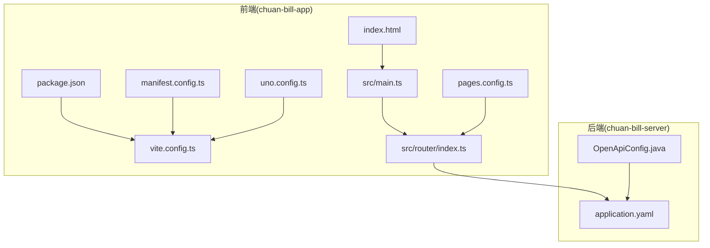
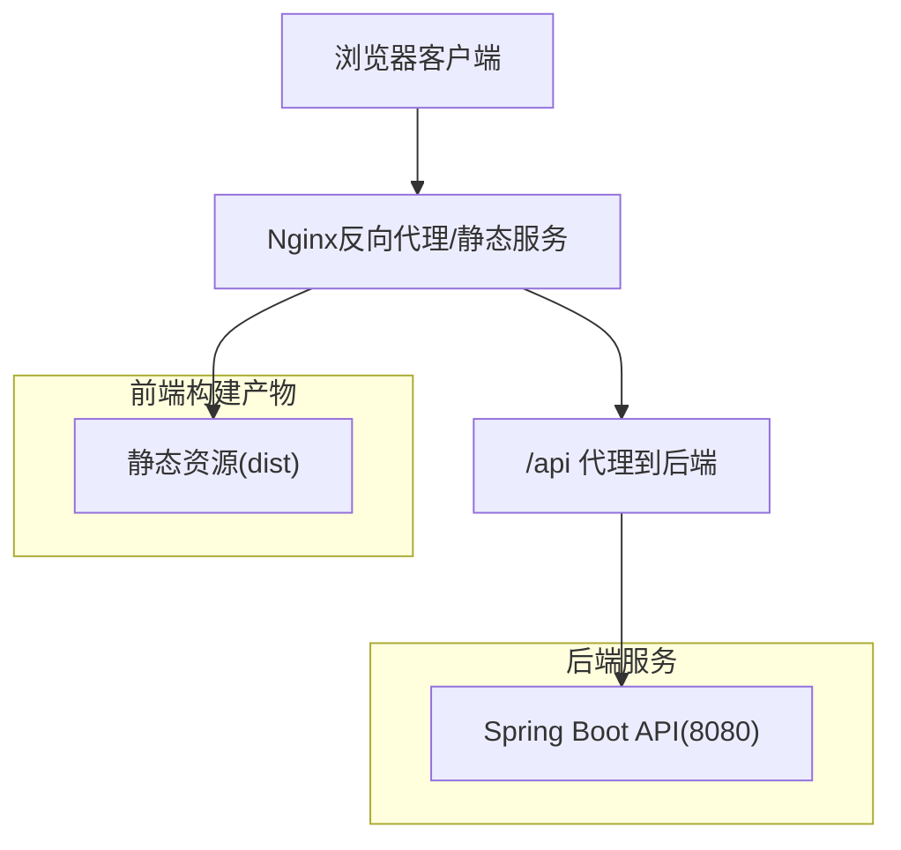
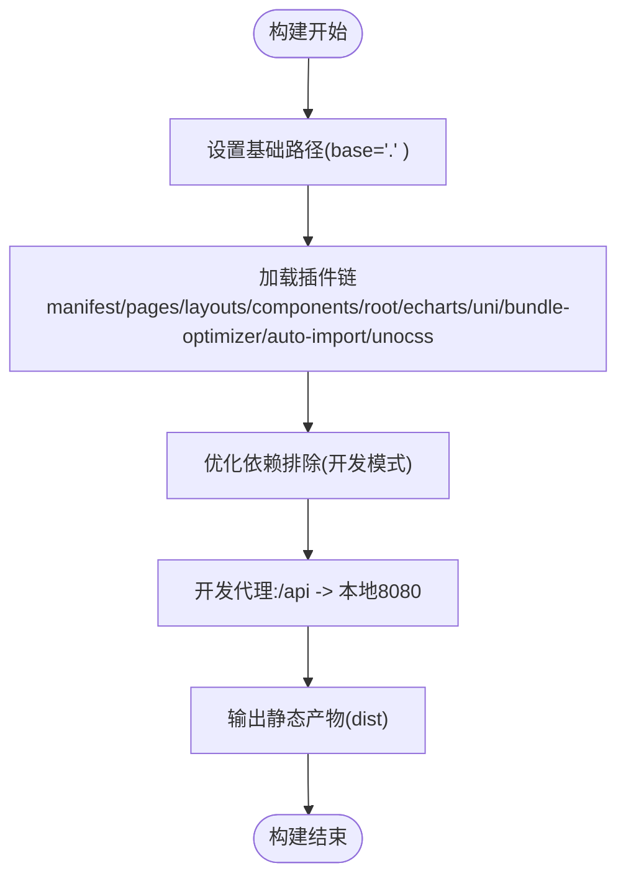
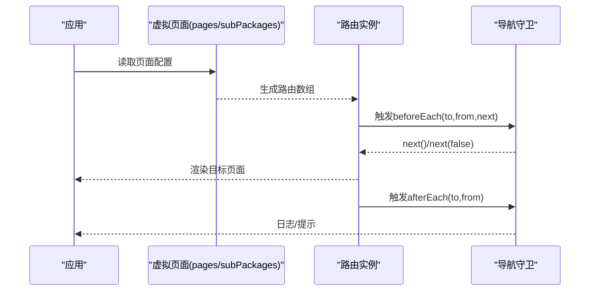
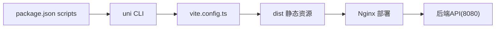

# H5网页部署

<cite>
**本文引用的文件**
- [vite.config.ts](file://chuan-bill-app/vite.config.ts)
- [package.json](file://chuan-bill-app/package.json)
- [index.html](file://chuan-bill-app/index.html)
- [main.ts](file://chuan-bill-app/src/main.ts)
- [router/index.ts](file://chuan-bill-app/src/router/index.ts)
- [manifest.config.ts](file://chuan-bill-app/manifest.config.ts)
- [pages.config.ts](file://chuan-bill-app/pages.config.ts)
- [uno.config.ts](file://chuan-bill-app/uno.config.ts)
- [application.yaml](file://chuan-bill-server/src/main/resources/application.yaml)
- [OpenApiConfig.java](file://chuan-bill-server/src/main/java/com/samoy/chuanbillserver/config/OpenApiConfig.java)
- [PRD.md](file://PRD.md)
</cite>

## 目录
1. [简介](#简介)
2. [项目结构](#项目结构)
3. [核心组件](#核心组件)
4. [架构总览](#架构总览)
5. [详细组件分析](#详细组件分析)
6. [依赖关系分析](#依赖关系分析)
7. [性能考虑](#性能考虑)
8. [故障排查指南](#故障排查指南)
9. [结论](#结论)
10. [附录](#附录)

## 简介
本指南面向“小川记账”H5网页部署，基于uni-app生态与Vite构建体系，覆盖以下主题：
- uni-app H5平台构建配置与路由模式
- 静态资源与公共资源处理、代码分割与懒加载
- Nginx部署、CDN加速、缓存与压缩策略
- 移动端适配（viewport、rem、flexible.js、CSS单位转换）
- SEO优化（meta标签、标题描述、结构化数据）
- 性能监控与分析（Google Analytics、百度统计等）

## 项目结构
该仓库采用“前后端分离”的多模块结构：
- 前端：chuan-bill-app（uni-app + Vue3 + Vite）
- 后端：chuan-bill-server（Spring Boot + MySQL + Redis）
- 文档与产品：PRD.md、CLAUDE.md 等

**图示来源**
- [vite.config.ts:17-80](file://chuan-bill-app/vite.config.ts#L17-L80)
- [package.json:11-56](file://chuan-bill-app/package.json#L11-L56)
- [index.html:1-22](file://chuan-bill-app/index.html#L1-L22)
- [main.ts:1-16](file://chuan-bill-app/src/main.ts#L1-L16)
- [router/index.ts:1-80](file://chuan-bill-app/src/router/index.ts#L1-L80)
- [manifest.config.ts:12-99](file://chuan-bill-app/manifest.config.ts#L12-L99)
- [pages.config.ts:3-43](file://chuan-bill-app/pages.config.ts#L3-L43)
- [uno.config.ts:10-38](file://chuan-bill-app/uno.config.ts#L10-L38)
- [application.yaml:1-51](file://chuan-bill-server/src/main/resources/application.yaml#L1-L51)
- [OpenApiConfig.java:16-30](file://chuan-bill-server/src/main/java/com/samoy/chuanbillserver/config/OpenApiConfig.java#L16-L30)

**章节来源**
- [package.json:11-56](file://chuan-bill-app/package.json#L11-L56)
- [vite.config.ts:17-80](file://chuan-bill-app/vite.config.ts#L17-L80)
- [index.html:1-22](file://chuan-bill-app/index.html#L1-L22)

## 核心组件
- 构建与插件体系：Vite + @uni-helper系列插件 + UnoCSS + AutoImport + ECharts集成
- 路由与页面：基于虚拟页面生成器与路由守卫
- 主题与样式：UnoCSS + 自定义主题变量
- H5平台配置：manifest.config.ts中的h5节点
- 服务端配置：Spring Boot配置文件与OpenAPI文档

**章节来源**
- [vite.config.ts:17-80](file://chuan-bill-app/vite.config.ts#L17-L80)
- [router/index.ts:1-80](file://chuan-bill-app/src/router/index.ts#L1-L80)
- [manifest.config.ts:91-99](file://chuan-bill-app/manifest.config.ts#L91-L99)
- [uno.config.ts:10-38](file://chuan-bill-app/uno.config.ts#L10-L38)
- [application.yaml:1-51](file://chuan-bill-server/src/main/resources/application.yaml#L1-L51)

## 架构总览
H5部署采用“前端静态产物 + 反向代理/Nginx + CDN + 后端API”的典型架构。前端通过uni-app构建生成静态资源，后端提供REST API与文档能力。

[此图为概念性架构示意，不对应具体源码文件，故不附“图示来源”]

## 详细组件分析

### Vite构建与H5平台配置
- 基础路径：base设置为相对路径，适配H5部署场景
- 插件链：manifest、pages、layouts、components、root、echarts、uni、bundle-optimizer、auto-import、unocss
- 代理配置：开发时将/api前缀代理至本地后端
- 优化依赖排除：在开发模式下排除部分依赖以提升启动速度

**图示来源**
- [vite.config.ts:17-80](file://chuan-bill-app/vite.config.ts#L17-L80)

**章节来源**
- [vite.config.ts:17-80](file://chuan-bill-app/vite.config.ts#L17-L80)

### 路由与页面生成
- 路由来源：从虚拟页面生成器读取pages与subPackages，统一映射为路由表
- 路由守卫：全局beforeEach/afterEach用于导航日志、演示拦截与提示
- 页面配置：pages.config.ts定义全局样式、导航栏、Tabbar等

**图示来源**
- [router/index.ts:1-80](file://chuan-bill-app/src/router/index.ts#L1-L80)
- [pages.config.ts:3-43](file://chuan-bill-app/pages.config.ts#L3-L43)

**章节来源**
- [router/index.ts:1-80](file://chuan-bill-app/src/router/index.ts#L1-L80)
- [pages.config.ts:3-43](file://chuan-bill-app/pages.config.ts#L3-L43)

### H5平台与主题配置
- manifest.config.ts中h5节点开启暗色模式与主题位置，便于H5端主题一致性
- pages.config.ts定义导航栏与Tabbar样式，支持条件编译与自定义

**章节来源**
- [manifest.config.ts:91-99](file://chuan-bill-app/manifest.config.ts#L91-L99)
- [pages.config.ts:3-43](file://chuan-bill-app/pages.config.ts#L3-L43)

### 样式与主题
- UnoCSS配置：启用presetUni、icons、指令与变体转换器，支持主题颜色变量
- App.vue中定义页面容器背景与深色模式样式

**章节来源**
- [uno.config.ts:10-38](file://chuan-bill-app/uno.config.ts#L10-L38)
- [src/App.vue:1-16](file://chuan-bill-app/src/App.vue#L1-L16)

### 服务端配置与API文档
- application.yaml：数据库、Redis连接、sa-token、MyBatis-Plus、springdoc配置
- OpenApiConfig：Swagger UI与API文档的服务器地址配置（本地与生产）

**章节来源**
- [application.yaml:1-51](file://chuan-bill-server/src/main/resources/application.yaml#L1-L51)
- [OpenApiConfig.java:16-30](file://chuan-bill-server/src/main/java/com/samoy/chuanbillserver/config/OpenApiConfig.java#L16-L30)

## 依赖关系分析
- 前端依赖：@dcloudio/uni-app、@dcloudio/uni-h5、vue、pinia、alova、wot-design-uni、uni-echarts、unocss、@wot-ui/router等
- 构建脚本：dev:h5/build:h5等命令通过uni CLI驱动Vite构建
- 代理与跨域：开发时通过Vite代理解决前后端联调跨域问题

**图示来源**
- [package.json:11-56](file://chuan-bill-app/package.json#L11-L56)
- [vite.config.ts:17-80](file://chuan-bill-app/vite.config.ts#L17-L80)

**章节来源**
- [package.json:11-56](file://chuan-bill-app/package.json#L11-L56)
- [vite.config.ts:70-78](file://chuan-bill-app/vite.config.ts#L70-L78)

## 性能考虑
- 代码分割与懒加载
  - 建议结合路由级懒加载与组件级动态导入，减少首屏体积
  - 利用Vite的动态import特性实现按需加载
- 资源优化
  - 启用压缩与Tree-Shaking（Vite默认开启）
  - 图片与字体资源建议使用CDN与合适的格式（WebP/AVIF）
- 缓存策略
  - 静态资源设置长缓存（带内容指纹），HTML短缓存或不缓存
  - 通过Nginx配置ETag/Last-Modified与Cache-Control
- 网络优化
  - 启用gzip/br压缩
  - 使用HTTP/2或多路复用
- 运行时性能
  - 减少不必要的全局状态与重复渲染
  - 合理使用keep-alive与虚拟滚动

[本节为通用性能指导，不直接分析具体源码文件，故不附“章节来源”]

## 故障排查指南
- 构建失败或依赖缺失
  - 确认Node版本满足package.json引擎要求
  - 使用pnpm安装依赖，避免版本冲突
- 开发代理无效
  - 检查vite.config.ts中proxy配置与target端口
  - 确认后端服务已启动且可访问
- H5页面空白或路由异常
  - 检查index.html中基础路径与预加载占位符
  - 确认路由生成逻辑与页面路径映射
- 样式异常或主题不生效
  - 检查UnoCSS配置与主题变量
  - 确认manifest.config.ts中h5主题配置正确

**章节来源**
- [package.json:8-10](file://chuan-bill-app/package.json#L8-L10)
- [vite.config.ts:70-78](file://chuan-bill-app/vite.config.ts#L70-L78)
- [index.html:1-22](file://chuan-bill-app/index.html#L1-L22)
- [router/index.ts:1-80](file://chuan-bill-app/src/router/index.ts#L1-L80)
- [uno.config.ts:10-38](file://chuan-bill-app/uno.config.ts#L10-L38)
- [manifest.config.ts:91-99](file://chuan-bill-app/manifest.config.ts#L91-L99)

## 结论
本指南基于现有代码库梳理了“小川记账”H5部署的关键配置与最佳实践，涵盖构建、路由、样式、服务端与部署要点。建议在实际部署中结合业务流量特征与安全需求，完善Nginx缓存与压缩策略、HTTPS证书与CDN接入，并持续通过性能监控工具迭代优化。

[本节为总结性内容，不直接分析具体源码文件，故不附“章节来源”]

## 附录

### H5构建与部署清单
- 构建命令
  - 开发：使用dev:h5或dev:h5:development
  - 生产：使用build:h5或build:h5:production
- 输出目录：dist（静态资源）
- 代理配置：开发时/api代理至后端8080端口
- 基础路径：base为相对路径，确保H5部署兼容

**章节来源**
- [package.json:11-56](file://chuan-bill-app/package.json#L11-L56)
- [vite.config.ts:17-80](file://chuan-bill-app/vite.config.ts#L17-L80)
- [index.html:1-22](file://chuan-bill-app/index.html#L1-L22)

### Nginx部署要点
- 静态资源托管：将dist目录作为静态站点根目录
- 反向代理：将/api前缀转发至后端服务（8080）
- 缓存与压缩：对静态资源设置长缓存与gzip/br压缩
- HTTPS：配置SSL证书与强制跳转

[本节为通用部署指导，不直接分析具体源码文件，故不附“章节来源”]

### 移动端适配方案
- viewport配置：index.html中动态注入viewport meta，支持安全区域
- rem适配：建议引入lib-flexible与px转rem工具链
- CSS单位转换：结合UnoCSS与工具链实现px到rem的自动转换
- 响应式布局：使用媒体查询与弹性布局适配多设备

**章节来源**
- [index.html:6-12](file://chuan-bill-app/index.html#L6-L12)

### SEO优化策略
- 标题与描述：在页面级或路由级设置<title>与<meta name="description">
- 结构化数据：根据页面类型添加JSON-LD（如产品、文章、网站）
- 可索引性：robots.txt与sitemap.xml（如需）
- 元标签：Open Graph、Twitter Card等社交分享元标签

[本节为通用SEO指导，不直接分析具体源码文件，故不附“章节来源”]

### 性能监控与分析
- Google Analytics：在index.html或应用初始化阶段注入
- 百度统计：按官方SDK接入，注意合规与隐私
- 自定义埋点：结合路由守卫与业务事件进行关键指标采集
- 工具集成：Lighthouse、Web Vitals、Sentry（错误监控）

[本节为通用监控指导，不直接分析具体源码文件，故不附“章节来源”]

### 产品与功能参考
- 产品PRD概述了核心功能模块与技术实现要求，可作为部署与优化的业务依据

**章节来源**
- [PRD.md:1-168](file://PRD.md#L1-L168)