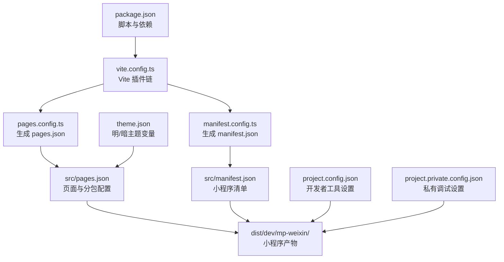
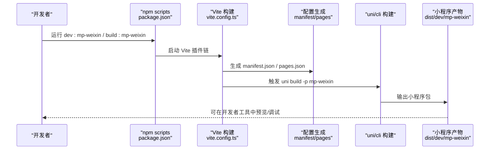
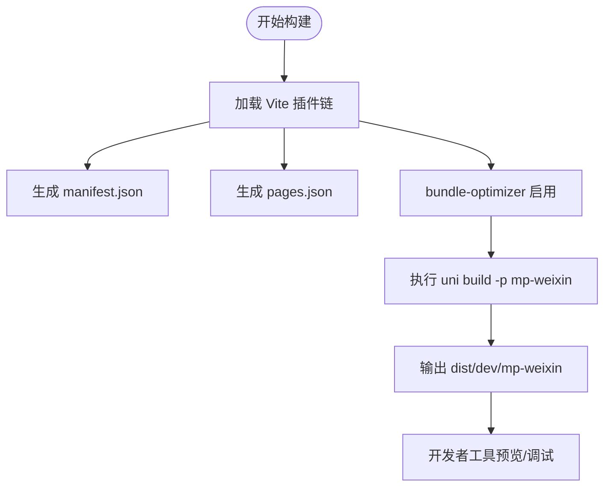
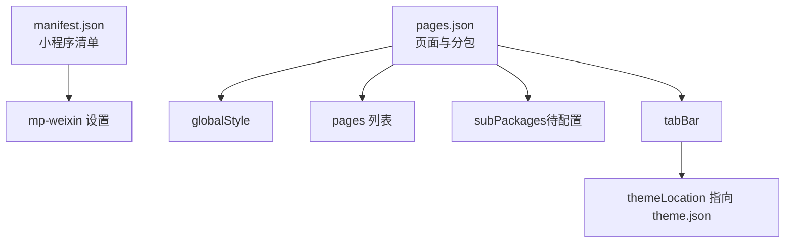
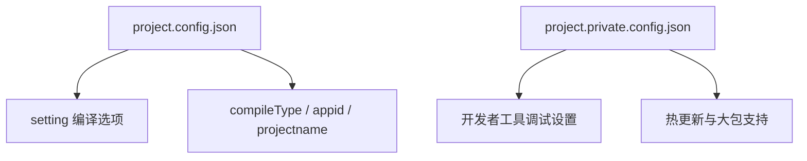
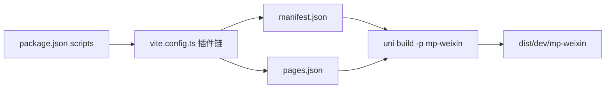

# 微信小程序部署

<cite>
**本文引用的文件**
- [package.json](file://chuan-bill-app/package.json)
- [vite.config.ts](file://chuan-bill-app/vite.config.ts)
- [manifest.config.ts](file://chuan-bill-app/manifest.config.ts)
- [manifest.json](file://chuan-bill-app/src/manifest.json)
- [pages.config.ts](file://chuan-bill-app/pages.config.ts)
- [pages.json](file://chuan-bill-app/src/pages.json)
- [theme.json](file://chuan-bill-app/src/theme.json)
- [project.config.json](file://chuan-bill-app/dist/dev/mp-weixin/project.config.json)
- [project.private.config.json](file://chuan-bill-app/dist/dev/mp-weixin/project.private.config.json)
- [uno.config.ts](file://chuan-bill-app/uno.config.ts)
- [alova.config.ts](file://chuan-bill-app/alova.config.ts)
- [README.md](file://chuan-bill-app/README.md)
</cite>

## 目录
1. [简介](#简介)
2. [项目结构](#项目结构)
3. [核心组件](#核心组件)
4. [架构总览](#架构总览)
5. [详细组件分析](#详细组件分析)
6. [依赖关系分析](#依赖关系分析)
7. [性能考量](#性能考量)
8. [故障排查指南](#故障排查指南)
9. [结论](#结论)
10. [附录](#附录)

## 简介
本指南面向“小川记账”微信小程序的部署与上线，覆盖从开发环境准备、项目初始化、构建与发布全流程，以及微信小程序平台侧的账号申请、注册认证、开发版上传、体验版发布、正式版提交审核等关键步骤。同时，文档深入解析项目配置文件结构（manifest.json、pages.json、主题与分包配置、插件使用等），并总结构建优化策略（代码压缩、资源合并、分包加载、按需加载）。最后提供调试技巧、真机联调方法、性能分析工具使用，以及常见问题排查建议（包体积过大、启动白屏、权限申请失败等）。

## 项目结构
该仓库采用 uni-app 多端统一工程，其中微信小程序产物位于 dist/dev/mp-weixin 目录，核心配置集中在 chuan-bill-app/src 与 chuan-bill-app 下的多个配置文件中。关键点如下：
- 构建与运行：通过 package.json 的 scripts 调用 uni/cli 进行开发与构建，目标平台为 mp-weixin。
- 配置生成：通过 Vite 插件链（uni-manifest、uni-pages、uni-layouts、uni-components、bundle-optimizer 等）自动生成 manifest.json、pages.json、主题与组件注册等。
- 小程序配置：manifest.json 与 pages.json 决定小程序的清单、页面路由、分包、主题与暗色模式等；theme.json 提供明/暗主题变量。
- 开发工具配置：dist/dev/mp-weixin/project.config.json 与 project.private.config.json 控制开发者工具的编译设置、调试行为与大包支持等。

图表来源
- [package.json:11-56](file://chuan-bill-app/package.json#L11-L56)
- [vite.config.ts:17-69](file://chuan-bill-app/vite.config.ts#L17-L69)
- [manifest.config.ts:12-99](file://chuan-bill-app/manifest.config.ts#L12-L99)
- [pages.config.ts:3-42](file://chuan-bill-app/pages.config.ts#L3-L42)
- [manifest.json:1-84](file://chuan-bill-app/src/manifest.json#L1-L84)
- [pages.json:1-83](file://chuan-bill-app/src/pages.json#L1-L83)
- [theme.json:1-27](file://chuan-bill-app/src/theme.json#L1-L27)
- [project.config.json:1-36](file://chuan-bill-app/dist/dev/mp-weixin/project.config.json#L1-L36)
- [project.private.config.json:1-22](file://chuan-bill-app/dist/dev/mp-weixin/project.private.config.json#L1-L22)

章节来源
- [package.json:11-56](file://chuan-bill-app/package.json#L11-L56)
- [vite.config.ts:17-69](file://chuan-bill-app/vite.config.ts#L17-L69)
- [manifest.config.ts:12-99](file://chuan-bill-app/manifest.config.ts#L12-L99)
- [pages.config.ts:3-42](file://chuan-bill-app/pages.config.ts#L3-L42)
- [manifest.json:1-84](file://chuan-bill-app/src/manifest.json#L1-L84)
- [pages.json:1-83](file://chuan-bill-app/src/pages.json#L1-L83)
- [theme.json:1-27](file://chuan-bill-app/src/theme.json#L1-L27)
- [project.config.json:1-36](file://chuan-bill-app/dist/dev/mp-weixin/project.config.json#L1-L36)
- [project.private.config.json:1-22](file://chuan-bill-app/dist/dev/mp-weixin/project.private.config.json#L1-L22)

## 核心组件
- 构建与脚本
  - 通过 npm scripts 调用 uni/cli，支持多端开发与构建，其中 mp-weixin 为目标平台。
  - 本地开发与构建命令分别对应 dev:mp-weixin 与 build:mp-weixin。
- 配置生成与优化
  - Vite 插件链负责 manifest、pages、layouts、components、bundle 优化等。
  - bundle-optimizer 在 mp-weixin 平台启用，提升构建效率与产物体积优化。
- 清单与页面配置
  - manifest.json 控制小程序基础信息、平台设置、分包优化、暗色模式与主题位置等。
  - pages.json 定义全局样式、TabBar、页面列表与分包配置。
- 主题系统
  - theme.json 提供明/暗两套主题变量，manifest.json 中启用 darkmode 并指定 themeLocation。
- 开发工具配置
  - project.config.json 与 project.private.config.json 控制编译选项、调试开关与大包支持等。

章节来源
- [package.json:11-56](file://chuan-bill-app/package.json#L11-L56)
- [vite.config.ts:17-69](file://chuan-bill-app/vite.config.ts#L17-L69)
- [manifest.json:50-62](file://chuan-bill-app/src/manifest.json#L50-L62)
- [pages.json:15-81](file://chuan-bill-app/src/pages.json#L15-L81)
- [theme.json:1-27](file://chuan-bill-app/src/theme.json#L1-L27)
- [project.config.json:6-12](file://chuan-bill-app/dist/dev/mp-weixin/project.config.json#L6-L12)
- [project.private.config.json:5-21](file://chuan-bill-app/dist/dev/mp-weixin/project.private.config.json#L5-L21)

## 架构总览
下图展示了从源码到微信小程序产物的关键流程：Vite 插件链生成清单与页面配置，随后 uni/cli 执行构建，最终输出 dist/dev/mp-weixin 目录下的小程序包。

图表来源
- [package.json:28-48](file://chuan-bill-app/package.json#L28-L48)
- [vite.config.ts:17-69](file://chuan-bill-app/vite.config.ts#L17-L69)
- [manifest.json:1-84](file://chuan-bill-app/src/manifest.json#L1-L84)
- [pages.json:1-83](file://chuan-bill-app/src/pages.json#L1-L83)

## 详细组件分析

### 构建与优化组件
- Vite 插件链
  - uni-manifest、uni-pages、uni-layouts、uni-components、uni-echarts、@uni-ku/bundle-optimizer、AutoImport、UnoCSS 等。
  - bundle-optimizer 在 mp-weixin 平台启用，提升构建效率与产物体积优化。
- 代理与开发服务器
  - 本地开发时通过代理将 /api 请求转发至后端服务，便于前后端联调。
- UnoCSS
  - 原子化 CSS，减少样式体积，提升构建速度。

图表来源
- [vite.config.ts:22-69](file://chuan-bill-app/vite.config.ts#L22-L69)
- [manifest.config.ts:12-99](file://chuan-bill-app/manifest.config.ts#L12-L99)
- [pages.config.ts:3-42](file://chuan-bill-app/pages.config.ts#L3-L42)

章节来源
- [vite.config.ts:17-79](file://chuan-bill-app/vite.config.ts#L17-L79)
- [uno.config.ts:10-37](file://chuan-bill-app/uno.config.ts#L10-L37)

### 清单与页面配置组件
- manifest.json（小程序清单）
  - 平台特定设置：mp-weixin 区块包含 appid、setting.urlCheck、optimization.subPackages、darkmode、themeLocation、mergeVirtualHostAttributes 等。
  - 全局设置：版本号、px 转换、模块与分发配置等。
- pages.json（页面与分包配置）
  - globalStyle：导航栏、背景色、动画等全局样式。
  - pages：页面路径、类型、布局与局部样式。
  - subPackages：分包配置（当前为空，需按需添加）。
  - tabBar：TabBar 自定义、覆盖、高度与颜色等。
- 主题系统
  - theme.json 提供明/暗两套主题变量，manifest.json 中启用 darkmode 并指定 themeLocation。

图表来源
- [manifest.json:50-62](file://chuan-bill-app/src/manifest.json#L50-L62)
- [pages.json:2-14](file://chuan-bill-app/src/pages.json#L2-L14)
- [pages.json:15-54](file://chuan-bill-app/src/pages.json#L15-L54)
- [pages.json:56-81](file://chuan-bill-app/src/pages.json#L56-L81)
- [theme.json:1-27](file://chuan-bill-app/src/theme.json#L1-L27)

章节来源
- [manifest.json:1-84](file://chuan-bill-app/src/manifest.json#L1-L84)
- [pages.json:1-83](file://chuan-bill-app/src/pages.json#L1-L83)
- [theme.json:1-27](file://chuan-bill-app/src/theme.json#L1-L27)

### 开发工具配置组件
- project.config.json
  - compileType、appid、projectname 等基础配置。
  - setting.urlCheck、minified、bigPackageSizeSupport 等编译与调试选项。
- project.private.config.json
  - setting 中包含 urlCheck、coverView、lazyloadPlaceholderEnable、skylineRenderEnable、autoAudits、useApiHook、compileHotReLoad、bigPackageSizeSupport 等调试与热更新相关设置。

图表来源
- [project.config.json:1-36](file://chuan-bill-app/dist/dev/mp-weixin/project.config.json#L1-L36)
- [project.private.config.json:5-21](file://chuan-bill-app/dist/dev/mp-weixin/project.private.config.json#L5-L21)

章节来源
- [project.config.json:1-36](file://chuan-bill-app/dist/dev/mp-weixin/project.config.json#L1-L36)
- [project.private.config.json:1-22](file://chuan-bill-app/dist/dev/mp-weixin/project.private.config.json#L1-L22)

### API 与类型生成组件
- alova.config.ts
  - 基于 Swagger/OpenAPI 文档生成 TypeScript 接口与类型文件，支持过滤弃用接口、自动更新等。
  - 输出路径指向 src/api，便于在前端直接消费接口类型与实现。

章节来源
- [alova.config.ts:8-84](file://chuan-bill-app/alova.config.ts#L8-L84)

## 依赖关系分析
- 构建链路
  - package.json 的 scripts 作为入口，调用 uni/cli。
  - vite.config.ts 注入各类插件，完成 manifest、pages、components、bundle 优化等。
  - 生成的 manifest.json 与 pages.json 作为小程序构建输入。
- 平台差异
  - manifest.json 的 mp-weixin 区块控制小程序平台特性（分包、暗色模式、主题、URL 校验等）。
  - pages.json 的 subPackages 当前为空，需根据业务拆分主/分包以降低首包体积。
- 工具链
  - UnoCSS 提供原子化样式，减少冗余 CSS。
  - bundle-optimizer 在 mp-weixin 平台启用，有助于减小包体与提升构建效率。

图表来源
- [package.json:11-56](file://chuan-bill-app/package.json#L11-L56)
- [vite.config.ts:17-69](file://chuan-bill-app/vite.config.ts#L17-L69)
- [manifest.json:1-84](file://chuan-bill-app/src/manifest.json#L1-L84)
- [pages.json:1-83](file://chuan-bill-app/src/pages.json#L1-L83)

章节来源
- [package.json:11-56](file://chuan-bill-app/package.json#L11-L56)
- [vite.config.ts:17-69](file://chuan-bill-app/vite.config.ts#L17-L69)
- [manifest.json:50-62](file://chuan-bill-app/src/manifest.json#L50-L62)
- [pages.json:56](file://chuan-bill-app/src/pages.json#L56)

## 性能考量
- 代码压缩与资源合并
  - 使用 bundle-optimizer 在 mp-weixin 平台启用优化，减少冗余代码与提升加载性能。
  - 通过 Vite 的 optimizeDeps 与 AutoImport 减少重复依赖与样板代码。
- 分包加载与按需加载
  - pages.json 的 subPackages 当前为空，建议将不常用页面或第三方库放入分包，降低主包体积。
  - 组件与页面层面采用按需加载策略，避免一次性加载全部资源。
- 样式与主题
  - UnoCSS 原子化样式减少 CSS 体积与重复定义。
  - theme.json 提供明/暗主题变量，结合 darkmode 降低主题切换成本。
- 网络与接口
  - 通过代理将 /api 请求转发至后端，便于联调与性能测试。
  - Alova 自动生成接口类型，减少手写错误与提升开发效率。

章节来源
- [vite.config.ts:46-49](file://chuan-bill-app/vite.config.ts#L46-L49)
- [vite.config.ts:19-21](file://chuan-bill-app/vite.config.ts#L19-L21)
- [uno.config.ts:10-37](file://chuan-bill-app/uno.config.ts#L10-L37)
- [manifest.json:56-62](file://chuan-bill-app/src/manifest.json#L56-L62)
- [pages.json:56](file://chuan-bill-app/src/pages.json#L56)
- [alova.config.ts:26-53](file://chuan-bill-app/alova.config.ts#L26-L53)

## 故障排查指南
- 包体积过大
  - 检查 pages.json 的 subPackages 是否合理拆分，将非首屏资源移至分包。
  - 关闭不必要的插件或优化策略，确保 bundle-optimizer 在 mp-weixin 平台启用。
  - 使用 UnoCSS 原子化样式，避免重复定义。
- 启动白屏
  - 检查 project.config.json 与 project.private.config.json 的 setting 项，确认 urlCheck、minified、bigPackageSizeSupport 等是否符合预期。
  - 确认 manifest.json 的 themeLocation 与 theme.json 路径正确，避免主题加载异常。
- 权限申请失败
  - 检查 manifest.json 的 app-plus.permissions 与 mp-weixin.setting 配置，确保权限声明与平台要求一致。
- 真机调试与性能分析
  - 使用微信开发者工具打开 dist/dev/mp-weixin，开启编译热更新与大包支持。
  - 结合项目内代理配置，验证 /api 请求是否正常转发至后端服务。
  - 使用开发者工具的性能面板与网络面板定位卡顿与请求异常。

章节来源
- [project.config.json:6-12](file://chuan-bill-app/dist/dev/mp-weixin/project.config.json#L6-L12)
- [project.private.config.json:5-21](file://chuan-bill-app/dist/dev/mp-weixin/project.private.config.json#L5-L21)
- [manifest.json:50-62](file://chuan-bill-app/src/manifest.json#L50-L62)
- [manifest.json:20-52](file://chuan-bill-app/src/manifest.json#L20-L52)

## 结论
本指南围绕“小川记账”微信小程序的部署与上线，系统梳理了开发环境、项目初始化、构建与发布流程，并对配置文件结构、构建优化策略、调试与性能分析、常见问题排查进行了详细说明。建议在实际上线前完成分包拆分、主题与暗色模式校验、权限与网络代理配置，并在开发者工具中充分验证性能与稳定性。

## 附录
- 快速上手与周边生态可参考项目 README。
- 本项目使用 Vite、UnoCSS、Alova、@wot-ui/router、wot-design-uni 等技术栈，建议在团队内统一开发规范与版本管理。

章节来源
- [README.md:16-47](file://chuan-bill-app/README.md#L16-L47)