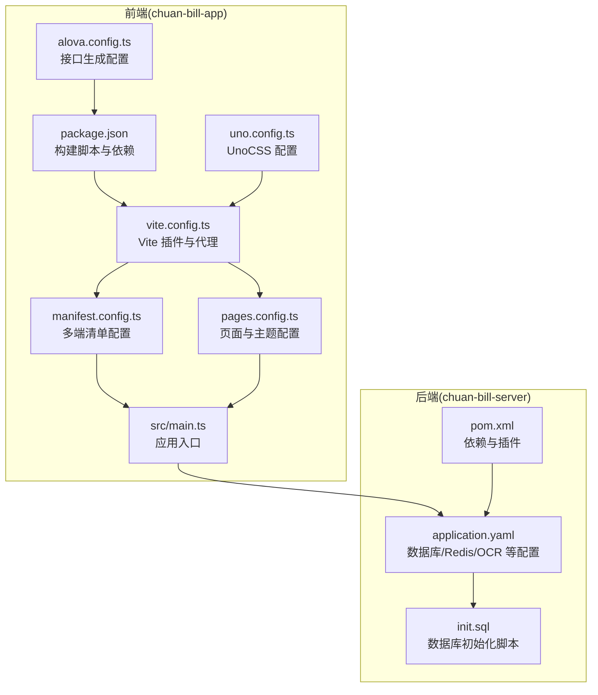
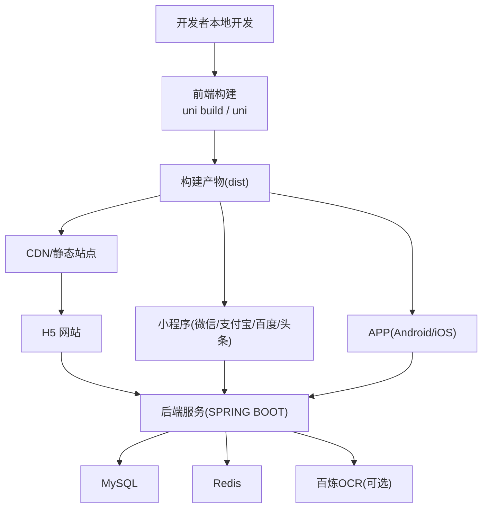
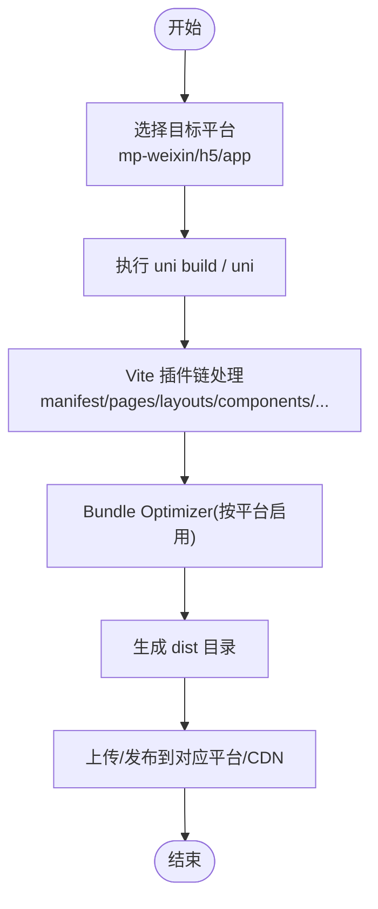
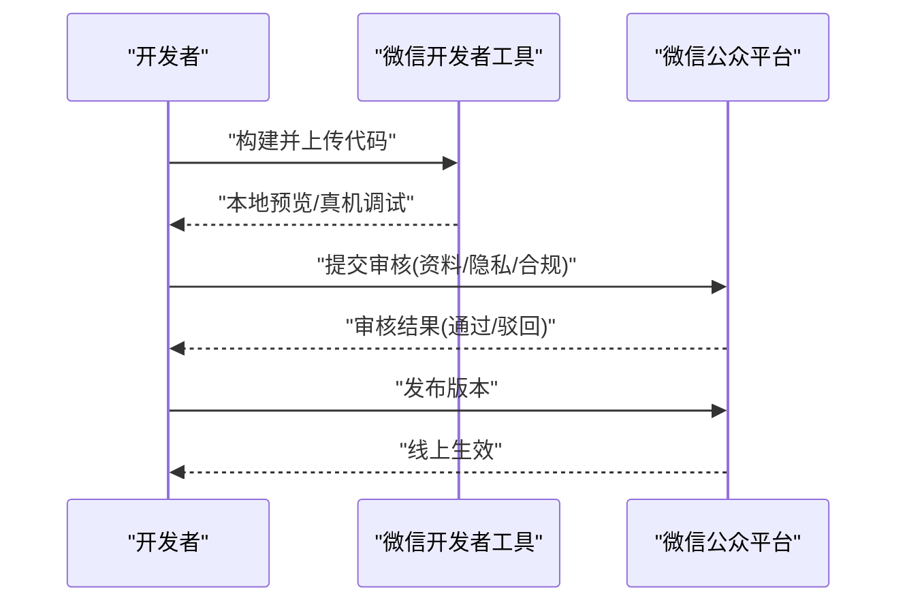
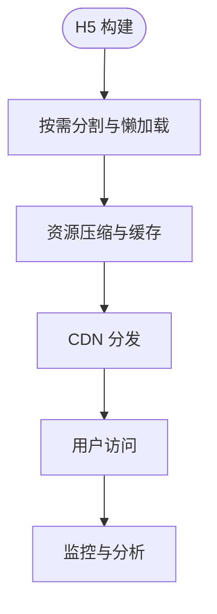
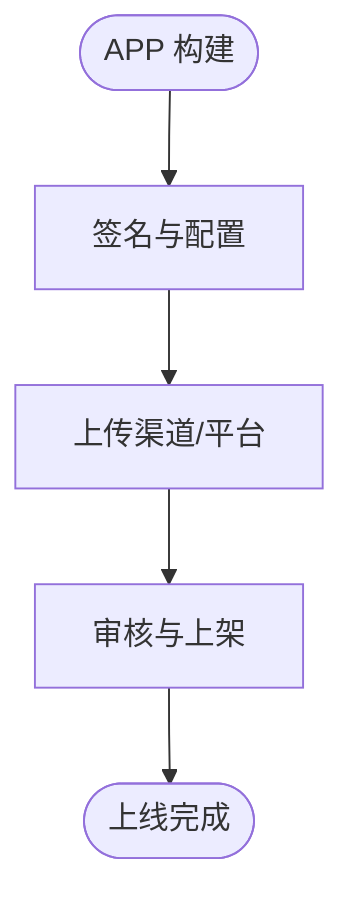
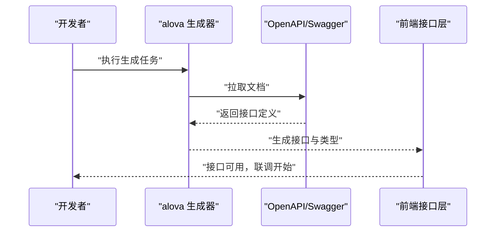
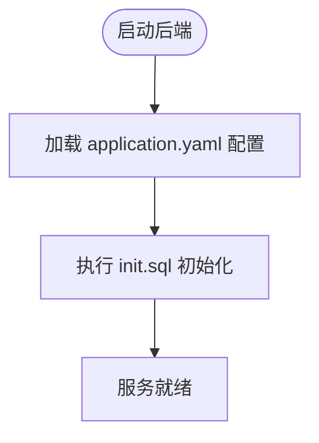
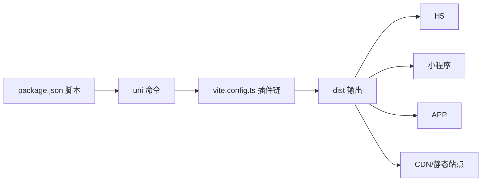

# 跨平台部署

<cite>
**本文引用的文件**
- [package.json](file://chuan-bill-app/package.json)
- [vite.config.ts](file://chuan-bill-app/vite.config.ts)
- [manifest.config.ts](file://chuan-bill-app/manifest.config.ts)
- [pages.config.ts](file://chuan-bill-app/pages.config.ts)
- [src/manifest.json](file://chuan-bill-app/src/manifest.json)
- [uno.config.ts](file://chuan-bill-app/uno.config.ts)
- [alova.config.ts](file://chuan-bill-app/alova.config.ts)
- [src/main.ts](file://chuan-bill-app/src/main.ts)
- [chuan-bill-server/pom.xml](file://chuan-bill-server/pom.xml)
- [chuan-bill-server/src/main/resources/application.yaml](file://chuan-bill-server/src/main/resources/application.yaml)
- [chuan-bill-server/init.sql](file://chuan-bill-server/init.sql)
- [.gitignore](file://chuan-bill-app/.gitignore)
- [PRD.md](file://PRD.md)
</cite>

## 目录
1. [简介](#简介)
2. [项目结构](#项目结构)
3. [核心组件](#核心组件)
4. [架构总览](#架构总览)
5. [详细组件分析](#详细组件分析)
6. [依赖分析](#依赖分析)
7. [性能考虑](#性能考虑)
8. [故障排查指南](#故障排查指南)
9. [结论](#结论)
10. [附录](#附录)

## 简介
本指南面向“小川记账”跨平台部署，围绕 uni-app 的多平台编译与发布机制，系统讲解微信小程序、H5 网页、APP 应用的构建配置与发布流程；覆盖各平台特殊配置、权限申请与审核要点；阐述构建优化策略（代码分割、资源压缩、CDN）、CI/CD 流水线设计、性能与用户体验优化、兼容性处理，以及部署环境准备（域名、SSL、服务器）、故障排查、回滚与监控告警。

## 项目结构
- 前端工程位于 chuan-bill-app，采用 uni-app 3 + Vite 架构，支持多端统一开发与构建。
- 后端工程位于 chuan-bill-server，基于 Spring Boot 3 + MyBatis-Plus，提供 REST API、鉴权、文档与 OCR 能力。
- 数据库初始化脚本与环境变量在后端工程中定义，便于本地与生产环境部署。

**图示来源**
- [package.json:11-56](file://chuan-bill-app/package.json#L11-L56)
- [vite.config.ts:17-80](file://chuan-bill-app/vite.config.ts#L17-L80)
- [manifest.config.ts:12-99](file://chuan-bill-app/manifest.config.ts#L12-L99)
- [pages.config.ts:3-42](file://chuan-bill-app/pages.config.ts#L3-L42)
- [src/main.ts:1-16](file://chuan-bill-app/src/main.ts#L1-L16)
- [uno.config.ts:10-37](file://chuan-bill-app/uno.config.ts#L10-L37)
- [alova.config.ts:8-84](file://chuan-bill-app/alova.config.ts#L8-L84)
- [chuan-bill-server/pom.xml:51-168](file://chuan-bill-server/pom.xml#L51-L168)
- [chuan-bill-server/src/main/resources/application.yaml:1-51](file://chuan-bill-server/src/main/resources/application.yaml#L1-L51)
- [chuan-bill-server/init.sql:1-326](file://chuan-bill-server/init.sql#L1-L326)

**章节来源**
- [package.json:11-56](file://chuan-bill-app/package.json#L11-L56)
- [vite.config.ts:17-80](file://chuan-bill-app/vite.config.ts#L17-L80)
- [manifest.config.ts:12-99](file://chuan-bill-app/manifest.config.ts#L12-L99)
- [pages.config.ts:3-42](file://chuan-bill-app/pages.config.ts#L3-L42)
- [src/main.ts:1-16](file://chuan-bill-app/src/main.ts#L1-L16)
- [uno.config.ts:10-37](file://chuan-bill-app/uno.config.ts#L10-L37)
- [alova.config.ts:8-84](file://chuan-bill-app/alova.config.ts#L8-L84)
- [chuan-bill-server/pom.xml:51-168](file://chuan-bill-server/pom.xml#L51-L168)
- [chuan-bill-server/src/main/resources/application.yaml:1-51](file://chuan-bill-server/src/main/resources/application.yaml#L1-L51)
- [chuan-bill-server/init.sql:1-326](file://chuan-bill-server/init.sql#L1-L326)

## 核心组件
- 构建与脚本：通过 package.json 中的 uni 命令与模式参数，统一驱动多端构建与开发。
- Vite 配置：集成页面、布局、组件、自动导入、UnoCSS、ECharts、Bundle Optimizer 等插件，支持代理与基础路径。
- 清单与页面：manifest.config.ts/pages.config.ts 定义多端清单、权限、主题、分包与 Tabbar。
- 应用入口：src/main.ts 注册路由、状态管理与全局样式。
- 接口生成：alova.config.ts 基于 OpenAPI/Swagger 自动生成前后端接口与类型。
- 后端依赖与配置：pom.xml 管理依赖与插件，application.yaml 提供数据库、Redis、OCR 等运行时配置。
- 数据库初始化：init.sql 提供建库建表与系统默认数据。

**章节来源**
- [package.json:11-56](file://chuan-bill-app/package.json#L11-L56)
- [vite.config.ts:17-80](file://chuan-bill-app/vite.config.ts#L17-L80)
- [manifest.config.ts:12-99](file://chuan-bill-app/manifest.config.ts#L12-L99)
- [pages.config.ts:3-42](file://chuan-bill-app/pages.config.ts#L3-L42)
- [src/main.ts:1-16](file://chuan-bill-app/src/main.ts#L1-L16)
- [alova.config.ts:8-84](file://chuan-bill-app/alova.config.ts#L8-L84)
- [chuan-bill-server/pom.xml:51-168](file://chuan-bill-server/pom.xml#L51-L168)
- [chuan-bill-server/src/main/resources/application.yaml:1-51](file://chuan-bill-server/src/main/resources/application.yaml#L1-L51)
- [chuan-bill-server/init.sql:1-326](file://chuan-bill-server/init.sql#L1-L326)

## 架构总览
下图展示从开发到多端发布的整体流程，涵盖前端构建、后端服务、数据库与静态资源托管的关键节点。

**图示来源**
- [package.json:32-51](file://chuan-bill-app/package.json#L32-L51)
- [vite.config.ts:18-78](file://chuan-bill-app/vite.config.ts#L18-L78)
- [chuan-bill-server/pom.xml:51-168](file://chuan-bill-server/pom.xml#L51-L168)
- [chuan-bill-server/src/main/resources/application.yaml:4-51](file://chuan-bill-server/src/main/resources/application.yaml#L4-L51)

## 详细组件分析

### 构建与多端发布（uni-app）
- 构建命令与模式
  - 开发：dev:mp-weixin、dev:h5、dev:app-android、dev:app-ios 等，分别对应不同平台与模式。
  - 生产：build:mp-weixin、build:h5、build:app 等，输出 dist 目录。
- Vite 配置要点
  - 基础路径 base: "./"，适配多端相对路径。
  - 插件链：manifest、pages、layouts、components、root、echarts、uni、bundle-optimizer、auto-import、unocss。
  - 代理：/api 代理至本地后端服务，便于联调。
- 清单与页面
  - manifest.config.ts 定义各端 appid、权限、分包、主题、暗色模式等。
  - pages.config.ts 定义导航栏、Tabbar、主题变量等。
- 入口与样式
  - src/main.ts 注册路由、状态管理与全局样式，确保多端一致行为。

**图示来源**
- [package.json:11-56](file://chuan-bill-app/package.json#L11-L56)
- [vite.config.ts:17-80](file://chuan-bill-app/vite.config.ts#L17-L80)
- [manifest.config.ts:63-94](file://chuan-bill-app/manifest.config.ts#L63-L94)
- [pages.config.ts:3-42](file://chuan-bill-app/pages.config.ts#L3-L42)

**章节来源**
- [package.json:11-56](file://chuan-bill-app/package.json#L11-L56)
- [vite.config.ts:17-80](file://chuan-bill-app/vite.config.ts#L17-L80)
- [manifest.config.ts:12-99](file://chuan-bill-app/manifest.config.ts#L12-L99)
- [pages.config.ts:3-42](file://chuan-bill-app/pages.config.ts#L3-L42)
- [src/main.ts:1-16](file://chuan-bill-app/src/main.ts#L1-L16)

### 微信小程序发布与审核要点
- 清单与分包
  - 在 manifest.config.ts 的 mp-weixin 节点开启分包与主题配置，subPackages: true。
  - 设置 appid 与 setting.urlCheck 等。
- 权限与隐私
  - Android 权限在 app-plus.android.permissions 中声明，如相机、网络状态等。
  - 需在微信公众平台完成隐私合规与权限申请。
- 审核与发布
  - 本地调试通过后，在开发者工具上传代码，按指引完善基本信息与服务类目。
  - 注意避免敏感接口与违规内容，确保隐私政策与用户协议清晰。

**图示来源**
- [manifest.config.ts:63-75](file://chuan-bill-app/manifest.config.ts#L63-L75)
- [src/manifest.json:50-62](file://chuan-bill-app/src/manifest.json#L50-L62)

**章节来源**
- [manifest.config.ts:63-75](file://chuan-bill-app/manifest.config.ts#L63-L75)
- [src/manifest.json:50-62](file://chuan-bill-app/src/manifest.json#L50-L62)

### H5 网页部署与性能优化
- 构建与部署
  - 使用 build:h5 或 build:h5:ssr 生成静态资源，部署至 Nginx/Apache/CDN。
  - base: "./" 保证静态资源相对路径正确。
- 性能优化
  - 代码分割：按需加载页面与组件，减少首屏体积。
  - 资源压缩：开启 Gzip/Brotli，合理设置缓存策略。
  - CDN：静态资源走 CDN，动态接口直连后端。
- 主题与暗色模式
  - pages.config.ts 与 manifest.config.ts 的 h5 节点开启暗色模式与主题文件。

**图示来源**
- [vite.config.ts:18-78](file://chuan-bill-app/vite.config.ts#L18-L78)
- [pages.config.ts:91-94](file://chuan-bill-app/pages.config.ts#L91-L94)
- [manifest.config.ts:91-94](file://chuan-bill-app/manifest.config.ts#L91-L94)

**章节来源**
- [vite.config.ts:18-78](file://chuan-bill-app/vite.config.ts#L18-L78)
- [pages.config.ts:91-94](file://chuan-bill-app/pages.config.ts#L91-L94)
- [manifest.config.ts:91-94](file://chuan-bill-app/manifest.config.ts#L91-L94)

### APP 应用（Android/iOS）构建与上架
- 权限与模块
  - Android 权限在 app-plus.android.permissions 中声明；iOS 可在对应节点补充。
- 打包与签名
  - 使用 DCloud/HBuilderX 进行签名打包；确保 keystore 与配置正确。
- 上架流程
  - Android：Google Play/应用宝等渠道；iOS：App Store Connect。
  - 提交前完成隐私清单、截图与描述文案。

**图示来源**
- [manifest.config.ts:34-58](file://chuan-bill-app/manifest.config.ts#L34-L58)
- [src/manifest.json:20-42](file://chuan-bill-app/src/manifest.json#L20-L42)

**章节来源**
- [manifest.config.ts:34-58](file://chuan-bill-app/manifest.config.ts#L34-L58)
- [src/manifest.json:20-42](file://chuan-bill-app/src/manifest.json#L20-L42)

### 接口生成与联调（Alova + Swagger）
- 配置说明
  - alova.config.ts 指定 OpenAPI/Swagger 文档地址，生成接口与类型文件至 src/api。
  - 自动更新策略可按需启用。
- 联调流程
  - 前端通过 /api 代理访问后端，确保本地开发与联调一致。

**图示来源**
- [alova.config.ts:8-84](file://chuan-bill-app/alova.config.ts#L8-L84)
- [vite.config.ts:70-78](file://chuan-bill-app/vite.config.ts#L70-L78)

**章节来源**
- [alova.config.ts:8-84](file://chuan-bill-app/alova.config.ts#L8-L84)
- [vite.config.ts:70-78](file://chuan-bill-app/vite.config.ts#L70-L78)

### 后端服务（Spring Boot）部署
- 依赖与插件
  - pom.xml 管理 Web、MyBatis-Plus、Redis、Actuator、OpenAPI、百炼 SDK 等。
- 运行配置
  - application.yaml 通过环境变量注入数据库、Redis、OCR 等配置。
- 初始化与数据
  - init.sql 提供建库建表与系统默认数据，便于快速初始化。

**图示来源**
- [chuan-bill-server/pom.xml:51-168](file://chuan-bill-server/pom.xml#L51-L168)
- [chuan-bill-server/src/main/resources/application.yaml:1-51](file://chuan-bill-server/src/main/resources/application.yaml#L1-L51)
- [chuan-bill-server/init.sql:1-326](file://chuan-bill-server/init.sql#L1-L326)

**章节来源**
- [chuan-bill-server/pom.xml:51-168](file://chuan-bill-server/pom.xml#L51-L168)
- [chuan-bill-server/src/main/resources/application.yaml:1-51](file://chuan-bill-server/src/main/resources/application.yaml#L1-L51)
- [chuan-bill-server/init.sql:1-326](file://chuan-bill-server/init.sql#L1-L326)

## 依赖分析
- 前端依赖
  - @dcloudio/uni-app 系列包提供多端能力；@uni-helper 插件生态完善页面、布局、组件、清单、类型生成。
  - @uni-ku/bundle-optimizer 在特定平台启用，提升包体优化效果。
  - UnoCSS、AutoImport、ECharts 等增强开发体验与可视化能力。
- 后端依赖
  - Spring Boot Starter、MyBatis-Plus、Sa-Token、OpenAPI/Swagger UI、百炼 SDK 等。
- 构建与脚本
  - 通过 uni 命令与模式参数统一驱动多端构建，配合 Vite 插件链实现高效开发与优化。

**图示来源**
- [package.json:11-56](file://chuan-bill-app/package.json#L11-L56)
- [vite.config.ts:17-80](file://chuan-bill-app/vite.config.ts#L17-L80)

**章节来源**
- [package.json:57-125](file://chuan-bill-app/package.json#L57-L125)
- [vite.config.ts:17-80](file://chuan-bill-app/vite.config.ts#L17-L80)

## 性能考虑
- 构建优化
  - Bundle Optimizer：在特定平台启用，减少包体与冗余代码。
  - 代码分割：按页面与组件拆分，结合路由懒加载。
  - 资源压缩：Gzip/Brotli，合理缓存策略。
- 运行时优化
  - 按需引入组件与样式，避免全量引入。
  - 图表与多媒体资源按需加载，降低首屏压力。
- 平台差异
  - 小程序：分包策略、本地缓存、网络请求优化。
  - H5：路由懒加载、图片懒加载、骨架屏与预加载。
  - APP：包体大小控制、启动页优化、离线资源策略。

**章节来源**
- [vite.config.ts:46-49](file://chuan-bill-app/vite.config.ts#L46-L49)
- [manifest.config.ts:64-66](file://chuan-bill-app/manifest.config.ts#L64-L66)
- [uno.config.ts:10-37](file://chuan-bill-app/uno.config.ts#L10-L37)

## 故障排查指南
- 构建问题
  - 确认 Node 版本满足 engines 要求；检查 package.json 脚本与 uni 版本兼容性。
  - 若出现依赖解析问题，清理 node_modules 与缓存后重装。
- 代理与联调
  - 检查 vite.config.ts 代理配置是否指向正确的后端地址。
- 小程序审核
  - 确认权限声明完整、隐私政策合规、服务类目准确。
- H5 部署
  - 确保 base: "./" 与服务器路径一致；CDN 缓存策略合理。
- 后端连接
  - 检查 application.yaml 中数据库与 Redis 连接参数，确认 init.sql 已执行。

**章节来源**
- [package.json:8-10](file://chuan-bill-app/package.json#L8-L10)
- [vite.config.ts:70-78](file://chuan-bill-app/vite.config.ts#L70-L78)
- [chuan-bill-server/src/main/resources/application.yaml:4-22](file://chuan-bill-server/src/main/resources/application.yaml#L4-L22)
- [chuan-bill-server/init.sql:1-326](file://chuan-bill-server/init.sql#L1-L326)

## 结论
通过统一的 uni-app 构建体系与完善的多端配置，小川记账可在微信小程序、H5 网页与 APP 三端实现一致的开发体验与高效的发布流程。结合后端 Spring Boot 的模块化依赖与数据库初始化脚本，可快速搭建稳定的服务端支撑。建议在 CI/CD 中固化构建、测试与发布步骤，并配套监控与告警，持续优化用户体验与平台合规性。

## 附录

### CI/CD 流水线设计建议
- 触发条件
  - push 到 main 分支触发构建与测试；PR 触发静态检查与单元测试。
- 步骤
  - 依赖安装（pnpm install）
  - 类型检查与 ESLint
  - 单元测试（如有）
  - 多端构建（按平台分别构建）
  - 产物归档与发布（H5/小程序/APP）
  - 后端构建与镜像推送（可选）
- 部署策略
  - H5：上传至 CDN/对象存储，配置缓存与回源。
  - 小程序：通过 CI 自动上传代码，保留版本与回滚。
  - APP：签名打包并上传至各应用市场。
- 回滚策略
  - 保留最近 N 个版本；H5 通过 CDN 版本号切换；小程序/APP 通过平台版本管理回滚。
- 监控告警
  - 前端：性能指标（首屏、交互延迟）、错误上报。
  - 后端：接口响应时间、错误率、数据库与 Redis 健康度。

### 部署环境准备
- 域名与 SSL
  - 为 H5 与后端服务申请域名与 SSL 证书，确保 HTTPS。
- 服务器与 CDN
  - H5 静态资源部署至 CDN；后端服务部署至云服务器或容器平台。
- 数据库与缓存
  - 准备 MySQL 与 Redis 实例，执行 init.sql 初始化。
- 环境变量
  - 通过环境变量注入数据库、Redis、OCR 等配置项。

**章节来源**
- [chuan-bill-server/src/main/resources/application.yaml:4-51](file://chuan-bill-server/src/main/resources/application.yaml#L4-L51)
- [chuan-bill-server/init.sql:1-326](file://chuan-bill-server/init.sql#L1-L326)
- [.gitignore:1-22](file://chuan-bill-app/.gitignore#L1-L22)
- [PRD.md:142-152](file://PRD.md#L142-L152)