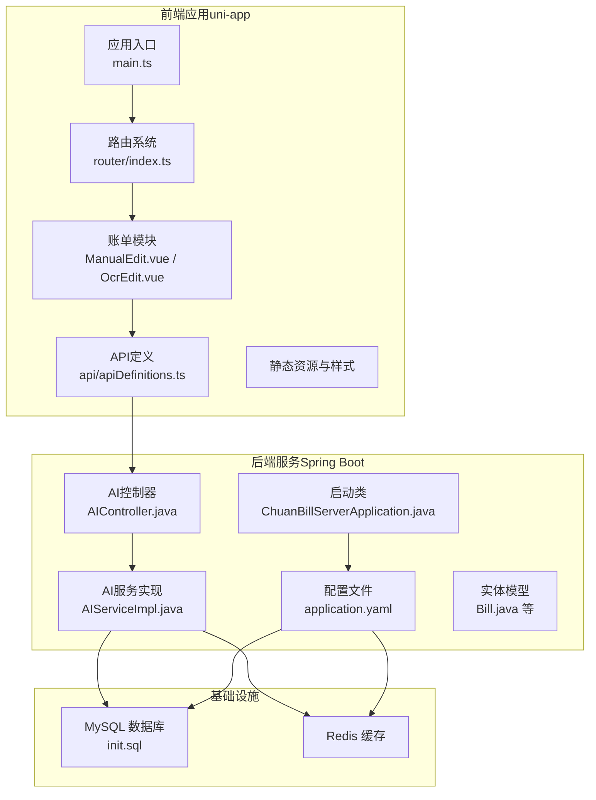
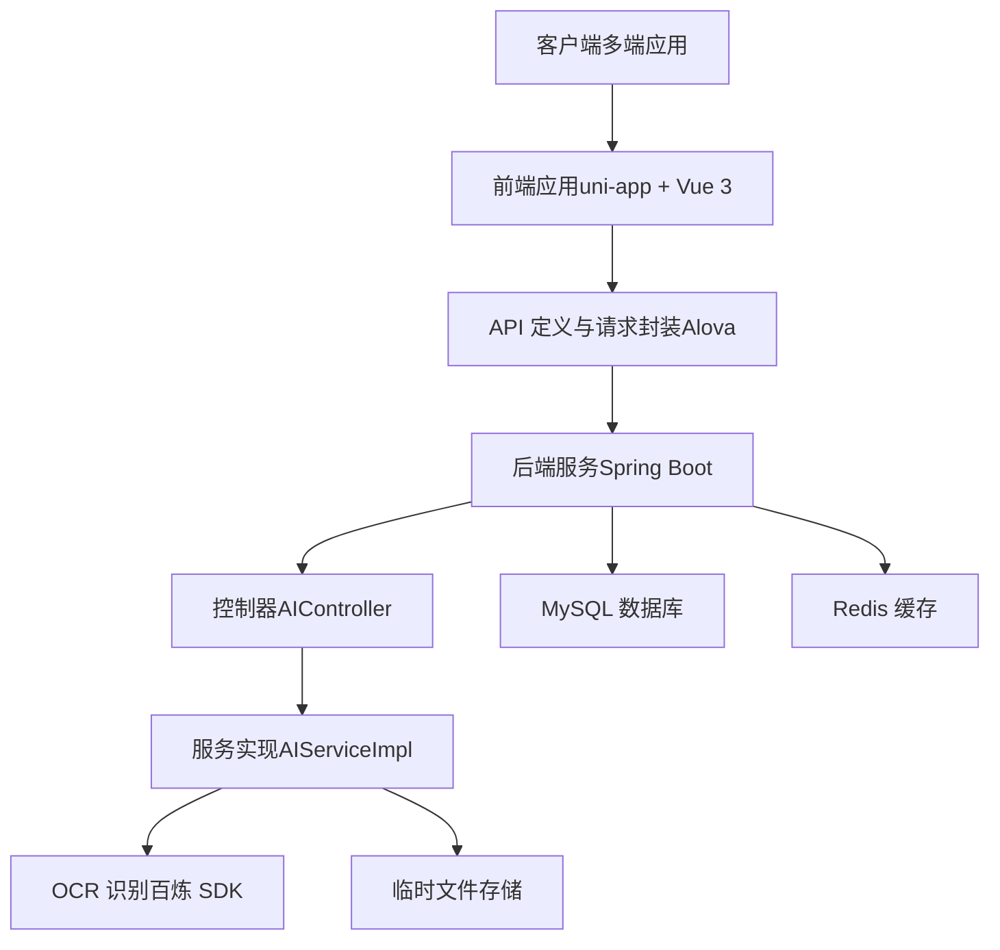
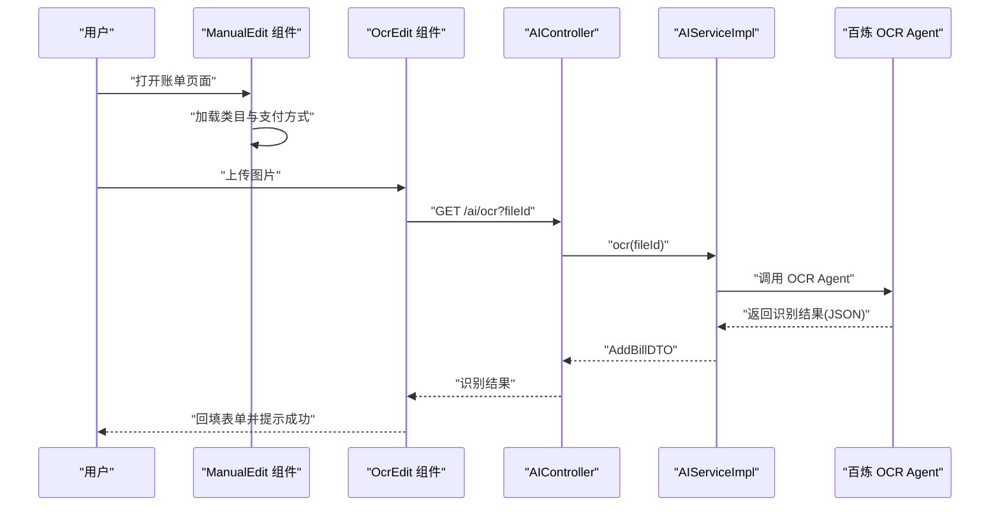
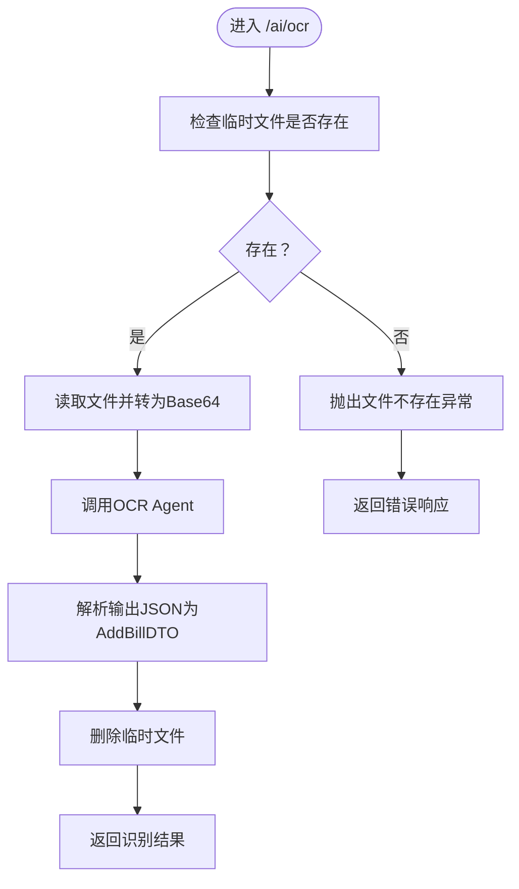
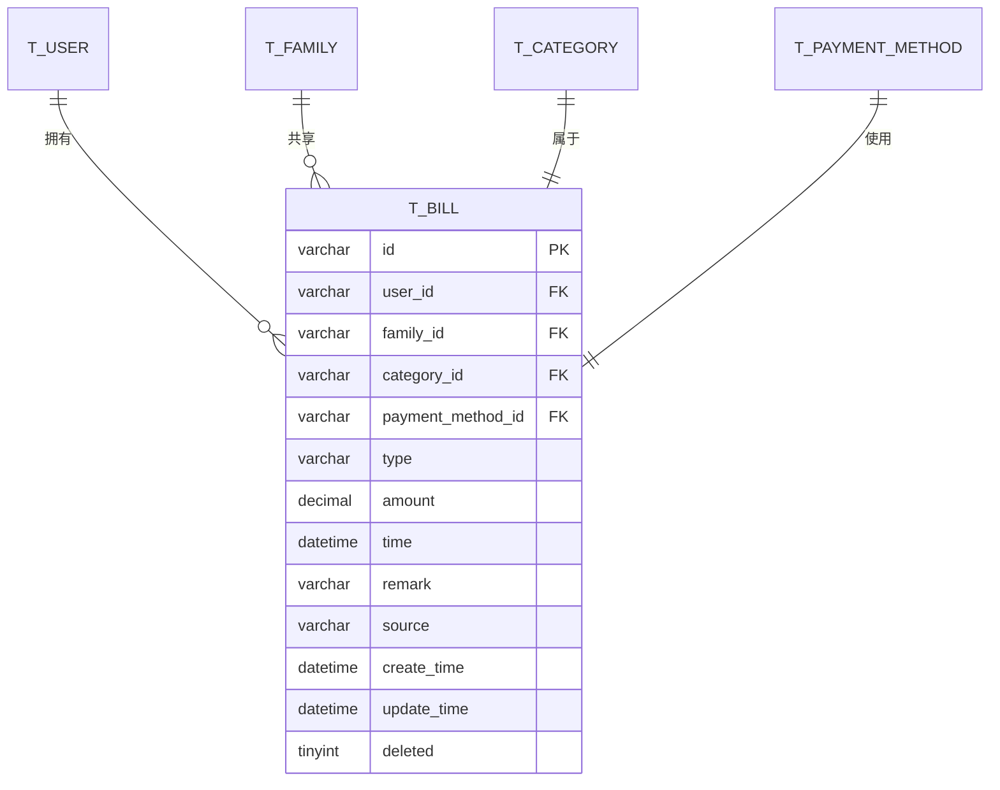
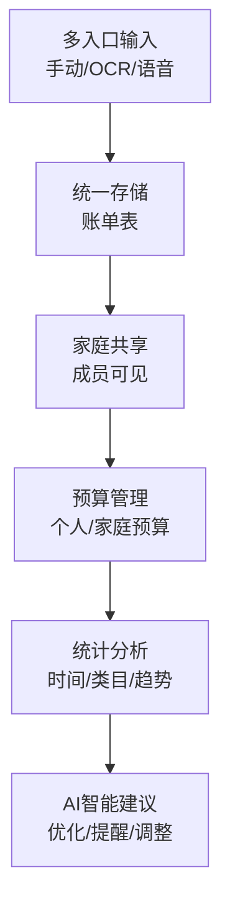
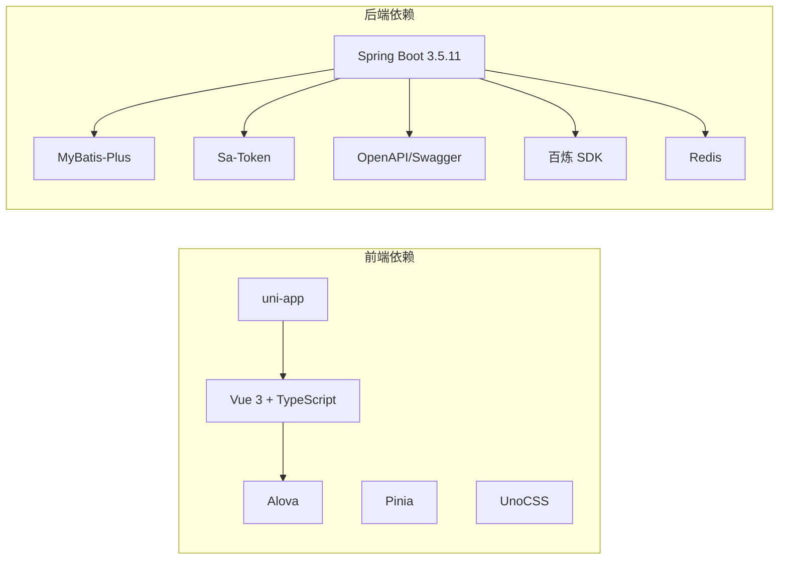

# 项目概述

<cite>
**本文引用的文件**   
- [README.md](file://chuan-bill-app/README.md)
- [PRD.md](file://PRD.md)
- [init.sql](file://chuan-bill-server/init.sql)
- [package.json](file://chuan-bill-app/package.json)
- [pom.xml](file://chuan-bill-server/pom.xml)
- [main.ts](file://chuan-bill-app/src/main.ts)
- [ChuanBillServerApplication.java](file://chuan-bill-server/src/main/java/com/samoy/chuanbillserver/ChuanBillServerApplication.java)
- [index.ts](file://chuan-bill-app/src/router/index.ts)
- [application.yaml](file://chuan-bill-server/src/main/resources/application.yaml)
- [ManualEdit.vue](file://chuan-bill-app/src/pages/bill/components/ManualEdit.vue)
- [OcrEdit.vue](file://chuan-bill-app/src/pages/bill/components/OcrEdit.vue)
- [AIController.java](file://chuan-bill-server/src/main/java/com/samoy/chuanbillserver/controller/AIController.java)
- [AIServiceImpl.java](file://chuan-bill-server/src/main/java/com/samoy/chuanbillserver/service/impl/AIServiceImpl.java)
- [apiDefinitions.ts](file://chuan-bill-app/src/api/apiDefinitions.ts)
- [index.vue](file://chuan-bill-app/src/pages/statistics/index.vue)
- [Bill.java](file://chuan-bill-server/src/main/java/com/samoy/chuanbillserver/entity/Bill.java)
</cite>

## 目录
1. [引言](#引言)
2. [项目结构](#项目结构)
3. [核心组件](#核心组件)
4. [架构总览](#架构总览)
5. [详细组件分析](#详细组件分析)
6. [依赖关系分析](#依赖关系分析)
7. [性能考量](#性能考量)
8. [故障排查指南](#故障排查指南)
9. [结论](#结论)
10. [附录](#附录)

## 引言
“小川记账”是一个面向个人与家庭的跨平台智能记账应用，提供便捷的记账体验与科学的财务管理方案。项目围绕四大核心目标展开：支持多种输入方式（手动输入、OCR识别、语音输入）、实现家庭共享与预算管理、提供统计分析与AI智能建议、以及构建全栈一体化的工程化架构。通过前后端分离设计，前端采用基于 uni-app 的跨平台应用，后端基于 Spring Boot，结合 MySQL 与 Redis，形成稳定、可扩展、易维护的技术体系。

## 项目结构
项目采用“前后端分离 + 多端部署”的组织方式，分为前端应用与后端服务两大子工程，并辅以数据库初始化脚本与文档资料。

- 前端应用（chuan-bill-app）
  - 基于 uni-app 与 Vue 3，采用 Vite 构建，支持多端（H5、小程序、App 等）编译与运行
  - 使用 Wot Design Uni 组件库、Alova 请求库、Pinia 状态管理、UnoCSS 原子化样式等
  - 页面与功能模块化组织，包含账单、家庭、统计、我的等页面
- 后端服务（chuan-bill-server）
  - 基于 Spring Boot 3.5.11 与 Java 17，采用 MyBatis-Plus、Sa-Token、OpenAPI/Swagger
  - 提供认证授权、账单管理、家庭共享、预算管理、文件上传与 AI OCR 等能力
- 数据库与环境
  - MySQL 初始化脚本包含用户、类目、支付方式、家庭、账单、预算、消息等核心表
  - Redis 配置用于缓存与会话管理，环境变量驱动数据库与第三方服务接入

**图示来源**
- [main.ts:1-16](file://chuan-bill-app/src/main.ts#L1-L16)
- [index.ts:1-80](file://chuan-bill-app/src/router/index.ts#L1-L80)
- [ManualEdit.vue:1-174](file://chuan-bill-app/src/pages/bill/components/ManualEdit.vue#L1-L174)
- [OcrEdit.vue:1-167](file://chuan-bill-app/src/pages/bill/components/OcrEdit.vue#L1-L167)
- [apiDefinitions.ts:1-38](file://chuan-bill-app/src/api/apiDefinitions.ts#L1-L38)
- [ChuanBillServerApplication.java:1-15](file://chuan-bill-server/src/main/java/com/samoy/chuanbillserver/ChuanBillServerApplication.java#L1-L15)
- [application.yaml:1-51](file://chuan-bill-server/src/main/resources/application.yaml#L1-L51)
- [AIController.java:1-26](file://chuan-bill-server/src/main/java/com/samoy/chuanbillserver/controller/AIController.java#L1-L26)
- [AIServiceImpl.java:1-52](file://chuan-bill-server/src/main/java/com/samoy/chuanbillserver/service/impl/AIServiceImpl.java#L1-L52)
- [Bill.java:1-113](file://chuan-bill-server/src/main/java/com/samoy/chuanbillserver/entity/Bill.java#L1-L113)
- [init.sql:1-326](file://chuan-bill-server/init.sql#L1-L326)

**章节来源**
- [package.json:1-135](file://chuan-bill-app/package.json#L1-L135)
- [pom.xml:1-226](file://chuan-bill-server/pom.xml#L1-L226)
- [application.yaml:1-51](file://chuan-bill-server/src/main/resources/application.yaml#L1-L51)
- [init.sql:1-326](file://chuan-bill-server/init.sql#L1-L326)

## 核心组件
- 前端核心
  - 应用入口与全局状态：在应用入口集中注册路由与状态管理，确保多端一致的启动流程
  - 路由系统：基于虚拟页面生成路由，支持全局导航守卫与页面切换钩子
  - 账单编辑组件：提供手动输入与 OCR 识别两种入口，支持类目、支付方式、共享选项等
  - API 定义：集中声明后端接口，便于前端调用与类型推导
- 后端核心
  - 启动类与扫描路径：自动扫描 Mapper 接口，统一暴露服务
  - 配置文件：数据源、Redis、MyBatis-Plus、OpenAPI/Swagger、AI 服务密钥等
  - 控制器与服务：AI 控制器负责 OCR 入口，AI 服务实现负责文件读取、Base64 转换与百炼 SDK 调用
  - 实体模型：账单实体映射 t_bill 表，包含来源字段以区分输入方式

**章节来源**
- [main.ts:1-16](file://chuan-bill-app/src/main.ts#L1-L16)
- [index.ts:1-80](file://chuan-bill-app/src/router/index.ts#L1-L80)
- [ManualEdit.vue:1-174](file://chuan-bill-app/src/pages/bill/components/ManualEdit.vue#L1-L174)
- [OcrEdit.vue:1-167](file://chuan-bill-app/src/pages/bill/components/OcrEdit.vue#L1-L167)
- [apiDefinitions.ts:1-38](file://chuan-bill-app/src/api/apiDefinitions.ts#L1-L38)
- [ChuanBillServerApplication.java:1-15](file://chuan-bill-server/src/main/java/com/samoy/chuanbillserver/ChuanBillServerApplication.java#L1-L15)
- [application.yaml:1-51](file://chuan-bill-server/src/main/resources/application.yaml#L1-L51)
- [AIController.java:1-26](file://chuan-bill-server/src/main/java/com/samoy/chuanbillserver/controller/AIController.java#L1-L26)
- [AIServiceImpl.java:1-52](file://chuan-bill-server/src/main/java/com/samoy/chuanbillserver/service/impl/AIServiceImpl.java#L1-L52)
- [Bill.java:1-113](file://chuan-bill-server/src/main/java/com/samoy/chuanbillserver/entity/Bill.java#L1-L113)

## 架构总览
项目采用前后端分离架构，前端通过 Alova 发起请求，后端通过 Spring MVC 接收请求并调用服务层，持久层使用 MyBatis-Plus 访问 MySQL，Redis 用于缓存与会话管理。AI 能力通过百炼 SDK 调用 OCR Agent，识别图片中的账单信息并返回结构化数据。

**图示来源**
- [apiDefinitions.ts:1-38](file://chuan-bill-app/src/api/apiDefinitions.ts#L1-L38)
- [AIController.java:1-26](file://chuan-bill-server/src/main/java/com/samoy/chuanbillserver/controller/AIController.java#L1-L26)
- [AIServiceImpl.java:1-52](file://chuan-bill-server/src/main/java/com/samoy/chuanbillserver/service/impl/AIServiceImpl.java#L1-L52)
- [application.yaml:1-51](file://chuan-bill-server/src/main/resources/application.yaml#L1-L51)

## 详细组件分析

### 前端组件：账单编辑（手动输入与 OCR）
- 手动输入
  - 支持收入/支出切换、金额输入、名称、时间、类目、支付方式、备注、家庭共享等字段
  - 类目与支付方式通过接口拉取并动态渲染
- OCR 识别
  - 支持图片上传，上传成功后触发 OCR 任务
  - 识别过程中展示扫描动画与状态提示，失败时提供重试与手动输入入口
  - 识别成功后将结果回填至表单，提升输入效率

**图示来源**
- [ManualEdit.vue:1-174](file://chuan-bill-app/src/pages/bill/components/ManualEdit.vue#L1-L174)
- [OcrEdit.vue:1-167](file://chuan-bill-app/src/pages/bill/components/OcrEdit.vue#L1-L167)
- [AIController.java:1-26](file://chuan-bill-server/src/main/java/com/samoy/chuanbillserver/controller/AIController.java#L1-L26)
- [AIServiceImpl.java:1-52](file://chuan-bill-server/src/main/java/com/samoy/chuanbillserver/service/impl/AIServiceImpl.java#L1-L52)

**章节来源**
- [ManualEdit.vue:1-174](file://chuan-bill-app/src/pages/bill/components/ManualEdit.vue#L1-L174)
- [OcrEdit.vue:1-167](file://chuan-bill-app/src/pages/bill/components/OcrEdit.vue#L1-L167)
- [apiDefinitions.ts:1-38](file://chuan-bill-app/src/api/apiDefinitions.ts#L1-L38)

### 后端组件：AI OCR 识别流程
- 控制器层：提供 /ai/ocr 接口，接收临时文件 ID 并返回识别结果
- 服务层：读取临时文件、转为 Base64、调用 OCR Agent、解析 JSON、删除临时文件
- 错误处理：针对缺少密钥、输入缺失等异常抛出业务异常，统一返回错误码

**图示来源**
- [AIController.java:1-26](file://chuan-bill-server/src/main/java/com/samoy/chuanbillserver/controller/AIController.java#L1-L26)
- [AIServiceImpl.java:1-52](file://chuan-bill-server/src/main/java/com/samoy/chuanbillserver/service/impl/AIServiceImpl.java#L1-L52)

**章节来源**
- [AIController.java:1-26](file://chuan-bill-server/src/main/java/com/samoy/chuanbillserver/controller/AIController.java#L1-L26)
- [AIServiceImpl.java:1-52](file://chuan-bill-server/src/main/java/com/samoy/chuanbillserver/service/impl/AIServiceImpl.java#L1-L52)

### 数据模型：账单实体与数据库表
账单实体映射 t_bill 表，包含用户/家庭关联、类目/支付方式、收支类型、金额、时间、来源、备注等字段，支持按用户与家庭维度查询与统计。

**图示来源**
- [Bill.java:1-113](file://chuan-bill-server/src/main/java/com/samoy/chuanbillserver/entity/Bill.java#L1-L113)
- [init.sql:130-158](file://chuan-bill-server/init.sql#L130-L158)

**章节来源**
- [Bill.java:1-113](file://chuan-bill-server/src/main/java/com/samoy/chuanbillserver/entity/Bill.java#L1-L113)
- [init.sql:130-158](file://chuan-bill-server/init.sql#L130-L158)

### 概念性概览
项目围绕“输入—存储—共享—分析—建议”的闭环展开，前端提供多入口输入，后端统一处理并持久化，家庭共享与预算管理增强协作与控制，统计分析与 AI 建议提升决策效率。

[此图为概念性流程图，不对应具体源文件，故不附“图示来源”]

## 依赖关系分析
- 前端依赖
  - uni-app 生态与 Vue 3 + TypeScript + SCSS 栈，配合 Vite、Alova、Pinia、UnoCSS 等
  - 多端编译脚本覆盖 H5、小程序、App 等平台
- 后端依赖
  - Spring Boot 3.5.11 + Java 17，MyBatis-Plus、Sa-Token、OpenAPI/Swagger、百炼 SDK、Redis
  - 环境变量驱动数据库与第三方服务配置，便于本地与生产环境切换

**图示来源**
- [package.json:1-135](file://chuan-bill-app/package.json#L1-L135)
- [pom.xml:1-226](file://chuan-bill-server/pom.xml#L1-L226)

**章节来源**
- [package.json:1-135](file://chuan-bill-app/package.json#L1-L135)
- [pom.xml:1-226](file://chuan-bill-server/pom.xml#L1-L226)

## 性能考量
- 前端
  - 使用 Alova 进行高效请求管理，结合 Pinia 状态缓存减少重复请求
  - UnoCSS 原子化样式避免冗余样式体积，提升构建与运行效率
  - 多端编译按需打包，降低首屏体积
- 后端
  - MyBatis-Plus 分页与索引优化，结合 Redis 缓存热点数据
  - OpenAPI/Swagger 自动生成接口文档，减少联调成本
  - 百炼 SDK 异步调用与错误兜底，避免阻塞主线程

[本节为通用性能建议，不直接分析具体文件，故不附“章节来源”]

## 故障排查指南
- 常见问题
  - OCR 识别失败：检查临时文件是否存在、百炼 API Key 与 OCR AppId 配置是否正确
  - 数据库连接异常：核对 MYSQL_URL、用户名与密码，确认数据库服务可用
  - Redis 连接超时：检查主机、端口、密码与连接池配置
- 定位方法
  - 查看后端日志与异常栈，定位具体异常类型（如文件不存在、缺少密钥）
  - 前端上传与识别流程中增加状态提示与错误回调，便于用户反馈
  - 使用 Swagger UI 校验接口参数与返回值

**章节来源**
- [AIServiceImpl.java:1-52](file://chuan-bill-server/src/main/java/com/samoy/chuanbillserver/service/impl/AIServiceImpl.java#L1-L52)
- [application.yaml:1-51](file://chuan-bill-server/src/main/resources/application.yaml#L1-L51)

## 结论
“小川记账”通过跨平台前端与企业级后端的协同，实现了从多入口输入到家庭共享、预算管理、统计分析与 AI 建议的完整闭环。项目采用现代化技术栈与工程化实践，具备良好的可扩展性与可维护性，适合初学者快速理解全栈架构与核心业务价值。

## 附录
- 项目特性与技术选型优势
  - 前端：Vue 3 + TypeScript + SCSS + uni-app，多端统一开发，组件化与模块化程度高
  - 后端：Spring Boot 3.5.11 + Java 17，MyBatis-Plus + Sa-Token + OpenAPI，易于扩展与维护
  - 数据层：MySQL + Redis，满足高并发与低延迟场景
  - AI 能力：百炼 SDK 集成 OCR，提升识别准确率与用户体验
- 应用场景与价值主张
  - 个人记账：快速记录收支、查看趋势、制定预算
  - 家庭共享：统一账单、透明消费、预算共管
  - 智能建议：基于历史数据与趋势，提供优化建议与异常提醒

**章节来源**
- [README.md:1-116](file://chuan-bill-app/README.md#L1-L116)
- [PRD.md:1-168](file://PRD.md#L1-L168)
- [package.json:1-135](file://chuan-bill-app/package.json#L1-L135)
- [pom.xml:1-226](file://chuan-bill-server/pom.xml#L1-L226)
- [application.yaml:1-51](file://chuan-bill-server/src/main/resources/application.yaml#L1-L51)
- [init.sql:1-326](file://chuan-bill-server/init.sql#L1-L326)